# Web前端基础

—————————————————————————————————————————————————————————————————————————————————————————————————————————————


# HTML


## HTML-01 

### 一、知识点

HTML软件、模板、标签属性、常用标签：文本标签、文本修饰标签、图片标签、链接标签、列表标签


### 二、目标

1、熟悉软件【VScode】

2、初步了解什么是前端

3、了解HTML在前端中的作用

4、熟练使用常用标签，能够根据不同情景选择合适标签


### 三、内容分析

#### （一）重点

1、标签、标签属性、链接标签

#### （二）难点

1、软件使用

2、标签属性


### 四、内容

#### (一) 前端

##### **1.1 什么是前端**

​	百度百科：前端即[网站前台](https://baike.baidu.com/item/网站前台/4849916?fromModule=lemma_inlink)部分，运行在[PC](https://baike.baidu.com/item/PC/107?fromModule=lemma_inlink)端，[移动](https://baike.baidu.com/item/移动/22826?fromModule=lemma_inlink)端等[浏览器](https://baike.baidu.com/item/浏览器/213911?fromModule=lemma_inlink)上展现给用户浏览的网页。随着[互联网技术](https://baike.baidu.com/item/互联网技术/617749?fromModule=lemma_inlink)的发展，[HTML5](https://baike.baidu.com/item/HTML5/4234903?fromModule=lemma_inlink)，[CSS3](https://baike.baidu.com/item/CSS3/4059544?fromModule=lemma_inlink)，前端框架的应用，[跨平台](https://baike.baidu.com/item/跨平台/8558902?fromModule=lemma_inlink)响应式网页设计能够适应各种屏幕分辨率，合适的动效设计，给用户带来极高的用户体验。

​	概述：直面群体为普通用户的软件、网页等可视交互界面，主要用于展示信息、数据和用户交互。


##### **1.2 网页前端学什么**

- 基础

  HTML 、CSS 、JavaScript、DOM、BOM

- **进阶**

  JQuery、 JSON、Ajax、ES6

- **提升**

  Vue、Webpack、Axios、Element-UI、小程序


#### (二) 软件安装

##### 2.1 安装VScode

[Download Visual Studio Code - Mac, Linux, Windows](https://code.visualstudio.com/Download)

- 安装插件【Chinese】汉化
- 安装插件【live server】


##### **2.2 安装MarkDown阅读软件**

- Typora下载：[Typora 官方中文站 (typoraio.cn)](https://typoraio.cn/)
- MarkText下载：[MarkText - from github](https://github.com/marktext/marktext/releases/download/v0.17.1/marktext-setup.exe)


##### **2.3 浏览器**

- Edge
- Chrome：[Google Chrome 网络浏览器](https://www.google.cn/chrome/index.html)
- Firfox：[Firefox 火狐浏览器 - 全新、安全、快速 | 官方最新下载](http://www.firefox.com.cn/)


#### (三) HTML文件

##### **3.1 模板**

html的编码规则规定，必须是以下格式的代码，才能在浏览器中被正确解析，因此每一份html文件，都在以下模板基础上，在`<body></body>`标签区域中编写自定义代码。

```html
<!DOCTYPE html> <!-- 指明文档类型为html，让浏览器用html标准解析 -->
<html lang="en"> <!-- 根标签，页面代码的起点 -->
    <head> <!--head标签：引用脚本、样式、提供元信息等 -->
        <!-- 元信息：设置网页使用国际编码，防止出现乱码-->
        <meta charset="UTF-8"> 
        <meta http-equiv="X-UA-Compatible" content="IE=edge">
        <meta name="viewport" content="width=device-width, initial-scale=1.0">
        <title>Document</title>
    </head>
    <!-- 编写代码的区域，也是最终页面会显示的内容 -->
    <body>
		网页显示的区域
    </body>
</html>
```


##### **3.2 模板生成快捷键**

`.html`文件中，输入`!`(英文)  + 回车


##### **3.3 注释**

代码中能看到，但不会显示在页面中。

**形式**：`<!--  这是个注释  -->`

**快捷键(vscode)**： `ctrl + /`

**作用**

​	1. 屏蔽暂时不用的代码。

​	2. 对代码进行标记提示，提高代码的可阅读性，可维护性。


#### (四) 标签

##### **4.1 双标签**

一种标签形式，除了单标签（input、img等），都是双标签。

**语法：**`<标签名> </标签名>`


##### **4.2 单标签**

一种标签形式，只有特殊单标签（input、img等）。

**语法：**`<标签名/>`或者`<标签名>`


##### **4.3 标签域**

**双标签**中的内容填写区域，可以写文字也可以嵌套其他标签。理论上标签可以无限嵌套，形成一棵标签树。


##### **4.4 标签属性**

用来修饰标签，设置标签的一些功能。

一个标签可以有多个属性(空格隔开)，有些标签有独有属性(后续具体介绍)。

**形式**：`<标签  属性1="值1" 属性2="值2" >  </标签>`


##### **4.5 通用属性**

`id`、`class`、`title` 等。


#### (五) 标题与段落标签

##### **5.1 标题标签**

- **`<h1> - <h6>`**

  用于快速设置不同大小的标题。

  **案例**

  ```html
  <h1>一级标题</h1>
  <h2>二级标题</h2>
  <h3>三级标题</h3>
  <h4>四级标题</h4>
  <h5>五级标题</h5>
  <h6>六级标题</h6>
  ```

  **效果**

  


##### **5.2 段落标签**

- **`<p> </p>`**

  用于快速设置段落文本，自带段落首行缩进效果。

  **案例**

  ```html
  <p>你可以剥开一颗金黄诱人的蜜柚，然后打开家里的音响，放上一曲理查德.克莱德曼的《秋日私语》，带着美好的心情，随着钢琴王子那带着魔力的十指，进入一种美妙的境界.在优美的旋律中，你仿佛听到了，秋天那沙沙的脚步声，正渐渐的向你走来，向你微笑.琴声向你展现了，一片秋日的窃喜.你看到了，片片的树叶飘了起来，摇曳着随风而去.</p>
  <p>你还可以捧着一本古书，在梧桐树下的躺椅上，随着片片飘落的黄叶，去感悟古人悲秋的情怀.看看稼轩“觉人间，万事到秋来，都摇落”的感慨，品拼秦观“秋容老尽芙蓉院，草上霜花匀似翦”的心境.或者为刘禹锡 “晴空一鹤排云上，便引诗情到碧霄！”赞上一笔，总之，这是一种很逍遥的感觉.</p>
  ```

  **效果**

  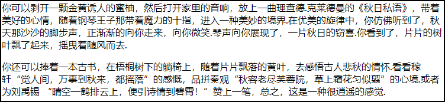


#### (六) 文本修饰标签

##### **6.1 加粗文本**

- **`<strong> </strong>`**

  用于快速设置文本加粗效果。

  **案例**

  ```html
  <p>
      10月18日，<strong>中国共产党第十九次全国代表大会</strong>在北京人民大会堂开幕。
  </p>
  ```

  **效果**

  


##### **6.2 斜体文本**

- **`<em> </em>`**

  用于快速设置文本斜体效果。

  **案例**

  ```html
  <p>
      10月18日，中国共产党第十九次全国代表大会在<em>北京人民大会堂</em>开幕。
  </p>
  ```

  **效果**

  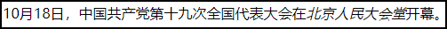


##### **6.3 上标文本**

- **`<sup> </sup>`**

  用于快速设置文本作为上标效果。

  **案例**

  ```html
  <!-- 标注 -->
  <p>
      10月18日，中国共产党第十九次全国代表大会<sup>[1]</sup>在北京人民大会堂<sup>[2]</sup>开幕。
  </p>
  ```

  ```html
  <!-- 数学函数 -->
  <p>
      y = x<sup>2</sup> + 1
  </p>
  ```

  **效果**

  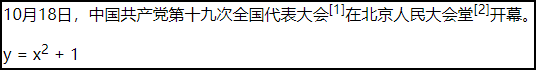


##### **6.4 下标文本**

- **`<sub> </sub>`**

  用于快速设置文本作为下标效果。

  **案例**

  ```html
  <!-- 标注 -->
  <p>
      10月18日，中国共产党第十九次全国代表大会<sub>[1]</sub>在北京人民大会堂<sub>[2]</sub>开幕。
  </p>
  ```

  ```html
  <!-- 数学函数 -->
  <p>
      y=log<sub>a</sub>x
  </p>
  ```

  **效果**

  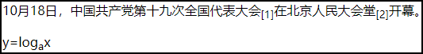


##### **6.5 删除文本**

- **`<del> </del>`**

  用于快速设置文本有一个删除线的效果,来描述文档中的删除。

  ##### 案例

  ```html
  <!-- 错别字更改 -->
  <p>
      家乡变得更文明了！人们过马路，不再着急；人<del>门</del>们说话，更加注意礼貌。
  </p>
  ```

  **效果**

  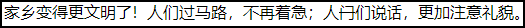


##### **6.6 添加文本**

- **`<ins> </ins>`**

  用于快速设置文本有一个下划线的效果,来描述文档中的更新和修正。

  ##### 案例

  ```html
  <!-- 插入文本 -->
  <p>
      家乡变得更文明了！<ins>人们过马路，不再着急；人们说话，更注意礼貌。</ins>
  </p>
  ```

  **效果**

  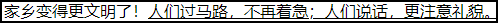


#### (七) 图片标签

- **``**

  引用一张图片。

  - **src：**图片的文件地址 【磁盘地址（相对路径/绝对路径）、网络地址】。

  - **alt：**图片不能正常显示的时候，替代显示的文本提示。


```html
<!-- 相对路径  ./当前级   ../上一级 -->


<!-- 绝对路径（开发时  几乎不用） -->

```


#### (八) 文件引用路径

##### **8.1 绝对路径**

​	从盘符开始，一级一级逐层到文件的最终位置。形似从【我的电脑】在不同【盘】中寻找文件的过程。

- ##### 从盘符【根级】开始查找

  **例**：`C:/Users/desktop/篮球.png`

  ##### 案例

  ```js
  在地图上，找到广州市。
  地球 -> 中国 -> 找到广东省 -> 找到广州市
  路径形式："地球:/中国/广东省/广州市"
  
  如果移民到火星？？？
  ```

  **图解**

  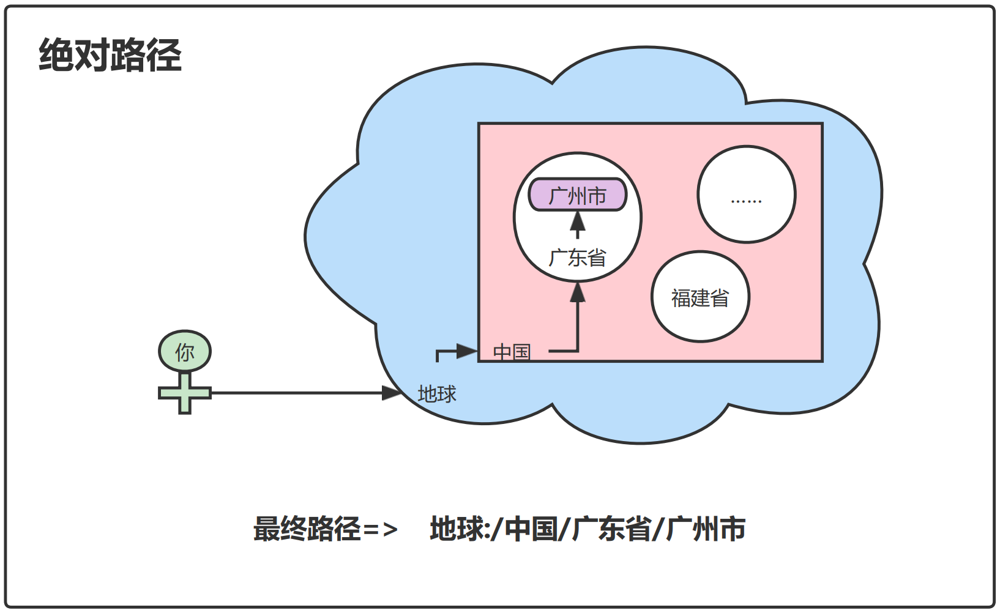


##### **8.2 相对路径**

​	由于代码最终投入使用的服务器环境不同，引用的文件所在的【盘符】可能不同，因此相对路径引用的方式更加适合，也更加常用。

- ##### `./`

  一个点，表示当前文件所在的路径层级。

  

- ##### `../`

  两个点，表示上一级路径层级，能够访问到同级文件夹或文件。

  **例**：`./../../images/篮球.png`

  ##### 案例

  ```js
  在地图上，找到广州市。
  福州市(自己) -> 福建省 -> 广东省 -> 广州市
  路径形式："./../广东省/广州市"
  
  不管在哪个星球，只要你还在，都有一条路可以指引到目的地。
  ```

  **图解**

  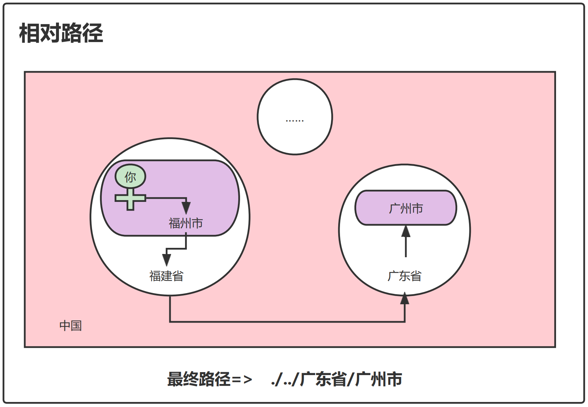


#### (九) 链接与锚点

##### 9.1 链接标签

`<a href="" target=""> </a>`

从一个页面跳转到另一个页面（可以是其他网址，也可以是本地的html）。

- **href**

  跳转的地址（一个链接或者其他html文件）。


- **target**

  链接的打开方式（`_self` - 在当前页面打开【默认值】     `_blank` - 在新标签页打开）。

```html
<body>
    <!-- 页内跳转 -->
    <a href="https://www.bilibili.com/">哔哩哔哩-干杯(页内跳转)</a>
    <!-- 新页面跳转 -->
    <a href="https://www.bilibili.com/" target="_blank">哔哩哔哩-干杯（新页）</a>
</body>
```

**效果**

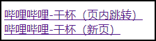


##### 9.2 锚点

`<a href="#id" > </a>`

若页面<u>出现滚动条</u>，可以在本页面内跳转到指定标签位置。

- **href**

  跳转目标标签的【**id值**】。

**案例**

```html
<body>
	<!-- 锚点跳转 -->
    <a href="#img-1">第1张</a>
    <a href="#img-2">第2张</a>
    <a href="#img-3">第3张</a>
    <a href="#img-4">第4张</a>
    <a href="#img-5">第5张</a>

    <!-- 内容区 -->
    <h2 id="img-1">欢度国庆1</h2>
    
    <h2 id="img-2">欢度国庆2</h2>
    
    <h2 id="img-3">欢度国庆3</h2>
    
    <h2 id="img-4">欢度国庆4</h2>
    
    <h2 id="img-5">欢度国庆5</h2>
    

    <!-- 锚点跳转 -->
    <a href="#img-1">第1张</a>
    <a href="#img-2">第2张</a>
    <a href="#img-3">第3张</a>
    <a href="#img-4">第4张</a>
    <a href="#img-5">第5张</a>
</body>
```


#### (十) 列表标签

##### 10.1 无序列表

​	快速生成无序树级列表，可以无限嵌套，前三层的样式不同。

- ##### `<ul> </ul>`

  有序列表容器。

- ##### `<li></li>`

  列表的具体项。

  ##### 案例

  ```html
  <h1>无序列表(前三层的样式不同，之后和第三层相同)</h1>
  <!-- ul无序列表容器  li是列表具体项 -->
  <ul>
      <li>
          1
          <ul>
              <li>
                  1-1
                  <ul>
                      <li>1-1-1</li>
                  </ul>
              </li>
          </ul>
      </li>
      <li>2</li>
      <li>3</li>
      <li>4</li>
  </ul>
  ```

  **效果**

  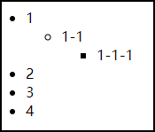


##### 10.2 有序列表

​	快速生成有序树级列表，可以无限嵌套，每层都会重新排序。

- ##### `<ol> </ol>`

  无序列表容器。

- ##### `<li></li>`

  列表的具体项。

  ##### 案例

  ```html
  <h1>有序列表(可以无限嵌套，每层都会重新排序)</h1>
  <ol>
      <li>
          1
          <ol>
              <li>1-2</li>
              <li>1-2</li>
          </ol>
      </li>
      <li>2</li>
      <li>3</li>
      <li>4</li>
  </ol>
  ```

  **效果**

  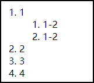


### 五、总结

本节介绍了前端开发使用的软件，一些基础的HTML标签的属性、功能、效果和使用方法。强调代码的规范性，需要在一定的模板中，编写代码。需要熟练掌握这些标签的属性，使用情况。在不同的情况下，合理选择使用的标签。


## HTML-02

### 一、知识点

表格标签、表单标签、div和span、css选择器


### 二、目标

- 熟悉表格标签的属性特点
- 熟练表单所有标签的使用和特点
- 了解并区分块级元素、行内元素
- 熟练使用css选择器


### 三、内容分析

#### (一) 重点

- 表单标签
- div、span
- css选择器

#### (二) 难点

- 表单标签
- css选择器


### 四、内容

#### (一) 表格标签

- **`<table> </table>`**

  表格标签的【**容器**】标签，所有表格元素标签都必须在此标签内，单元格会自动对齐。

  - **border**

    表格的边框粗细。

  - **cellpadding**

    单元格内，文字到边框的距离。

  - **cellspacing**

    单元格之间的距离。

  - **align**

    指定表格相对于周围元素的对齐方式。

  

- **`<caption> </cation>`**

  表格中的【**标题**】标签，无论写在  `<table>`  中的什么地方，最终都显示在表格顶部，因此常写在  `<table>`  的内第一行。

  

- **`<tr> </tr>`**

  表格中的【**行**】标签，每一个单元格都必须在行标签内。

  

- **`<th> </th>`**

  **表格头**的单元格标签。

  

- **`<td> </td>`**

  **表格内容**的单元格标签。

  - **rowspan**

    **纵向**合并相邻单元格 

  - **clospan**

    **横向**合并相邻单元格

  **注意**：合并单元格时，要注意横向、纵向上【合并数 + 单元格数】要相同，否则表格单元格会溢出，撑大表格。

  **案例1**

  普通的表格

  ```html
  <table border="1" cellspacing="5" align="left" cellpadding="10">
      <caption>学生信息表</caption>
      <!-- 表格头 -->
      <tr>
          <th>姓名</th>
          <th>年龄</th>
          <th>性别</th>
      </tr>
      <!-- 内容 -->
      <tr>
          <td>小红</td>
          <td>20</td>
          <td>女</td>
      </tr>
      <tr>
          <td>小明</td>
          <td>30</td>
          <td>男</td>
      </tr>
  </table>
  ```

  **效果**

  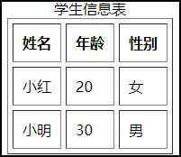

  

  **案例2**

  有单元格合并的表格

  ```html
  <table border="1" cellspacing="0" align="left" cellpadding="10">
      <caption>进货单</caption>
      <!-- 表格头 -->
      <tr>
          <th rowspan="2">序号</th>
          <th colspan="3">商品信息</th>
          <th rowspan="2">数量</th>
          <th rowspan="2">备注</th>
      </tr>
      <tr>
          <th>名称</th>
          <th>规格</th>
          <th>单价</th>
      </tr>
      <!-- 内容 -->
      <tr>
          <td>1</td>
          <td>华为手机</td>
          <td>mate50</td>
          <td>100</td>
          <td>12</td>
          <td>12</td>
      </tr>
      <tr>
          <td>2</td>
          <td>小米手机</td>
          <td>mix 3</td>
          <td>200</td>
          <td>1</td>
          <td>2</td>
      </tr>
  </table>
  ```

  **效果**

  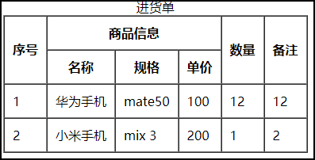


#### (二) 表单标签

- **`<form> </form>`**

  各类表单输入标签的容器，可以利用action属性直接提交表单的输入值到目标地址。

  - **action**

    提交表单数据的目标地址，会有默认跳转事件。

  

- **`<label> </label>`**

  input 元素定义标注（标记），没有特殊显示效果，点击到`<label>`时，会自动聚焦到其绑定的`<input>`标签。

  - **for**

    要绑定`<input>`标签的`id`值。

  ```html
  <label for="username">用户名</label>
  <input id="username"></input>
  ```

  

- **`<input> </input>`**

  输入标签，用于获取用户在网页中的键盘、鼠标输入。

  - **placeholder**

    输入框中的提示文字

    ```html
    <input placeholder="请输入"></input>
    ```

    

  - **name**

    最终提交表单时，该项输入框的数据描述，如：

    ```html
    <form>
        <input name="account"></input>
    	<input name="password"></input>
    </form>
    ```

    表示此表单中，分别有输入账号(account)和密码(password)的输入框。

    

  - **value**

    输入框最终的【输入值/选中值/按钮文字】

    ```html
    <input value="123123">
    ```

    

  - **disabled**

    禁止该`<input>`【输入/选择】

    

  - **type**

    通过修改type的值(默认为`text`)，可以更改输入框的功能

    - **text**：普通的文本输入框

      ```html
      <input type="text"> </input>
      ```

      

    - **password**：密码输入框

      ```html
      <input type="password"> </input>
      ```

      

    - **radio**：单选框

      - 【搭配属性】**checked**：默认选择

        ```html
        <input type="radio" checked> </input>
        ```

      - 【搭配属性】**disabled**：禁止使用

        ```html
        <input type="radio" disabled> </input>
        ```

      

    - **checkbox**：复选框

      - 【搭配属性】**checked**：默认选择

        ```html
        <input type="checkbox" checked> </input>
        ```

      - 【搭配属性】**disabled**：禁止使用

        ```html
        <input type="checkbox" disabled> </input>
        ```

      

    - **file**：选择文件

      ```html
      <input type="file"> </input>
      ```

      

    - **submit**：提交按钮

      ```html
      <input type="submit"> </input>
      ```

      

    - **reset**：重置按钮

      ```html
      <input type="reset"> </input>
      ```

      

    - **button**：普通按钮

      需要写**value**属性，按钮才有文字

      ```html
      <input type="button" value="修改"> </input>
      ```

  

- **`<textarea> </textarea>`**

  多行文本

  - **cols**

    规定初始显示的【**列数**】(以字为单位)

  - **rows**

    规定初始显示的【**行数**】(以字为单位)

  ```html
  <textarea cols="10" rows="3"></textarea>
  ```

  

- **`<select> </select>` `<option> </option>`**

  下拉选择框，

  `select`是下拉选择框容器。 

  `option`是选项。

  ```html
  <label for="taste"></label>
  <select id="taste">
      <option value="few">微微辣</option>
      <option value="little">微辣</option>
      <option value="spicy">辣</option>
  </select>
  ```

  **案例**

  ```html
  <form action="表单提交地址">
      <!-- input的name属性用来指定提交的表单内容 -->
      <h2>文本输入框</h2>
      <input type="text" placeholder="请输入">
  
  
      <h2>密码输入框</h2>
      <input type="password" placeholder="请输入密码" name="password">
  
  
      <h2>单选框</h2>
      <!-- name属性要同名 -->
      <input id="man" type="radio" name="sex" disabled>
      <label for="man">男</label>
      <input id="woman" type="radio" name="sex" checked>
      <label for="woman">女</label>
  
  
      <h2>多选框</h2>
      
      <input id="item-1" type="checkbox" name="item">
      <label for="item-1">唱</label>
  
      <input id="item-2" type="checkbox" name="item" checked>
      <label for="item-2">跳</label>
  
      <input id="item-3" type="checkbox" name="item" disabled>
      <label for="item-3">篮球</label>
  
  
      <h2>文件选择</h2>
      <input type="file">
  
  
      <h2>按钮</h2>
      <input type="button" value="按钮">
      <input type="submit">
      <input type="reset">
  
  
      <h2>多行文本框</h2>
      <textarea name="" id="" cols="30" rows="10"></textarea>
  
  
      <h2>下拉菜单</h2>
      <select name="" id="">
          <option value="" >1</option>
          <option value="" selected>2</option>
          <option value="" disabled>3</option>
      </select>
  </form>
  ```

  **效果**

  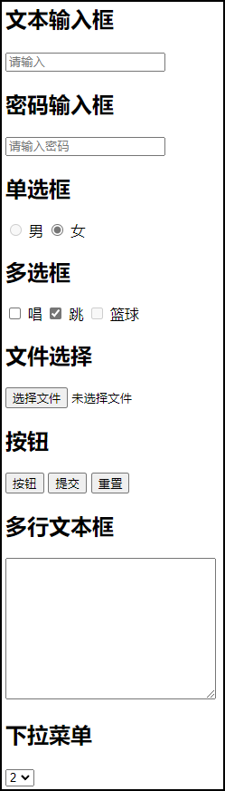


#### (三) 布局标签

- **`<div> </div>`**

  块级元素标签

  **特点**：

  ​	1、常用于划分一块区域，一个网页的由若干个区域组成，从大区域到小区域实现布局。

  ​	2、一定**占整行**宽度，并且**换行**。

  ​	3、可以设置宽高

  

- **`<span> </span>`**

  行内元素标签

  **特点**：

  ​	1、没有任何默认样式，常用来修饰文字。

  ​	2、宽高随文字撑开，不会换行。

  ​	3、不能设置宽高

  

  **案例**

  ```html
  <!-- 表格搜索 -->
  <div>
      <form>
          <label for="tel">姓名</label>
          <input id="username" name="username"></input>
      <label for="tel">手机</label>
      <input id="tel" name="tel"></input>
  <button>搜索</button>
  </form>
  </div>
  <div>
      <table border="1">
          <tr>
              <th>姓名</th>
              <th>手机</th>
          </tr>
          <tr>
              <td>小明</td>
              <td>123</td>
          </tr>
          <tr>
              <td>小红</td>
              <td>321</td>
          </tr>
      </table>
  </div>
  ```

  **效果**

  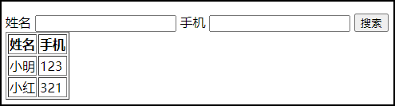


#### (四) 标签显示特性

- ##### 块级元素

  一定占整行宽度，并且换行。

  可以指定内容区宽高，但依旧换行。

  `<div>`  `<h1> - <h6>`  `<p>` 等标签

  

- ##### 行内（内联）元素

  宽高随内容撑开，不会换行。

  宽高无法指定。

  `<span>` `<a>`等标签 

  

- ##### 行内块元素

  宽高默认随文字撑开，不会换行。

  宽高也可以通过css指定。

  `` `<input>` 等标签

  **案例**

  ```html
  <!-- 查看不同特性标签 的显示效果 -->
  
  <!-- 块级元素 div  h1-6...  -->
  <div>这是个div标签（会占一整行并且换行）</div>
  <!-- 行内（内联）元素  span input label... -->
  <span>这是个span标签</span>
  <span>span不会换行</span>
  <!-- 行内块元素 -->
  <input type="text">
  <input type="text">
  ```

  **效果**

  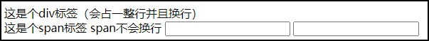


#### (五) css选择器

##### 5.1 什么是css

- ##### 层叠样式表

  ###### 显示设备在视觉上是二维平面的，实际上是多层图层叠加显示的效果，css可以用来更改标签显示的样式、层级，实现想要的显示效果。

  

- ##### 定义如何显示HTML标签

  

- ##### 书写格式

  选择器 {属性1：值1；属性2：值2}


##### 5.2 书写位置

- ##### 内联样式

  直接写在标签的`style`属性中。

  无法重复使用代码。

  ```html
  <span style="color:red">内联样式</span>
  ```

  

- ##### 内部样式

  在html文件的`<head> </head>`标签域中，添加`<style> <style>`标签，将css代码书写其中。

  可以通过选择器重复使用代码。

  ```html
  <head>
      <style>
          /* css代码书写区域 */
      </style>
  </head>
  ```

  

- ##### 外部样式

  在html文件的`<head> </head>`标签域中，通过`<link>`标签，引入一个`.css`文件，该文件的书写格式和【内部样式】相同。

  可以通过选择器重复使用代码。

  ```html
  <head>
      <link href="css文件所在位置(相对路径、绝对路径、网络路径)">
  </head>
  ```

  

  **优先级**：

  - 内联 > 内部 / 外部

  - 内联优先级最大
  - 内部和外部优先级取决于css代码**上下文顺序**，靠后的大，会**覆盖**前一个选择器的相同属性。


#####  5.3 选择器

- ##### 元素 选择器

  匹配到`标签名`相同的标签，更改样式。

  **语法**：

  - **标签**：`<标签> </标签>`
  - **css**：`标签名 { /* css代码 */ }`

  **案例**

  ```html
  <style>
      div{
          color:red;
      }
      span{
          color:green;
      }
  </style>
  
  <body>
      <div>这是个div标签</div>
      <span>这是个span标签</span>
  </body>
  ```

  **效果**

  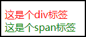

  

  

- ##### id 选择器

  匹配到`id名`相同的标签，更改样式。

  **语法**：

  - **标签**：`<标签 id="id名" >`
  - **css**：`.id名 { /* css代码 */ }`

  **注意**：一个html文档中，不能出现两个同`id`的标签。

  **案例**

  ```html
  <style>
      .page-container{
          background-color:green;
      }
      #title{
          color:red;
      }
  </style>
  
  <body>
      <div class="page-container">
          <h1 id="title">标题</h1>
      </div>
  </body>
  ```

  **效果**

  

  

- ##### class（类）选择器

  匹配到`class名`相同的标签，更改样式。

  **语法**：

  - **标签**：`<标签 class="class名" >`
  - **css**：`.class名 { /* css代码 */ }`

  **案例**

  ```html
  <style>
      .page-container{
          background-color:green;
      }
      .title{
          color:red;
      }
  </style>
  
  <body>
      <div class="page-container">
          <h1 class="child">标题</h1>
      </div>
  </body>
  ```

  **效果**

  

  

  **特点**：

  - **多个标签可以`class`同名**：一个选择器样式作用多个标签。

    **案例**

    ```html
    <style>
        .text-normal{
            font-size:24px;
            color:red;
        }
    </style>
    <span class="text-normal">1</span>
    <span class="text-normal">2</span>
    ```

    **效果**

    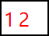

    

  - **单个标签可以写多个`class`值(空格隔开)**：多个选择器样式，作用于一个标签，同属性设置会根据【css上下文顺序】覆盖。

    **案例**

    ```html
    <style>
        .text-normal{
            font-size:24px;
            color:red;
        }
        .text-red{
            color:green;
        }
    </style>
    <span class="text-normal text-red">1</span>
    ```

    **效果**

    

    

- ##### 子元素 选择器

  是三种选择器的综合使用，用于修改【父级标签】中的指定【子标签】的样式。

  **语法**：`选择器(父级) 选择器(子级) ... { /* css代码 */ }`

  **注意**：每个选择器之间，必须用【空格】隔开

  **案例**

  ```html
  <style>
      .father-container{
          background-color:green;
      }
      .father-container .title{
          color:red;
      }
  </style>
  
  <body>
      <div class="father-container">
          <h1 class="child">标题1</h1>
      </div>
  </body>
  ```

  **效果**

  

  

- ##### 相邻元素 选择器

  是三种基础选择器的综合使用，用于修改目标【标签】的后一个相邻【标签】的样式。

  **语法**：`选择器 + 选择器(同级) { /* css代码 */ }`

  **注意**：

  1. 每个选择器之间，必须用【+号】连接，且用空格隔开。
  2. 仅能修改后一个相邻标签的样式。

  **案例**

  ```html
  <style>
      .father-container{
          background-color:green;
      }
      /* 从孩子选到兄弟 */
      .child + .brother{
          color:yellow;
      }
      /* 从父亲选到孩子的兄弟 */
      .father-container .child + .brother{
          color:yellow;
      }
  </style>
  
  <body>
      <div class="father-container">
          <h1 class="child">标题1</h1>
          <h1 class="brother">标题2</h1>
      </div>
  </body>
  ```

  **效果**

  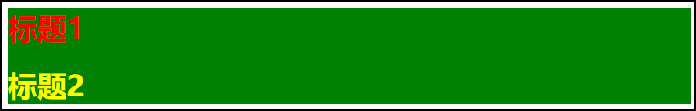


- **兄弟元素 选择器**

  是三种基础选择器的综合使用，用于修改目标【标签】后面任意【标签】的样式，位置无须紧邻于目标元素。

  **语法**：`选择器 ~ 选择器(同级) { /* css代码 */ }`

  **注意**：

  1. 每个选择器之间，必须用【~号】连接，且用空格隔开。


### 五、总结

这一小节，主要介绍了表格、表单标签的使用与属性。在实战中，这些标签是非常常用的，它们的属性也比较多，需要多去使用，复习，从而掌握。小节后半段，介绍了CSS的概念与选择器，作为CSS的入门。CSS选择器，是重点也是难点，大家需要学会并且熟练掌握其用法，在使用中，选择最适合的选择器，做到代码最优。


# CSS


## CSS-01

### 一、知识点

css颜色、背景、边框、字体、文本、伪类样式


### 二、目标

- 熟练使用css选择器修改标签样式
- 了解伪类样式
- 熟悉几种颜色表示方式
- 熟悉精灵图使用


### 三、内容分析 

#### (一) 重点

- 精灵图
- 修改标签样式

#### (二) 难点

- 伪类

- 熟悉精灵图使用

  

### 四、内容

#### (一) 颜色

- **单词表示法**

  直接以单词来表示颜色，如：red、green、blue...，但是无法精确的指定颜色，比较不常用。

  

- **十六进制表示法（常用）**

  以`#`开头的**6位十六进制数**，表示颜色，可以准确的表示所有颜色。如：#000000、#ffffff。

  **取值范围**：0 - f (不区分大小写)

  

- **RGB三原色表示法（常用）**

  使用`rbg()`函数，表示颜色，可以准确的表示所有颜色。如：rgb(0,0,0)、rbg(255,255,255)。

  **取值范围**：三个参数都是 0 - 255，分别表示【红、绿、蓝】三色通道。


#### (二) 背景样式

- **`background-color`**

  标签背景颜色。

  **值**：三种颜色表示法。

  

- **`background-image`**

  标签背景图片。

  **值**：使用`url()`函数，引入文件地址。

  **注意**：

  1. 标签必须有明确的宽高，才能看到设置的背景图片。
  2. 文件地址使用`""`或`''`包裹。

  **案例**

  ```html
  <div style="width: 400px; height:400px; background-image: url("./../imgs/background.png");">
      这是个div
  </div>
  ```

  

  

- **`background-repeat`**

  背景图片平铺方式。

  **值**：

  - **repeat(默认)**：重复填充
  - **no-repeat**：不重复

  **注意**：当背景图片小于标签大小时，才能看到效果。

  ```css
  /* 重复 */
  background-repeat: repeat;
  /* 不重复 */
  background-repeat: no-repeat;
  ```

  **效果**

  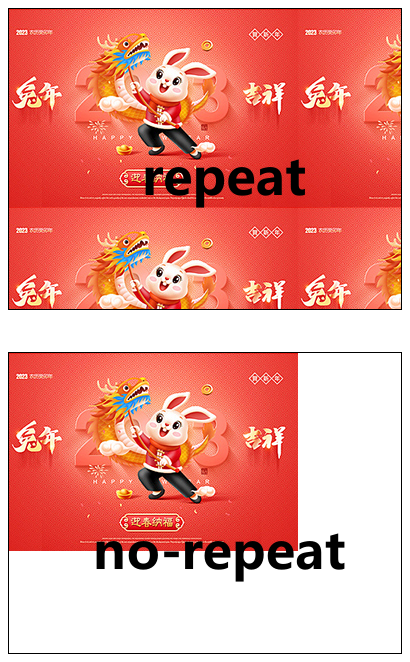

  

- **`background-size`**

  背景图片在标签中的大小，默认是图片自己的大小（若图片比标签大，就会出现图片显示缺失）。

  **值**：用空格隔开，分别设置x、y方向的相对位置。

  - **px单位**：具体到px单位的偏移。
  - **%单位**：以标签大小的占比计算。
  - **auto(默认值)**：保留图片自身宽度或着高度。
  - **contain**：水平铺满。
  - **cover**：垂直铺满。

  ```css
  /* 背景图片30*30 */
  background-size: 30px 30px;
  /* 背景图片100%占标签大小 */
  background-size: 100% 100%;
  /* 背景图片x方向占满，y方向保留自身高度 */
  background-size: 100% auto;
  /* 背景图片水平铺满 */
  background-size: contain;
  /* 背景图片垂直铺满 */
  background-size: cover;
  ```

  **案例**

  100%大小背景。（`background-size: 100% 100%;`）

  

  

- **`background-position`**

  背景图片在标签中的相对位置，默认在标签的左边0点处。

  **值**：用空格隔开，分别设置x、y方向的相对位置。

  - **px单位**：具体到px单位的偏移。
  - **%单位**：以标签大小的占比计算。

  **注意**：`%单位`仅在`background-size: auto`时有效。

  ```css
  background-position: 50% 50%;
  ```

  **案例**

  背景偏移。（`background-position: 50% 50%;`）

  


#### (三) 精灵图

- 精灵图技术产生的目的：

  很多大型网页在首次加载的时候都需要加载很多的小图片，而考虑到在同一时间，服务器拥堵的情况下，为了解决这一问题，采用了精灵图这一技术来缓解加载时间过长从而影响用户体验的这个问题。

- 精灵图技术的本质：

  所谓精灵图就是把很多的小图片合并到一张较大的图片里，所以在首次加载页面的时候，就不用加载过多的小图片，只需要加载出来将小图片合并起来的那一张大图片也就是精灵图即可，这样在一定程度上减少了页面的加载速度，也一定程度上缓解了服务器的压力。

  **例**：

  ```css
  /* 指定精灵图宽度为30px，位置在标签的最右边 */
  background-image: url("./../imgs/sprite.png");
  background-size: 30px auto; 
  background-postion: 100% 0;
  ```


#### (四) 边框样式

- **`border-style`**

  指定标签边框样式，若不指定则看不到。

  **值**：none、solid、dotted...

  - none：无边框
  - solid：实线
  - dotted：虚线
  - 更多属性查看[border-style | MDN](https://developer.mozilla.org/zh-CN/docs/Web/CSS/border-style#概述)

  ```css
  /* 设置边框实线 */
  border-style:solid;
  ```

  

- **`border-width`**

  边框宽度。

  ```css
  border-width:10px;
  ```

  

- **`border-color`**

  边框颜色。      

  ```css
  border-color:#123456;
  ```

  

- **`border-radius`**

  边框圆角，单个参数时，同时指定四个角；多个参数时，从左上角开始，顺时针按照参数顺序指定，没被指定的角则与对角相同。

  **值**：

  - **px单位**：指定具体圆角半径。
  - **%单位**：通常指定50%，设置成一个圆。

  ```css
  /* 指定四个角 */
  border-radius: 10px;
  /* 指定左上、右上角，其余角与其对角相同 */
  border-radius: 10px 15px;
  /* 指定左上、右上、右下角，其余角与其对角相同 */
  border-radius: 10px 15px 20px;
  /* 分别指定4个角 */
  border-radius: 10px 15px 20px 25px;
  /* 指定一个圆 */
  border-radius: 50%;
  ```

  **案例**

  设置边框：`border-style:solid;`、`border-width:10px;`、`border-color:#123456;`、`border-radios: 10px 15px 20px 25px;`

  


#### (五) 字体样式

- **`font-family`**

  指定文本的字体，前提是电脑中要有这个字体库，一般不会修改。

  ```css
  font-family:'宋体';
  ```

  

- **`font-size`**

  指定文本的字体大小，单位为`px`。

  **值**：

  - **单词**：large、larger...
  - **px单位**(常用)

  ```css
  font-size: 24px;
  ```

  **注意**：浏览器一般默认为16px，能够显示的最小字体一般为10px

  

- **`font-weight`**

  字体粗细。

  **值**：

  - 单词：normal、bold...
  - 数字：400、500...

  ```css
  font-weight:700;
  ```

  **案例**

  设置字体效果：`font-family:'宋体';`、`font-size: 24px;`、`font-weight:700;`

  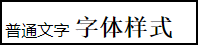


#### (六) 文本样式

- **`text-decoration`**

  文本装饰，一般用于设置下划线、中划线、上划线。

  **值**：

  - underline：下划线
  - line-through：中划线
  - overline：上划线

  ```css
  text-decoration:underline;
  text-decoration:line-through;
  text-decoration:overline;
  ```

  

- **`text-align`**

  文本水平对齐方式。

  **值**：

  - left：左对齐
  - center：居中
  - right：右对齐

  ```css
  text-align:left;
  text-align:center;
  text-align:right;
  ```

  

- **`text-index`**

  文本首行缩进

  **值**：

  - px单位：以1像素为单位缩进。
  - em单位：以1字为单位缩进。

  ```css
  /* 首行缩进10px */
  text-index:10px;
  /* 首行缩进2个字 */
  text-index:2em;
  ```

  

- **`line-heigt`**

  文本行高，默认值（normal）1.5倍比文字高度。会增大行间距。

  **值**：

  - px单位：以px为单位设置行高，若设置的高度和标签高度相同，会有**垂直居中**的效果。
  - em单位：以字为单位设置行高。
  - 数字：按照倍比设置行高。

  ```css
  /* 若文字所在标签的高度也为20px，则呈现垂直居中 */
  line-height: 20px;
  /* 1.5倍行高 */
  line-height:1.5;
  ```

  **案例**

  设置文本效果：`text-indent: 2em;`、`text-decoration: underline;`

  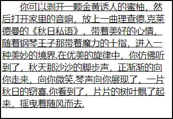


#### (七) 伪类

- **`选择器:hover`**

  hover伪类，鼠标悬浮，指定样式。

  ```css
  .btn:hover{
      background-color:blue;
  }
  ```

  

- **`选择器:active`**

  active伪类，鼠标点击时，指定样式。

  ```css
  .btn:active{
      background-color:blue;
  }
  ```

  **特殊情况**：hover、active要更改别的元素样式，使用方式同**子元素选择器**等综合选择器使用方式。

  1. 元素A和元素B是父子关系 ， 元素A选择器:hover  元素B选择器  {}

     ```css
     /* 改子级  用空格 */
     .father:hover .child {
         background-color: blue;
     }
     ```

  2. 元素A和元素B是相邻关系 ， 元素A选择器:hover + 元素B选择器  {}

     ```css
     /* 改相邻  用+ */
     .child:hover + .brother {
         background-color: blue;
     }
     ```

  **案例**

  鼠标悬浮时，修改背景颜色。

  **效果**

  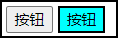

  

- **`选择器:nth-child()`**

  快读通过**简单数学公式**，**正序**只更改选择器匹配中的元素。

  **值**：

  - **数字**：设置指定位置元素的样式。
  - **n + a**：设置第a个元素的样式。
  - **an + b**：设置符合表达式元素的样式。

  **匹配规则**：找到【目标选择器】的父级，再匹配【目标标签】在父级中的顺序值，符合`nth-child()`公式结果值的标签。

  **注意**：匹配计数起始，是以【选择器】目标所在父容器的**第一个子元素**开始算。

  ```css
  /* 设置第二个起标签样式 */
  div:nth-child(n + 2){
      color:blue;
  }
  
  /* 设置奇数个样式 */
  div:nth-child(2n + 1){
      color:blue;
  }
  ```

  **案例**

  设置奇数个文字样式为蓝色。

  **效果**

  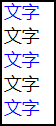

  

- ##### `选择器:nth-last-child()`

  快读通过**简单数学公式**，**逆序**只更改选择器匹配中的元素。

  **值**：同`nth-child()`

  **匹配规则**：同上。

  **注意**：同上

  

#### (八) 伪元素

- **`选择器::before`**

  伪双标签元素，设置`before`伪元素，可以在标签前添加内容，效果类似一个行内标签。

  **注意**：必须写`content`属性，值必须得是一个**文本**或者**空字符**。

  ```css
  /* 在标签前显示文本 */
  .title::before{
      content:'这是个标题';
  }
  /* 在标签前显示图标等 */
  .title::before{
      content:'';
      height:10px;
      width:10px;
      background-image:url("./../imgs/icon.png")
  }
  ```

  

- **`选择器::after`**

  伪双标签元素，设置`after`伪元素，可以在标签前添加内容，效果类似一个行内标签。

  **注意**：必须写`content`属性，值必须得是一个**文本**或者**空字符**。

  ```css
  /* 在标签前显示文本 */
  .title::after{
      content:'这是个标题';
  }
  /* 在标签前显示图标等 */
  .title::after{
      content:'';
      height:10px;
      width:10px;
      background-image:url("./../imgs/icon.png");
  }
  ```

  **案例**

  给目标元素加上`before`伪类,填入红色文字。

  **效果**

  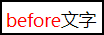

  


### 五、总结

这一小节，主要是对CSS的背景、边框、字体、文本、伪类进行介绍。这些属性都是CSS基础级别，日常开发中非常经常用到，也是需要大家主要去熟悉，使用的。其中伪类的知识点会比较抽象复杂，大家在使用的时候需要理清楚父子关系，层级关系。合理的在选择器上去绑定伪类属性，高效正确使用伪类。


## CSS-02

### 一、知识点

css继承、盒子模型、float浮动、position定位、display


### 二、目标

- 牢记盒子模型
- 熟练使用position定位
- 熟悉display


### 三、内容分析

#### (一) 重点

- 盒子模型
- position定位
- display

#### (二) 难点

- position定位

  


### 四、内容

#### (一) CSS继承

- 文字相关的样式默认被子元素继承
- 布局相关的样式默认不能被继承（inherit）

**案例**

嵌套标签中，父级设置文本及布局样式。

```html
<style>
    .page-container{
        color:#123456;
        font-size:24px;
        text-align:center;
        border:1px solid red;
    }
</style>
<body>
    <div class="page-container">
        <!-- 文本样式会继承,其他不会 -->
        <div class="title">标题</div>
        <span class="text">文本</span>
    </div>
</body>
```

**效果**

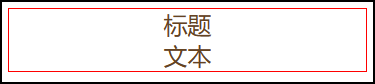


#### (二) 盒子模型

##### 2.1 组成

每个标签都有一个盒子模型，有内容区、内边距、边框、外边距。

从内到外：content -> padding -> border -> margin。

**注意**：如果没有设置`box-sizing`属性，一个盒子的最终大小为content + padding + border，也是`background-color`的区域。

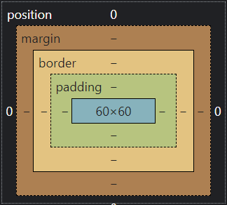


##### 2.2 详情

- **content**

  标签的内容区域，用来盛放别的标签或者文本等内容。

  一般css设置的宽高就是这个区域。

  - **width**：宽
  - **height**：高

  

- **padding**

  内边距，内容到边框的距离。

  一般设置完后，由于padding占位，会撑大盒子模型。

  - **单参数**

    指定对应边内边距或者一次性指定所有内边距（单位：`px` `%`）。

    padding-left

    padding-right

    padding-top

    padding-bottom

    padding

  - **多参数**

    参数个数，按【上 -> 右 -> 下 -> 左】顺时针顺序，没有指定到的边则和**对边**相同。

    padding：上下    右左

    padding：上    右左    下

    padding：上    右    下    左

  ```css
  .padding {
      /* 单参 */
      padding-left: 40px; 
      padding-right: 40px;
      padding-top: 40px;
      padding-bottom: 40px;
      padding: 10px; 
      
      /* 多参 从上开始  顺时针 哪边没有  去找对边补齐 */
      /* 两个参数  上下  右左 */
      padding: 10px 50px; 
      /* 三个参数  上  右左  下*/
      padding: 10px 50px 100px;
      /* 四个参数 上 右 下 左（顺时针）*/
      padding: 10px 50px 60px 20px;
  }
  ```

  

- **border**

  边框样式，回顾上节课的【边框样式】，这里介绍边框宽度的参数写法。

  - **单参数**

    指定对应边框或者一次性指定所有边框。

    border-left

    border-right

    border-top

    border-bottom

    border-width

  - **多参数**

    参数个数，按【上 -> 右 -> 下 -> 左】顺时针顺序，没有指定到的边则和**对边**相同。

    border-width：上下    右左

    border-width：上    右左    下

    border-width：上    右    下    左

  - **快速写法**

    ```css
    border: 1px solid #123456
    ```

  

- **margin**

  外边距，一般用来调整盒子之间的距离,参数写法与作用同padding。

  - **单参数**

    指定对应边框或者一次性指定所有边框。

    margin

    margin-left

    margin-right

    margin-top

    margin-bottom

  - **多参数**

    参数个数，按【上 -> 右 -> 下 -> 左】顺时针顺序，没有指定到的边则和**对边**相同。

    margin：上下    右左

    margin：上    右左    下

    margin：上    右    下    左

  ```css
  .margin {
      /* 单参 */
      margin: 10px;
      margin-top: 20px; 
      margin-bottom: 20px; 
      margin-left: 20px; 
      margin-right: 20px; 
      margin: 10px; 
      
      /* 多参 从上开始  顺时针 哪边没有  去找对边补齐*/
      /* 两个参数  上下  右左 */
      margin: 10px 50px; 
      /* 三个参数  上  右左  下*/
      margin: 10px 50px 100px;
      /* 四个参数 上 右 下 左（顺时针）*/
      margin: 10px 50px 60px 20px; 
  }
  ```


##### 2.3 补充	

- **背景颜色会填充到margin以内的区域**

- **内容在content区域**

- **`box-sizing`**

  可以改变盒子模型的展示形态

  - **content-box**(默认值)

    width(宽)、height(高)，**作用于content**

  - **border-box**

    width(宽、height(高)，**作用于content padding border**，防止padding、border撑大盒子大小。

    ```css
    .box-sizing {
        /* 属性box-sizing，可以改变盒子模型的展示形态 */
        box-sizing: border-box;
    }
    ```

- **`box-shadow`**

  可以设置盒子模型的周边阴影

  - 参数

    x轴偏移量   y轴偏移量   阴影大小  阴影颜色

    ```css
    /* 一个偏右下的红色阴影 */
    box-shadow: 10px 20px 10px red;
    ```


#### (三) float浮动

##### 3.1 文档流

文档中可显示对象在排列时所占用的位置

- **块级元素**：单独一行，自上而下（div、h1、p）

- **行内元素**：从左到右水平分布显示（a、span、strong）


##### 3.2 float特点

1. 脱离文档流，相对于父容器靠左或者靠右排列，如果之前有浮动元素，会挨着排列。
2. 如果区域内出现``标签，浮动元素的文本会绕开图片区域，呈现一个【文字围绕图片】的效果。


##### 3.3 参数值

- none(默认)：不浮动，保持原文档流。
- left：脱离文档流，居左浮动。
- right：脱离文档流，居右浮动。

```html
<style>
    .float-left{
        float:left;
    }
    div{
        width:100px;
        height:100px;
        border:1px solid red;
    }
</style>
<body>
    <!-- 案例1 元素浮动 -->
    <div class="float-container">
        <span>文本</span>
        <div class="float-left">浮动元素1</div>
        <div class="float-left">浮动元素2</div>
    </div>
</body>
```


#### (四) position定位

##### 4.1 参数值

- **relative**

  指定该元素为相对定位，相对于其自身正常位置定位（常用于给子集提供定位参照）。如果是给自己提供定位参照点，可以不写【**4.2**】的配合属性。

  **案例**

  ```html
  <!-- 子元素根据自身位置偏移 -->
  <style>
      .position-relative{
          position:relative;
          left:10px;
          top:0px;
      }
      .father{
          height:100px;
          background-color:#123456;
      }
      .child{
          height:50px;
          background-color:#654321
      }
  </style>
  <body>
      <div class="father">
          <div class="child position-relative"></div>
      </div>
  </body>
  ```

  

- **absolute**

  指定该元素为绝对定位，相对于最近一个带有**【定位属性】**的父级元素定位，若没有则以`body`做定位参照点。

  **案例**

  ```html
  <!-- 子元素根据自身位置偏移 -->
  <style>
      .position-relative {
          postion: relative;
          left:50px;
          top:50px;
      }
      .position-absolute{
          /* 若不写，则继续找父级，直到body */
          position:absolute;
          left:10px;
          top:0px;
      }
      .father{
          height:100px;
          background-color:#123456;
      }
      .child{
          height:50px;
          background-color:#654321
      }
  </style>
  <body>
      <div class="father position-relative">
          <div class="child position-absolute"></div>
      </div>
  </body>
  ```

  

- **fixed**

  指定该元素为绝对固定定位，相对于浏览器窗口定位。

  **案例**

  ```html
  <!-- fixed固定定位 -->
  <style>
      .position-relative {
          postion: relative;
          left:50px;
          top:50px;
      }
      .position-fixed{
          position:fixed;
          bottom:30px;
          right:10px;
      }
      .father{
          height:100px;
          background-color:#123456;
      }
      .child{
          height:50px;
          background-color:#654321
      }
  </style>
  <body>
      <div class="father position-relative">
          <div class="child position-fixed"></div>
      </div>
  </body>
  ```

  

##### 4.2 配合属性

- **top**：离顶部的距离

- **bottom**：离底部的距离

- **left**：离左边的距离

- **right**：离左边的距离

  **注意**：

  1. position定位要配合上述属性使用，才能看到偏移效果，单位为：`px` 或 `%`；
  2. **top**和**bottom**不同时写，**left**和**right**不同时写。


#### (五) display

##### 5.1 值

- **none**

  隐藏该元素。

- **block**

  将元素转为**块级元素**。

- **inline**

  将元素转为**行内元素**。

- **inline-block**

  将元素转为行**内块元素**，可以指定宽高并且不换行。（未指定宽高则根据内容撑开）


##### 5.2 去除元素间空白间隙

【inline-block】【inline】元素之间会有空白间隙。

1. 在你的HTML代码里元素间不留任何空白。

2. 父元素设置`font-size : 0`。

   

### 五、总结

这一小节，主要介绍了CSS继承、盒子模型、浮动、定位、display属性的使用。首先知识点都是非常重要，在日常开发中使用的非常高，其次他们的难度会有所上升，可能有些同学觉得会比较抽象，难以理解，是很正常的现象，不要着急。盒子模型是必须掌握的，因为每一个标签都是一个盒子模型，所有的样式都是围绕这个内容。浮动和定位更多是布局中使用，布局是需要大家对整个页面有规划，需要大家有大局观，从大到小去布局。在日后的不断练习中会得到锻炼，对这小节的知识会有更深理解。


## CSS-03

### 一、知识点

overflow、最大最小宽高、透明度、transform形变、动画、calc函数、过渡属性


### 二、目标

- 熟悉overflow使用场景
- 熟悉最大最小宽度
- 熟练使用transform
- 熟练并区分css动画和过渡属性


### 三、内容分析

#### (一) 重点

- 过渡属性    
- 动画
- 最大最小宽高
- calc函数

#### (二) 难点

- 最大最小宽高

- 过渡属性

  


### 四、内容

#### (一) 内容溢出

##### 1.1 overflow属性值

- **overflow**（默认值）: 内容不会被修剪，呈现在元素框外。

  **案例**

  ```html
  <style>
      .block {
          width: 200px;
          height: 200px;
      }
  
      .of-visible {
          overflow: visible;
      }
  </style>
  
  <body>
      <div class="block of-visible">
          
      </div>
  </body>
  ```

  **效果**

  

  

- **auto**：内容溢出时出现滚动条。

  **案例**

  ```html
  <style>
      .block {
          width: 200px;
          height: 200px;
      }
  
      .of-auto {
          overflow: auto;
      }
  </style>
  
  <body>
      <div class="block of-auto">
          
      </div>
  </body>
  ```

  **效果**

  

  

- **hidden**：内容溢出时，隐藏溢出的部分。

  **案例**

  ```html
  <style>
      .block{
          width: 200px;
          height: 200px; 
      }
      .of-hidden {
          overflow: hidden;
      }
  </style>
  <body>
      <div class="block of-hidden">
           
      </div>
  </body>
  ```

  **效果**

  

  

- **scroll**：无论内容是否溢出，都显示滚动条。

  **案例**

  ```html
  <style>
      .block{
          width: 200px;
          height: 200px; 
      }
      .of-scroll {
          overflow: scroll;
      }
      img{
        	width: 100px;
        	height: 80px; 
      }
  </style>
  <body>
      <div class="block of-scroll">
         
      </div>
  </body>
  ```

  **效果**

  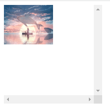


##### 1.2 使用场景

用户头像、轮播图等等需要区域显示的场景。

**案例**

```html
<style>
    .block {
        width: 200px;
        height: 200px;
        border-radius: 50%;
    }
    .of-hidden {
        overflow: hidden;
    }
    img{
        width: 300px;
        height: 240px;
    }
</style>

<body>
    <div class="block of-hidden">
        
    </div>
</body>
```

**效果**


#### (二) 最大最小宽高

##### 2.1 属性

- `min-height` `min-width`

  指定元素最小的宽高。

- `max-width` `max-height`

  指定元素能够拥有的最大宽高。


##### 2.2 使用场景

当`width`和`height`的值为**百分比**这种不固定值时，页面发生大小变化有可能导致元素过大或者过小，页面排版不美观，可以通过设置最大最小宽高限定其变化范围。

```html
<style>
    .min{
        min-height:200px;
        min-width:400px;
    }
    .max{
        max-height:400px;
        max-width:400px
    }
    .container{
        width:100vw;
        height:100vh;
    }
    .box{
        width: 50%;
        height: 100%;
        background-color: #123456;
        color: #fff;
    }
</style>
<body>
    <div class="container">
        <div class="box min"></div>
        <div class="box max"></div>
    </div>
</body>
```

**案例1**

设置最小宽高。

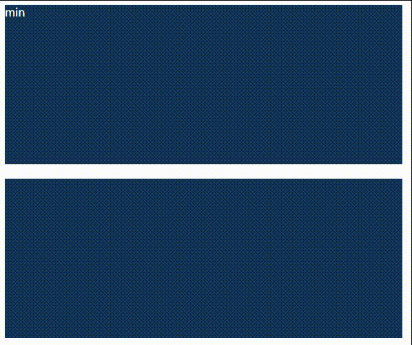

**案例2**

设置最大宽高。

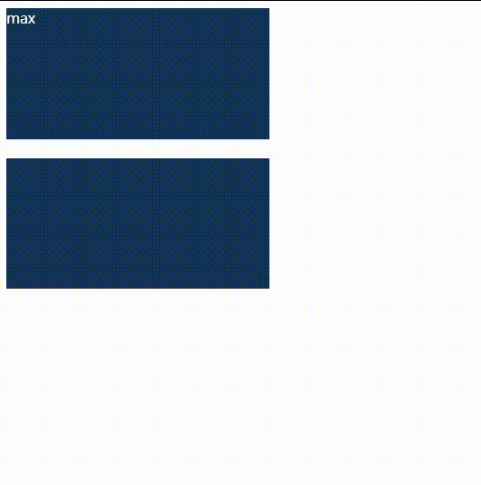


#### (三) 透明度

##### 3.1 opacity

规定整个元素的透明度。

**取值范围**：`0 - 1`

**注意**：子元素也会变跟着透明

```html
  <style>
    .opacity-50{
        opacity: 0.5;
        /* opacity: 1; */
    }
    .father{
        background-color: green;
        
    }
     .child{
        background-color: red;
        width: 200px;
        height: 100px;
    }
</style>
<body>
    <div class="father opacity-50">
        <div class="child ">
            opacity变化透明度
        </div>
    </div>
</body>
```

**案例**

`opacity: 0.5;`

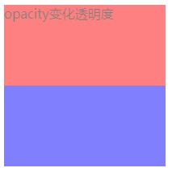

`opacity: 1;`

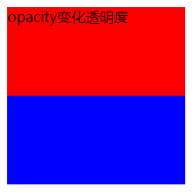

在子元素上设置时会导致重叠区域颜色改变。

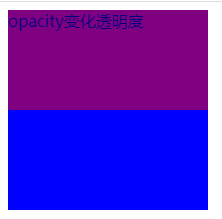


##### 3.2 rgba(r,g,b,a)

`rgb()`的升级版，最后一个参数指定透明度。

**取值范围**：

- r、g、b：`0 - 255`
- a：`0 - 1`

**注意**：不会影响子元素，只是更改背景颜色的透明度。

```html
<body>
  <style>
    .father{
         width: 200px;
         height: 200px;
    }
    .child{
        background-color: red;
        width: 200px;
        height: 100px;
    }
    .rgba-5{
        background-color: rgba(0,0,0,.5);
        color: #fff;
    }
</style>
<body>
    <div class="father rgba-5">
        <div class="child">
            rgba变化透明度
        </div>
    </div>
</body>
```

**案例**

rgba 值为 1

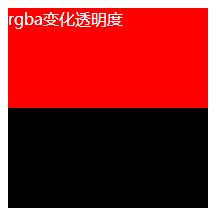


rgba 值为 0.5

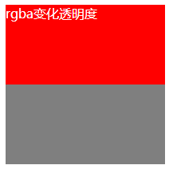


#### (四) cursor手势

鼠标悬浮后的鼠标指针样式。

- pointer：手指样式（常用）

更多手势见：[cursor | MDN](https://developer.mozilla.org/zh-CN/docs/Web/CSS/cursor#值)

**案例**

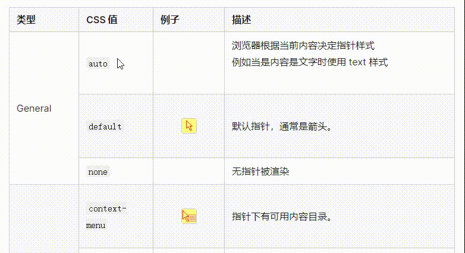


#### (五) transform变换

##### 5.1 变换方式

1. **rotate函数**

  - rotate()：(默认)以【**Z轴**】旋转元素。
  - rotateX()：以【**X轴**】旋转元素。
  - rotateY()：以【**Y轴**】旋转元素。
  - rotateZ()：以【**Z轴**】旋转元素。

  **取值范围**：无上限，超过360就是转一圈，负角度表示逆时针的旋转。（单位：`deg`）

  **案例**

  ```html
<style>
    div {
        width: 200px;
        height: 100px;
        background-color: #123456;
        margin-top: 80px;
        margin-left: 50px;
        color: #fff;
    }

    /* 顺时针旋转45° */
    .rotate {
        transform: rotate(45deg);
    }

    /* 逆时针旋转45° */
    .reverse-rotate {
        transform: rotateZ(-45deg);
        margin-top: 120px;
    }

    .x-rotate {
        margin-top: 80px;
        transform: rotateX(45deg);
    }

    .y-rotate {
        margin-top: 80px;
        transform: rotateY(45deg);
    }
</style>

<body>
    <!-- 顺时针旋转45° -->
    <div class="rotate">顺时针旋转45°</div>
    <!-- 逆时针旋转45° -->
    <div class="reverse-rotate">逆时针旋转45°</div>
    <!-- x轴旋转45° -->
    <div class="x-rotate">x轴旋转45°</div>
    <!-- y轴旋转45° -->
    <div class="y-rotate">y轴旋转45°</div>
    <div>没有改变的</div>
</body>
  ```

  **效果**

  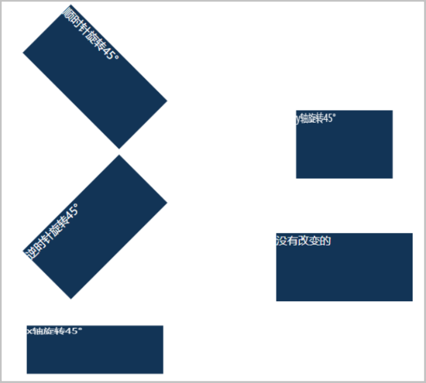

  

2. **scale函数**

  - scale()：

    单参：在【**X、Y轴**】同倍比缩放元素。

    双参：分别指定【**X轴**】、【**Y轴**】倍比缩放元素。

  - scaleX()：在【**X轴**】缩放元素。

  - scaleY()：在【**Y轴**】缩放元素。

  **取值范围**：0 - 无穷大。（单位：数字）

  **案例**

  ```html
<style>
    div {
        width: 200px;
        height: 100px;
        background-color: #123456;
    }
    /* 放大到1.2倍 */
    .scale {
        transform: scale(1.2);
    }
    /* 缩小到0.5倍 */
    .reverse-scale {
        transform: scaleX(0.5);
    }
</style>
<body>
    <!-- 放大到1.2倍 -->
    <div class="scale"> </div>
    <!-- 缩小到0.5倍 -->
    <div class="reverse-scale"> </div>

    <div></div>
</body>
  ```

  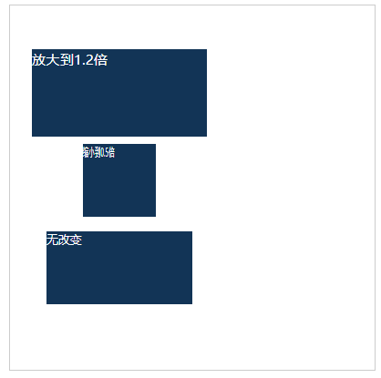

  

3. **translate函数**

  以元素原文档流位置为原点，根据X、Y轴移动元素。

  - translate()：

    单参：指定【**X轴**】移动距离。

    双参：分别指定【**X轴**】、【**Y轴**】移动距离。

  - translateX()：指定【**X轴**】移动距离。

  - translateY()：指定【**Y轴**】移动距离。

  **取值范围**：负数 - 整数。（单位：`px` 、`%`）

  **案例**

  ```html
<style>
    #box{
        width: 300px;
        height: 300px;
        padding: 50px;
        border: 1px solid #ccc;
        background-color: rgba(0,0,0, 0) !important;
    }
    div {
        width: 150px;
        height: 50px;
        background-color: #123456;
        margin-top: 40px;
        color: #fff;
    }

    /* 正向移动X轴、负向移动Y轴 */
    .translate {
        transform: translate(100px,-40px);
    }
    /*  向移动X轴，自身宽度的一半 */
    .reverse-translate {
        transform: translate(50%);
    }
</style>
<body>
    <div id="box">
        <!-- 正向移动X、Y轴 -->
        <div class="translate">正向移动X轴、负向移动Y轴 </div>
        <!-- 负向移动X轴，自身宽度的一半 -->
        <div class="reverse-translate">向移动X轴，自身宽度的一半 </div>

        <div>没有改变</div>
    </div>

</body>
  ```

  **效果**

  

  

4. **skew函数**

  以元素原文档流位置为原点，在X、Y轴上形变，趋向菱形。

  - skew()：

    单参：指定在【**X轴**】形变。

    双参：分别指定在【**X轴**】、【**Y轴**】形变。

  - skewX()：指定在【**X轴**】形变。

  - skewY()：指定在【**Y轴**】形变。

  **取值范围**：负数 - 整数。（单位：`deg`）

  **案例**

  ```html
<style>
    div {
        width: 200px;
        height: 100px;
        background-color: #123456;
    }
    /* 在X轴上正向形变 */
    .skew {
        transform: skewX(10deg);
    }
    /* 在X轴上负向形变 */
    .reverse-skew {
        transform: skewX(-20deg);
    }
</style>
<body>
    <!-- 在X轴上正向形变 -->
    <div class="skew"> </div>
    <!-- 在X轴上负向形变 -->
    <div class="reverse-skew"> </div>

    <div></div>
</body>
  ```

  **效果**

  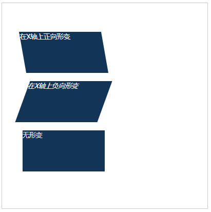


##### 5.2 变化起点

- ##### transform-origin

  **语法**：`transform-origin: x轴 y轴;`

  ```css
  /* 以左上角为原点 */
  transform-origin: 0 0;
  /* 以x轴0点为原点 */
  transform-origin: 0;
  ```


##### 5.3 注意

transform变换**不会**更改元素原文档流位置、大小，只是在视觉上发生了变换。


#### (六) 动画

##### 6.1 创建动画

​	在css中要使用动画，必须先创建一个预设的动画，规定动画帧的内容。动画播放时，会按照所有设定的关键帧，按顺序播放并且有过渡效果。

- **`@keyframes 动画名字 { /* 动画帧内容 */ }`**

  使用`@keyframes `关键字，声明一个动画并取名。然后设定`0% - 100%`或者`from{ /* 初始样式 */ } to{ /* 结尾样式 */ }`的动画帧过程的css样式。

  **案例**

  声明一个旋转的动画。

  ```css
  /* 使用百分比，精确设定每个阶段的样式 */
  @keyframes rolling{
      /* 第一帧样式 */
      0%{
          width: 100px;
          height: 100px;
          background-color:#123456;
          transform:rotate(0deg);
      }
  
      /* 中间帧可以省略 */
  
      /* 最后一帧样式 */
      100%{
          width: 200px;
          height: 200px;
          background-color:#654321;
          transform:rotate(360deg);
      }
  }
  
  /* 使用 from to ，快速设置开始到结束的样式 */
  @keyframes rolling{
      /* 第一帧样式 */
      from{
          width: 100px;
          height: 100px;
          background-color:#123456;
          transform:rotate(0deg);
      }
      /* 最后一帧样式 */
      to{
          width: 200px;
          height: 200px;
          background-color:#654321;
          transform:rotate(360deg);
      }
  }
  ```


##### 6.2 使用动画

- **animation-name**

  要使用的动画的名字。（`@keyframes`声明的动画）

- **animation-duration**

  指定动画周期的时长。（单位：`s`）

- **animation-delay**

  指定动画延时多久开始。（单位：`s`）

- **animation-timing-function**

  指定动画速率曲线。

  **值**：

  - **ease**(默认值)：缓慢
  - **ease-in**：慢入
  - **ease-out**：慢出
  - **ease-in-out**：慢入慢出
  - **linear**：线性

- **animation-iteration-count**

  指定动画播放次数。

  **值**：

  - 数字
  - **infinite**：无限

- **animation-direction**

  指定动画播放方向。

  **值**：

  - **normal**(默认值)：每个动画循环结束，动画重置到起点重新开始
  - **reverse**：反向运行动画。
  - **alternate**：动画交替反向运行。
  - **alternate-reverse**：反向交替，反向开始交替。

- **animation**

  快速简写，一次配置上述所有动画设置。

  **语法**：`animation: name duration timing-function delay iteration-count direction;`

  **案例**

  旋转和位移动画。

  ```html
  <style>
      div{
          width:50px;
          height:50px;
          background-color:#123123;
      }
      /* 分部设置 */
      .animate-detail{
          animate-name: rolling;
          animation-duration: 3s;
          animation-timing-function: ease-in-out;
          animation-iteration-count: infinite;
          animation-direction: alternate;
      }
      /* 一步到位 */
      .animate-easy{
          animation: rolling 3s ease-in-out 0 infinite alternate;
      }
      /* 使用 from to ，快速设置开始到结束的样式 */
      @keyframes rolling{
          /* 第一帧样式 */
          from{
              width: 100px;
              height: 100px;
              background-color:#123456;
              transform:rotate(0deg);
          }
          /* 最后一帧样式 */
          to{
              width: 200px;
              height: 200px;
              background-color:#654321;
              transform:rotate(360deg);
          }
      }
  </style>
  <body>
      <div class="animate-detail"></div>
      <div class="animate-easy"></div>
  </body>
  ```

  **效果**

  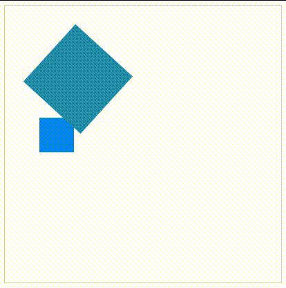


#### (七) calc函数

对于css中无法写数学计算的问题，`calc( )`很好的解决了这一问题，在函数中写入计算式，会自动计算出结果值。

**注意**：计算式中的**加法**、**减法**的符号，左右必须有一个【空格】。

```html
<style>
    .father{
        width: 500px;
        height:200px;
        background-color: green;
    }
    .child{
        width: calc(50% - 10px);
        height: 100%;
        background-color: red;
    }
</style>
<body>
    <div class="father">
        <div class="child"></div>        
    </div>
</body>
```

**效果**

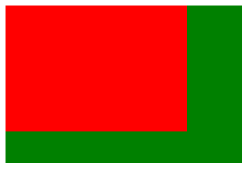


#### (八) 过渡属性

- **transition**

  指定元素某一个属性值发生**瞬间变化**时，会自动过渡变化，而不是瞬间变化。

  **注意**：效果有点像动画，但它自身并不指定动画，不要混淆。

  **语法**：`transition: property  duration  timing-function delay ;`

  **参数**：

  - **property**：指定有过渡效果的属性，默认值是`all`(对所有属性都生效)。
  - **duration**：过渡时长(单位：`s`)，默认值是`0s`。
  - **timing-function**：指定动画速率曲线。
    - ease(默认值)：缓慢
    - ease-in：慢入
    - ease-out：慢出
    - ease-in-out：慢入慢出
    - linear：线性
  - **delay**：延时触发(单位：`s`)，默认值是`0s`。

  **案例**

  ```html
  <style>
      .box{
          width: 100px;
          height: 100px;
          background-color: #123456;
      }
      .box:hover{
          width: 150px;
          height: 150px;
          background-color: #654321;
      }
      .transition-all {
          transition: all 1s;
      }
      .transition-one {
          transition: width 1s;
      }
  </style>
  <body>
      <!-- 没有transition -->
      <div class="box"></div>
      <!-- transition-all -->
      <div class="box transition-all"></div>
      <!-- transition-one -->
      <div class="box transition-one"></div>
  </body>
  ```

  **效果**

  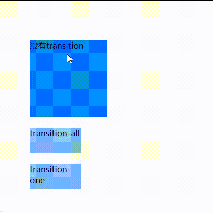


### 五、总结

这一小节，主要介绍了overflow属性、最大最小值、透明度、手势、平移、旋转、动画、过渡属性。这些知识点，除了一些基础的CSS知识以外，更多内容是对样式的交互、美感进行了提升。难度上不是很难，也比较好理解，更多是记忆性内容。


## CSS-04

### 一、知识点

flex布局、grid布局、媒体查询


### 二、目标

- 十分熟练使用flex布局
- 熟悉媒体查询


### 三、内容分析

#### (一) 重点

- flex布局
- grid布局
- 熟悉媒体查询

#### (二) 难点

- 弹性布局

  


### 四、内容

#### (一) flex布局

##### 1.1 序言

​	flex是一种**一维**的布局模型，它给 flexbox 的子元素之间提供了强大的空间分布和对齐能力。一次只能处理一个维度上的元素布局，一行或者一列。


##### 1.2 主轴和交叉轴

​	每个flex容器都有主轴和交叉轴。主轴由 `flex-direction` 定义（默认如图），另一根轴垂直于它。我们使用 flexbox 的所有属性都跟这两根轴线有关，所以有必要在一开始首先理解它。

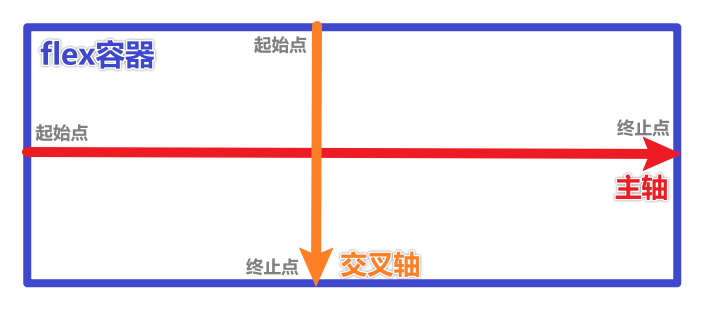


##### 1.3 弹性布局

​	设置`display:flex;`将一个标签设置为**flex容器**，其直系子元素就成为**flex元素**，并且执行flex容器的默认设置：元素从主轴的起始线开始排列为一行、元素被拉伸来填充交叉轴大小、`flex-wrap`为`nowrap`。

**属性**：

- **flex-direction**

  更改 flex 容器中元素的**排列方向**或**主轴**。

  - row(默认值)：从左到右
  - row-reverse：从右到左
  - column：从上到下，**主轴和交叉轴交换**。
  - column-reverse：从下到上，**主轴和交叉轴交换**。

  

- **justify-content**

  元素在主轴方向上对齐方式。

  - flex-start(默认值)：元素靠齐主轴的**起始点**。
  - flex-end：元素靠齐主轴的**终止点**。
  - center：元素在主轴的中心。
  - space-between：相邻元素的间距相同，首位元素在起始点、终止点靠齐。
  - space-around：每个元素自身的左右留白相等

  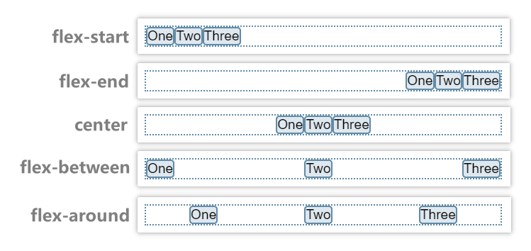

  

- **align-items**

  元素在交叉轴方向对齐方式和空间分配。

  - stretch(默认值)：拉伸元素高度来填满 flex 容器。
  - flex-start：元素靠齐交叉轴的**起始点**。
  - flex-end：元素靠齐交叉轴的**终止点**。
  - center：元素在交叉轴的中心。

  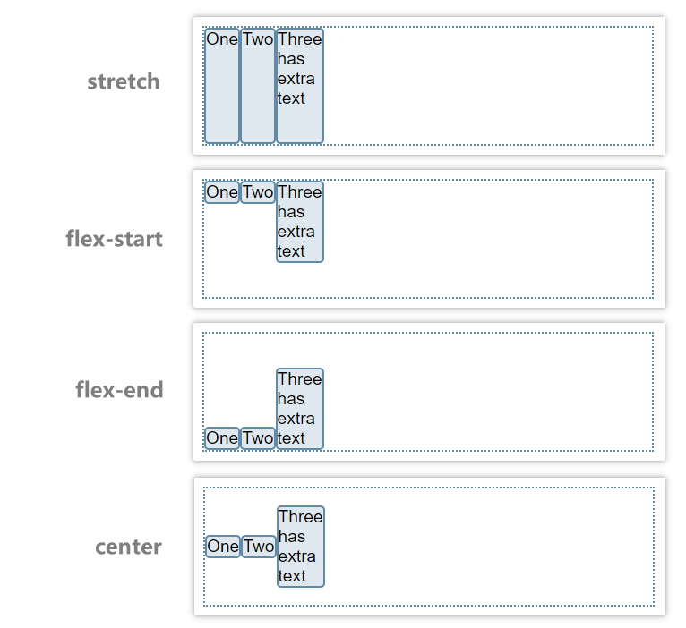

  

- **flex-wrap**

  ​	虽然`flexbox`是一维模型，但可以通过该属性使`flex`元素溢出时换行。

  - no-wrap(默认值)：无论有多少元素，都不换行，元素会被挤小。
  - wrap：容器放不下元素时，换行。

  **注意**：指定为`wrap`时，应该把每一行看作一个新的`flex`容器，并且每行拥有自己的主轴和交叉轴。

  

- **align-content**

  ​	当flex容器为`wrap`并且出现换行时，指定多根<u>主轴（每行）</u>在flex容器中**交叉轴方向上的对齐方式**。

  - flex-start(默认值)：每根主轴靠齐容器交叉轴方向的**起始点**。
  - flex-end：每根主轴靠齐容器交叉轴方向的**终止点**。
  - center：每根主轴在容器交叉轴方向的中心。
  - space-between：相邻主轴的间距相同，首位元素在起始点、终止点靠齐。
  - space-around：每个主轴自身在容器交叉轴方向留白相等


##### 1.4 平均分布

- **flex**

  ​	如果元素在flex容器中，可以设定其`flex`值，最终容器中的元素所占大小即元素之间的`flex值`比例。

  ​	若只有容器中一个元素，则占满；若只有容器中只有一个元素设定了`flex`，则该元素占满剩余空间。

  ```html
  <style>
      .layout-flex{
          display: flex;
          height: 100px;
      }
      .flex-1{
          flex: 1;
          background-color: red;
      }
      .flex-2{
          flex: 2;
          background-color: green;
      }
  </style>
  <body>
      <div class="layout-flex">
          <div class="flex-1"></div>
          <div class="flex-2"></div>
      </div>
  </body>
  ```

  **效果**

  


#### (二) grid布局

设置`display:grid;`将一个标签设置为**grid容器**，通过设置网格数量和大小，内部的子元素会自动按序填入网格中。

**属性**：

- **grid-template-rows**：指定网格行数。

  **值**：

  - 多个空格隔开的长度（单位：`%` `px`）：列数等于参数量，按顺序指定每一列的宽度。

  - `repeat(列数, 大小)`：快速设置列数与大小。

    - 列数：数字	

    - 大小：`px`、`fr`(每列之间的比例)

  

- **grid-template-columns**：指定网格列数。

  **值**：同上

  

- **gap**：网格之间的间距。

  **值**：`px`

  

  **案例**

  一个两列等宽的网格，行数根据内容自适应，网格间距10px。

  ```html
  <style>
      .grid {
          width: 100%;
          height: 200px;
          display: grid;
          grid-template-columns: repeat(2, 1fr);
          gap: 10px;
      }
      span {
          display: inline-block;
          width: 100%;
          height: 100%;
          text-align: center;
          font-size: 30px;
          background-color: aqua;
      }
  </style>
  <body>
      <div class="grid">
          <span>1</span>
          <span>2</span>
          <span>3</span>
          <span>4</span>
          <span>5</span>
      </div>
  </body>
  ```

  **效果**

  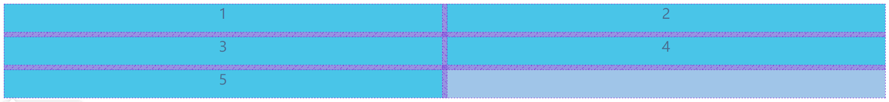


#### (三) 媒体查询

##### 3.1 创建媒体查询

- **`@media 媒体目标 and 条件 ...`**

  使用`@media`关键字，配合条件可以让网页在特定设备的特定条件下显示不同的效果。常用于**响应式布局**。

  **案例**

  当页面最大宽度小于`376px`时，显示手机设备下的样式。

  ```html
  <style>
      .content {
          margin: auto;
          width: 1200px;
          height: 300px;
          background-color: #123456;
      }
      .title{
          font-size:16px;
          color: #ffffff;
      }
      /* 当页面宽度是小屏设备时，重写选择器 */
      @media screen and (max-width: 765px) {
          .content {
              width: 90%;
              height: 200px;
              background-color: #645321;
          }
          .title{
              font-size: 20px;
              font-weight: bold;
          }
      }
  </style>
  <body>
      <div class="content">
          <span class="tite">标题</span>
      </div>
  </body>
  ```

  **效果**

  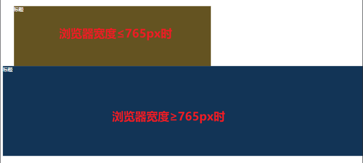


### 五、总结

这一小节的内容，主要是介绍两种布局。布局是完成页面的基础，合理使用好布局，可以提高写页面的效率。也可以减少我们开发的时间，所以大家除了知道两种布局的知识点，还需要熟练的使用，在每次的写页面做布局先去思考，哪一个更适合这个页面，学会结合去使用，因为一个页面上可能会使用多个布局属性，这小节也是很重点的，有很多需要记忆理解的知识。


# JavaScript


## JavaScript-01

### 一、知识点

js基础、变量、数据类型、数据类型检测、类型转换


### 二、目标

- 理解变量
- 掌握各种数据类型的特点、使用情景
- 熟悉数据类型转换


### 三、内容分析

#### (一) 重点

- 变量
- 数据类型
- 类型转换

#### (二) 难点

- 掌握各种数据类型的特点、使用情景

  


### 四、内容

#### (一) JS基础

##### 1.1 编程

​		让计算机代为解决某个问题，使用某种程序设计语言编写代码，最终得到正确结果的过程。


##### 1.2 机器语言

​		机器语言是用二进制代码表示的计算机能直接识别和执行的一种机器指指令系统令的集合。它是计算机的设计者通过计算机的硬件结构赋予计算机的操作功能。


##### 1.3 编程语言

​		可以通过类似人类语言的语言来控制计算机。让计算机为我们做事情，这样的语言就叫编程语言。

​		编程语言是用来控制计算机的一系列指令，有固定的格式和词汇（不同的编程语言的格式和词汇不一样），必须遵守。


##### 1.4 翻译器

​		高级语言所编程的语言不能被计算机识别，必须经过转换才能执行，为此，我们就需要一个翻译器。

​		JavaScript代码  —>  翻译器 （浏览器） —> 机器语言


##### 1.5 浏览器执行JS

​		浏览器主要分成两部分：渲染引擎、JS解释器。

​		渲染引擎：用于解析HTML与CSS，俗称内核。

​		JS引擎：JS解释器，读取网页中的JavaScript代码并执行。

​		浏览器本身不会执行JS代码，通过内置的JS引擎，逐行解释每一句代码（转换为机器语言），然后由计算机执行。


##### 1.6 HTML、CSS、Javascript的关系

​		HTML：决定网页结构和内容。

​		CSS：决定网页的模样。

​		JavaScript：实现业务逻辑和页面控制（功能）。


##### 1.7 JS的组成

​		ECMAScript：Javascript语法，由所有浏览器厂商共同遵守 （ECMA—欧洲计算机制造商协会）。

​		DOM：页面文档对象，提供给Javascript很多操作页面中元素的属性和方法。

​		BOM：浏览器对象模型，提供很多操作浏览器的属性和方法，比如：弹出框、获取分辨率等。


##### 1.8 Js的书写位置

- ##### 行内（不常用）

  限制比较多，无法写多行代码。

  ```html
  <!-- 行内  限制比较多 -->
  <button onclick="console.log(123123)">行内书写js</button>
  ```

  

- ##### 内部

  在`html`文件中，写一个`<script> </script>`标签。

  ```html
  <!-- 内部(script) -->
  <script type="text/javascript">
      alert("hello world!");
  </script>
  ```

  

- ##### 外部

  将Javascript代码写到`.js`文件中，通过`<script src="/* 文件路径 */"></script>`引入文件。

  ```html
  <!-- 外部引用 -->
  <script src="./../js/demo.js"></script>
  ```


##### 1.9 注释

- 单行注释：`// 注释内容`

- 多行注释：`/* 注释内容 */`

- 函数注释：

  ```js
  /**
    * 函数名、功能...
    */
  ```


##### 1.10 Js输入输出语句

- **alert(msg)**

  浏览器弹出警示框  

  **msg**：弹框内的显示的信息

  ```js
  alert("这是个弹出框")
  ```

  **效果**

  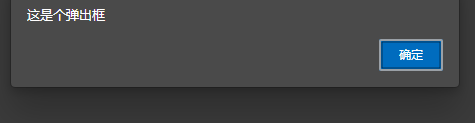

  

- **console.log(msg)**

  浏览器控制台打印输出信息，程序员测试使用

  **msg**：输出的信息

  ```js
  console.log("这是个控制台输出")
  ```

  **效果**

  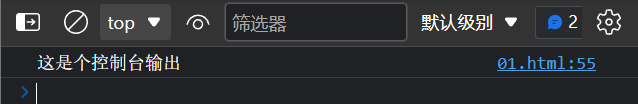

  

- **prompt(info)**

  浏览器弹出输入框，用户可以输入

  **info**：输入框上方的提示信息

  ```js
  prompt("请输入一个值")
  ```

  **效果**

  


#### (二) 变量

​	用来存储数据的一个有名字的容器，通过名字可以获取数据、修改数据，就是变量。

##### 2.1 声明

- **关键字 `var`**

  使用该关键字声明一个变量。

- **声明且赋值**

  使用`=`号，将右边的值赋值给`num`这个变量。

  ```js
  var num = 0;
  ```

- **声明不赋值**

  只声明`num`变量。

  ```js
  var num;
  ```

  

##### 2.2 命名规范

1. **见名知意（最重要）**
2. **驼峰式命名(Camel Case)**：首单词全小写，后面的单词首字母大写，如：studentNumber。
3. 可包含字母、数字、下划线、和美元符号。
4. 名称必须以字母、$或_开头。
5. 名称应注意大小写。
6. 保留字、关键字不能作为变量的名称，如：`var`、`console`、`window`...。


#### (三) 数据类型

​	对数据进行分类。JavaScript 的数据类型比较特殊， 拥有动态类型，相同的变量可以用作不同的类型，是根据等号右边的值来确定。

##### 3.1 基础数据类型

**特点**：数据存在栈里。

- **Number**

  数字类型，包含**整型值**和**浮点型值**，如：`1`  `0.1`

  

- **NaN**

  非数字类型，数学计算过程中若出现非`Number`类型，则计算结果就是NaN。如：`'hello world' - 1`

  - **isNaN()**

    判断是否是`NaN`非数字类型，如果传入的值是数字或者能够转为数字，都会被当作是数字类型。

  

- **String**

  字符串类型，需用`' '`或`" "`包裹。

  - **普通字符串**

    `'hello world'` 或 `"hello world"`

  - **转义字符**

    使用`\`+特定字符，会解析为转义字符。

    `\n`：换行符。

    `\\`：输出一个`\`字符。

    `\'`：输出一个`'`字符。

    `\"`：输出一个`"`字符。

    ```js
    console.log("\n")
    console.log("\\")
    console.log("\'")
    console.log("\"")
    ```

    **效果**

    

    

  - ##### `length`

    通过`变量名/字符串.length`的方式，可以获取字符串的长度。

    ```js
    var str = "hellow world"
    console.log(srt.length)
    console.log('hellow world'.length)
    ```

    **效果**

    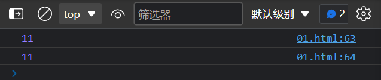

    

  - ##### 字符串拼接

    js中，对`String`类型进行**加法**操作，会拼接字符串。若与其他数据类型拼接，结果也是`String`类型。

    **注意**：字符串拼接仅限**加法**。

    ```js
    console.log("hellow world" + 1 + true + NaN )
    ```

    **效果**

    

    

- **undefined**

  变量没有被赋值，也可以手动对变量赋值为`undefined`。

  ```js
  var num
  console.log(num)
  ```

  **效果**

  

  

- **null**

  空值，表示没有数据，可以手动赋值为`null`，常见于后端返回数据。

  ```js
  var num = null
  console.log(null)
  ```

  **效果**

  

  

- **Boolean**

  布尔类型，只有`true`和`false`两种值。

  **为false的值**：`0`、`NaN`、`''`、`""`、`undefined`、`null`、`false`、错误的判断表达式。

  ```js
  var bool = true
  console.log(bool)
  ```

  **效果**

  

  

##### 3.2 引用数据类型

​	**特点**：值存放在堆里。

- **Array**

  数组类型，常用来存放一组意义相同的数据。

  ```js
  // 一个存放数字的数组
  var numArr = [0,1,2,3,4,5,6,7,8,9]
  console.log(numArr);
  ```

  **效果**

  

  

- **Object**

  对象类型，常用于存放一个相关度高的信息数据，如一个人的信息。（后续专门介绍）

  **形式**：**键值对**，每一个信息都是键值对的形式（`键:值`）。

  ```js
  var obj = {
      name:"小明",
      age:22,
      isAdult:true,    
  }
  ```

  **效果**

  


##### 3.3 栈与堆

- **基础数据类型**

  存在**栈**中，赋值和拷贝都会新开一个栈空间，数据间相互独立。

  ​	


- **引用数据类型**

  存在**堆**中，赋值会新开一个堆空间，拷贝会引用目标的堆地址，导致指向同一个地址空间。

  修改任意一份拷贝的值，都是在修改改地址的数据，会导致所有拷贝的数据都发生变化。

  


#### (四) 检测数据类型

- **typeof**

  用来判断**基础数据类型**，判断结果是全小写的基础数据类型字符串（`string` `number` `boolen`...）。

  **形式**：`typeof 变量`

  ```js
  var stuNum = 10
  var isTrue = false
  // 输出数据、数据类型、typeof结果的数据类型
  console.log(stuNum, typeof stuNum, typeof(typeof stuNum));
  // 输出数据、数据类型
  console.log(isTrue, typeof isTrue);
  // 判断数据类型
  if(typeof stuNum == "number"){
      console.log("是数字")
  }
  ```

  **效果**

  

  

- **instanceof**

  用来判断**引用数据类型**，判断结果是Boolean类型，`true`或者`false`。

  **形式**：`变量 instanceof 数据类型`

  ```js
  var arr = [1,2,3]
  var obj = {name:"小明"}
  // 输出数据、数据类型、typeof结果的数据类型
  console.log(arr, arr instanceof Array, typeof(arr instanceof Array));
  // 输出数据、数据类型
  console.log(obj, obj instanceof Object);
  ```


#### (五) 数据类型转换

​	把数据转换为别的数据类型。

##### 5.1 转为String

- **toString()**

  **形式**：`变量.toString()`

  ```js
  // Number类型 => String类型
  var num = 50
  var numToString = num.toString()
  console.log(numToString, typeof numToString);
  ```

  **效果**

  

  

- **String()**

  **形式**：`String(变量)`

  ```js
  // Number类型 => String类型
  var num = 50
  var numToString = String(num)
  console.log(numToString, typeof numToString);
  ```

  **效果**

  

  

- **隐式转换**

  在一个**加法运算式**中，如果出现一项为`String`类型数据，则js会将其当作**字符串拼接**，将任何数据类型都转为`String`进行拼接。因此可以利用这个特性，拼接一个空字符`""`达到数据转换的效果。

  **形式**：`变量 + ""`

  ```js
  // Number类型 => String类型
  var num = 50
  var numToString = num + ''
  console.log(numToString, typeof numToString);
  
  // Boolean类型 => String类型
  var bool = true
  var boolToString = bool + '' 
  console.log(boolToString, typeof boolToString);
  ```

  **效果**

  


##### 5.2 转为Number

- **parseInt()**

  将**形如数字**的字符串，转为Number类型的整数。

  **形式**：`parseInt(String)`

  **注意**：此方法不会保留小数。

  ```js
  // 形如数字的字符串 => Number类型
  var numStr = '50.15'
  console.log(parseInt(numStr), typeof parseInt(numStr), 'parseInt');
  // 非数字字符串
  var str = 'hello world'
  console.log(parseInt(str), 'parseInt')
  ```

  **效果**

  

  

- **parseFloat()**

  将**形如数字**的字符串，转为Number类型的浮点数。

  **形式**：`parseFloat(String)`

  ```js
  // 形如数字的字符串 => Number类型
  var numStr = '50.15'
  console.log(parseFloat(numStr), typeof parseFloat(numStr), 'parseFloat');
  // 非数字字符串
  var str = 'hello world'
  console.log(parseFloat(str), 'parseFloat')
  ```

  **效果**

  

  

- **Number()**

  将**形如数字**的字符串，转为Number类型，会自动保留小数。

  **形式**：`Number(String)`

  ```js
  // 整数形式
  var numStr1 = '50'
  console.log(parseFloat(numStr1), typeof parseFloat(numStr1), 'Number');
  // 小数形式
  var numStr2 = '50.15'
  console.log(parseFloat(numStr2), typeof parseFloat(numStr2), 'Number');
  ```

  **效果**

  

  

- **隐式转换**

  在一个只含有 **乘法 `*`、除法 `/`、减法 `-`** 的计算式中，js会将每一项都自动转为`Number`类型进行运算。因此可以利用这个特性，进行算术运算达到数据转换的效果。

  **形式**：`变量 - 0`、`变量 * 1`、`变量 / 1`

  ```js
  var numStr = "50"
  // 乘法转换
  var result1 = numStr * 1
  console.log(result1, typeof result1, '乘法');
  // 除法转换
  var result2 = numStr / 1
  console.log(result2, typeof result2, '除法');
  // 减法转换
  var result3 = numStr - 0
  console.log(result3, typeof result3, '减法');
  ```

  **效果**

  


##### 5.3 转为Boolean

- **Boolean()**

  代表**空、否定**的值会被转为**false**，如：`0`、`NaN`、`''`、`""`、`undefined`、`null`、`false`、错误的判断表达式。

  其余会被转为**true**。

  **形式**：`Boolean(value)`

  ```js
  var value = 2 - 2;
  var result = Boolean(value)
  console.log(value, typeof value)
  ```

  **效果**

  


### 五、总结

这一小节，主要介绍了什么是JavaScript，入门我们的JavaScript。相比之前，接下来一些基础知识会比较枯燥，但是这些枯燥的知识，是未来大家在写功能、逻辑的完美支柱。大家必须要掌握好这些基础，对这些概念，类型要熟记于心，以便以后再学期更复杂的逻辑，会更容易上手。


## JavaScript-02

### 一、知识点

运算符、流程控制、数组、函数


### 二、目标

- 掌握运算符
- 掌握流程控制
- 熟练使用数组
- 理解函数并熟练使用函数


### 三、内容分析

#### (一) 重点

- 数组
- 函数

#### (二) 难点

- 函数

  

### 四、内容

#### (一) 运算符

##### 1.1 四则运算符

- **`+`、`-`、`*`、`/`**

  加减乘除运算。

  **形式**：`a + b` ...

  

- **`++`、`--`**

  自增、自减运算。

  **形式**：`a++`、`++a` ...

  **注意**：`a++`（后置运算符）是先返回a的值再运算结果；`++a`（前置运算符）是先运算再返回结果。

  

- **`%`**

  取余运算。


##### 1.2 赋值运算符

- **`=`、`+=`、`-=`、`*=`、`/=`、`%=`**

  **形式**：`a = b`、`a += b` ...


##### 1.3 比较运算符

- **`>`、`>=`、`<`、`<=`**

  **形式**：`a >= b` ...

  **注意**： 返回的是布尔值。

  

- **`==`、`===`**

  判断是否相等。

  **注意**：`==`不会校验数据类型是否相等；`===`会校验数据类型。

  ```js
  var a = '1'
  var b = 1
  console.log(a==b)
  console.log(a===b)
  ```

  **效果**

  

  

- **`!=`、`!==`**

  判断是否不等。

  **注意**：`!=`不会校验数据类型是否相等；`!==`会校验数据类型。

  ```js
  var a = '1'
  var b = 1
  console.log(a!=b)
  console.log(a!==b)
  ```

  **效果**

  

  

##### 1.4 逻辑运算符

- **`&`**

  与运算，每一个表达式做判断，必须每项都为true，最后的结果才是true。

  

- **`&&`**

  短路与运算，与&效果一样，不同在于前面的表达式为false，就不会判断后面的表达式了。

  

- **`|`**

  或运算，每一个表达式做判断，只要有一个为true，最后的结果就为true。

  

- **`||`**

  短路或运算，与|效果一样，不同在于前面的表达式为true，就不会判断后面的表达式了。

  

- **`!`**

  取反运算，!true为false，!flase为true。

  **注意**：返回值是布尔值。


##### 1.5 运算符优先级

- 小括号：`( )`

- 一元运算符：`++`  `--`  `!`

- 算数运算符：先  `*`  `/`  `%`   后   `+`  `-`

- 关系运算符：`>`  `>=`  `<`  `<=`

- 相等运算符：`==`  `===`  `!=`  `!==`

- 逻辑运算符：先  `&&`    后  `||`


#### (二) 流程控制

​	在一个程序执行过程中，各条代码的执行顺序对程序的结果是有直接影响的，很多时候我们需要通过控制代码的执行顺序来实现我们要完成的功能。

​	**作用**：控制我们的代码按照什么结构顺序来执行的。


##### 2.1 顺序结构

​	最简单，最基本的流程结构，没有特定的语法结构，程序会按照代码的先后顺序，依次执行


##### 2.2 分支结构

​	根据不同的条件，执行不同的路径代码，从而得到不同的结果。

- **单分支语句**

  如果条件表达式的结果为真，则执行`if`中的代码；否则直接跳过。

  **形式**：

  ```js
  if(/* 条件表达式 */) {
      //执行代码
  }
  ```

  **案例**

  ```js
  var isHungry = true
  if(isHungry){
      console.log("饿了呀")
  }
  ```

  **效果**

  

  

- **双分支语句**

  ​	如果条件表达式的结果为真，则执行`if`中的代码；否则执行`else`中的代码。

  **形式**：

  ```js
  if(/* 条件表达式 */) {
      //如果条件表达式成立，执行代码
  } else {
      //否则，执行的代码
  }
  ```

  **案例**

  输出较大值。

  ```js
  var num1 = 1
  var num2 = 2
  
  if(num1 > num2){
      cosnole.log(num1)
  }else{
      console.log(num2)
  }
  ```

  **效果**

  

  

- **多分支语句**

  ​	按顺序判断`if`、`else if`中的表达式，执行第一个为真的代码；否则执行`else`中的代码。

  **形式**：

  ```js
  if(/* 条件表达式1 */) {
      //如果条件表达式1成立，执行代码
  } else if(/* 条件表达式2 */){
      //如果条件表达式2成立，执行代码
  } else {
      //否则，执行的代码
  }
  ```

  

- **三元表达式**

  ​	双分支结构的简写法，表达式中可以写简单运算、函数调用，最终会将结果值返回。

  **形式**：**条件表达式 ？表达式1 ：表达式2**

  **思路**：如果条件表达式成立则返回表达式1的值，否则返回表达式2的值。

  **注意**：若有赋值过程，则最终赋值为表达式的运行结果。

  **案例**

  输出较大值。

  ```js
  var num1 = 1
  var num2 = 2
  /* 输出最大值 */
  // 方式一
  var max = num1>num2 ? num1:num2
  console.log(max)
  
  // 方式二
  var max = num1>num2 ? num1:num2
  console.log(num1>num2 ? num1:num2)
  ```

  **效果**

  

  

- **switch**

  ​	也是多分支语句，用于基于不同的条件来执行不同的代码。当要针对变量设置一系列的**特定值**选项时，就可以使用switch语句。

  **注意**：每个case中都必须有`break`。

  ```js
  switch(/* 表达式 */) {
      case value1: 
          //执行语句1；
          break;
      case value2: 
          //执行语句2；
          break;
      case ***:
          //执行语句***
          break;
      default：
          //没匹配上执行的代码块
          //执行语句
          break;
  }
  ```

  

  ##### switch与if else的区别

  - 在区间条件判断的时候，if else 比较合适，switch难实现。

  - 进行固定值条件判断的时候，switch会更好，性能更为优良。

  


##### 2.3 循环结构

​	在实际问题中，有许多具有规律的重复操作，因此在程序中要完成这类操作就需要重复执行某些语句。

- **`for` 循环**

  **形式**：

  ```java
  for(初始变化量; 条件表达式; 操作表达式) {
      // 循环体
  }
  ```

  **过程**：

  1. 执行初始变化量
  2. 判断条件表达式，如果为true，则执行3，如果为false则执行5
  3. 执行循环体，执行4
  4. 执行操作表达式，执行3
  5. 结束循环

  **案例**

  循环4次，输出循环次数。

  ```js
  for(var i=0; i<4; i++){
      console.log(i)
  }
  ```

  **效果**

  


- **`while` 循环**

  **形式**：

  ```java
  while(/* 条件表达式 */) {
      // 循环体
  }
  ```

  **案例**

  循环4次，输出循环次数。

  ```js
  var i = 0
  while(i<4){
      console.log(i)
      i++
  }
  ```

  **效果**

  

  

- **`do...while` 循环**

  先执行循环体再判断条件表达式

  **形式**：

  ```java
  do {
      // 循环体
  } while (/* 条件表达式 */)
  ```

  **案例**

  循环4次，输出循环次数。

  ```js
  var i = 0
  do{
      console.log(i)
      i++
  }
  while(i<4)
  ```

  **效果**

  


- **关键字**

  - **continue**：终止本次循环，直接执行下一次循环。
  - **break**：立即终止并跳出循环。

  

#### (三) 数组

数组是指一组数据的集合，其中每个数据被称为元素，在数组中可以存放**任意数据类型**的元素。常用于存放一组同类数据，如：班级学生名字。


##### 3.1 创建数组

- **`new Array()`**

  使用构造函数，创建一个空数组。

  ```js
  var arr = new Array()
  console.log(arr)
  ```

  **效果**

  

  

- **字面量`[]`**

  使用字面量`[]`，直接创建一个空数组或有值数组。

  ```js
  // 空数组
  var arr = []
  var arr2 = [0,1,2,3,4,5,6,7,8,9]
  console.log(arr)
  console.log(arr2)
  ```

  **效果**

  


##### 3.2 数组长度

- **length**

  直接获取数组长度，即元素个数。常用于获取最大索引值 `数组长度 - 1`。

  **形式**：`数组.length`

  ```js
  var arr = [123,456,789]
  console.log(arr.length)
  ```

  **效果**

  


##### 3.3 修改数组元素

- **索引**

  **形式**：`数组[索引] = 新元素`

  ```js
  var arr = [123,456,789]
  console.log(arr)
  // 修改元素
  arr[0] = 0
  console.log(arr)
  ```

  **效果**

  


##### 3.4 新增数组元素

- **索引**

  对数组最大索引加一的位置进行赋值，会自动添加一个元素。

  **形式**：`数组[ 最大索引 + 1 ] = 新元素`

  **注意**：此方式要注意索引不要越界。

  ```js
  var arr = [123,456,789]
  console.log(arr)
  // 添加元素，数组长度就是最大索引+1
  arr[arr.length] = 0
  console.log(arr)
  ```

  **效果**

  

  

- **`push()`（常用）**

  自动在数组尾部添加一个元素。

  **形式**：`数组.push(新元素)`

  ```js
  var arr = [123,456,789]
  console.log(arr)
  // 添加元素
  arr.push(0)
  console.log(arr)
  ```

  **效果**

  


##### 3.5 访问数组元素

- **索引（下标）**

  数组是一个有序的存储方式，元素的索引值从`0`递增。索引即元素在数组中的顺序。

  **形式**：`数组[索引]`

  **注意**：超出数组最大索引时，拿到的值是`undefined`

  ```js
  var arr = [122,312,435,56,-99]
  console.log(arr[0])
  console.log(arr[1])
  // 输出数组最后一个元素
  console.log(arr[4])
  ```

  **效果**

  


##### 3.6 遍历数组

 利用数组下标具有 **0 --> 数组长度-1** 的规律，把数组的元素从头到尾**循环**访问一次

```js
var arr = [123, 456, 789]
for(var i =0; i<arr.length; i++){
    console.log(arr[i])
}
```

**效果**


#### (四) 函数

在js里面，我们可能定义非常多的相同的代码或者功能相似的代码，这些代码可能**大量重复**的使用，如：求和。

函数就是封装了一段可被重复调用执行的代码块。

##### 4.1 声明与调用

- **具名函数（常用）**

  使用`function`声明函数时，同时赋予函数名。

  **形式**：`function 函数名() { /* 代码 */ }`

  ```js
  function fn(){
      /* 代码 */
  }
  ```

  

- **匿名函数**

  使用`function`声明函数时，不赋予函数名，而是将其赋值给一个变量。常用于回调函数。

  **形式**：`变量 = function() { /* 代码 */ }`

  ```js
  var fn = function(){
      /* 代码 */
  }
  ```

  

- **调用函数**

  函数不调用，不会执行。

  **形式**：`函数名()`

  ```js
  function fn(){
      console.log(1 + 1)
  }
  // 调用函数
  fn()
  ```

  **效果**

  


##### 4.2 函数参数

可以利用函数的参数，实现函数代码功能相同，但执行结果不同。如：一个求和函数可以计算任意输入值。

- **形参**

  - **声明函数时**，小括号里的n个逗号隔开的**变量**
  - 是用来接收**实参**的，类似函数内部声明了一个未赋值的变量，在调用时传入实参时，自动赋值。

  **形式**：`function 函数名(形参1, 形参2, ...)`

  ```js
  // 求和函数
  function sum(num1,num2){
      console.log(num1 + num2)
  }
  ```

  

- **实参**

  - **调用函数时**，小括号里传入的 **具体值** 或 **已赋值的变量**。

  **形式**：`函数名(值1，值2，...)`

  ```js
  // 求和函数
  function sum(num1, num2){
      console.log(num1 + num2)
  }
  // 函数调用
  sum(1,1)
  sum(123,-10)
  ```

  **效果**

  


##### 4.3 函数return

调用函数后，可以获取到结果值。常用于一些高频复用的功能性函数，类似数学函数`y = x² + 10 `，输入不同的`x`可以获取到结果值`y`。

- **返回值**

  在函数内部用`return`关键字来返回一个结果，返回的值 就是 函数调用者获取到的值。`return`后面也可以写一些简单的代码逻辑，如：简单的计算、调用别的函数。

  **形式**：`return 值(非必须)`

  **注意**：如果调用了一个**没有return**的函数，调用者获取的是`undefined`值。

  ```js
  function 函数名(){
      return 需要返回的结果
  }
  ```

  **案例**

  ```js
  // 求和函数（有返回值）
  function sum(num1, num2){
      return num1 + num2
  }
  var sumResult = sum(123,33)
  console.log(sumResult)
  ```

  **效果**

  

  

- **结束函数执行**

  `return` 后面的语句**不会执行**，因此也常用于在分支语句中结束函数执行。

  **注意**：如果有分支语句，一条支路上只能有一次return。

  **案例**

  ```js
  // 开发中性别常用数字代替，写一个函数转化为对应中文
  function transformSex(sexCode){
      if(sexCode == 0){
          return "女"
      }else if(sexCode == 1){
          return "男"
      }
      return "未知"
  }
  
  var man = transformSex(1)
  var woman = transformSex(0)
  var unknown = transformSex(3)
  console.log(man)
  console.log(woman)
  console.log(unknown)
  ```

  **效果**

  


### 五、总结

这一小节，主要介绍了运算符、流程控制、数组、函数知识点。每一个知识点都是非常重要的，是大家再之后编写逻辑代码都会写到的，大家要对程序流程有深刻的了解。数组、函数是重点也是难点，其中数组会经常跟我们的for循环结合使用，大家需要清晰知道循环是在做什么，会有什么样的效果。函数主要更多是为了减少，我们去写重复的代码，减少代码的冗余。


## JavaScript-03

### 一、知识点

作用域、对象、内置对象


### 二、目标

- 清晰作用域
- 理解什么是对象
- 熟练使用内置对象的API


### 三、内容分析

#### (一) 重点

- 作用域
- 对象
- 内置对象

#### (二) 难点

- 对象

- 内置对象

  

### 四、内容

#### (一) 作用域

##### 1.1 局部作用域

在`函数`中声明的`变量`或`函数`，属于局部作用域。

**注意**：局部作用域内声明的变量、函数，仅能在该作用域内获取到。

**案例**

局部作用域内声明变量和函数，同时在两种作用域中访问。

```js
function fn() {
    var str = "局部作用域的字符串"
    // 作用域内使用
    console.log("作用域外访问变量");
    console.log(str)
    var print = function () {
        console.log("局部作用域的函数")
    }
    console.log("作用域内使用函数");
    print()
}

fn()
// 作用域外使用
console.log("作用域外访问变量");
console.log(str)
console.log("作用域外调用函数");
print()
```

**效果**


##### 1.2 全局作用域

在`<script> </script>`标签中或`.js`文件中，声明的`变量`或`函数`，都属于全局作用域，能够在该作用域(声明后)的任意位置访问，包括局部作用域。

**案例**

```html
<script>
    // 声明变量
    var num = 10

    function fn() {
        console.log("局部作用域中访问",num)
    }
    // 全局作用域中访问全局变量
    console.log("全局作用域中",num)
    // 局部作用域中访问全局变量
    fn()
</script>
```

**效果**


##### 1.3 预解析（变量提升）

在**当前作用域**中，JavaScript代码执行之前，浏览器**首先**会默认的把所有带**var**和**function**声明的变量/函数，进行提前的声明或者定义，但赋值过程还是按照代码的上下文顺序。

**注意**：在预解析时，变量只会声明，而函数既会声明也会定义。


**例1**：变量声明前访问变量，是`undefined`值。

**过程**：

1. 变量声明提升
2. 输出num为`undefined`
3. 变量赋值
4. 输出num为`0`

```js
// 已经在该作用域内最开始先声明num了，所以输出undefined
console.log("变量提升",num)
var num = 0
console.log("声明后使用",num)
```

**效果**


**例2**：声明两个同名的变量和函数，对变量赋值，调用函数。

**过程**：

1. 变量声明提升、函数声明并定义(先声明一个sum未赋值，再声明一个sum为函数) 
2. 变量sum赋值
3. 输出sum
4. 调用sum（此时sum由于被赋值为0，不是个函数）

```js
var sum = 0
function sum(){
    console.log(1 + 1)
}
console.log(sum)
sum()
```

**效果**


##### 1.4 区别

- **全局变量**：在浏览器关闭时销毁，比较占内存。
- **局部变量**：在程序运行完销毁，比较节约内存。


#### (二) 对象

##### 2.1 什么是对象

​	万物皆对象，对象是一个具体事物，一组**无序**的**相关属性和方法**的集合，所有的事物都是对象。

​	对象是由**属性**和**方法**组成的。

- **属性**：事物的特征。

- **方法**：事物的行为。

  

##### 2.2 为什么使用对象？

- **保存一个值**

  使用基础数据类型。

- **保存多个值**

  使用数组。

- **保存一个人的信息**

  使用对象，存储一些具有特征描述的数据，可以存放任何数据类型，如：姓名、年龄、身份证、学校...。


##### 2.3 创建对象

- ##### **`new Object()`**

  使用对顶级构造函数`Object()`，使用`new`关键字构造一个空对象。

  ```js
  // 空对象
  var obj = new Object()
  ```

  

- **字面量`{}`**

  使用字面量`{}`直接声明一个对象，同时可以写属性和方法。

  ```js
  // 空对象
  var objEmpty = {}
  // 有初值对象
  var obj = {
      name: "小明",
      age: 18,
      isRich: false,
      schoolInfo: {
          name:"**学校",
          address:"中国..."
      },
      run: function(){
          console.log("快跑！")
      }
  }
  console.log("打印空对象",objEmpty);
  console.log("打印有初值对象",obj);
  ```

  **效果**

  

  

- **构造函数**

  构造函数是一种特殊的函数，用来初始化对象。它将一类具有共同特征的事物抽象成一个构造函数。

  为什么使用构造函数？因为上述两种方式都只能创建一个特定对象。

  **注意**：Js中的函数比较特殊，既是函数也可以是构造函数，区分于函数内部代码的逻辑和调用方式。用作构造函数时，内部会有`this`声明的**属性**和**方法**，并且为了更好区分，函数命名规范要求使用**大写驼峰命名**（首单词首字母也大写）。

  

  - **构造函数模板**

    **注意**：函数命名规范要求使用**大写驼峰命名**（首单词首字母也大写）。

    ```js
    /* 构造函数名首单词大写 */
    function 构造函数名(){
        this.属性 = 值
        this.方法 = function(形参1,...){
            return ...
        }
    }
    ```

    

  - **创建对象**

    **形式**：`new 构造函数名()`

    **注意**：不需要return就可以返回结果；调用必须使用**new**。

    

    - ##### 无参构造函数

      ```js
      /* 无参构造函数 */
      function People() {
          this.name = null
          this.setName = function (name) {
              this.name = name
          }
          this.run = function () {
              console.log("溜了溜了...")
          }
      }
      
      // 创建几个对象
      var p1 = new People()
      p1.setName("张三")
      var p2 = new People()
      p2.setName("李四")
      
      // 控制台输出
      console.log("打印对象p1", p1);
      console.log("打印对象p2", p2);
      ```

      **效果**

      

    

    

    - ##### 有参构造函数

      ```js
      /* 有参构造函数 */
      function People(name){
          this.name = name
          this.run = function(){
              console.log("溜了溜了...")
          }
      }
      
      // 创建几个对象
      var p1 = new People("张三")
      var p2 = new People("李四")
      
      // 控制台输出
      console.log("打印对象p1", p1);
      console.log("打印对象p2", p2);
      ```

      **效果**

    

    

##### 2.4 访问属性/方法

- **`.键名`语法**

  ```js
  var obj = { name: "小明", run: function () { console.log("溜溜球") } }
  // 访问属性
  console.log("访问属性",obj.name)
  // 调用方法
  console.log("调用方法")
  obj.run()
  ```

  

- **`[键名]`语法**

  ```js
  var obj = {name:"小明", run: function(){ console.log("溜溜球") }}
  // 访问属性
  console.log(obj["name"])
  // 调用方法
  console.log(obj["name"]())
  ```

  **效果**

  


##### 2.5 修改属性

**形式**：

1. `对象.属性 = 值`   
2. `对象[属性名] = 值`

```js
    var obj = { name: "小明" }
    console.log("修改前",obj.name);
    // .语法
    obj.name = "小红"
    console.log("修改后",obj.name);
    // [] 语法
    obj["name"] = "小华"
    console.log("再次修改后",obj.name);
```

**效果**


##### 2.6 遍历对象

- **`for(key in 对象)`**

  利用`[键名]`语法，访问对象。

  - **key**：遍历项的**键名**（属性名）

  **形式**：

  ```js
  for(变量 in 对象) {
      consoel.log(obj[变量])
  }
  ```

  **案例**

  ```js
  var obj = {name:"小明",age:20}
  for(key in obj) { 
      console.log("value:",obj[key])
  }
  ```

  **效果**

  


#### (三) 内置对象

​	JS语言自带的一种对象，供开发者使用，并提供一些常用的、基本的属性和方法，有利于帮助我们快速开发。如：Math、Date、Array、String等。

##### 3.1 数学对象Math

不是构造函数，直接使用。https://developer.mozilla.org/zh-CN/docs/Web/JavaScript/Reference/Global_Objects/Math

**形式**：`Math.方法()`

- ##### PI：圆周率（这是个属性）

- ##### abs()：绝对值

- ##### floor()：向下取整

  若传入值有小数，直接舍去。

  ```js
  var num = Math.floor(1.1)
  console.log("舍去小数部分",num)
  ```

  **效果**

  

  

- ##### round()：四舍五入

  ```js
  var num = Math.round(1.1)
  console.log("四舍五入",num)
  var num = Math.round(2.6)
  console.log("四舍五入",num)
  ```

  **效果**

  


##### 3.2 日期对象Date

是构造函数，需要使用`new`。

**文档**：[Date - JavaScript | MDN ](https://developer.mozilla.org/zh-CN/docs/Web/JavaScript/Reference/Global_Objects/Date)

**形式**：`new Date().方法()`

**注意**：只能使用一个Date对象访问以下方法，并且在`new Date()`时，已经获取了时间。如需获取实时时间，需要每次都`new Date()`。


**获取当前时间对象**

```js
var date = new Date();
```

**获取指定时间对象**

```js
// 使用字符串获取时间对象
var date = new Date("2022/02/22 22:22:22:222") // 2022年2月22日 22:22:22:222的一个时间对象
// 使用时间戳获取时间对象
var date = new Date(1666443020)
```

**效果**


- ##### getFullYear()：获取年份（4位数）

  ```js
  console.log( new Date().getFullYear() )
  ```

  **效果**

  

  

- ##### getMonth() ：获取月份（范围是`0 - 11`）

  ```js
  console.log( new Date().getMonth() )
  ```

  **效果**

  

  

- ##### getDate()：获取日期

  ```js
  console.log( new Date().getDate() )
  ```

  **效果**

  

  

- ##### getDay()：获取星期（范围是`0-6`）

  ```js
  console.log( new Date().getDay() )
  ```

  **效果**

  

  

- ##### getHours()：获取小时

  ```js
  console.log( new Date().getHours() )
  ```

  **效果**

  

  

- ##### getMinutes()：获取分钟

  ```js
  console.log( new Date().getMinutes() )
  ```

  **效果**

  

  

- ##### getSeconds()：获取秒

  ```js
  console.log( new Date().getSeconds() )
  ```

  **效果**

  

  

- ##### getTime()：获取1970年1月1日至今的**毫秒数**，也称**<u>时间戳</u>**

  ```js
  console.log( new Date().getTime() )
  ```

  **效果**

  


##### 3.3 字符串对象String

不是构造函数，直接使用。

**形式**：`字符串.方法()`

- ##### [charAt()](https://developer.mozilla.org/zh-CN/docs/Web/JavaScript/Reference/Global_Objects/String/charAt#语法)

  使用下标，返回在指定位置的字符。

  ```js
  var str = "hello world"
  console.log(str.charAt(2))
  ```

  **效果**

  

  

- ##### [indexOf()](https://developer.mozilla.org/zh-CN/docs/Web/JavaScript/Reference/Global_Objects/String/indexOf#语法)

  从前往后检索字符串，返回指定的字符串在目标字符串中首次出现的下标。

  ```js
  var str = "hello world"
  console.log(str.indexOf("el"))
  ```

  **效果**

  

  

- ###### [lastIndexOf()](https://developer.mozilla.org/zh-CN/docs/Web/JavaScript/Reference/Global_Objects/String/lastIndexOf#语法)

  从后往前检索字符串，并从起始位置（0）开始计算返回字符串最后出现的位置。

  ```js
  var str = "hello world"
  console.log(str.indexOf("el"))
  ```

  **效果**

  

  

- ###### [includes()](https://developer.mozilla.org/zh-CN/docs/Web/JavaScript/Reference/Global_Objects/String/includes#语法)

  查找字符串中是否包含指定的子字符串。

  ```js
  var str = "hello world"
  console.log(str.includes("el"))
  ```

  

  

- ###### [replace()](https://developer.mozilla.org/zh-CN/docs/Web/JavaScript/Reference/Global_Objects/String/replace#语法)

  在字符串中查找匹配的子串，并替换与匹配的子串。

  **注意**：不会修改原字符串，只是一个返回值。

  ```js
  var str = "hello world"
  console.log("替换前",str);
  console.log("替换后",str.replace(/el/, "EL"));
  ```

  **效果**

  

  

- ###### [split()](https://developer.mozilla.org/zh-CN/docs/Web/JavaScript/Reference/Global_Objects/String/split#语法)

  把字符串按照传入的标识，分割成多个字符串，放入一个数组中。

  **注意**：不会修改原字符串，只是一个返回值。

  ```js
  var str = "hello world"
  var result = str.split("el")
  console.log("分割后结果", result)
  ```

  **效果**

  

  

- ###### [substring()](https://developer.mozilla.org/zh-CN/docs/Web/JavaScript/Reference/Global_Objects/String/substring#语法)

  提取字符串中两个指定的索引号之间的字符。

  **注意**：不会修改原字符串，只是一个返回值。

  ```js
  var str = "hello world"
  var result = str.substring(0,3)
  console.log(result)
  ```

  **效果**

  

  

- ###### [trim()](https://developer.mozilla.org/zh-CN/docs/Web/JavaScript/Reference/Global_Objects/String/Trim#语法)

  从两头去掉空白字符的字符串，并不影响原字符串本身。

  **注意**：不会修改原字符串，只是一个返回值。

  ```js
  var str = "   hello world   "
  console.log("原字符串：",str);
  var result = str.trim()
  console.log("去除空格后：",result)
  ```

  **效果**

  


##### 3.4 数组对象Array

不是构造函数，可以直接用。

- ##### [push()](https://developer.mozilla.org/zh-CN/docs/Web/JavaScript/Reference/Global_Objects/Array/push#语法)

  添加一个新的元素到数组末尾。

  **返回值**：新的数组长度。

  ```js
  var arr = [123, 456, 789]
  console.log("旧数组",arr)
  var result = arr.push(111)
  console.log("新数组长度",result)
  console.log("新数组",arr)
  ```

  **效果**

  

  

- ##### [pop()](https://developer.mozilla.org/zh-CN/docs/Web/JavaScript/Reference/Global_Objects/Array/pop#语法)

  从一个数组中删除并返回最后一个元素

  **返回值**：从数组中删除的元素

  ```js
  var arr = [123, 456, 789]
  var result = arr.pop()
  console.log(result)
  console.log(arr)
  ```

  **效果**

  

  

- ##### [reverse()](https://developer.mozilla.org/zh-CN/docs/Web/JavaScript/Reference/Global_Objects/Array/reverse#语法)

  颠倒数组中元素的位置，改变了数组。

  **返回值**：颠倒后的数组。

  ```js
  var arr = [123, 456, 789]
  var result = arr.reverse()
  console.log("顺序颠倒",arr);
  ```

  **效果**

  

  

- ##### [sort()](https://developer.mozilla.org/zh-CN/docs/Web/JavaScript/Reference/Global_Objects/Array/sort#语法)

  按照传入规则`compareFn`排序数组，如果没有指明 `compareFn` ，那么元素会按照转换为的字符串的诸个字符的 Unicode 位点进行排序。

  **返回值**：排序后的数组。

  ```js
  /* 普通数组排序 */
  var arr = [1, 123, 20, 66]
  // 从小到大排序
  var result = arr.sort(function(a, b){
      return a - b
  })
  // 从大到小排序
  var result = arr.sort(function(a, b){
      return b - a
  })
  
  /* 对象数组排序 */
  var arr = [{name:"小红", age:10}, {name:"老王", age:35}, {name:"小明", age:20}]
  // 按年龄从小到大排序
  var result = arr.sort(function(a, b){
      return a.age - b.age
  })
  ```

  **效果**

  

  

- ##### [indexOf()](https://developer.mozilla.org/zh-CN/docs/Web/JavaScript/Reference/Global_Objects/Array/indexOf#语法)

  使用[全等运算](https://developer.mozilla.org/zh-CN/docs/Web/JavaScript/Reference/Operators/Strict_equality)（与 `===`，或称为三等号运算符的方法相同）判断 `searchElement` 与数组中包含的元素之间的关系，返回数组中该元素第一次出现的索引。

  **返回值**：首个被找到的元素在数组中的索引位置; 若没有找到则返回 **-1**。

  ```js
  var arr = [123, 456, 789, 456]
  console.log(arr.indexOf(456))
  ```

  **效果**

  

  

- ##### [lastIndexOf()](https://developer.mozilla.org/zh-CN/docs/Web/JavaScript/Reference/Global_Objects/Array/lastIndexOf#语法)

  使用[严格相等 (en-US)](https://developer.mozilla.org/en-US/docs/Web/JavaScript/Reference/Operators#using_the_equality_operators)（strict equality，即 ===）比较 `searchElement` 和数组中的元素，返回数组中该元素最后一次出现的索引。

  **返回值**：数组中该元素最后一次出现的索引，如未找到返回-1。

  ```js
  var arr = [123, 456, 789, 456]
  console.log(arr.lastIndexOf(456))
  ```

  **效果**

  

  

- ##### [join()](https://developer.mozilla.org/zh-CN/docs/Web/JavaScript/Reference/Global_Objects/Array/join#语法)

  所有数组元素被转换成字符串，并通过指定字符（非必须），连接到一个字符串中。

  **返回值**：一个所有数组元素连接的字符串。

  **注意**：如果一个元素是 `undefined` 或 `null`，它将被转换为空字符串，而不是字符串 `"undefined"` 或 `"null"`。

  ```js
  var arr = [123, 456, 789]
  // 直接连接
  console.log(arr.join())
  // 指定连接符
  console.log(arr.join("-"))
  ```

  **效果**

  

  

- ##### [forEach()](https://developer.mozilla.org/zh-CN/docs/Web/JavaScript/Reference/Global_Objects/Array/forEach#语法)

  数组迭代器。

  **注意**：此方式中，`break`、`continue`关键字无效，只能使用`return`达到`continue`的效果。

  ```js
  var arr = [123, "123", true, {name:"小明"}]
  arr.forEach(function(element, index, arr){
      // element => 当前遍历到的元素
      // index => 当前元素的下标
      // arr => 原数组
  })
  ```

  **效果**

  

  

- ##### [includes()](https://developer.mozilla.org/zh-CN/docs/Web/JavaScript/Reference/Global_Objects/Array/includes#语法)

  判断一个数组是否包含一个指定的值。

  **返回值**：返回一个布尔值 `Boolean`。

  ```js
  var arr = [123, 456, 789]
  console.log(arr.includes(456))
  ```

  **效果**

  

  

- ##### [splice()](https://developer.mozilla.org/zh-CN/docs/Web/JavaScript/Reference/Global_Objects/Array/splice#语法)

  只传前两个参数，是删除元素；传3个以上参数，会将第三个开始的参数，添加到数组`start`下标位置。

  **形式**：`splice(start, deleteCount, item1)`

  **返回值**：由被删除的元素组成的一个数组。

  ```js
  var arr = [123,456]
  // 删除第二个元素
  arr.splice(1, 1) // 数组变为 [123]
  console.log("删除了第二个元素",arr);
  // 添加元素
  arr.splice(0, 0, 456, 789) // 数组变为[456, 789, 123]
  console.log("添加元素了的数组",arr);
  ```

  **效果**

  


### 五、总结

这一小节，主要介绍了作用域、对象、内置对象的知识点。这些知识点中对象、内置对象是重点也是难点。大家要牢记任何事务都是对象，对象的创建、如何遍历对象、对象的使用。内置对象更多是提供给我们便捷的方法，需要大家多去使用，多去记忆，在需要它们的时候拿出来，快速解决问题。


## JavaScript-04

### 一、知识点

Dom基础知识、获取元素、操作元素


### 二、目标

- 熟练掌握获取元素
- 熟练操作元素


### 三、内容分析

#### (一) 重点

- 熟练掌握获取元素

- 熟练操作元素

  

#### (二) 难点

- 熟练掌握获取元素

- 熟练操作元素

  

### 四、内容

#### (一) 什么是DOM

DOM全称Document Object Model（文档对象模型），是一种用于HTML和XML文档的编程接口，给文档提供可一种结构化的表示方法，可以修改文档的内容和结构。

DOM可以把网页和脚本语言以及其他编程语言联系起来。

DOM在开发中主要是用于操作元素（标签）。


#### (二) 获取元素

##### 2.1 ID获取

- **`getElementById("id名")`**

  获取匹配到的第一个元素。

  **注意**：页面不要有同id名的标签。

  ```html
  <body>
      <div id="page" >
  
      </div>
  </body>
  <script>
      var idDom = document.getElementById("page")
      console.log("我获取到的元素",idDom)
  </script>
  ```

  **效果**

  


##### 2.2 Class获取

- **`getElementsByClassName("class名")`**

  获取匹配到的所有元素。返回的是伪数组（集合）。

  **注意**：只能通过`for`循环，无法使用`forEach`。

  ```html
  <body>
      <div class="row"></div>
      <div class="row"></div>
      <div class="row"></div>
      <div class="row"></div>
  </body>
  <script>
      var classDom = document.getElementsByClassName("row")
      console.log("获取到的所有元素",classDom)
  </script>
  ```

  **效果**

  


##### 2.3 标签名获取

- **`getElementsByTagName("标签名")`**

  获取匹配到的所有元素。返回的是伪数组（集合）。

  ```html
  <body>
      <div>
          <span></span>
      </div>
      <span></span>
  </body>
  <script>
      var tagDom = document.getElementsByTagName("span")
      console.log(tagDom)
  </script>
  ```

  效果

  


##### 2.4 选择器获取

- **`querySelector("css选择器")`**

  获取匹配到的第一个元素。

  ```html
  <body>
      <div class="row"></div>
      <div class="row"></div>
      <div class="row"></div>
      <div class="row"></div>
  </body>
  <script>
      var classDom = document.querySelector(".row")
      console.log("获取匹配到的第一个元素",classDom)
  </script>
  ```

  **效果**

  ##### 

  

- **`querySelectorAll("css选择器")`**

  获取匹配到的所有元素。返回的是伪数组（集合）。 

  **注意**：可以使用`forEach`遍历。

  ```html
  <body>
      <div class="row"></div>
      <div class="row"></div>
      <div class="row"></div>
      <div class="row"></div>
  </body>
  <script>
      var classDom = document.querySelectorAll(".row")
      console.log(classDom)
  </script>
  ```

  **效果**

  


##### 2.5 特殊元素

- **获取html**

  **形式**：`document.documentElement`

- **获取body**

  **形式**：`document.body`


#### (三) 操作元素

##### 3.1 内容值

- **`innerText`**

  获取或修改元素的内容，只能设置文本内容。

  **形式**：`element.innerText`

  - **获取**

    `element.innerText`可以直接获取到值。

    ```html
    <body>
        <span>这是个span标签</span>
    </body>
    <script>
        var spanDom = document.querySelector("span")
        console.log(spanDom.innerText)
    </script>
    ```

    

  - **修改**

    对`element.innerText`赋值，即修改内容。

    ```html
    <body>
        <span>这是个span标签</span>
    </body>
    <script>
        var spanDom = document.querySelector("span")
        spanDom.innerHTML= "文字"
    </script>
    ```

    **效果**

    

    

  

- **`innerHTML`**

  获取或修改元素的内容，可以设置标签文本。

  **形式**：`element.innerHTML  `

  - **获取**

    `element.innerHTML  `可以直接获取到值。

    ```html
    <body>
        <div>这是个span标签</div>
    </body>
    <script>
        var spanDom = document.querySelector("div")
        console.log(spanDom.innerText)
    </script>
    ```

    

  - **修改**

    对`element.innerHTML  `赋值，即修改内容。

    ```html
    <body>
        <span>这是个span标签</span>
        <div>这是个div标签</div>
    </body>
    <script>
        var spanDom = document.querySelector("span")
        var divDom = document.querySelector("span")
        spanDom.innerText= "<span>文字</span>"
        divDom.innerHTML = "<span>文字</span>"
    </script>
    ```

    **效果**

    

    

  

- **`value`**

  获取或修改**表单元素**的内容。

  **形式**：`element.value  `

  **注意**：仅对表单元素。

  - **获取**

    `element.value  `可以直接获取到值。

    ```html
    <body>
        <input value="123456">
    </body>
    <script>
        var inputDom = document.querySelector("input")
        console.log(inputDom.value)
    </script>
    ```

    

  - **修改**

    对`element.value  `赋值，即修改内容。

    ```html
    <body>
        <input value="123456">
    </body>
    <script>
        var inputDom = document.querySelector("input")
        inputDom.value = "修改input值"
    </script>
    ```

    **效果**

  

  


##### 3.2 属性值

在Dom中，标签都被理解成为一个对象（Object），拥有各种属性和方法，可以通过Js获取、修改，包括事件也可以看成是对标签属性赋值。

- **获取**

  `element.属性`可以直接获取到值。

  ```html
  <body>
      <div id="index" class="container">
  </body>
  <script>
      var divDom = document.querySelector("div")
      console.log(inputDom.id)
  </script>
  ```

  

- **修改**

  对`element.属性  `赋值，即修改属性值。

  ```html
  <body>
      <div id="index" class="container">
  </body>
  <script>
      var divDom = document.querySelector("div")
      inputDom.id = "changed-index"
  </script>
  ```

  **效果**

  


**特殊属性**

1. 通常在dom中的属性名与标签中属性名是同名的，但也有例外，如：

   - class（标签中）   --   className（dom中）

2. style属性在Dom中还是个对象模型，可以细化设置，在4.3中详细介绍。


##### 3.3 样式

- ##### 通过`style`

  通过直接元素修改style属性的值，达到修改元素的样式。

  **形式**：`element.style.属性 = 属性值`

  **注意**：

  1. 属性值为`String`类型。
  2. 若在css中是`单词-单词`形式的属性，要写成驼峰形式。
  3. 此方法是修改行内style。

  ```html
  <body>
      <div>文本</div>
  </body>
  <script>
      var divDom  =  document.quesrySelector("div")
      divDom.style.color = "#123456"
      divDom.style.backgroundColor = "#654321"
  </script>
  ```

  **效果**

  

  

- **通过`className`**

  可以通过修改元素的class值，修改元素的最终样式。

  **形式**：`element.class = "值"`

  **注意**：此方式会覆盖原有的class值，如果想要保留，使用字符串拼接。

  ```html
  <style>
      .normal-text{
          color: #123456;
          font-size: 24px;
      }
      .primary-text{
          color: red;
          font-weight: bold;
      }
  </style>
  <body>
      <div class="normal-text">
      test文字
      </div>
  </body>
  <script>
      var divDom = document.querySelector(".normal-text")
      // 不保留原class
      divDom.className = "primary-text"
      // 保留原class
      divDom.className += "primary-text"
  </script>
  ```

  **效果**

  1. 原样式

     

  2. 不保留原样式

     

  3. 保留原样式，并加上新样式

     

  

- **通过`classList`**

  dom提供了一个classList，将class每一项数组化，以灵活的**添加**、**删除**一项 class。

  - `add("值")`

    添加一个class。

    **形式**：`element.classList.add("值")`

    

  - `remove("值")`

    移除一个class。

    **形式**：`element.classList.remove("值")`

  ```html
  <style>
      .normal-text{
          color: #123456;
          font-size: 24px;
      }
      .primary-text{
          color: red;
          font-weight: bold;
      }
  </style>
  <body>
      <div class="normal-text">
      	文本
      </div>
  </body>
  <script>
      var divDom = document.querySelector(".normal-text")
      // 添加一个class
      divDom.classList.add("primary-text")
      // 移除一个class
      divDom.classList.remove("normal-text")
  </script>
  ```

  **效果**

  1. 添加新`class`

     

     

  2. 移除旧`class`

  

  

  

### 五、总结

DOM 将文档解析为一个由节点和对象（包含属性和方法的对象）组成的结构集合；它提供了对文档的结构化的表述，并定义了一种方式可以使从程序中对该结构进行访问，从而改变文档的结构，样式和内容。我们能使用其提供的方式来查找页面的对应元素（**元素就是标签**）或节点，并且还可以通过修改元素内部的属性值来达到修改页面样式能力。


## JavaScript-05

### 一、知识点

自定义属性、事件、节点操作


### 二、目标

- 熟练使用自定义属性
- 熟练掌握事件
- 熟练使用节点操作


### 三、内容分析

#### (一) 重点

- 事件

  

#### (二) 难点

- 事件

- 节点操作

  


### 四、内容

#### (一) 自定义属性

为了保存数据并使用数据，有些数据可以保存在页面，不需要存在数据库。

- **`setAttribute()`**

  设置一个属性和值（键值对）。

  **形式**：`element.setAttribute("键","值")`

  **注意**：

  ```html
  <body>
    <div class="normal-text">信息</div>
  </body>
  <script>
    var divDom = document.querySelector(".normal-text")
    divDom.setAttribute("username","小明")
  </script>
  ```

  **效果**

  

  

- **`getAttribute()`**

  获取指定属性的值，如果没有该属性，则返回`undefined`。

  **形式**： `element.setAttribute("键")`

  ```html
  <body>
      <div class="normal-text" username="小明">信息</div>
  </body>
  <script>
      var divDom = document.querySelector(".normal-text")
      var attr = divDom.getAttribute("username")
      console.log(attr)
  </script>
  ```

  **效果**

  


#### (二) 事件

##### 2.1 什么是事件

​		事件是可以被JavaScript检测到的行为，网页中每个元素都可以触发事件，由三个部分组成：事件源，事件类型，事件处理程序。

​		**事件源**：事件触发的目标。

​		**事件类型**：触发方式（单击、双击、长按...）。

​		**事件处理程序**：通过函数响应事件。


##### 2.2 绑定事件

- **标签属性绑定**

  ```html
  <button onclick="函数名()">点击</button>
  ```

- **DOM对象属性绑定**

  ```js
  domObj.事件名 = function(){
      /* 逻辑代码 */
  }
  ```


  - **`addEventListener()`方法绑定**

    ```js
    domObj.addEventListener("事件名",function(){
        /* 逻辑代码 */ 
    })
    ```

**注意**：对一个元素不要绑定两次相同的事件。


##### 2.3 事件参数

- **event**

  此次发生的事件对象，里面记录了本次事件的各项信息。

- **this**

  此次事件的事件源。

  **注意**：如果是用【**标签属性**】绑定，`this`得手动传入。

  **案例**

  手动传入`this`参数。

  ```html
  <body>
      <button onclick="handleCilck(this)">点击</button>
  </body>
  
  <script>
      function handleCilck(that){
          console.log(that)
          console.log(event)
      }
  </script>
  ```

  **效果**


##### 2.4 鼠标事件

- **事件列表**

  | 事件                                                         | 描述                                   |
  | :----------------------------------------------------------- | :------------------------------------- |
  | [onclick](https://www.runoob.com/jsref/event-onclick.html)   | 当用户点击某个对象时调用的事件句柄。   |
  | [oncontextmenu](https://www.runoob.com/jsref/event-oncontextmenu.html) | 在用户点击鼠标右键打开上下文菜单时触发 |
  | [ondblclick](https://www.runoob.com/jsref/event-ondblclick.html) | 当用户双击某个对象时调用的事件句柄。   |
  | [onmousedown](https://www.runoob.com/jsref/event-onmousedown.html) | 鼠标按钮被按下。                       |
  | [onmouseenter](https://www.runoob.com/jsref/event-onmouseenter.html) | 当鼠标指针移动到元素上时触发。         |
  | [onmouseleave](https://www.runoob.com/jsref/event-onmouseleave.html) | 当鼠标指针移出元素时触发               |
  | [onmousemove](https://www.runoob.com/jsref/event-onmousemove.html) | 鼠标被移动。                           |
  | [onmouseover](https://www.runoob.com/jsref/event-onmouseover.html) | 鼠标移到某元素之上。                   |
  | [onmouseout](https://www.runoob.com/jsref/event-onmouseout.html) | 鼠标从某元素移开。                     |
  | [onmouseup](https://www.runoob.com/jsref/event-onmouseup.html) | 鼠标按键被松开。                       |

  **案例**

  ```html
  <body>
      <button class="sub-btn">提交</button>
  </body>
  <script>
      var btnDom = document.querySelector(".sub-btn")
      btnDom.onclick = function(){
          console.log("提交成功")
          // 输出默认形参
          console.log(event)
          console.log(this)
      }
  </script>
  ```

  **效果**

  

  


##### 2.5 键盘事件

- **事件列表**

  | 属性                                                         | 描述                       |
  | :----------------------------------------------------------- | :------------------------- |
  | [onkeydown](https://www.runoob.com/jsref/event-onkeydown.html) | 某个键盘按键被按下。       |
  | [onkeypress](https://www.runoob.com/jsref/event-onkeypress.html) | 某个键盘按键被按下并松开。 |
  | [onkeyup](https://www.runoob.com/jsref/event-onkeyup.html)   | 某个键盘按键被松开。       |

  **案例**

  ```html
  <body>
      <input class="username-input">
  </body>
  <script>
      var btnDom = document.querySelector(".username-input")
      btnDom.onkeydown = function(){
          console.log("按键输入")
          // 按键码
          console.log("按下的键码", event.keyCode)
          console.log(event)
          console.log(this)
      }
  </script>
  ```

  **效果**

  

  


##### 2.6 表单事件

- **事件列表**

  | 属性                                                         | 描述                                                         |
  | :----------------------------------------------------------- | :----------------------------------------------------------- |
  | [onblur](https://www.runoob.com/jsref/event-onblur.html)     | 元素失去焦点时触发                                           |
  | [onchange](https://www.runoob.com/jsref/event-onchange.html) | 该事件在表单元素的内容改变时触发( `<input>`, `<select>` 和 `<textarea>`) |
  | [onfocus](https://www.runoob.com/jsref/event-onfocus.html)   | 元素获取焦点时触发                                           |
  | [onfocusin](https://www.runoob.com/jsref/event-onfocusin.html) | 元素即将获取焦点时触发                                       |
  | [onfocusout](https://www.runoob.com/jsref/event-onfocusout.html) | 元素即将失去焦点时触发                                       |
  | [oninput](https://www.runoob.com/jsref/event-oninput.html)   | 元素获取用户输入时触发                                       |
  | [onreset](https://www.runoob.com/jsref/event-onreset.html)   | 表单重置时触发                                               |
  | [onsearch](https://www.runoob.com/jsref/event-onsearch.html) | 用户向搜索域输入文本时触发 ( `<input="search">`)             |
  | [onselect](https://www.runoob.com/jsref/event-onselect.html) | 用户选取文本时触发 ( `<input> `和` <textarea>`)              |
  | [onsubmit](https://www.runoob.com/jsref/event-onsubmit.html) | 表单提交时触发                                               |

  **案例**

  输入框的聚焦、失焦、输入。

  ```html
  <body>
      <input class="username-input">
  </body>
  <script>
      var btnDom = document.querySelector(".username-input")
      btnDom.onfocus = function(){
          console.log("聚焦")
          console.log(event)
          console.log(this)
      }
      btnDom.onblur = function(){
          console.log("失焦")
          console.log(event)
          console.log(this)
      }
      btnDom.onchange = function(){
          console.log("输入变化")
          console.log(event)
          console.log(this)
          console.log(this.value)
      }
  </script>
  ```

  **效果**

  1. 点击输入框触发聚焦事件

     

     

  2. 输入内容

     

     


##### 2.7 冒泡事件

​	如果多个嵌套的父子标签拥有相同的事件，则当触发子级事件时，会向上冒泡自动触发父级事件。

- **`stopPropagation()`**

  调用子级的事件参数对象的此方法，阻止子级事件冒泡。

  **形式**：`event.stopPropagation()`

  

  **案例**

  一个商品信息卡片，卡片和按钮都绑定了`click`事件。

  ```html
  <body>
      <div class="info-card">
          <h3>商品**</h3>
          <button class="buy-btn">购买</button>
      </div>
  </body>
  <script>
      // 父级点击事件
      var cardDom = document.querySelector(".info-card")
      cardDom.onclick = function(){
          console.log("点击了父亲")
      }
      // 子级点击事件
      var btnDom = document.querySelector(".buy-btn")
      btnDom.onclick = function(){
          console.log("点击了孩子")
          event.stopPropagation()
      }
  
  </script>
  ```

  **效果**

  1. 事件冒泡

   

  

  

  2. 添加event.stopPropagation()方法后

     

     


##### 2.8 默认事件

Js很多元素有默认的事件效果，如：a标签的默认跳转、鼠标右键菜单事件、表单submit提交事件、滚动条的滚动事件等。

- **`preventDefault()`**

  调用事件参数对象的此方法，阻止默认事件。

  **形式**：`event.preventDefault()`

  

  ##### 案例

  阻止表单默认提交事件。

  ```html
  <body>
      <form action="https://www.baidu.com">
          <label for="search">检索条件</label>
          <input id="search">
          <button class="sub-btn">提交</button>
      </form>
  </body>
  <script>
      var subDom = document.querySelector(".sub-btn")
      subDom.onclick = function(){
          console.log("点击了提交按钮")
          // 阻止表单默认事件
          event.preventDefault()
      }
  </script>
  ```

  **效果**

  

  若没有阻止默认提交

  


#### (三) 节点操作

##### 3.1 获取dom

- **`parentElement`**

  获取最近的父元素节点。

- **`childNodes`**

  元素的子节点，包括元素节点和文本节点等。

- **`children`**

  所有子元素节点。

- **`firstElementChild`**

  第一个子元素节点。

- **`lastElementChild`**

  最后一个子元素节点。

- **`nextElementSibling`**

  下一个兄弟元素。

- **`previousElementSibling`**

  上一个兄弟元素。

  ```html
  <body>
      <div class="father">
          父亲
          <div class="child">
              儿子
          </div>
          <div class="brother">
              兄弟
              <span></span>
          </div>
      </div>
  </body>
  <script>
      // 获取父亲和孩子的dom
      var father = document.querySelector('.father')
      var child = document.querySelector('.child')
  
      var grandFather = father.parentElement
      console.log('1、获取父亲的父亲', grandFather);
  
      var childrenNodes = father.childNodes                             
      console.log('2、获取所有儿子', childrenNodes);
  
      var children = father.children
      console.log('3、获取所有儿子', children);
  
      var fathersChild = father.firstElementChild
      console.log('4、通过父亲拿孩子', fathersChild);
  
      var brother = father.lastElementChild
      console.log('5、通过父亲拿第一个孩子的兄弟', brother);
  
      var nextBrother = child.nextElementSibling
      console.log('6、通过儿子拿儿子的兄弟', nextBrother);
  
      var preBrother = brother.previousElementSibling
      console.log('7、通过兄弟拿上一个兄弟', preBrother);
  </script>
  ```

  **效果**

  


##### 3.2 创建dom

- ##### **`createElement()`**

  **形式**：`document.createElement("tagName")`

  ```js
  document.createElement("div")
  ```

  

##### 3.3 添加dom

- **`appendChild()`**

  在目标元素内部的最后添加一个元素。

  **形式**：`element.appendChild(node)`

  

- **`prepend()`**

  在目标元素内部的最前添加一个元素。

  **形式**：`element.prepend(node)`

  ```html
  <body>
      <div class="father" style="border:1px solid red">
          父亲
      </div>
  </body>
  <script>
      // 获取父亲
      var father = document.querySelector('.father')
     	// 创建孩子
      var child = document.createElement("div")
      child.className = "child"
      child.innerHTML = "儿子"
      child.style.border = "1px solid green"
      // 添加到父亲中
      father.appendChild(child)
  </script>
  ```

  **效果**：

  


##### 3.4 删除dom

- **`remove()`**

  **形式**：`element.remove()`

  ```html
  <body>
      <div class="father" style="border:1px solid red">
          父亲
          <div class="child" style="border:1px solid green">
              儿子
          </div>
      </div>
  </body>
  <script>
      // 获取父亲
      var child = document.querySelector('.child')
      child.remove()
  </script>
  ```

  **效果**

  


##### 3.5 克隆dom

- **`cloneNode()`**

  形式：`element.cloneNode(deep)` 

  - **deep**：false(默认值) - 复制元素 ；   true - 复制元素和内容

  ```html
  <body>
      <div class="father" style="border:1px solid red">
          父亲
          <div class="child" style="border:1px solid green">
              儿子
          </div>
      </div>
  </body>
  <script>
      // 获取孩子
      var child = document.querySelector('.child')
      // false  克隆元素(默认值)
      // true   克隆元素和内容
      var brother = child.cloneNode(true)
      console.log(brother);
  </script>
  ```

  **效果**

  


### 五、总结

1.可以使用自定义属性来达到在页面上临时存储数据。

2.事件由三部分组成：1.触发事件的元素、2.对应的事件函数、3.事件的处理函数。事件操作可以分为三大类1.鼠标事件，鼠标的一切操作都是鼠标事件；2.键盘事件，一般操作是给整体加 onkeydown键盘按下 onkeyup键盘弹起 onkeypress按下之后弹起之前；3.默认事件，是由于标签默认行为组成。

3.**节点**包括元素和文本；通俗的来说：p标签和它里面的文字，合一块叫做节点。


## JavaScript-06

### 一、知识点

BOM基础、定时器、同步异步、location、history、本地存储


### 二、目标

- 熟悉定时器
- 理解同步异步
- 理解location、history
- 理清本地存储的使用场景


### 三、内容分析

#### (一) 重点

- 理解同步异步
- 理解location、history
- 理清本地存储的使用场景


#### (二) 难点

- 理解同步异步
- 理解location、history


### 四、内容

#### (一) BOM

##### 1.1 什么是BOM

​		浏览器对象模型，提供了与浏览器窗口交互的对象，核心对象是**window**。

​		前面学习的alert()，prompt()都属于window对象方法。


##### 1.2 window对象的常见事件

- **页面加载事件**

  当文档内容加载完执行该事件。

  - **对象属性绑定**

    ```js
    window.onload = function() { /* 逻辑代码 */ }
    ```

  - **addEventListener方法绑定**

    ```js
    window.addEventListener('load', function() { /* 逻辑代码 */ })
    ```

    

- **窗口大小变化事件**

  监听浏览器大小更改

  - **对象属性绑定**

    ```js
    window.onresize = function() { /* 逻辑代码 */ }
    ```

  - **addEventListener方法绑定**

    ```js
    window.addEventListener('resize', function() { /* 逻辑代码 */ })
    ```


#### (二) 定时器

##### 2.1 创建定时器

- **`setTimeout()`**

  延迟多少时间后执行。

  **形式**：`setTimeout(回调函数, 延迟毫秒数)`

  **返回值**：该定时器的`id`值，作为清除该定时器的索引。

  ```js
  setTimeout(function(){
      console.log('3秒时间到了');
  }, 1000 * 3)
  ```

  

- **`setInterval()`**

  间隔多少秒执行。

  **形式**：`setInterval(回调函数, 延迟毫秒数)`

  **返回值**：该定时器的`id`值，作为清除该定时器的索引。

  ```js
  setInterval(function(){
      console.log('过了1秒');
  },1000)
  ```


##### 2.2 清除定时器

- **`clearTimeout()`**

  **形式**：`clearTimeout(timeoutID)`

  

- **`clearInterval()`**

  **形式**：`clearInterval(intervalID)`

  ```js
  var intervalTimer = setInterval(function(){
      console.log("过了1秒")
  })
  
  var timeoutTimer = setTimeout(function(){
      console.log("3秒到了")
      // 3秒后清除interval定时器
      clearInterval(intervalTimer)
  }, 1000 * 3)
  ```

  

  ##### 案例

  实现一个验证码点击后，按钮60s倒计时。

  ```html
  <body>
      <label>请输入验证码</label>
      <input name="check_code" />
      <button class="code-btn" onclick="getCode(this)">获取验证码<span></span></button>
  </body>
  <script>
      /**
       * 验证码点击事件
       * @param _this 事件中的this形参
       */
      function getCode(_this) {
          // 按钮中span标签
          var codeTiming = document.querySelector(".code-btn span")
          // 禁止按键点击
          _this.disabled = true
  
          // 倒计时时长
          var time = 10
          // 创建定时器
          var intervalTimer = setInterval(function () {
              // 如果时间为0
              if (time === 0) {
                  // 清空计时文字
                  codeTiming.innerText = ""
                  // 清除定时器
                  clearInterval(intervalTimer)
                  // 允许按键点击
                  _this.disabled = false
                  // 结束函数
                  return
              }
  
              // 显示计时文字 
              codeTiming.innerText = `(${time}s)`
              // 计时
              time--
          }, 1000)
      }
  </script>
  ```

  **效果**

  


#### (三) 回调函数

​	被作为实参传入另一函数，并在该外部函数内被调用，用以来完成某些任务的函数，称为回调函数。如：定时器中的传参。

1. **定义主函数，有一个形参为函数**

   通常对于回调函数的形参命名，都会带上`callback`、`fn`等单词，多个回调函数时，加单词区分，如：`beginCallback`、`beginFn`。

   **注意**：调用回调函数之前，要判断一下传入的数据类型，避免非函数以函数调用的形式报错。

   ```js
   function fn(callback){
       var text = "主函数的变量"
       // 调用回调函数之前，判断参数类型，避免非函数
       if(typeof callback === "function"){
           // 传入数据
           callback(text)
       }
   }
   ```

  

2. **定义函数，用作回调函数**

   ```js
   function callback(data){
       conole.log("我是子函数")
       console.log(data)
   }
   ```

  

3. **调用主函数**

   如果回调函数是一个具名函数，则将函数名传入；如果是一个变量接收的匿名函数赋值，则将变量名传入。

   ```js
   fn(callback)
   ```

   

  **案例**

  实时时钟，两位数显示【时：分：秒】。

  ```html
<body>
    <span class="clock" style="border: 1px solid black">00:00:00</span>
</body>
<script>
    function clockText() {
        var date = new Date()
        var seconds = date.getSeconds() < 10 ? `0${date.getSeconds()}` : date.getSeconds()
        var minutes = date.getMinutes() < 10 ? `0${date.getMinutes()}` : date.getMinutes()
        var hours = date.getHours() < 10 ? `0${date.getHours()}` : date.getHours()
        var clockDom = document.querySelector(".clock")
        clockDom.innerText = `${hours}:${minutes}:${seconds}`
    }
    setInterval(clockText, 1000)
</script>
  ```

  **效果**

  


#### (四) **同步异步**

- **同步任务**

  前一个任务结束后再执行后一个任务，程序的执行顺序与任务的排序是一致的、同步的。

  同步任务都在主线程上，形成一个执行栈。


- **异步任务**

  执行一个任务的时候，还可以同时处理其他的任务。

  Js的异步任务是通过回调函数实现的 ，放到任务队列。

  异步任务一般有一下三种类型：

  1. 普通事件，如click。
  2. 资源加载，如load，error。
  3. 定时器。

  

- **执行机制**

  -> 先执行**执行栈**中的同步任务

  -> 异步任务放入**任务队列**中

  -> 执行栈的所有同步任务执行完毕，系统按照次序读取任务队列中的同步任务

  

  **案例**

  用定时器写一个异步任务。

  ```js
  console.log(1);
  
  setTimeout(function(){
      console.log(2);
  }, 1000)
  
  console.log(3);
  ```

  **效果**

  定时器事件异步触发。

  **思考**：如果把1000改成0，这时候的结果？

  

  

#### (五) location对象

​	Window对象给我们提供了一个location对属性用于获取或设置窗体的URL，并且可以用于解析URL。因为这个属性返回的是一个对象，所以我们将这个属性也称为location对象。

​	**注意**：代码中可以直接写`location`，省略`window`。

##### 5.1 URL（地址）

标准语法格式 ：`protocol://host[:post]/path/[?query]#fragment`

- protocol：通信协议，http、https等。
- host：主机IP/域名。
- port：端口号，默认为8080。
- path：路径，由零个或多个`/`隔开的字符串，一般用来表示主机上的一个目录或文件地址。
- query：参数，以键值对的形式通过&符号分隔开。
- fragment：片段，#后面内容常见于链接、锚点。


##### 5.2 属性

**形式**：`location.属性`

- `href`：获取或者设置整个URL。

  ```js
  // 获取url
  console.log(location.href)
  
  // 设置url，会发生页面跳转
  location.href = "https://www.baidu.com"
  ```

- `host`：返回主机IP/域名（对应URL的host）。

- `port`：返回端口号（对应URL的port）。

- `pathname`：返回路径（对应URL的path）。

- `search`：返回参数（对应URL的query）。

- `hash`：返回片段（对应URL的fragment）。


##### 5.3 方法

**形式**：`location.方法()`

- `assign()`：跟href一样，可以跳转页面（也称为重定向页面）。
- `replace()`：替代当前页面，因为不记录历史，所以不能后退。
- `reload()`：重新加载页面，相当于刷新按钮或者f5


**案例**

获取页面跳转的URL参数

**页面一**：index.html

```html
<body>
    <form action="./index.html">
        <input type="text" name="username">
        <input type="password" name="password">
        <button>登录</button>
    </form>
</body>
```

**页面二**：index.html

```html
<body>
    <span>欢迎您！</span>
    <span class="username"></span>
</body>
<script>
    var search = window.decodeURI(window.location.search);
    // 剪切字符串，去掉符号?
    search = search.substr(1);
    // 切割字符串，切分多个参数为键值对数组
    var params = search.split('&')
    // 对第一个元素切割字符串，提取键值对
    var keyValueArr = params[0].split('=');
    // 取值
    var username = keyValueArr[1];
    // 显示到页面上
    var infoDom = document.querySelector('.username');
    infoDom.innerText = username;
</script>
```

**效果**


#### (六) history对象

window的history对象，与浏览器历史进行交互，该对象包含用户（在浏览器窗口）**访问过**的URL

##### 6.1 属性

- `length`：返回会话历史中页面的数目，包括当前加载的页。例如，在一个新的选项卡加载的一个页面中，这个属性返回 `1`。


##### 6.2 方法

- `back()`：后退一页。

- `forward()`：前进一页。

- `go()`：前进后退功能，参数是如果是1就前进一个页面，如果是-1就后退一个页面。


#### (七) navigator对象

navigator对象包含有关浏览器的信息，主要包含用户代理的状态和标识，我们最常用的是userAgent，该属性可以返回由客户端发送服务端的user-agent（用户代理）头部的值

- **`userAgent`**

  可以判断用户是使用什么客户端打开的

  **案例**

  ```js
  // 根据用户的设备，显示不同的页面。如：b站
  if(/Android|webOS|iPhone|iPod|BlackBerry/i.test(navigator.userAgent)) {
      /* 移动端设备 */
      console.log("移动端设备")
      window.location.href = "./mobileIndex.html"; 
  } else {   
      /* PC端设备 */
      console.log("pc设备")
      window.location.href = "./pcIndex.html"; 
  }
  ```

- **`platform`**

  返回运行浏览器的操作系统平台。

  

- **`appVersion`**

  返回浏览器的平台和版本信息。

  

  

#### (八) 本地存储

可以将数据存储在浏览器，设置、读取方便，甚至页面刷新不消失。

##### 8.1 sessionStorage(会话存储)

​	存储在 `sessionStorage` 里面的数据在页面会话结束时（关闭浏览器窗口）会被清除。

- **`setItem()`**

  设置存储信息。

  **形式**：`sessionStorage.setItem("键","值")`

  **注意**：以键值对的形式存储使用，且只能存储基本数据类型，自动转为`String`类型。

  

- **`getItem()`**

  获取指定存储。

  **形式**：`sessionStorage.getItem("键")`

  

- **`removeItem()`**

  清除指定存储。

  **形式**：`sessionStorage.removeItem("键")`

  

- **`clear()`**

  清除所有存储。

  **形式**：`sessionStorage.clear()`

  **注意**：此方法将清除所有存储，注意使用。

  

  **案例**

  设置一个sessionStorage，并获取在控制台中输出。

  ```js
  sessionStorage.setItem("name", "小明")
  console.log(sessionStorage.getItem("name"))
  ```

  **效果**

  控制台（console）中能看到输出。

  

  应用程序（Application）的会话存储（sessionStorage）中能看到设置的值。

  


##### 8.2 localStorage(本地存储)

​	存储在 `localStorage` 的数据可以长期保留，关闭浏览器也依旧保留，只能手动清除。

- **`setItem()`**

  设置存储信息。

  **形式**：`localStorage.setItem("键","值")`

  **注意**：以键值对的形式存储使用，且只能存储基本数据类型，自动转为`String`类型。

  

- **`getItem()`**

  获取指定存储。

  **形式**：`localStorage.getItem("键")`

  

- **`removeItem()`**

  清除指定存储。

  **形式**：`localStorage.removeItem("键")`

  

- **`clear()`**

  清除所有存储。

  **形式**：`localStorage.clear()`

  **注意**：此方法将清除所有存储，注意使用。

  

  **案例**

  设置一个localStorage，并获取在控制台中输出。

  ```js
  localStorage.setItem("name", "小明")
  console.log(localStorage.getItem("name"))
  ```

  **效果**

  控制台（console）中能看到输出。

  

  应用程序（Application）的本地存储（localStorage）中能看到设置的值。

  


### 五、总结

1. 是JS访问浏览器窗口的一个接口。

2. 是一个全局对象。定义在全局作用域中的变量，函数都会变成window对象的属性和方法。在调用的时候可以省略window，如alert()、setInterval()等。

   3.内置对象：1.可以设置定时器的setInterval与setTimeout对象；2.可以用于导航的location对象与history对象；3.可以获取浏览器、操作系统与用户屏幕信息的navigator与screen对象；4.可以存储数据的Storage对象。