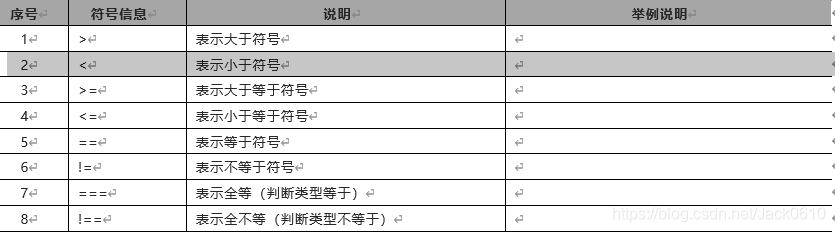

# PHP基础

—————————————————————————————————————————————————————————————————————————————————————————————————————————————

## 目录

```
前言

第一章 PHP语言学习介绍

    1.1 PHP部署安装环境
    1.2 PHP代码工具选择

第二章 PHP代码基本语法

    2.1 PHP函数知识介绍
    2.2 PHP常量变量介绍
        2.2.1 PHP变量知识：
        2.2.2 PHP常量知识：
    2.3 PHP注释信息介绍
    2.4 PHP数据类型介绍
        2.4.1 整形数据类型
        2.4.2 布尔数据类型
        2.4.3 字符串数据类型
        2.4.4 浮点型数据类型
        2.4.5 PHP数据类型之查看和判断数据类型
    2.5 PHP流程控制语句
    2.6 PHP算数运算方法
        2.6.1 PHP程序自加自减运算
        2.6.2 PHP程序比较运算符号
        2.6.3 PHP程序逻辑运算符号
        2.6.4 PHP程序位运算
        2.6.5 PHP三元运算符合其它运算符

第三章 PHP流程控制语句

    3.1 if条件控制语句
    3.2 if嵌套语句
    3.3 switch语句使用
    3.4 while循环语句说明
    3.5 for循环语句
    3.6 goto循环语句

第四章 PHP函数基本语法

第五章 PHP数组结构

    5.1 for循环遍历索引数组
    5.2 常用操作数组函数

第六章 PHP正则表达式

第七章 PHP文件系统管理

    7.1 fopen、fread、fclose操作读取文件
    7.2 PHP创建和修改文件内容
    7.3 PHP创建临时文件
    7.4 php移动、拷贝和删除文件

总结
```


## 前言

```
	PHP是安全中需要掌握的一门语言，就这么一点儿时间教网络安全，不可能精通，这里就不要求你精通PHP，但是对于一些基础代码能够认识、能够编写那么就可以了。

	同时，这里需要和HTML结合，如果你HTML还没懂，那么就需要加强一些HTML的技术能力了。值得一提的是，你看网页中那么多HTML代码，真的是人去写的么，那是不现实的，都是通过框架自动生成的，像现在的少儿编程不也是一样么。
```


## 第一章 PHP语言学习介绍

```
	外文名PHP：Hypertext Preprocessor，中文名：“超文本预处理器”是一种通用开源脚本语言。语法吸收了C语言、java和Perl的特点，利于学习，使用广泛，主要适用于web开发领域。用PHP做出的动态页面与其他的编程语言相比，PHP是将程序嵌入到HTML（标准通用标记语言下的一个应用）文档中去执行，执行效率比完全生成HTML标记的CGI要高许多；PHP还可以执行编译后代码，编译可以达到加密和优化代码运行，使代码运行更快。
	
1、目前PHP在全球网页市场、手机网页市场还有为手机提供API（程序接口）排名第一。

2、PHP入门简单，学习入门易入手。
```

### 1.1 PHP部署安装环境

    	PHP可以安装的环境比较广泛，可以在windows环境和Linux环境安装部署，并且已经集成比较多环境包安装。以下的这些全是各种环境包英文名，只不过代表的是不同集成环境包的名字，不用去深究。如下所示：
    
    AppServ PHPstudy APMserv XAMPP WAMPServer …等等
    
    对于我们才入门的学习者来说，选择集成环境包的原则：
    
    1、更新更快，版本较新
    
    2、操作简单易于上手
    
    3、选择项不要过多
    
    因此，我们下面使用的集成环境包是：PHPstudy；当然，如果你对这块比较熟悉了，也可以自行选择集成环境包。
    
    可以在官方网站下载：http://www.phpstudy.net/

### 1.2 PHP代码工具选择

    写代码的工具有很多，对于刚开始学习PHP的朋友来说，选择工具有几个原则
    
    1、不要使用带自动提示的工具（例如eclipse、zend studio等PHP开发工具集）
    
    2、写完的代码必须要有颜色高亮显示（不要使用txt文本编辑器等无代码颜色显示的编辑器）
    推荐的开发工具：
    
    1）、sublime
    
    2）、PHPstorm（推荐）
    
    注：这两个工具已经在开发环境文件夹中，直接使用即可，两个工具的使用和配置，稍后写在附录文章中。


## 第二章 PHP代码基本语法

2.1 PHP函数知识介绍

```
新建test.php文件，在这个test.php文件中写入如下代码：
```

```php
<?php
phpinfo();
?>
```

你可以在浏览器地址栏里面，输入你的服务器地址。我们当前是以自己的电脑作为网页服务器使用的，可以在地址中输入：


代码信息解读说明：

    1、phpinfo是一个函数（功能），这个函数会显示一个当前电脑（服务器）的详细的PHP信息。
    
    2、电脑是一个很笨的东西，需要我们人为的告诉他，代码写完了。我们用分号（；）来告诉他代码写完了。因此只要写完一段代码，就需要在后面加分号。
    
    3、而前后两行的回车空行，是为了让代码更加好看，避免叠在一起，看着不舒服。其实中间有多少个回车空行都没有关系的，保证好看就行了。PHP的语法解释器（PHP最核心部分）不会处理这些空行的。

代码编写注意事项：

    1、PHP的代码信息全部要用半角的英文、很多人容易写成全角的英文/中文和符号造成PHP代码报错。
    
    2、PHP代码的最后一行可以加也可不加分号。由于很多学习者特别是初学者经常犯一个毛病，写完一行代码不加分号，因此容易犯错，某些公司规定一行代码写完，就必须加分号。
    
    3、我们在写文件test.php这个文件命名的时候，只要英文半角（a-z A-Z 0-9 _-）这些字符来命名文件，文件命名不要用中文，不要用特殊符号，不要中间加空格，严格区分大小。

### 2.2 PHP常量变量介绍

#### 2.2.1 PHP变量知识：

```php
在这个test01.php文件中写入如下代码：

<?php
$iphone7 = 5880;
$iphone7plus = 6088;
echo $iphone6 + $iphone7plus;  //echo是在PHP里面最常用的一个输出、显示功能的命令
?>
```

    $叫作美元符，英文单词：dollar。PHP的变量必须以美元符开始。说明搞PHP有”钱”途。

变量的几个特点介绍：

    1、必须要以开始，如变量x必须要写成开始
    
    2、变量的首字母不能以数字开始
    
    3、变量的名字区分大小写
    
    4、变量不要用特殊符号、中文，_不算特殊符号
    
    5、变量命名要有意义（别写xxx，aaa，ccc）这种变量名

变量的分类情况说明：

    可变变量，外部变量，环境变量

##### 1.可变变量举例说明

```php
<?php
// 服务器读取的  编码设置
    header('Content-type:text/html;charset=utf-8');
//定义了一个变量叫作$shu 将$shu这个变量的值设为字符串的biao
$shu = ‘biao’；
//定义了一个变量叫作$biao 将他的值设置为鼠标
$biao = ‘鼠标’；
//$$shu就是可变变量；在已声明的变量$shu前又加上了一个变量符
echo $$shu;
?>
```

##### 2.外部变量举例说明

**PHP的外部变量是PHP在使用过程中规定好的一些变量。这个变量的规定是这样定的。**

```php
<html>
  <head>
  </head>
  <body>
<!-- 这一行method 对应的值改为post --->
<form action="req.php" method="post">
<input type="text" name="username"/>
<input type="password" name="pwd"/>
<input type="submit" name="提交"/>
</form>
  </body>
</html>
```

PHP代码调用以上HTML代码中的外部变量方法如下所示：

```php
<?php
//$_POST[‘username’]，将username作为字符串放在中括号里面，就得到了表单里面的<input type=”text”name=”username”/>的值
$u = $_POST['username'];
echo $u.'<br />';
//$_POST[‘pwd’]，将pwd作为字符串放在中括号里面，就得到了表单里面的<input type=”text”name=”pwd”/>的值
$passwd = $_POST['pwd'];
echo $passwd.'<br />';
?>
```

通过上面的实验我们知道了，通过$_POST这个外部变量，可以得到从表单输入的值。另外我们总结一些外部变量，要求知识点的学习级别：了解含义，默写这个单词的写法和作用。


##### 3.环境变量举例说明

**环境变量我们主要用的有SERVER和_ENV两个环境变量。不过，$ENV逐渐被PHP的新版本给废弃了。**

```php
<?php
phpinfo();
?>
```

其它环境变量：


#### 2.2.2 PHP常量知识：

    常量就是长久不变的值，常量在代码中的定义，以及书写方式如下所示：
    
    define(常量名, 常量值)

常量知识说明：

    1、常量名可以小写，但是通常大写
    
    2、常量名可以不加引号，但是通常加上引号
    
    3、在字符串中调用常量的时候，必须在引号外面
    
    4、常量名建议只用字母和下划线

```php
<?php
define('MY_NAME','PHP中文网');
echo MY_NAME;
//下面是错误的调用方式
echo '我的名字是MY_NAME';
//下面是正确的调用方式
echo '我的名字是'.MY_NAME;
?>
```

此外，系统还为我们准备了一些内置的常量，这些常量都是规定好的，先熟悉几个，还有更多的系统变量可以在入门以后扩展深入学习。


### 2.3 PHP注释信息介绍

    	所谓注释，汉语解释为注解，更为准确一些，因为代码是英文的，并且代码很长，时间长了人会忘了代码的意思作用，所以可以加上注释进行说明提示。

注释功能说明：

    1、对重点进行标注
    
    2、时间长了容易忘记代码，方便快速回忆，以及方便查找信息
    
    3、可以让其他人更容易看懂配置信息
    
    4、还可以生成文档，代码写完相关的文档就写完了，提高工作效率
    
    5、拥有注释、空行、回车之后的代码看起来更优美
    
    6、注释可用来排错，不确定代码中哪一块写错了，可以将一大段注释，确定错误区域。
    
    7、注释中的部分的内容，电脑不会执行它

PHP注释的方法如下所示：

##### 1.单行注释（只注释一行）

```
//		表示单行注释
#		表示单行注释，用的比较少
```

单行注释举例演示：

```php
<?php
//声明异步iphone7手机的价格变量
$iphone7 = 5880;
//显示输出收集价格
echo $iphone7; 
?>
```

##### 2.多行注释（注释多行）

```
/*
多行注释，这里是注释区域代码
*/
```

多行注释举例演示：

```
<?php
/*
作者：PHP
时间：2023.10.26
功能：这是一个多行注释例子
*/
?>
```

### 2.4 PHP数据类型介绍

    数据类型就是对数据分类的一种划分方式而已，例如以下举例说明：
    
    哺乳动物：人、猫、马、鸭嘴兽…等等
    
    蔬菜类型：西红柿、菠菜、茄子…等等
    
    水果类型：西瓜、桃子、苹果…等等
    
    PHP中一共有八种数据类型，包括:
    
    	4种标量数据类型：boolean（布尔类型）、integer（整形）、float/double（浮点型）和string（字符串型）
    	
    	2种复合数据类型：array（数组类型）和object（对象类型）
    	
    	2中特殊的数据类型：resource（资源类型）与null（无/空白类型）


##### 2.4.1 整形数据类型

    	整形表示即为整数，英文称之为integer，英文简写为int；整形分为8进制、10进制、16进制，整形在计算机里面是有最大值和最小值范围的。大家经常听说32位计算机，也就是32位计算机一次运算处理的最大范围是-2的32次方到2的32次方-1；而64位计算机，就是一次运算处理的最大范围是-2的64次方到2的64次方-1。

8进制声明方式：

```php
<?php
//8进制的取值范围是0-7，即0、1、2、3、4、5、6、7
$bajinzhi=033145;
echo $bajinzhi;
?>
// 这里仅仅是个说明，并不是八进制的运算，具体看下面的图
```

10进制声明方式：

```php
<?php
//为了方便大家记忆和前期学习，英文不好的朋友可用拼音来声明变量。
//声明变量整数，英文int
$int=1000;
$zhengshu=1000；
echo $int;
echo $zhengshu;
?>
// 这里仅仅是个说明，并不是十进制的运算，具体看下面的图
```

16进制声明方式：以0x开始，后面跟0-f的，0x的后面的abcdef不区分大小写。（了解即可）

```php
<?php
//16进制的取值范围是0-f，即0、1、2、3、4、5、6、7、8、9、a、b、c、d、e、f
//声明变量整数，英文int
$shiliujinzhi=0x6ff;
echo $shiliujinzhi;
// 这里仅仅是个说明，并不是十六进制的运算，具体看下面的图
?>
```


##### 2.4.2 布尔数据类型

```
	所谓布尔类型，汉语翻译过来之后，更好的解释是用道家中易经的语言进行解释，即为：阴/阳，男/女，真/假，对/错，存在/不存在，0/1等等。
```

布尔类型举例说明：

```php
<?php
//声明一个变量（拼音）为布尔
$buer=true;
//声明一个变量(英文)
$bool=false;
?>
```

##### 2.4.3 字符串数据类型

```
在PHP语言中声明字符串有三种方式：

 1、用单引号声明
 
 2、用双引号声明
 
 3、用字界符声明
```

**单引号声明**

```
用英文半角的单引号，将字符串包起来：
```

```php
<?php
//声明字符串变量$zifu
$zifu='好好学习吧';
echo $zifu;
?>
```

**双引号声明**

```
在字符串两面加双引号
```

```php
<?php
//声明字符串变量$str
$str="我想好好学习";
echo $str;
?>
```

**字界符声明**

```
1、在变量后面的等号写三个小于号 <<<

2、然后在<<<后面写上字符（建议英文大写字符）

3、然后换行写上任意想写的字符

4、写完后，顶行。在行最开始处，再写上<<<后面的字符和分号。
```

```php
<?php
$dingjie = <<<ABC
  如果
      非要在这个测试
    前
        面<br />
       加上一段
    <i>有趣的话</i>
    我想说，<h1>努力学习不好么<h1>
ABC;
echo $dingjie
?>
```

那双引号和单引号有什么区别呢：

    1.双引号解析变量，但是单引号不解析变量
    
    2.在双引号里面插入变量，变量后面如果有英文或中文字符，会把这个字符和变量拼起来，视为一整个变量。一定要在变量后面接上特殊字符，例如空格等分开。
    
    3.如果在双引号里面插变量的时候，后面不想有空格，可以拿大括号将变量包起来。
    
    4.双引号解析转义字符，单引号不解析转义字符。但是单引号能解析\
    
    5.单引号效率高于双引号，尽可能使用单引号
    
    6.双引号和单引号可以互相嵌套，双引号中可以插入单引号，单引号当中插入变量，这个变量会被解析。
    
    7.神奇的字符串拼接胶水——（.）点，用来拼接字符串。
    
    8.一般将定界符声明字符串视为双引号一样的功能来看待。

##### 2.4.4 浮点型数据类型

    所谓浮点类型，可以理解为，我们数学里面的小数。声明方式分为两种：
    
    1、普通声明方式
    
    2、科学声明方式

普通声明浮点数：

```php
<?php
//声明变量fudian的植为12121.3232
$fudian=12121.3232;
echo $fudian;
?>
```

科学声明浮点数：

```php
<?php
//声明变量$f1的植为0.8873
$f1=0.8873;
var_dump($f1)
?>
```

```
	var_dump() 函数用于输出变量的相关信息。显示关于一个或多个表达式的结构信息，包括表达式的类型与值。数组将递归展开值，通过缩进显示其结构。

参考资料：https://www.runoob.com/php/php-var_dump-function.html
```

#### 2.4.5 PHP数据类型之查看和判断数据类型

```
查看数据类型：

1、gettype（传入一个变量）能获得变量的类型
 
2、var_dump（传入一个变量）输出变量类型和值
```

```php
<?php
//声明一个变量88.8,可以自己多做几次实现换成其他类型看看$type输出是多少。
$float = 88.8;
$type = gettype($float);
echo $type;
?>

<?php
//多换几个类型试试
$str = '你喜欢男人还是喜欢女人';
$type = var_dump($str);
echo $type;
?>
```

```
判断数据类型方法：

使用is_*系列函数，is_types这一系列的函数，来进行判断某个数据属于哪种类型，如果是这个类型返回真，不是这个类型返回假。
```


```php
<?php
//is_*系列函数有个特点，就是如果是这个类型的返回的值为真，不是这个数据类型就返回的是假
//声明类型为假
$fo = false;
if (is_bool($fo)) {
    echo '执行真区间';
}else{
    echo '执行假区间';
}
echo "<br />";

//检查未声明的变量$p是否为空，为空就执行真区间
if(is_null($p)) {
    echo '执行真区间';
}else{
    echo '执行假区间';
}
echo "<br />";

//字符串类型的数值，检查执行的真还是假
$str = '18.8';
if(is_numeric($str)) {
    echo '执行真区间';
}else{
    echo '执行假区间';
}
echo "<br />";

//把sca的值换为整数 浮点 布尔和字符串试试
$sca = true;
if(is_scalar($sca)) {
    echo '执行真区间';
}else{
    echo '执行假区间';
}
echo "<br />";

//换成echo，is_int试试，为什么echo执行假区间呢？
if(is_callable('var_dump')) {
    echo '执行真区间';
}else{
    echo '执行假区间';
}
echo "<br />";
?>
```

### 2.5 PHP流程控制语句

```php
<?php
//我们定义一个泡到美女的变量($pao)为true，意思为泡到了
$pao =fales;
if($pao){
    echo '林志玲，我爱死你了';
    echo '我愿意去死';
}else{
    echo '照骗，爱会消失的';
    echo '我不愿意去死';
}
?>
```

### 2.6 PHP算数运算方法


```php
<?php
$x=5;
$y=6;
//5+6为11
echo $x+$y;
?>
```

#### 2.6.1 PHP程序自加自减运算

```
自加自减运算就是把自己加1或者减1。如果学习过其它变成语言。会发现，此处的用法又是计算机里面的一个规定。可以这样用，用起来更加简洁
```


```
上面的用法说明其实很简单，按照上面的例子，分成步骤去按过程判断即可：
```

```php
<?php
$x=5;
//先赋值后做加法运算，即将$x的值赋值为$y.$x的值为5，所以将$x的值赋值为$y.$y也是5
$y=$x++;
echo $y;
//$x的结果输出为6，因为赋值给$y后，$x自己又把自己进行了+1操作。所以，$x结果为6
echo $x;
?>
```

#### 2.6.2 PHP程序比较运算符号

```
比较运算符，在大家小学的时候就学了很多
```



```php
<?php
$x=5;
$y=6;
//因为5大于6不成立，所以为错的，即为false执行了假区间
if(!$x > $y){
    echo '变量x大于变量y 成立';
}else{
    echo '变量x大于变量y 不成立';
}
?>
```

#### 2.6.3 PHP程序逻辑运算符号

```
逻辑运算符号比较简单，是我们人类进行逻辑思考时的一种方式。
```


```php
<?php
$x=true;
$y=false;
//逻辑与（并且），要求两个都为true才能执行真区间，所以代码中执行假区间
if($x && $y) {
    echo '执行了真区间';
}else{
    echo '执行了假区间';
}
?>
```

#### 2.6.4 PHP程序位运算


```php
<?php
//$x二进制为:
$x=5;
//$y二进制为:
$y=8;
//结果为13
echo $x ^ $y;
?>
```

#### 2.6.5 PHP三元运算符合其它运算符

```
三元运算符，相当于是if…else结构，不过三元运算符的写法更加简洁，语法格式如下：
```


```php
<?php
$x=true;
$x?$y=5:$y=6;
//输出5
echo $y;
?>

<?php
echo '<pre>';
echo `ipconfig`;
echo '</pre>';
?>
```


## 第三章 PHP流程控制语句

### 3.1 if条件控制语句

```
比如：郝斌同学是无趣的人。他回家时候做的事如下所示：

如果半夜回家，先去睡觉
 
如果早上回家，先去洗澡
 
如果中午回家，先去吃法
 
如果晚上回家，先去烧水
 
下面来了解下他的活动安排PHP语法规则：
```

```php
<?php
If(判断语句1){
   执行语句体1
}elseif（判断语句2）{
   执行语句体2
} elseif（判断语句n）{
   执行语句体n
}else{
   最后的else语句可选
}
```

流程代码信息示例01：

```php
<?php
$week=date("4");
//判断星期小于6，则输出： 还没到周末，继续上班....
if($week<"6"){
    echo "还没到周末，继续上班....";
}
```

流程代码信息示例02：

```php
<?php
//定义一个随机变量，判定时间，随机0点至23点
$dida = rand(0,23);
echo "当前时间为 $dida 点\n";
if($dida > 6 && $dida < 10 ){
    echo '睡觉';
}elseif ($dida > 10 && $dida < 14){
    echo '洗澡';
}elseif($dida >= 19 && $dida < 22){
    echo '烧水';
}elseif($dida > 22 && $dida <=23){
    echo '看电视';
}elseif($dida >=1 && $dida <3){
    echo '看电影';
}else{
    echo '工作';
}
?>
```

### 3.2 if嵌套语句

    比如：王总在出行计划和工作项目中具有极高的规划性，他给自己的生活秘书和工作秘书分别指派了出差的行程：
    生活上：先查天气，下雨带雨具和毛巾，不下雨要带防晒霜，雨具、毛巾和防晒霜的情况要提前检查，如果没有要及时购买。
    工作上：要提前沟通出差的工作任务，准备好了要及时检查确认，打印签单。没有及时准备好的情况下，要列出主要的项目议题。
    
    类似于上面的这种情况判断，就需要用到if…else if…else反复嵌套的结构了.
    在if语句中可以嵌套一个或多个if语句,以实现多个参数的判断,这就是if语句的多种嵌套.
    
    嵌套结构如下所示:

```php
<?php
if(判断1){
  if(判断2){
    代码段1;
}else{
    代码段2;
}
}else{
  if(判断3){
    代码段3;
}else{
    代码段4;
}
}
?>
```

流程代码信息示例01：

```php
<?php
//0表示工作秘书,1表示生活秘书
//用代码模拟随机产生当前的行程安排是生活秘书负责还是工作秘书负责
$mishu=rand(0,1);
if($mishu){
    //下雨和不下雨的状态,随机产生;下雨状态为1,不下雨状态为0
    $xiayu=rand(0,1);
    if($xiayu){
        //是否购买雨伞;购买了雨伞为1,未购买雨伞为0
        $you=rand(0,1);
        if($you){
            echo '下雨天,已经购买雨伞';
        }else{
            echo '下雨天,需要购买雨伞';
        }
    }else{
        //是否购买了防晒霜,购买了为1,未购买为0
        $you=rand(0,1);
        if($you){
            echo '未下雨,已经购买了防晒霜';
        }else{
            echo '未下雨,需要购买防晒霜';
        }
    }
}else{
    //是否准备好了会议议程,准备好了为1,未准备好为0
    $yicheng=rand(0,1);
    if($yicheng){
        echo '已准备好,可以随时出发';
    }else{
        echo '没有准备好,需要打印,延迟出发';
    }
}
```

### 3.3 switch语句使用

```
比如:王同学家里特别有钱,所以他的行程方式和正常人的有些不一样.
他的出行方式有以下6种方式:
司机开车/民航/自己家的专机/火车动车/骑马/游轮

switch…case的语法结构如下:	
```

```php
<?php
switch(变量){    //字符串,整形
   case 具体值1:
      执行代码1;
      break;
   case 具体值2:
      执行代码2;
      break;
   case 具体值3:
      执行代码3;
      break;
      defult:
}
?>
```

```
上面的break是可选的,上面的default也是可选的,不要在case后面写成分号,后面是冒号.不要在case后面写判断区间,如($foo >20 或者 $foo == 30)

Switch里面的变量最好是整形 字符串 因为布尔判断更适合if…else.
```

```php
<?php
//定义出行工具
$tool=rand(1,6);
switch($tool){
    case 1:
        echo '司机开车';
        break;
    case 2:
        echo '民航';
        break;
    case 3:
        echo '自己家的专机';
        break;
    case 4:
        echo '火车动车';
        break;
    case 5:
        echo '骑马';
        break;
    case 6:
        echo '游轮';
        break;
}
```

### 3.4 while循环语句说明

```
	比如:王总需要反复往返于北京和大连,就是典型的循环结构.假设王总投资这个项目需要往返大连100次,每次访问都会计数一次.难道写一百遍同样的代码?显然对于智商极高的程序员来说不可能这样处理。

    需要抽象人类的思维逻辑,定义一个循环结构:
```

```php
<?php
//定义需要往返的次数,老外喜欢从0开始计数,所以系统也是从0开始
$count=0;
//while后面接布尔值判断,为真执行,为假停止
//$count小于100的时候执行,也就是$count为0至99的时候执行.
//如果$count不小于100了,循环停止执行后续的代码

//循环开始处
while($count < 100){
    echo "这是王总第 $count 次出差 <br />";
    //每次执行让$count+1,这样的话,就不会产生$count永远小于100的情况了
    $count++;
}
//循环结束
?>
```

**对比说明do…while与while区别:**

```
do…while与while的语法结构基本一样,也是一个布尔型循环,功能也基本一样.

基本语法规定如下:
```

```php
do{
   //代码框
}while(判断)
```

```
do…while与while区别是,它们的值得检查时机不同.

do…while不论while判断是否成立,先执行一次代码框循环语句,保证会执行一次(表达式的真值在每次循环结束后检查)

然而我们之前的while循环会检查布尔判断区域,成立则执行,不成立则不执行.
```

```php
<?php
$i=0;
do {
  echo $i;
}while($i >0);
?>
```

### 3.5 for循环语句

```
	同学反复往返于北京和大连,并且在本上记录往返次数.在PHP中还有另外一种实现方式能够实现同样的计数.for循环是PHP中的一种计数型循环.它的语法比较灵活多变,这是一个必须掌握的知识点.
```

```php
for(表达式1;表达式2;表达式3)
  需要执行的代码段;
}
```

```
1、表达式1是初始化赋值,可以同时赋值多个代码;

2、表示式2在每次循环开始前求值,如果值为true,则继续循环,执行嵌套的循环语句,如果值为false,则终止循环.

3、表达式3在每次循环之后被求值.
```

```php
<?php
for($i=1;$i<=10;$i++)
  echo ‘分手后第’.$i.’年, 我全都忘了你的样子<br />’;
}
?>
```

### 3.6 goto循环语句

```
王同学每周往返,但有一个特例:项目失败后或者集团临时通知除外,就可以不再这么每周往返了.
```

##### 1.基本语法

```php
<?php
goto wan;
echo '天王盖地虎';
wan:
echo '小鸡炖蘑菇';
?>
```

##### 2.基本编写

```php
<?php
for ($i=0;$i<100;$i++){
    echo '第'.$i.'每周往返北京大连<br />';
    if($i == 17){
        goto end;
    }
}
end:
echo '集团公司要求停止此项';
?>
```

## 第四章 PHP函数基本语法

```
函数的英文叫做:function,而function的解释项中有另外一个含义”功能”,函数就是功能,调用一个函数就是在调用一个功能.

自定义函数的语法规则,语法规范如下:
```

```php
Function 函数名(参数名1=[值1], 参数名2=[值2] , 参数名n=[值n])
{
    函数中的功能体
    [return 返回值]
}
```

**代码编写示例:**

```php
<?php
function php_cn(){
    echo "好好学习";
}
php_cn();
php_cn();
?>
```

**php_cn这个函数,是不是显示出来了两段: 好好学习.**

```
函数备注说明:

1.函数名只能是字母,数字,下划线的组合,并且之间不能包含空格,数字不能放在变量名首位.

2.函数名与变量命名规则一样,但是不同的是,函数名不区分大小写

3.函数体的参数若是定义了,未传参,代码会报错.

4.函数后的参数如果有默认值,参数可以不填,代码也不会报错

5.函数后的参数可以写多个

6.函数后如果有默认值和无默认值的参数,通常把无默认值的参数写在最前面

7.函数体的变量与函数体外的变量没有关系

8.函数体中若有return,return后的代码不执行.

9.函数执行完后,可把函数体内的值,带到函数体外

10.函数的执行没有顺序关系,可以在定义外之前的位置调用
```

**根据之前学习的全局变量信息,编写页面内容:**

```php
<html>
  <head>
     <title>网站页面信息</title>
  </head>
  <body>
<!-- 先用POST来做实验,以后可以改为get -->
<form action="glob.php" method="post">
<input type="text" name="info"/>
<input type="submit" name="提交"/>
</form>
  </body>
</html>
```

**编写传入参数的函数信息:**

```php
<?php
function demo() {
    echo $_POST['info'];
}
demo();
?>
```

```
	在实际开发中,常常需要把程序中的共用代码放到一个文件中,使用这些代码的文件只需要包含这个文件即可.这种方法有助于提高代码的重用性,给代码的编写与维护带来很大的便利.在PHP中,有以下四种方法包含一个文件:
```


```
include函数功能实践:

创建一个functions.php文件,里面写上两个函数:
```

```php
<?php
//functions-test-02文件
function demo(){
    echo 'aaaa';
}
function test(){
    echo 'bbbb';
}
?>
```

```
在functions.php的同级目录下,在创建一个user.php文件把functions.php文件包含进来.

这样函数信息就可以专门放在functions.php里面,哪需要用到这些函数的时候,就从哪包含进来.
```

```php
<?php
//user.php
include "function-test-02.php";
//可以直接调用
demo();
test();
?>
```

##### **1、数学常用函数总结**


##### 2、**字符串常用函数总结**


##### **3、时间信息函数总结**

```php
<?php 
    
$mytime = getdate();

echo "年 :".$mytime['year']."\n";

echo "月 :".$mytime['mon']."\n";

echo "日 :".$mytime['mday']."\n";

echo "时 :".$mytime['hours']."\n";

echo "分 :".$mytime['minutes']."\n";

echo "秒 :".$mytime['seconds']."\n";

echo "一个小时中的第几钟 :".$mytime['minutes']."\n";

echo "这是一分钟的第几秒 :".$mytime['seconds']."\n";

echo "星期名称 :".$mytime['weekday']."\n";

echo "月份名称 :".$mytime['month']."\n";

echo "时间戳   :".$mytime[0]."\n";

?>
```

## 第五章 PHP数组结构

```
数组的英文是array,可以存入多个不同类型的数据，是一个复合数据类型。
```

**案例：**

```php
<?php
$shu = array(1 , 1.5 , true ,'天王盖地虎，小鸡炖蘑菇');
echo '<pre>';
var_dump($shu);
echo '</pre>';
?>
```

```
在上例中，我们发现我们存入了：整型、浮点、布尔、字符串

注：上例中echo pre这个标签的主要目的是为原样输出，格式展示的更好看，更清晰。

可以用var_dump()打印出来显示看一下效果：

索引数组的下标必须要从0开始吗？
答：这个问题其实不然，索引数组并不一定要从0开始。

那如何能够不从0开始呢？
答：需要用到大家在上面学的一小块知识哟。就是键值对应符。我们来动手写。
```

```php
<?php
$kele = array('只有不断努力才能博得未来',10 => 'NoAlike', 'PHP中文网' , '去PHP中文网学PHP', 19 => '苹果和梨子我都爱' , '橘子我最爱');
//打印显示$kele
echo '<pre>';
var_dump($kele);
echo '</pre>';
?>
```

### 5.1 for循环遍历索引数组

```php
<?php
//声明一个数组，值为1到10
$num = array(1,2,3,4,5,6,7,8,9,10);

//按照索引数组的特点，下标从0开始。所以1的下标为0，10的下标为9
echo $num[0].'<br />';
echo $num[9].'<br />';

//我们可以得到数组中元素的总个数,为10
echo count($num) .'<br />';

//遍历这个索引数组的话，我们就可以定义一个变量为$i
//$i 的值为0，从0开始
//可以设定一个循环条件为：$i 在下标的(9)最大值之内循环
for($i = 0 ; $i < count($num) ; $i++){
   echo $num[$i].'<br />';
}
?>
```

```
	通过上面的例子，我们就把数组进行了循环。因为下标是从0开始的，定义 i = 0 。 每 次 循 环 的 时 候 让 i=0 。每次循环的时候让 i=0。每次循环的时候让i 加1 ，但是必须要小于10，因为数组下标的最大值为9。	
```

### 5.2 常用操作数组函数

**这些函数，也是面试中基础面试中最爱问到的问题。**


**补充函数：**


**例子：弹出数组中的第一个元素**

```php
<?php
$mingren = array("test", "test1", "test2", "test3");
$dc = array_shift($mingren);
echo $dc .'<br />';
print_r($mingren);
?>
```

## 第六章 PHP正则表达式

```
    正则表达是会在开发中经常看到，它主要用在以下一些地方：匹配邮箱、手机号码、验证码、替换敏感的关键词。例如：涉及政治和骂人的话
    
    PHP的正则表达示定界符的规定如下：定界符，不能用a-zA-Z0-9\ 其他的都可以用。必须成对出现，有开始就有结束。
```


```
举例说明正则符号的定义方式：
```

```php
   例子				  说明
       
/中间写正则/				正确
       
$中间写正则$				正确
       
%中间写正则%			    正确
       
^中间写正则^			    正确
       
@中间写正则@			    正确
       
(中间写正则)				错误  /\//
       
A中间写正则A			    错误
```

```
注：\ 是转义字符，如果在以后正则表达示里面需要匹配/，如下：
```

```
/ / /
```

```
这个时候真要匹配/ 的时候，需要把定界符里面的/ 用转义字符转义一下，写成下面的例子：
```

```
/ \/ /
```

```
如果你觉得麻烦，遇到这种需要转义的字符的时候可以把两个正斜线（/ /）定界，改为其他的定界符（# #）。
```

```
正则表达式格式：preg_match ( string $正则 , string $字符串 , array&$结果] )
```

```
功能：根据正则变量，匹配字符串变量。如果存在则返回匹配的个数，把匹配到的结果放到$结果变量里。如果没有匹配到结果返回0。
```

```php
<?php
$zz = '/wq/';
$string = 'ssssswqaaaaaa';
if(preg_match($zz, $string, $matches)){
   echo '匹配到了，结果为：';
   var_dump($matches);
}else{
   echo '没有匹配到';
}
?>
```

**我们常用的正则函数有：**


## 第七章 PHP文件系统管理

```
	我们会点鼠标右键删除文件、会control+c（或右键）复制、粘贴文件，会新建一些文件，检测这个文件是不是只读文件。在电脑里面进行的这些操作，在代码里面如果能操作就好了。因为，如果有了这些操作。我们能做很多事情了：可不可以写入修改配置文件、是不是可以做PHP安装的时候检测文件的权限、是不是可以做生成Html文件等等很多不同的操作，总之其他太多太多的地方用到了文件操作。
```

### 7.1 fopen、fread、fclose操作读取文件

#### 1、readfile读取文件函数

```
那如何读取一个文件呢？我们先学一个函数。
```

```php
readfile ( string: $文件名)
功能：传入一个文件路径，输出一个文件。
```

```
下面的这一段代码中，只要传入文件名或者指定的文件路径就把文件读取出来了。
```

```php
<?php
   //linux类的读了方式
   readfile("/home/paul/test.txt");
   //windows类的读取方式
   readfile("c:\\oldboy\oldboy\boot.ini");
?>
注意：上面的代码中windows的斜线是\斜线，可能会转义掉一些字符。因此，我们写的时候写上两个斜线。
```

#### 2、file_get_contents打开文件函数

```php
<?php
   $filename = 'NoAlike.txt';
   $filestring = file_get_contents($filename);
   echo $filestring;
?>
```

#### 3、fopen、fread、fclose操作读取文件

```
上面file_get_contents打开文件的方式简单、粗暴。
```

```
resource fopen	 	    ( string $文件名, string 模式)

string fread 			( resource $操作资源, int 读取长度)

bool fclose 			( resource $操作资源 )
```

```
fopen的模式有下面几个，我们来讲一下fopen的模式：
```


```php
<?php
   //你可以创建一个NoAlike.txt，以只读模式打开
   $fp = fopen('NoAlike.txt', "r");
   //var_dump()操作一下$fp看看效果，输出的是不是只有类型提示的是resource
   var_dump($fp);
?>
```

### 7.2 PHP创建和修改文件内容

#### 1、file_put_contents写入文件

```
先来学习第一种写入文件的方式：
```

```php
file_put_contents ( string $文件路径, string $写入数据)

功能：向指定的文件当中写入一个字符串，如果文件不存在则创建文件。返回的是写入的字节长度
```

**操作代码演示示例：**

```php
<?php
   $data = "在PHP中文网学好PHP，妹子票子不再话下！";
   $numbytes = file_put_contents('test.txt', $data);
   if($numbytes){
       echo '写入成功，我们读取看看结果试试：';
       echo file_get_contents('test.txt');
   }else{
       echo '写入失败或者没有权限，注意检查';
   }
?>
```

#### 2、fwrite配合fopen进行写入操作

```php
<?php
   $filename = 'test.txt';
   $fp= fopen($filename, "w");
   $len = fwrite($fp, '我是一只来自北方的狼，却在南方冻成了狗');
   fclose($fp);
   print $len .'字节被写入了\n';
?>
```

```
代码说明：
· 不论有没有新建都会打开文件重新写入
· 原有的文件内容会被覆盖掉
· 文件不存在会创建
```

```
那我们来对比一下以下几个模式的不同：
```


### 7.3 PHP创建临时文件

```
	我们之前创建的文件都是永久文件，而创建临时文件在我们平时的项目开发中也非常有用，创建临时文件的好处：文件操作完成后即删除，不需要去维护这个文件的删除状态。
```

```php
<?php
   //创建了一个临时文件
   $handle = tmpfile();
   //向里面写入了数据
   $numbytes = fwrite($handle, '写入临时文件');
   //关闭临时文件，文件即被删除
   fclose($handle);
   echo  '向临时文件中写入了'.$numbytes . '个字节';
?>
```

### 7.4 php移动、拷贝和删除文件

```
我们日常在处理文件的时候，可以删除文件、重命名文件也可以也可复制文件。
```

#### 1、重命名文件

```php
rename($旧名,$新名);

功能：这个函数返回一个bool值，将旧的名字改为新的名字。
```

**操作示例说明：**

```php
<?php
   //旧文件名
   $filename = 'test.txt';
   //新文件名
   $filename2 = $filename . '.old';
   //复制文件
   rename($filename, $filename2);
?>
```

#### 2、复制文件

```
复制文件，就相当于是克隆技术，将一个原来的东西再克隆成一个新的东西，两个长得一模一样。
```

```php
copy(源文件,目标文件)

功能：将指定路径的源文件，复制一份到目标文件的位置。
```

**操作示例说明：**

```php
<?php
   //旧文件名
   $filename = 'copy.txt';
   //新文件名
   $filename2 = $filename . '_backup';
   //修改名字。
   copy($filename, $filename2);
?>
    
//说明：会通过上面的例子，发现多出来了一个文件。
```

#### 3、删除文件

```
	删除文件就是将指定路径的一个文件删除，不过这个删除是直接删除。使用的是windows电脑，你在回收站看不到这个文件，你只会发现这个文件消失了。
```

```
unlink(指定路径的文件)
```

**代码操作示例：**

```php
<?php
   $filename = 'test.txt';
   if (unlink($filename)) {
       echo  "删除文件成功 $filename!\n";
   } else {
       echo  "删除 $filename 失败!\n";
   }
?>
```

#### 4、检测文件属性函数

```
假设安装界面的网址是：install.php，安装的锁文件是install.lock。我们就可以检测install.lock文件是否存在。
```

```php
<?php
if(file_exists('install.lock')){
   echo '已安装，请不要再次进行安装';
   exit;
}
?>
```

**常用文件属性函数：**


#### 5、PHP目录处理函数

```
php 目录处理函数处理文件夹的基本思想如下：

1.读取某个路径的时候判断是否是文件夹

2.是文件夹的话，打开指定文件夹，返回文件目录的资源变量

3.使用readdir读取一次目录中的文件，目录指针向后偏移一次

4.使用readdir读取到最后，没有可读的文件返回false

5.关闭文件目录
```

**我们来学习一比常用函数：**


**代码演示操作：**

```php
<?php
//设置打开的目录是D盘
$dir = "d:/";
//判断是否是文件夹，是文件夹
if (is_dir($dir)) {
   if ($dh = opendir($dir)) {
      //读取到最后返回false，停止循环
      while (($file = readdir($dh)) !== false) {
           echo "文件名为: $file : 文件的类型是: " . filetype($dir . $file) . "<br />";
       }
       closedir($dh);
   }
}
?>
```

#### 6、php文件权限设置

```
chmod 主要是修改文件的的权限
```

```php
<?php
//修改linux系统/var/wwwroot/某文件权限为755
chmod("/var/wwwroot/index.html", 755);  
chmod("/var/wwwroot/index.html", "u+rwx,go+rx"); 
chmod("/somedir/somefile", 0755); 
?>
```

#### 7、php文件路径函数

```
我们经常会遇到处理文件路径的情况。例如：

1.文件后缀需要取出来

2.路径需要取出名字不取目录

3.只需要取出路径名中的目录路径

4.或者把网址中的各个部份进行解析取得独立值

5.甚至是自己组成一个url出来
```

```
很多地方都需要用路径处理类的函数。把常用的路径处理函数为大家做了标注，对着这个路径处理函数进行处理即可：
```


**代码示例说明：**

```php
<?php
$path_parts = pathinfo('d:/www/index.inc.php');
echo '文件目录名：'.$path_parts['dirname']."<br />";
echo '文件全名：'.$path_parts['basename']."<br />";
echo '文件扩展名：'.$path_parts['extension']."<br />";
echo '不包含扩展的文件名：'.$path_parts['filename']."<br />"; 
?>
```

#### 8、php实现文件留言本

**我们来看一下文件结构：**

```
index.php		展示输入框和留言内容

write.php 		向message.txt写入数据

message.txt 		存入聊天内容
```

**编写index.php文件信息：**

```php
<?php
//设置时区
date_default_timezone_set('PRC');
//读了内容
@$string = file_get_contents('message.txt');
//如果$string 不为空的时候执行，也就是message.txt中有留言数据
if (!empty($string)) {
    //每一段留言有一个分格符，但是最后多出了一个&^。因此，我们要将&^删掉
    $string = rtrim($string, '&^');
    //以&^切成数组
    $arr = explode('&^', $string);
    //将留言内容读取
    foreach ($arr as $value) {
        //将用户名和内容分开
        list($username, $content, $time) = explode('$#', $value);
        echo '用户名为<font color="gree">' . $username . '</font>内容为<font color="red">' . $content . '</font>时间为' . date('Y-m-d H:i:s', $time);
        echo '<hr />';
    }
}
?>
<h1>基于文件的留言本演示</h1>
<form action="write.php" method="post">
    用户名：<input type="text" name="username" /><br />
    留言内容：<textarea  name="content"></textarea><br />
    <input type="submit" value="提交" />
</form>
```

```
看了刚刚的展示内容，我们知道文件存储时：

1、段与段之间进行了分割

2、内容与用户之前用一个特殊的符号进行了分割
```

```
下面我们来写write.php写入留言至文件的代码：
```

```php
<?php
//追加方式打开文件
$fp=fopen('message.txt','a');
//设置时间
$time=time();
//得到用户名
$username=trim($_POST['username']);
//得到内容
$content=trim($_POST['content']);
//组合写入的字符串：内容和用户之间分开，使用$#
//行与行之间分开，使用&^
$string=$username.'$#'.$content.'$#'.$time.'&^';
//写入文件
fwrite($fp,$string);
//关闭文件
fclose($fp);
header('location:index.php');
?>
```

## 总结

```
	以上便是在PHP的学习过程中需要掌握的一些基础知识，没有接触过的朋友可能比较吃力，但是多花时间去练一练总是好的，然后多看看参考、一些案例，将PHP和HTML很好的结合，能够熟练地运用更好。
```

