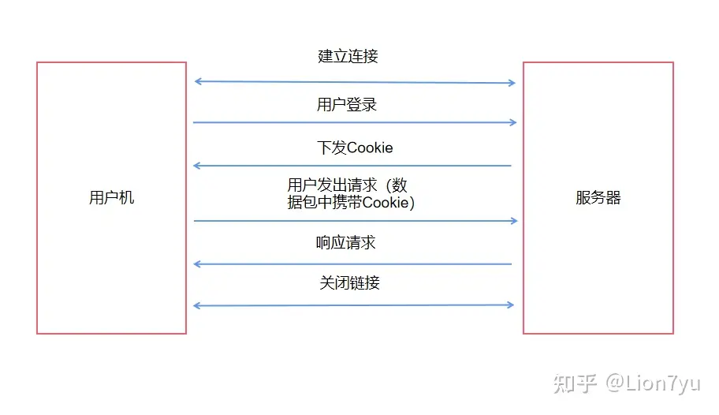
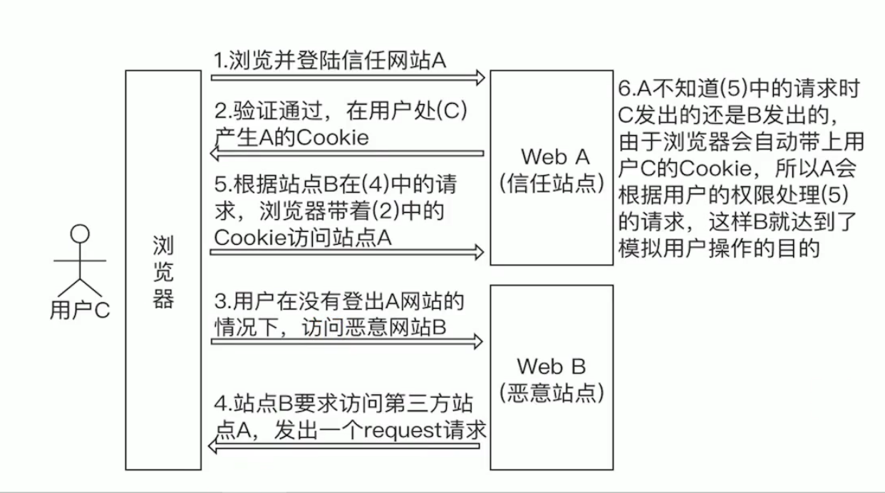
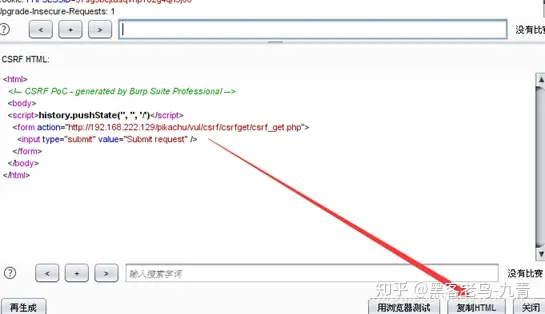

# CSRF漏洞

—————————————————————————————————————————————————————————————————————————————————————————————————————————————

### 一、CSRF基本概念

```
	CSRF（即跨站请求伪造）是指利用受害者尚未失效的身份认证信息、（cookie、会话等），诱骗其点击恶意链接或者访问包含攻击代码的页面，在受害人不知情的情况下以受害人的身份向（身份认证信息所对应的）服务器发送请求，从而完成非法操作（转账，改密码等）。
	CSRF：属于业务逻辑漏洞，在服务器看来，所有请求都是合法正常的
	XSS、SQL注入等：都是属于技术漏洞
	XSS是基于客户信任服务器，而CSRF是基于服务器信任客户（经过身份验证的)
	因为CSRF攻击，会重复利用用户的 Cookie，而说到 Cookie，就得先从 HTTP 协议开始讲起。
```

#### 1>HTTP协议


##### 1)无记忆性

```
HTTP是一种无状态协议，即服务器不会保留与客户交易时的状态。

用户A在很短的时间间隔内向Web服务器发送了两次同样的请求，服务器并不会因为已经响应了该请求一次就不对第二次请求进行响应，因为服务器并不知道已经响应过一次该请求。

假设用户在网站A的某一个页面上已经完成了登录操作，当在该网站的另一个页面上执行的操作需要验证用户登录的时候仍然需要用户再次登录，因为HTTP并不知道你已经登录了，它不会维持你的登录状态。

因为要多次登录太过麻烦，为了让服务器能够记住用户引入了 Cookie 机制
```

##### 2)Cookie机制



```
	当用户访问站点的时候，站点会为该用户分配一个 Cookie 值，站点使用该 Cookie 值来标记用户，当用户浏览器接受到包含 Cookie 值得数据包后，会将 Cookie 得值取出，存放到浏览器中，随后浏览器会在发往该站点得数据包中自动得填充该 Cookie 值。Cookie 的值的填充是浏览器的行为。

当浏览器自动完成Cookie的填充，目标网站会误认为该数据包就是管理员发送的，会以管理员的权限进行相关的操作。
```




### 二、CSRF攻击原理以及条件


```
1、用户输入账号信息请求登录A网站。

2、A网站验证用户信息，通过验证后返回给用户一个cookie

3、在未退出网站A之前，在同一浏览器中请求了黑客构造的恶意网站B

4、B网站收到用户请求后返回攻击性代码，构造访问A网站的语句

5、浏览器收到攻击性代码后，在用户不知情的情况下携带cookie信息请求了A网站。此时A网站不知道这是由B发起的。那么这时黑客就可以进行一下骚操作了！

两个条件：a 用户访问站点A并产生了cookie

b 用户没有退出A同时访问了

所以要被CSRF攻击，必须同时满足两个条件：

①登录受信任网站A，并在本地生成Cookie。

②在不登出A的情况下，访问危险网站B。
```

### 三、CSRF分类

```
CSRF(Cross-Site Request Forgery)，跟XSS漏洞攻击一样，存在巨大的危害性。

	你可以这么来理解：攻击者盗用了你的身份，以你的名义发送恶意请求，对服务器来说这个请求是完全合法的，但是却完成了攻击者所期望的一个操作，比如以你的名义发送邮件、发消息，盗取你的账号，添加系统管理员，甚至于购买商品、虚拟货币转账等
```

##### 1)GET型

```
	如果一个网站某个地方的功能，比如用户修改邮箱是通过GET请求进行修改的。如：/user.php?id=1&email=123@163.com ，这个链接的意思是用户id=1将邮箱修改为123@163.com。当我们把这个链接修改为 /user.php?id=1&email=abc@163.com ，然后通过各种手段发送给被攻击者，诱使被攻击者点击我们的链接，当用户刚好在访问这个网站，他同时又点击了这个链接，那么悲剧发生了。这个用户的邮箱被修改为 abc@163.com 了
```

##### 2)POST型

```
	在普通用户的眼中，点击网页->打开试看视频->购买视频是一个很正常的一个流程。可是在攻击者的眼中可以算正常，但又不正常的，当然不正常的情况下，是在开发者安全意识不足所造成的。攻击者在购买处抓到购买时候网站处理购买(扣除)用户余额的地址。比如：/coures/user/handler/25332/buy.php 。通过提交表单，buy.php处理购买的信息，这里的25532为视频ID。那么攻击者现在构造一个链接，链接中包含以下内容
	
<form action=/coures/user/handler/25332/buy method=POST>
<input type="text" name="xx" value="xx" />
</form>
<script> document.forms[0].submit(); </script> 

当用户访问该页面后，表单会自动提交，相当于模拟用户完成了一次POST操作，自动购买了id为25332的视频，从而导致受害者余额扣除
```

### 四、CSRF漏洞挖掘

```
1、抓取一个正常请求的数据包，如果没有Referer字段和token，那么极有可能存在CSRF漏洞

2、如果有Referer字段，但是去掉Referer字段后再重新提交，如果该提交还有效，那么基本上可以确定存在CSRF漏洞。

3、利用工具进行CSRF检测。如：CSRFTESTER，CSRF REQUEST BUILDER等

使用burpsuite快速生成CSRF POC

当我们发现一个页面存在CSRF漏洞后，可以通过burpsuite快速生成攻击代码
```


```
点击复制html ，然后保存在本地
```



```
双击打开，当受害者点击就执行了我们的CSRF代码
```


### 五、CSRF的防御

#### 1.验证 HTTP Referer 字段

```
	根据 HTTP 协议，在 HTTP 头中有一个字段叫 Referer，它记录了该 HTTP 请求的来源地址。在通常情况下，访问一个安全受限页面的请求来自于同一个网站，比如需要访问 http://bank.example/withdraw?account=bob&amount=1000000&for=Mallory，用户必须先登陆 bank.example，然后通过点击页面上的按钮来触发转账事件。这时，该转帐请求的 Referer 值就会是转账按钮所在的页面的 URL，通常是以 bank.example 域名开头的地址。而如果黑客要对银行网站实施 CSRF 攻击，他只能在他自己的网站构造请求，当用户通过黑客的网站发送请求到银行时，该请求的 Referer 是指向黑客自己的网站。因此，要防御 CSRF 攻击，银行网站只需要对于每一个转账请求验证其 Referer 值，如果是以 bank.example 开头的域名，则说明该请求是来自银行网站自己的请求，是合法的。如果 Referer 是其他网站的话，则有可能是黑客的 CSRF 攻击，拒绝该请求

	这种方法的显而易见的好处就是简单易行，网站的普通开发人员不需要操心 CSRF 的漏洞，只需要在最后给所有安全敏感的请求统一增加一个拦截器来检查 Referer 的值就可以。特别是对于当前现有的系统，不需要改变当前系统的任何已有代码和逻辑，没有风险，非常便捷

	然而，这种方法并非万无一失。Referer 的值是由浏览器提供的，虽然 HTTP 协议上有明确的要求，但是每个浏览器对于 Referer 的具体实现可能有差别，并不能保证浏览器自身没有安全漏洞。使用验证 Referer 值的方法，就是把安全性都依赖于第三方（即浏览器）来保障，从理论上来讲，这样并不安全。事实上，对于某些浏览器，比如 IE6 或 FF2，目前已经有一些方法可以篡改 Referer 值。如果 bank.example 网站支持 IE6 浏览器，黑客完全可以把用户浏览器的 Referer 值设为以 bank.example 域名开头的地址，这样就可以通过验证，从而进行 CSRF 攻击。即便是使用最新的浏览器，黑客无法篡改 Referer 值，这种方法仍然有问题。因为 Referer 值会记录下用户的访问来源，有些用户认为这样会侵犯到他们自己的隐私权，特别是有些组织担心 Referer 值会把组织内网中的某些信息泄露到外网中。因此，用户自己可以设置浏览器使其在发送请求时不再提供 Referer。当他们正常访问银行网站时，网站会因为请求没有 Referer 值而认为是 CSRF 攻击，拒绝合法用户的访问
```


#### 2.在请求地址中添加 token 并验证(Anti-CSRF token)

```
	CSRF 攻击之所以能够成功，是因为黑客可以完全伪造用户的请求，该请求中所有的用户验证信息都是存在于 cookie 中，因此黑客可以在不知道这些验证信息的情况下直接利用用户自己的 cookie 来通过安全验证。要抵御 CSRF，关键在于在请求中放入黑客所不能伪造的信息，并且该信息不存在于 cookie 之中。可以在 HTTP 请求中以参数的形式加入一个随机产生的 token，并在服务器端建立一个拦截器来验证这个 token，如果请求中没有 token 或者 token 内容不正确，则认为可能是 CSRF 攻击而拒绝该请求

	这种方法要比检查 Referer 要安全一些，token 可以在用户登陆后产生并放于 session 之中，然后在每次请求时把 token 从 session 中拿出，与请求中的 token 进行比对，但这种方法的难点在于如何把 token 以参数的形式加入请求。对于 GET 请求，token 将附在请求地址之后，这样 URL 就变成 http://url?csrftoken=tokenvalue。而对于 POST 请求来说，要在 form 的最后加上 ，这样就把 token 以参数的形式加入请求了。但是，在一个网站中，可以接受请求的地方非常多，要对于每一个请求都加上 token 是很麻烦的，并且很容易漏掉，通常使用的方法就是在每次页面加载时，使用 javascript 遍历整个 dom 树，对于 dom 中所有的 a 和 form 标签后加入 token。这样可以解决大部分的请求，但是对于在页面加载之后动态生成的 html 代码，这种方法就没有作用，还需要程序员在编码时手动添加 token

	该方法还有一个缺点是难以保证 token 本身的安全。特别是在一些论坛之类支持用户自己发表内容的网站，黑客可以在上面发布自己个人网站的地址。由于系统也会在这个地址后面加上 token，黑客可以在自己的网站上得到这个 token，并马上就可以发动 CSRF 攻击。为了避免这一点，系统可以在添加 token 的时候增加一个判断，如果这个链接是链到自己本站的，就在后面添加 token，如果是通向外网则不加。不过，即使这个 csrftoken 不以参数的形式附加在请求之中，黑客的网站也同样可以通过 Referer 来得到这个 token 值以发动 CSRF 攻击。这也是一些用户喜欢手动关闭浏览器 Referer 功能的原因
```

#### 3.在 HTTP 头中自定义属性并验证

```
	这种方法也是使用 token 并进行验证，和上一种方法不同的是，这里并不是把 token 以参数的形式置于 HTTP 请求之中，而是把它放到 HTTP 头中自定义的属性里。通过 XMLHttpRequest 这个类，可以一次性给所有该类请求加上 CSRFToken 这个 HTTP 头属性，并把 token 值放入其中。这样解决了上种方法在请求中加入 token 的不便，同时，通过 XMLHttpRequest 请求的地址不会被记录到浏览器的地址栏，也不用担心 token 会透过 Referer 泄露到其他网站中去

	然而这种方法的局限性非常大。XMLHttpRequest 请求通常用于 Ajax 方法中对于页面局部的异步刷新，并非所有的请求都适合用这个类来发起，而且通过该类请求得到的页面不能被浏览器所记录下，从而进行前进，后退，刷新，收藏等操作，给用户带来不便。另外，对于没有进行 CSRF 防护的遗留系统来说，要采用这种方法来进行防护，要把所有请求都改为 XMLHttpRequest 请求，这样几乎是要重写整个网站，这代价无疑是不能接受的
```

