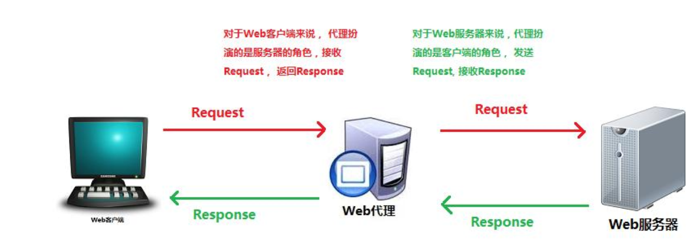

# 常见网络协议

—————————————————————————————————————————————————————————————————————————————————————————————————————————————

### 一、HTTP协议

```
HTTP是HyperTextTransferProtocol（超文本传输协议）的缩写。HTTP协议是用于从WWW服务器传输超文本到本地浏览器的传送协议。

HTTP是一个应用层协议，由请求（request)和响应(response)构成，是一个标准的客户端服务器模型。HTTP是一个无状态的协议。

请求和响应消息的头以ASCII形式给出；而消息内容则具有一个类似MIME的格式。这个简单模型是早期Web成功的有功之臣，因为它使开发和部署非常地直截了当。
```


#### 1、MIME类型

```
	MIME类型称为多用途互联网邮件扩展，它是一个互联网标准，在1992年最早应用于电子邮件系统，但后来也应用到浏览器。服务器会将它们发送的多媒体数据的类型告诉浏览器，而通知手段就是说明该多媒体数据的MIME类型，从而让浏览器知道接收到的信息哪些是MP3文件，哪些是MP4文件等等。服务器将MIME标志符放入传送的数据中来告诉浏览器使用哪种插件读取相关文件。

常见的几种MIME类型：

image/gif           .gif

image/jpeg          .jpeg、.jpg

text/plain          .txt          

audio/x-mpeg        .mp3  

video/mp4           .mp4
```

#### 2、HTTP协议工作流程

##### 1.客户端连接到Web服务器

```
一个HTTP客户端，通常是浏览器，与Web服务器的HTTP端口（默认为80）建立一个TCP套接字连接。例如，http://www.baidu.com。
```

##### 2.发送HTTP请求

```
通过TCP套接字，客户端向Web服务器发送一个文本的请求报文，一个请求报文由请求行、请求头部、空行和请求数据4部分组成。
```

##### 3.服务器接受请求并返回HTTP响应

		Web服务器解析请求，定位请求资源。服务器将资源复本写到TCP套接字，由客户端读取。一个响应由状态行、响应头部、空行和响应数据4部分组成。

##### 4.释放连接TCP连接

		若connection模式为close，则服务器主动关闭TCP连接，客户端被动关闭连接，释放TCP连接;若connection模式为keepalive，则该连接会保持一段时间，在该时间内可以继续接收请求;

##### 5.客户端浏览器解析HTML内容

		客户端浏览器首先解析状态行，查看表明请求是否成功的状态代码。然后解析每一个响应头，响应头告知以下为若干字节的HTML文档和文档的字符集。客户端浏览器读取响应数据HTML，根据HTML的语法对其进行格式化，并在浏览器窗口中显示。

#### 3、Cookie

```
HTTP协议是无状态的

	使用HTTP协议,每当有新的请求发送时,就会有对应的新响应产生。协议本身并不保留之前一切的请求或响应报文的信息。这是为了更快地处理大量事务,确保协议的可伸缩性,而特意把HTTP协议设计成如此简单的。可是,随着Web的不断发展,因无状态而导致业务处理变得棘手的情况增多了。比如,用户登录到一家购物网站,即使他跳转到该站的其他页面后,也需要能继续保持登录状态。针对这个实例,网站为了能够掌握是谁送出的请求,需要保存用户的状态。HTTP/1.1虽然是无状态协议,但为了实现期望的保持状态功能,于是引入了Cookie技术。有了Cookie再用HTTP协议通信,就可以管理状态了。
	
	Cookie在远程浏览器端存储数据并以此跟踪和识别用户的机制。从实现上说，Cookie是存储在客户端上的一小段数据，浏览器（即客户端）通过HTTP协议和服务器端进行Cookie交互。
```


#### 4、Request请求数据包

```
1、请求行：请求类型/请求资源路径、协议的版本和类型

2、请求头：一些键值对，浏览器与web服务器之间都可以发送，特定的某种含义

3、空行：请求头与请求体之间用一个空行隔开；

4、请求体：要发送的数据(一般post提交会使用)；例：user=123&pass=123
```


#### 5、请求行

```
请求行由三个标记组成：请求方法、请求URL和HTTP版本，它们用空格分享。HTTP规划定义了8种可能的请求方法：

GET：检索URL中标识资源的一个简单请求

HEAD：与GET方法相同，服务器只返回状态行和头标，并不返回请求文档POST：服务器接受被写入客户端输出流中的数据的请求PUT：服务器保存请求数据作为指定URL新内容的请求DELETE：服务器删除URL中命令的资源的请求OPTIONS：关于服务器支持的请求方法信息的请求

TRACE：web服务器反馈Http请求和其头标的请求

CONNECT：已文档化，但当前未实现的一个方法，预留做隧道处理
```

#### 6、GET和POST的区别


```
从标准上来看，GET和POST的区别如下：

GET用于获取信息，是无副作用的，是幂等的，且可缓存POST用于修改服务器上的数据，有副作用，非幂等，不可缓存

	但GET和POST只是HTTP协议中两种请求方式，而HTTP协议是基于TCP/IP的应用层协议，无论GET还是POST，用的都是同一个传输层协议，所以在传输上，GET和POST方法没有实质区别，只是报文格式不同。
```


#### 7、请求头


#### 8、Response响应数据包

```
1、状态行：协议版本、数字形式的状态代码和状态描述，个元素之间以空格分隔

2、响应头：包含服务器类型、日期、长度、内容类型等

3、空行：响应头与响应体之间用空行隔开

4、响应数据：浏览器会将实体内容中的数据取出来，生成相应的页面
```


#### 9、状态行

```
状态行：包括http协议版本、状态码、状态描述三个部分，以空格符分隔，以回车换行符结尾
```


**一些常见的状态码：**

```
200 OK  最常见的就是成功响应状态码200了，这表明该请求被成功地完成，所请求的资源发送回客户端

301Found  重定向，打开博客园首页http://cnblogs.com新的URL会在response中的Location中返回

304NotModified  代表上次的文档已经被缓存了，如果你不想使用本地缓存可以用Ctrl+F5强制刷新页面

400BadRequest  客户端请求与语法错误，不能被服务器所理解

403Forbidden  服务器收到请求，但是拒绝提供服务xx.com/admin

404NotFound  请求资源不存在（输错了URL）比如在IE中输入一个错误的URL，http://www.cnblogs.com/tesdf.aspx

500InternalServerError  服务器发生了不可预期的错误

503ServerUnavailable  服务器当前不能处理客户端的请求，一段时间后可能恢复正常
```

#### 10、代理（Proxy）

```
	代理服务器英文全称是ProxyServer，其功能就是代理网络用户去取得网络信息。形象的说：它是网络信息的中转站。在一般情况下，我们使用网络浏览器直接去连接其他Internet站点取得网络信息时，须送出Request信号来得到回答，然后对方再把信息以bit方式传送回来。代理服务器是介于浏览器和Web服务器之间的一台服务器，有了它之后，浏览器不是直接到Web服务器去取回网页而是向代理服务器发出请求，Request信号会先送到代理服务器，由代理服务器来取回浏览器所需要的信息并传送给你的浏览器。
```



 **代理的作用**  

```
1、翻墙[1]

2、匿名访问：HTTP代理服务器通过删除HTTP报文中的身份特性（比如客户端的IP地址，或cookie,或URI的会话ID），从而对远端服务器隐藏原始用户的IP地址以及其他细节。同时HTTP代理服务器上也不会记录原始用户访问记录的log(否则也会被查到)。

3、通过代理上网：比如局域网不能上网，只能通过局域网内的一台代理服务器上网。

4、通过代理缓存，加快上网速度：大部分代理服务器都具有缓存的功能，就好像一个大的cache，它有很大的存储空间，它不断将新取得数据存储到它本地的存储器上，如果浏览器所请求的数据在它本机的存储器上已经存在而且是最新的，那么它就不重新从Web服务器取数据，而直接将存储器上的数据传给用户的浏览器，这样就能显著提高浏览速度。

5、过滤器：很多教育机构，会利用过滤器代理来阻止学生访问成人内容。
```

```
	防火长城[1]（英语：Great Firewall，常用简称：GFW），中文也称中国国家防火墙[2]，通常简称为墙、防火墙[3]等，中国国家互联网信息办公室称为数据跨境安全网关[注 1][4][5]，解放军和武警机关等又称之为国家公共网络监控系统[6]，是中华人民共和国政府监控和过滤国际互联网出口内容的软硬件系统集合[7]，用于通过技术手段，阻断不符合中国政府要求的互联网内容传输。

	随着防火长城逐渐为人熟知，“墙”一词有时也被用作动词，[8][9]，“被墙”即指网站内容被防火长城所屏蔽。“翻墙”、“挂梯子”也被引申为突破网络审查浏览中国大陆境外被屏蔽的网站或使用服务的行为。
```


```
防火长城工作在旁路，而非网关
```


```
防火长城向查询zh.wikipedia.org的DNS请求注入伪造回复（使用dig测试）
```

#### 11、BurpSuite

```
	BurpSuite是用于攻击web应用程序的集成平台，包含了许多工具。BurpSuite为这些工具设计了许多接口，以加快攻击应用程序的过程。所有工具都共享一个请求，并能处理对应的HTTP消息、持久性、认证、代理、日志、警报。
```


#### 12、HTTP的缺点

```
	HTTP虽然使用极为广泛,但是却存在不小的安全缺陷,主要是其数据的明文传送和消息完整性检测的缺乏,而这两点恰好是网络支付,网络交易等新兴应用中安全方面最需要关注的。
	
	关于HTTP的明文数据传输,攻击者最常用的攻击手法就是网络嗅探,试图从传输过程当中分析出敏感的数据,例如管理员对Web程序后台的登录过程等等,从而获取网站管理权限,进而渗透到整个服务器的权限。即使无法获取到后台登录信息,攻击者也可以从网络中获取普通用户的隐秘信息,包括手机号码,身份证号码,信用卡号等重要资料,导致严重的安全事故。进行网络嗅探攻击非常简单,对攻击者的要求很低。使用网络发布的任意一款抓包工具,一个新手就有可能获取到大型网站的用户信息。
	
	另外,HTTP在传输客户端请求和服务端响应时,唯一的数据完整性检验就是在报文头部包含了本次传输数据的长度,而对内容是否被篡改不作确认。因此攻击者可以轻易的发动中间人攻击,修改客户端和服务端传输的数据,甚至在传输数据中插入恶意代码,导致客户端被引导至恶意网站被植入木马。
```

### 二、HTTPS协议

#### 1、思考引入1


#### 2、HTTPS

```
	HTTPS（全称：HyperTextTransferProtocoloverSecureSocketLayer），是以安全为目标的HTTP通道，在HTTP的基础上通过传输加密和身份认证保证了传输过程的安全性。
	
	HTTPS在HTTP的基础下加入SSL，HTTPS的安全基础是SSL，因此加密的详细内容就需要SSL。HTTPS存在不同于HTTP的默认端口及一个加密/身份验证层（在HTTP与TCP之间）。这个系统提供了身份验证与加密通讯方法。它被广泛用于万维网上安全敏感的通讯，
例如交易支付等方面。
```


#### 3、工作原理

```
	HTTPS协议是由HTTP加上TLS/SSL协议构建的可进行加密传输、身份认证的网络协议，主要通过数字证书、加密算法、非对称密钥等技术完成互联网数据传输加密，实现互联网传输安全保护。
	
1、客户端将它所支持的算法列表和一个用作产生密钥的随机数发送给服务器；

2、服务器从算法列表中选择一种加密算法，并将它和一份包含服务器公用密钥的证书发送给客户端；该证书还包含了用于认证目的的服务器标识，服务器同时还提供了一个用作产生密钥的随机数；

3、客户端对服务器的证书进行验证（有关验证证书，可以参考数字签名），并抽取服务器的公用密钥；然后，再产生一个称作pre_master_secret的随机密码串，并使用服务器的公用密钥对其进行加密（参考非对称加/解密），并将加密后的信息发送给服务器；

4、客户端与服务器端根据pre_master_secret以及客户端与服务器的随机数值独立计算出加密和MAC密钥（参考DH密钥交换算法）；

5、客户端将所有握手消息的MAC值发送给服务器；

6、服务器将所有握手消息的MAC值发送给客户端。
```


#### 4、思考引入2


#### 5、证书


#### 6、HTTP和HTTPS的区别

```
1.SSL证书需要购买申请，功能越强大的证书费用越高

2.SSL证书通常需要绑定IP，不能在同一IP上绑定多个域名，IPv4资源不可能支撑这个消耗（SSL有扩展可以部分解决这个问题，但是比较麻烦，而且要求浏览器、操作系统支持，WindowsXP就不支持这个扩展，考虑到XP的装机量，这个特性几乎没用）。

3.根据ACMCoNEXT数据显示，使用HTTPS协议会使页面的加载时间延长近50%，增加10%到20%的耗电。

4.HTTPS连接缓存不如HTTP高效，流量成本高。

5.HTTPS连接服务器端资源占用高很多，支持访客多的网站需要投入更大的成本。

6.HTTPS协议握手阶段比较费时，对网站的响应速度有影响，影响用户体验。比较好的方式是采用分而治之，类似12306网站的主页使用HTTP协议，有关于用户信息等方面使用HTTPS。

7.HTTP是超文本传输协议，信息是明文传输，HTTPS则是具有安全性的ssl/tls加密传输协议。

8.HTTP和HTTPS使用的是完全不同的连接方式，用的端口也不一样，前者是80，后者是443。
```

### 三、DNS协议

#### 1、域名

```
	域名（英语：DomainName），又称网域，是由一串用点分隔的名字组成的Internet上某一台计算机或计算机组的名称，用于在数据传输时对计算机的定位标识。
	
	尽管IP地址能够唯一地标记网络上的计算机，但IP地址是一长串数字，不直观，而且用户记忆十分不方便，于是人们又发明了另一套字符型的地址方案，即所谓的域名地址。IP地址和域名是一一对应的，这份域名地址的信息存放在一个叫域名服务器(DNS，Domainname server)的主机内，使用者只需了解易记的域名地址，其对应转换工作就留给了域名服务器。域名服务器就是提供IP地址和域名之间的转换服务的服务器。
```


#### 2、DNS

```
	域名系统（DomainNameSystem，缩写：DNS）是互联网的一项服务。它作为将域名和IP地址相互映射的一个分布式数据库，能够使人更方便地访问互联网。DNS使用TCP和UDP端口53。当前，对于每一级域名长度的限制是63个字符，域名总长度则不能超过253个字符。DNS协议是用来将域名转换为IP地址（也可以将IP地址转换为相应的域名地址）。
	
	常见的DNS服务器：114.114.114.114（国内运营商通用）8.8.8.8（谷歌）218.85.157.99 （福州电信）
```


#### 3、Hosts

```
	Hosts是一个没有扩展名的系统文件，可以用记事本等工具打开，其作用就是将一些常用的网址域名与其对应的IP地址建立一个关联“数据库”，当用户在浏览器中输入一个需要登录的网址时，系统会首先自动从Hosts文件中寻找对应的IP地址，一旦找到，系统会立即打开对应网页，如果没有找到，则系统会再将网址提交DNS域名解析服务器进行IP地址的解析。
	
需要注意的是，Hosts文件配置的映射是静态的，如果网络上的计算机更改了请及时更新IP地址，否则将不能访问。

一般位于电脑的C:\Windows\System32\drivers\etc目录下。
```


#### 4、CDN

```
	CDN的全称是ContentDeliveryNetwork，即内容分发网络。CDN是构建在现有网络基础之上的智能虚拟网络，依靠部署在各地的边缘服务器，通过中心平台的负载均衡、内容分发、调度等功能模块，使用户就近获取所需内容，降低网络拥塞，提高用户访问响应速度和命中
率。CDN的关键技术主要有内容存储和分发技术。

工作原理：

1、用户向浏览器提供要访问的域名;

2、浏览器调用域名解析函数库对域名进行解析，以得到此域名对应的IP地址;

3、浏览器使用所得到的IP地址，域名的服务主机发出数据访问请求;

4、浏览器根据域名主机返回的数据显示网页的内容。
```

