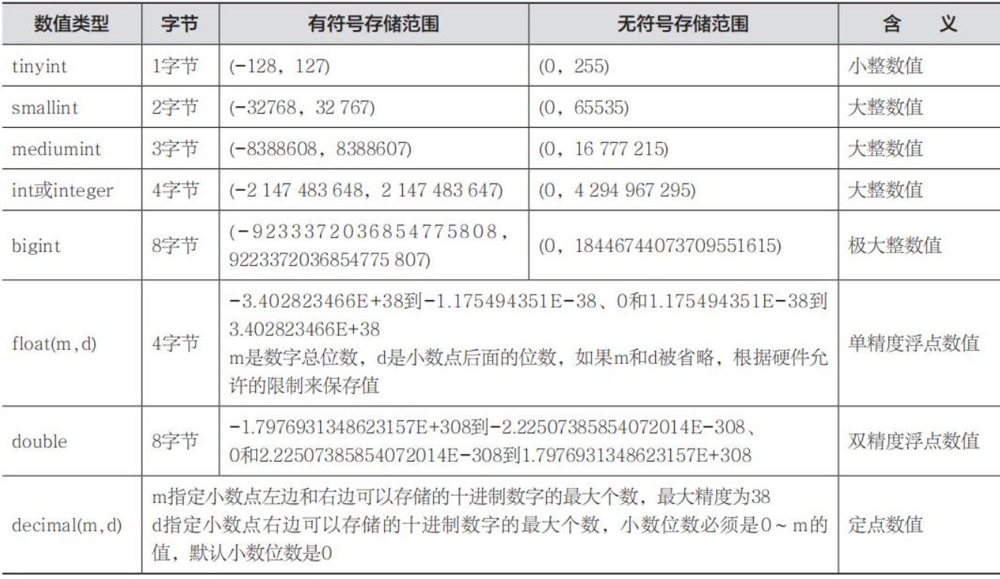

# 数据库基础

—————————————————————————————————————————————————————————————————————————————————————————————————————————————

### 一、数据库简介

#### 1、数据库

```
	数据库是“按照数据结构来组织、存储和管理数据的仓库”。是一个长期存储在计算机内的、有组织的、可共享的、统一管理的大量数据的集合。数据库是以一定方式储存在一起、能与多个用户共享、具有尽可能小的冗余度、与应用程序彼此独立的数据集合，可视为电子化的文件柜——存储电子文件的处所，用户可以对文件中的数据进行新增、查询、更新、删除等操作。
```


#### 2、关系型数据库


```
	比较常用的关系型数据库有Oracle、MySQL、SQLServer 、IBMDB2、Sybase、Access等，Oracle是收费商用的数据库，提供很好的维护与支持，适用于业务逻辑较复杂、数据量大的大中型项目；MySQL数据库由于体积小、速度快、总体拥有成本低、开放源码，受到很多中小型公司的青睐；SQLServer数据库的功能比较全面、效率高，适用于中型企业或单位的数据库平台。
```

#### 3、数据库管理系统排行

https://db-engines.com/en/ranking


### 二、MySQL

#### 1、MySQL数据库

```
	MySQL是采用客户端/服务器（C/S)的关系型SQL数据库管理系统，它具有跨平台性和可移植性，可以轻松、简单地运行在多种操作系
统上，如Windows、Linux操作系统等。本章介绍MySQL的基础知识，并带大家安装MySQL数据库。

	MySQL数据库是开放源码的，允许有兴趣的爱好者去查看和维护源码，大公司或者有能力的公司还可以继续对其进行优化，做成适合自己公司的数据库。最重要的一点是，相较于Oracle数据库的商用收费，MySQL允许各大公司免费使用，并且在被甲骨文公司收购后，不断地进行优化，性能提升接近30%，已成为小公司或者创业型公司首选的数据库，市场占有率也逐渐扩大。
```


#### 2、SQL语言

##### **1.数值类型**



##### 2.字符串类型


##### 3.日期时间类型


##### 4、数据库操作

```
MySQL允许创建多个数据库，每个数据库承载不同的内容，使用命令操作可以查看数据库、创建数据库、使用数据库以及删除数据库。
```

##### 5、查看数据库

```
使用 SHOW databases 命令可以查看有哪些数据库。
```


##### 6、创建数据库

```
使用 CREATE DATABASE [databaseName] 命令可以创建数据库。
```

##### 7、使用数据库

```
要操作某个数据库或者数据库里的表，首先需选择要使用的数据库，使用 USE databaseName 命令进入到数据库里。
```

##### 8、删除数据库

```
使用命令 DROP DATABASE databaseName 可以删除数据库。
```

##### 9、表操作

```
	MySQL表操作是使用频率最高的操作。用户可以创建数据库表，查看数据库表，向数据库表里插入数据、更新数据、删除数据等，同时可以修改表结构、复制表、使用临时表。
```


##### 10、数据操作

```
	插入、查询、修改和删除是MySQL数据库的4种最基本的操作，在项目开发的过程中也使用得最频繁。在MySQL里，插入使用INSERT关键字、查询使用SELECT关键字、修改使用UPDATE关键字、删除使用DELETE关键字。
```

##### 11、SQL语句格式

```
在数据库上执行的大部分工作都由SQL语句完成。SQL对大小写不敏感
```


##### 12、插入（INSERT）、查询（SELECT）

```
将一条数据插入到数据库里，可以使用如下命令。

INSERT INTO 表名(字段名，字段名) VALUES(值，值)；

或者可以不指明表里的字段，但是值按字段的顺序插入，可以使用如下命令。

INSERT INTO 表名 VALUES(值，值)；

查询数据，可以使用如下命令。

SELECT * FROM 表名；

或者查询指定字段，可以使用如下命令。

SELECT id FROM 表名；

使用WHERE条件语句按条件查询，把某一列或者几列作为查询条件，可以使用如下命令。

SELECT * FROM 表名 WHERE id=10；

SELECT * FROM 表名 WHERE id=10 and name='小明'；
```

##### 13、修改记录（UPDATE）

```
在MySQL里修改使用关键字UPDATE，命令如下所示。

UPDATE 表名 SET 字段=值，字段=值 WHERE 条件

UPDATE user SET name='小明',sex='男' WHERE id=4;
```

##### 14、删除记录（DELETE）

```
在MySQL中删除数据可以使用DELETE关键字，命令如下所示。

DELETE FROM 表名 WHERE 条件

DELETE FROM user WHERE id=4;
```

##### 15、对查询结果排序（ORDER BY）

```
	在MySQL数据库中，使用ORDER BY进行排序，使用关键字ASC进行升序排序(ascend)，使用关键字DESC进行降序排序(descend)，同时可以按一个字段或者多个字段进行排序。如果按多个字段进行排序，先进行第一个字段的排序，然后在结果集里面再进行第二个字段的排序，以此类推。
```

```
（1）ORDER BY [column] ASC：按某一字段进行升序排序，ASC可以省略不写。

SELECR * FROM user ORDER BY id ASC;

或者

SELECR * FROM user ORDER BY id;

（2）ORDER BY column DESC：按某一字段进行降序排序，DESC不可以省略不写。

SELECT * FROM user ORDER BY id DESC;

（3）ORDER BY column1,column2 DESC：按多个字段进行降序排序。

SELECT * FROM user ORDER BY sex,age DESC;
```

##### 16、限制查询数量（LIMIT）

```
	LIMIT用于限制查询的数量，常用于分页语句。LIMIT子句可以被用于强制SELECT语句返回指定的记录数。LIMIT接受一个或两个数字参数，参数必须是一个整数常量。
```

**（1）如果只给定一个参数，则它表示返回最大的记录行数目。**

```
#检索前6行记录

SELECT * FROM user LIMIT 6;
```

**（2）如果给定两个参数，则第一个参数指定第一个返回记录行的偏移量，第二个参数指定返回记录行的最大数目，初始记录行的偏移量是0（而不是1）。**

```
#从第3条数据开始，检索出5条数据

SELECT * FROM user LIMIT 2,5;
```

##### 17、基本查询语法

```
MySQL使用关键字SELECT来进行查询，SELECT语句的基本语法格式如下。
SELECT 查询内容

FROM 表名

WHERE 表达式

ORDER BY 字段名

LIMIT 记录数
```

```
（1）SELECT查询内容：查询所有字段 SELECT * FROM 表名， * 通配符表示所有字段。

（2）FROM表名：指定是从哪张表中查询。

（3）WHERE表达式（按条件查询）：在MySQL的表查询时，往往并不是需要将所有内容全部查出，而是根据实际需求，查询所需数据。

（4）ORDER BY 字段名：按某个字段进行排序，如淘宝宝贝可以按销量排序、按好评数排序、按价格排序等。

（5）LIMIT记录数：查询的条数，可以限制每次查询多少条数据，进行分页查询。
```

##### 18、条件表达式

```
在MySQL语句中，条件表达式是指SELECT语句的查询条件，在WHERE子句中可以使用关系运算符连接操作数作为查询条件对数据进行选择。常见的关系运算符如下。

= 等于

< > 不等于

! = 不等于

< 小于

> 大于

< = 小于等于

> = 大于等于
```

##### 19、条件查询过滤

```
条件查询过滤关键字为AND、OR、IN、NOT IN、IS NULL、IS NOT NULL、BETWEEN AND。按关键字可以进行条件查询过滤。

（1）AND（与）。用AND进行查询的时候，查询出来的数据要求条件都得满足。

SELECT * FROM user WHERE age = 20 and name = ' kevin ' ;

（2）OR（或）。用OR进行查询的时候，查询出来的数据只要求满足任意一个条件就可以查询出来。

SELECT * FROM user WHERE age = 20 or name = ' kevin ' ;

（3）IN（在范围内）。用IN进行查询的时候，查询出来的数据在这个范围内。

SELECT * FROM user WHERE id in ( 3 , 5 , 7 ) ;

（4）NOTIN（不在范围内）。用NOTIN进行查询的时候，查询出来的数据不在这个范围内。

SELECT * FROM user WHERE id not in ( 3 , 5 , 7 ) ;

（5）IS（为空）。用IS NULL进行查询的时候，用来查询某字段为空时用is null，而不能使用" = null "，因为MySQL中的null不等于任何其他值，也不等于另外一个null，优化器会把" = null "的查询过滤掉而不返回任何数据；查询某字段为非空时使用is not null。

SELECT * FROM user WHERE name is null;

SELECT * FROM user WHERE name is not null;

（6）BETWEEN AND（在……区间）：用BETWEENAND进行查询的时候，查询出来的数据在这个区间。

SELECT * FROM user WHERE age between 10 and 20;

select * from orders where order no BETWEEN 22456 and 24562 ; #闭区间

select * from orders where order no > = 22456 and order no <= 24562 ;

（×）select * from orders where 22456 < = order no < = 24562 ;
```

##### 20、模糊查询过滤

```
模糊查询过滤使用关键字LIKE进行查询。

（1）LIKE'张%'：使用LIKE查询该字段以“张”开头的数据。

SELECT * FROM user where name like '张%';

（2）LIKE'%明'：使用LIKE查询该字段以“明”结尾的数据。

SELECT * FROM user where name like '%明';

（3）LIKE'%明%'：使用LIKE查询该字段包含“明”的数据。

SELECT * FROM user where name like '%明%';
```

##### 21、联合查询

```
	联合查询是将多次查询结果合并起来进行拼接，其字段不会增加，要求两次查询的列数必须一致，列的类型可以不一样，多次SQL语句取出的列名可
	以不一致，此时以第一个SQL语句的列名为准；使用关键字UNION进行联合查询，会去掉重复的行，使用关键字UNIONall进行联合查询，不会去掉重复的行；ORDEYBY不能直接使用，需要对查询语句使用括号才行，要ORDER BY生效，就必须搭配LIMIT，LIMIT使用限定的最大数即可，推荐放到所有子句之后，即对最终合并的结果来排序或筛选。
```

```
SELECT column_name FROM table1 

UNION(all)

SELECT column_name FROM table2

	联合查询经常用于查询同一个表，但是需求不同，如查询学生信息、男生身高升序、女生身高降序；进行多表查询，多个表的结构是完全一样的，保存的数据（结构）也是一样的。
```

### 三、Oracle

#### 1、Oracle数据库

```
	OracleDatabase，又名OracleRDBMS，或简称Oracle。是甲骨文公司的一款关系数据库管理系统。它是在数据库领域一直处于领先
地位的产品。可以说Oracle数据库系统是目前世界上流行的关系数据库管理系统，系统可移植性好、使用方便、功能强，适用于各类大、中、小微机环境。它是一种高效率的、可靠性好的、适应高吞吐量的数据库方案。
```

#### 2、默认账号


#### 3、修改账号密码

```
打开cmd后，依次输入以下三条命令

sqlplus/nolog

connect/as sysdba

alter user sys identified by 123456
          用户名               密码
```

#### 4、查询数据库名

```
select name,dbid from v$database;

或者

show parameter db_name;
```

#### 5、查询数据表名

```
select table_name from user_tables;
```

#### 6、查询字段名

```
select column_name,data_type,data_length,data_precision,data_scale from user_tab_columns [where table_name = 表名];
```

#### 7、新建表

```
create table table1 ( id varchar ( 300 ) primary key,name varchar ( 200 ) not null);
```

#### 8、插入数据

```
insert into table1 (id,name) values ('aa','bb');
```

#### 9、更新数据

```
update table1 set id ='bb' where id='cc';
```

#### 10、删除数据

```
delete from table1 where id ='cc';
```

#### 11、删除表

```
drop table table1;
```

#### 12、查看表结构

```
desc student;
```

#### 13、查询指定列

```
select sex,xh,xm from student;
```

#### 14、统计表内有多少条记录

```
select count(*) from users;
```

### 四、SQL Server

#### 1、SQL Server数据库

```
	SQLServer是Microsoft公司推出的关系型数据库管理系统。具有使用方便可伸缩性好与相关软件集成程度高等优点，可跨越从运行MicrosoftWindows98的膝上型电脑到运行MicrosoftWindows2012的大型多处理器的服务器等多种平台使用。
	
	MicrosoftSQLServer是一个全面的数据库平台，使用集成的商业智能(BI)工具提供了企业级的数据管理。MicrosoftSQLServer数据库引擎为关系型数据和结构化数据提供了更安全可靠的存储功能，使您可以构建和管理用于业务的高可用和高性能的数据应用程序。
```

#### 2、查询所有数据库

```
select * from sysdatabases;
```

#### 3、查询当前数据库中所有表名

```
select * from sysobjects where xtype='U';

xtype='U':表示所有用户表，xtype='S':表示所有系统表。
```

#### 4、查询指定表中的所有字段名

```
select name from syscolumns where id=Object_ld(table_name');
```

#### 5、查询指定表中的所有字段名和字段类型

```
select sc.name,st.name from syscolumns sc,systypes st where sc.xtype=st.xtype and sc.id in ( select id from sysobjects where xtype='U' and name='table_name');
```

#### 6、创建数据库

```
create database TestDB;
```

#### 7、查看数据库是否存在

```
IF EXISTS (SELECT 1 FROM SYSDATABASES WHERE NAME='TestDB')
SELECT 1 ELSE SELECT 0;
```

#### 8、使用某个数据库

```
use database_name
```

#### 9、创建表

```
create table demo
(
ld int primary key,
nname nchar(10),
age tinyint,
sex int
)
```

#### 10、添加数据

```
方法一：安照列名依次给出数据值，不能交换顺序，数据类型不能出错

insert into demo
values
('zhang',25,1)

方法二：

insert into demo
(nname,age,sex)
values
('san',18,0)

方法三：交换顺序，数值按照列名给就行

insert into demo
(nname,sex,age)
values
('san',1,22)

方法四：没给数值的列显示null

insert into demo
(nname)
values
('li')
```

#### 11、插入多条数据

```
insert into demo(nname,age,sex)若不写列名，则默认插入所有列数据

select 'wang',28,0 union

select 'wu',30,1

插入一列

alter table demo

add sex int
```

#### 12、删除

```
删除某一行：
delete from demo
where nname='li'

删除某一列：
alter table demo
drop column sex

删除整张表：
delete from demo--不加where条件就是删除整个表
```

#### 13、清空整张表

```
truncate table demo

注意：删除整张表操作和清空整张表操作对比
	 删除是删除了所有，包括表结构
	 清空只是清空了表中数据，但表结构还在，清空速度快些
	 
删除数据库
drop database new
```

#### 14、更改

```
改某一列数据set是设置要改的数据
update demo
set
age='28'
where nname='zhang

改多列数据：
update demo
set
nname='zhao',
age='13,
sex='0'
where nname='li'
```

#### 15、查询

```
查询表中所有数据，*代表所有列：
select *
from demo

查询表中某一行所有数据：
select *
from demo
where nname='li'

查询表中某一行某一列的数据：
select age
from demo
where nname='li'
```

#### 16、查询出来的结果列用as取别名

```
select age as'年龄'
from demo
where nname='li'

查询出来的结果列用=取别名：
select wname nname
from demo
```

