# 信息收集

—————————————————————————————————————————————————————————————————————————————————————————————————————————————

### 一、信息收集介绍

#### 1、信息收集由来——黑客攻击模型

```
信息收集，俗称踩点。

渗透测试最重要的阶段之一就是信息收集。

为了启动渗透测试，用户需要收集关于目标网络资产等信息。用户得到的信息越多，渗透测试成功的概率也就越高。
```

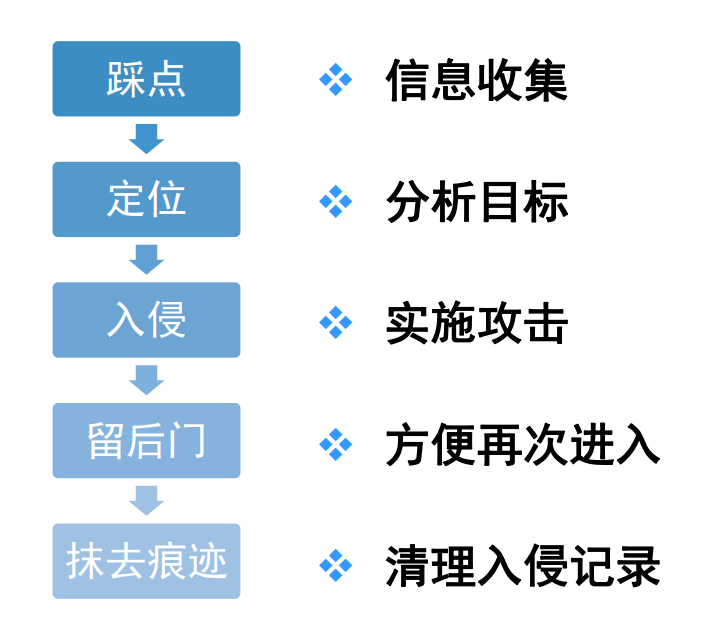

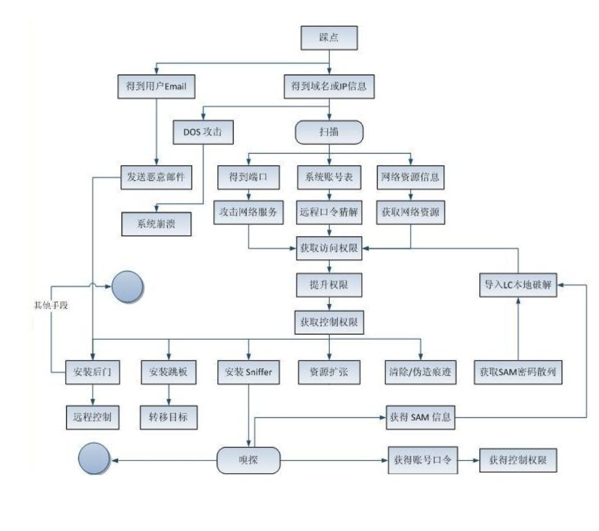

#### 2、信息收集类型

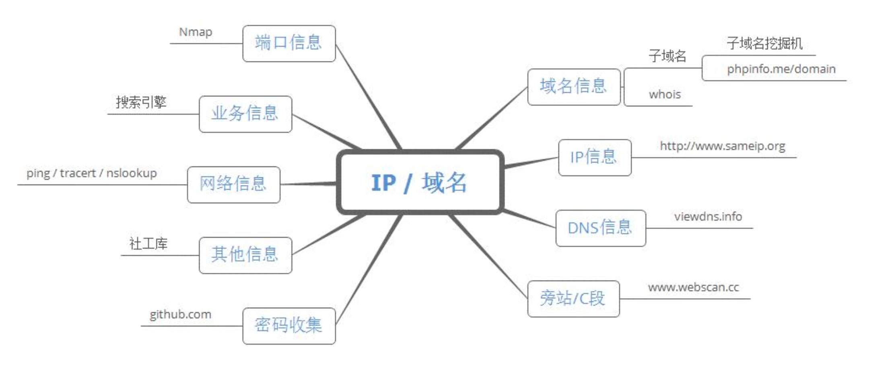

### 二、信息收集基本方式

#### 1、Whois

```
	whois（读作“Whois”，非缩写）是用来查询域名的IP以及所有者等信息的传输协议。简单说，whois就是一个用来查询域名是否已经被注册，以及注册域名的详细信息的数据库（如域名所有人、域名注册商）。通过whois来实现对域名信息的查询。早期的whois查询多以命令列接口存在，但是现在出现了一些网页接口简化的线上查询工具，可以一次向不同的数据库查询。网页接口的查询工具仍然依赖whois协议向服务器发送查询请求，命令列接口的工具仍然被系统管理员广泛使用。whois通常使用TCP协议43端口。每个域名/IP的whois信息由对应的管理机构保存。
	
	https://whois.chinaz.com/
	
	https://whois.aliyun.com/
```

#### 2、子域名

```
	子域名（或子域；英语：Subdomain）是在域名系统等级中，属于更高一层域的域。比如，mail.example.com和calendar.example.com是example.com的两个子域，而example.com则是顶级域.com的子域。（针对大网站）收集子域名可以很大程度知道目标所拥有的网站等资产信息。

工具：子域名挖掘机
```

#### 3、目录扫描

```
	目录扫描工具主要针对网站目录或者后台管理地址进行暴力猜解的工具。目录扫描工具有一个共同的特性：目录字典或者后台管理字典越强大，其扫描出的目录或者后台管理地址的数目就越多、越准确。以前的目录扫描工具有啊D注入工具（目录扫描模块）等。
	
	目录扫描工具有御剑、dirsearch、DirBuster及wwwscan等。
	
	https://github.com/maurosoria/dirsearch
```

#### 4、旁站C段

```
查询旁站指某个服务器同一个IP地址所有域名。

查询C段指某个服务器IP地址所在C段IP地址的所有域名。

www.webscan.cc

https://chapangzhan.com/
```

#### 5、征信查询

```
企业征信机构记录了一家企业的基本信息，历史沿革，股东及出资等信息的平台。

企查查：https://www.qcc.com

天眼查：https://www.tianyancha.com
```

#### 6、DNS查询

```
获取域名或者IP地址，并进行反向查找以快速显示同一服务器承载的所有其他域。

https://tools.ipip.net/

https://www.dnsdb.io

https://www.ip138.com
```

#### 7、IP地址查询

```
根据IP地址查询同一IP地址的其他信息。

查询：https://www.ip138.com
```

#### 8、备案号

```
备案号是网站是否合法注册经营的标志，一个网站域名要上线必然要经过备案程序，通过备案号反查可查询目标的所有合法网站。

查询：

http://icp.chinaz.com/

http://beian.miit.gov.cn
```

#### 9、敏感信息泄露

```
gitHub是全球最大的面向开源及私有软件项目的托管平台。

许多企业的开发人员在上传开源代码到github往往忽略了将密码等敏感信息删除导致信息泄露。
```

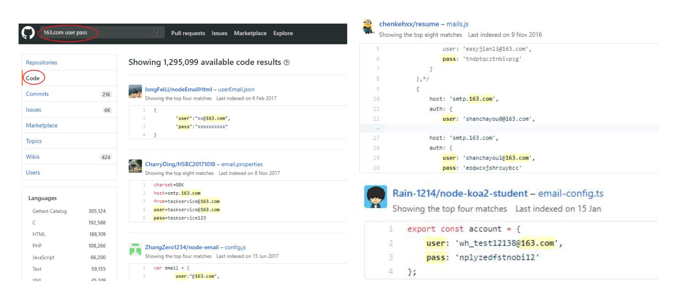

#### 10、JS文件探测

```
1.JS里能找到啥？

作为一个安全从业人员，我们最关心的就是Js文件中的这些东西：会增加攻击面的信息（URL，域名等）

敏感信息（密码，API密钥，bucket等）

代码中的潜在危险函数操作（eval，dangerallySetInnerHTML等）

2.具有已知漏洞的组件（过时的框架等）怎么去找？

识别并收集应用程序中的JavaScript文件

使收集的JavaScript代码可读（取消最小化/反混淆）识别可能导致安全问题的信息（找敏感词）
```

#### 11、社会工程学

```
社会工程学：利用心理学、行为学、揣摩、推理外在信息去分析内在信息，获取密码、心理性格、做事习惯，分析漏洞。
```


### 三、Google Hacking

#### 1、Google Hacking

```
	GoogleHacking是利用谷歌搜索的强大，来在浩瀚的互联网中搜索到我们需要的信息。轻量级的搜索可以搜素出一些遗留后门，不想被发现的后台入口，中量级的搜索出一些用户信息泄露，源代码泄露，未授权访问等等，重量级的则可能是mdb文件下载，CMS未被锁定install页面，网站配置密码，php远程文件包含漏洞等重要信息。
```

##### 1.基本搜索：

###### 1)逻辑与：and

###### 2)逻辑或：or

###### 3)逻辑非：-

###### 4)完整匹配："关键词"

###### 5)通配符：*?

##### 2.高级搜索：

###### 1)intext

```
寻找正文中含有关键字的网页，例如：intext:后台登录将只返回正文中包含后台登录的网页
```

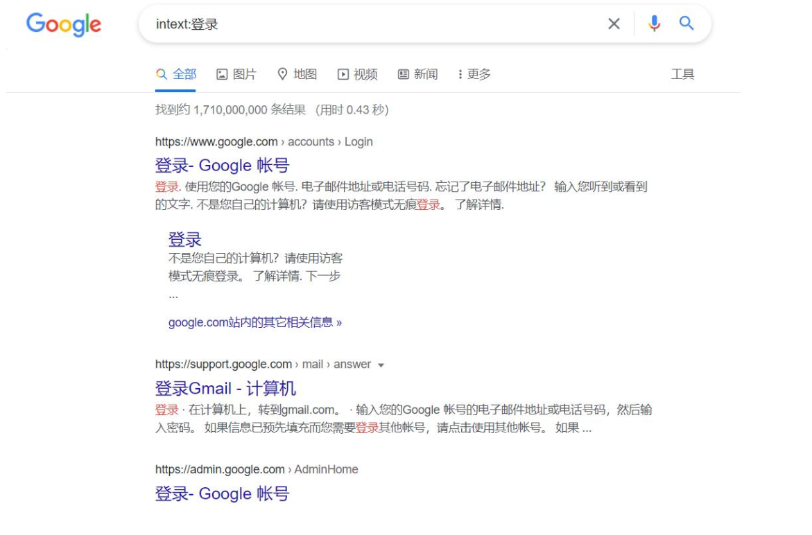

###### 2)intitle

```
	寻找标题中含有关键字的网页，例如：intitle:后台登录将只返回标题中包含后台登录的网页，intitle:后台登录密码将返回标题中包含黑客而正文中包含中国的网页
```

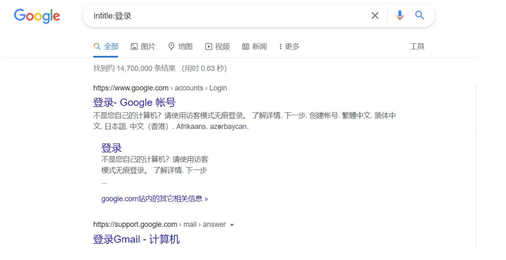


###### 3)alltitle

```
用法和intitle类似，只不过可以指定多个词，例如：alltitle:后台登录管理员将返回标题中包含后台登录和管理员的网页
```

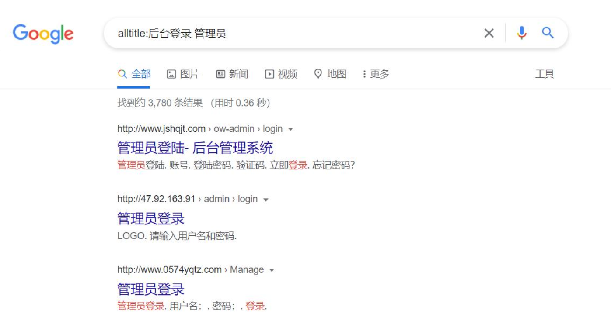

###### 4)inurl

```
将返回url中含有关键词的网页：例如：inurl:/login.php将返回url中含有Login的网页
```

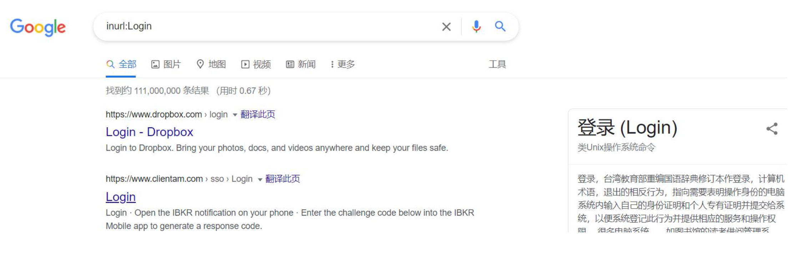

###### 5)site

```
指定访问的站点，例如：site:baidu.cominurl:Login将只在baidu.com中查找url中含有Login的网页
```


###### 6)filetype

```
指定访问的文件类型，例如：site:baidu.comfiletype:pdf将只返回baidu.com站点上文件类型为pdf的网页
```

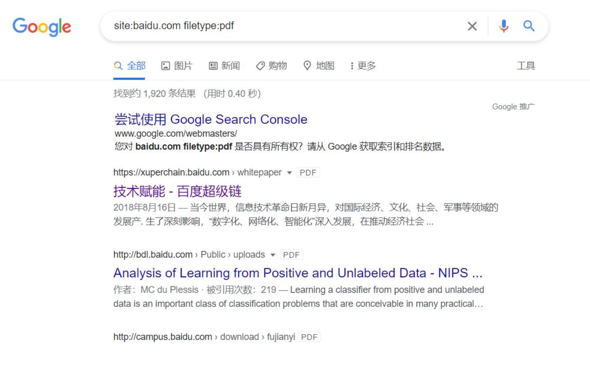

###### 7)link

```
指定链接的网页，例如：link:www.baidu.com将返回所有包含指向www.baidu.com的网页
```

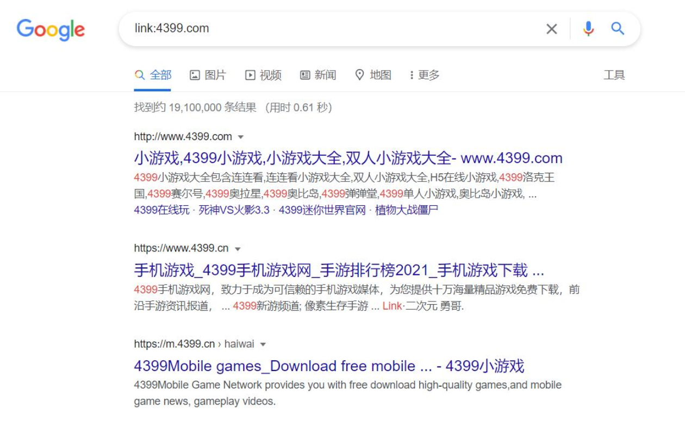


###### 8)related

```
相似类型的网页，例如：related:www.xjtu.edu.cn将返回与www.xjtu.edu.cn相似的页面，相似指的是网页的布局相似
```

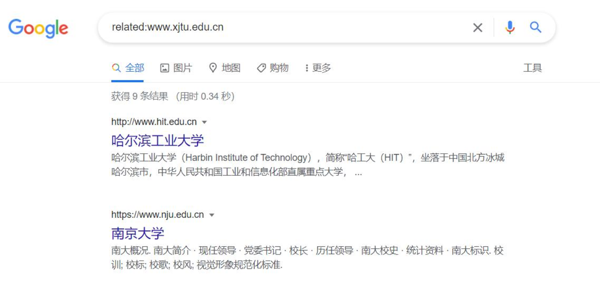

###### 9)cache

```
网页快照，谷歌将返回给你他存储下来的历史页面，如果你同时制定了其他查询词，将在搜索结果里以高亮显示，例如：cache:www.baidu.comguest，将返回指定网站的缓存，并且正文中含有guest
```


###### 10)info

```
返回站点的指定信息，例如：info:www.baidu.com将返回百度的一些信息
```

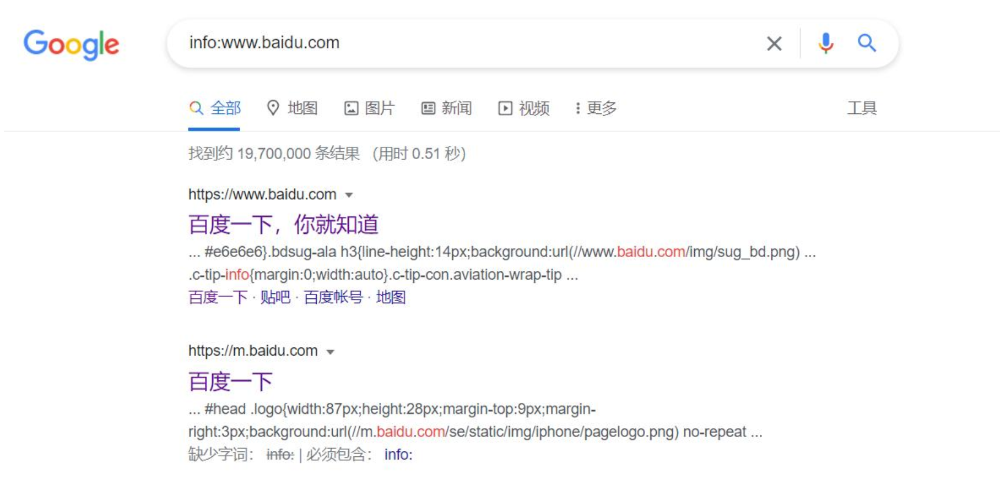

###### 11)define

```
返回某个词语的定义，例如：define:Hacker将返回关于Hacker的定义
```

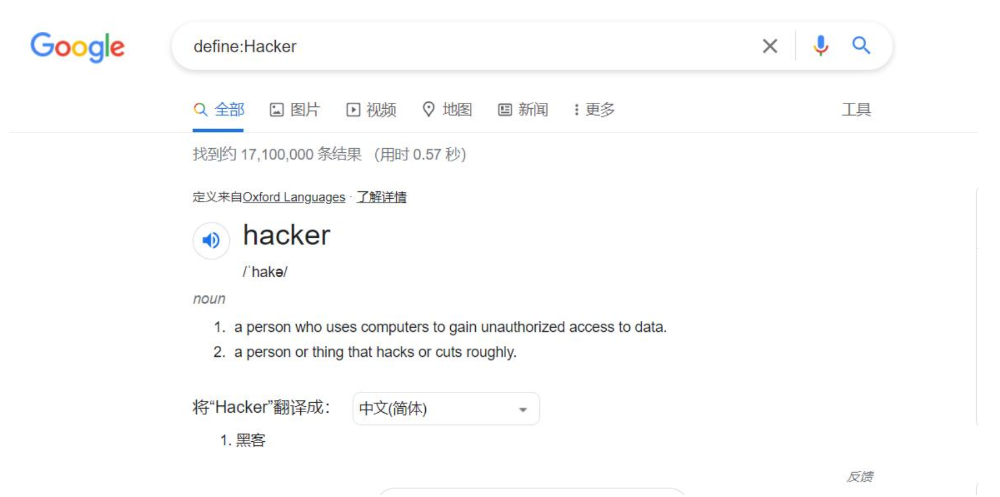

##### 3.常用查询语句

###### 1）查找网站后台

```
site:xx.comintext:管理

site:xx.cominurl:login 

site:xx.comintitle:后台
```

###### 2）查看服务器使用的程序

```
site:xx.comfiletype:asp 

site:xx.comfiletype:php 

site:xx.comfiletype:jsp 

site:xx.comfiletype:aspx
```

###### 3）查看上传漏洞

```
site:xx.cominurl:file

site:xx.cominurl:load
```

##### 4.一些有趣的查询

```
利用Indexof语法去发现允许目录浏览的web网站，就像在本地的普通目录一样。下面是一些有趣的查询：

indexof/admin

indexof/passwd

indexof/password

indexof/mail

"indexof/"+passwd

"indexof/"+password.txt

"indexof/"+.htaccess

"indexof/root"

"indexof/cgi-bin"

"indexof/logs"

"indexof/config"
```

#### 2、CDN绕过

##### 1.多地ping（超级ping）

```
通过多个地区的服务器去ping，查看ip地址是否是一样的

https://ping.chinaz.com/
```

##### 2.DNS的绑定查询

```
大部分网站早期可能没有开CDN，则会有dns历史遗留下来。

CDN访问有流量上限，用大量的访问消耗完流量，继续访问就是真实的IP。
```

##### 3.子域名查询

```
主域名有开CDN，子域名没有开CDN，子域名的IP地址就是这个服务器的真实地址。
```

##### 4.国外ping

```
大部分用户在国内，只考虑在国内部署CDN，用国外地址请求则会访问真实的服务器。
```

##### 5.网站的邮箱服务器

```
邮箱服务器大部分不会做CDN，所以是真实IP的几率很高。
```

##### 6.一些工具网站

```
查找真实IP:

https://get-site-ip.com/

工具：

https://github.com/boy-hack/w8fuckcdn

https://github.com/Tai7sy/fuckcdn
```

### 四、端口扫描

#### 1、端口扫描技术

```
通常使用专门的端口扫描工具来进行。可以详细收集目标开放的端口、服务、应用版本、操作系统、活跃主机等多种信息。
```

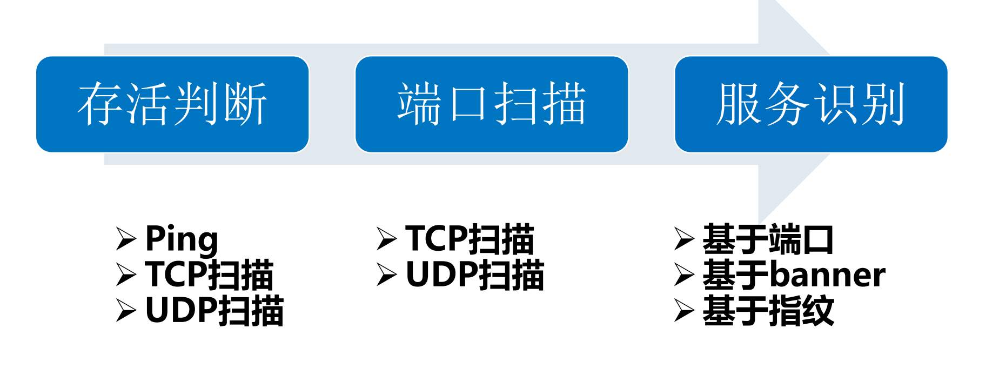

##### 1）Nmap（NetworkMapper）

```
Nmap（NetworkMapper），在网络中具有强大的信息收集能力。

Nmap具备主机探测、服务/版本检测、操作系统检测、网络路由跟踪、Nmap脚本引擎的功能，在Kali中右键鼠标选择“打开终端”输入nmap和对应参数进行使用。

基本命令格式：nmap[参数]IP/IP段/主机名

如： nmap –v -sS –O 10.2.2.2
```

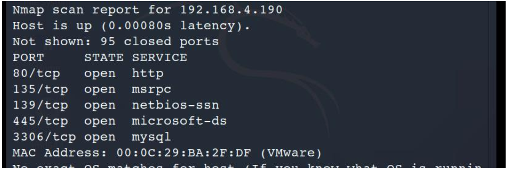

```
1.nmap -sT 192.168.96.4 //TCP连接扫描，不安全，慢

2.nmap -sS 192.168.96.4 //SYN扫描,使用最频繁，安全，快

3.nmap -Pn 192.168.96.4 //目标机禁用ping，绕过ping扫描

4.nmap -sU 192.168.96.4 //UDP扫描,慢,可得到有价值的服务器程序

5.nmap -sI 僵尸ip目标ip //使用僵尸机对目标机发送数据包

6.nmap -sA 192.168.96.4 //检测哪些端口被屏蔽

7.nmap 192.168.96.4 -p <portnumber> //对指定端口扫描

8.nmap 192.168.96.1/24 //对整个网段的主机进行扫描

9.nmap 192.168.96.4 -oX myscan.xml //对扫描结果另存在myscan.xml

10.nmap -T1~6 192.168.96.4 //设置扫描速度，一般T4足够。

11.nmap -sV 192.168.96.4 //对端口上的服务程序版本进行扫描

12.nmap -O 192.168.96.4 //对目标主机的操作系统进行扫描

13.nmap -sC <scirptfile> 192.168.96.4 //使用脚本进行扫描，耗时长

14.nmap -A 192.168.96.4 //强力扫描，耗时长

15.nmap -6 ipv6地址 //对ipv6地址的主机进行扫描

16.nmap -f 192.168.96.4 //使用小数据包发送，避免被识别出

17.nmap –mtu <size> 192.168.96.4 //发送的包大小,最大传输单元必须是8的整数

18.nmap -D <假ip> 192.168.96.4 //发送参杂着假ip的数据包检测

19.nmap --source-port <portnumber> //针对防火墙只允许的源端口

20.nmap –data-length: <length> 192.168.96.4 //改变发生数据包的默认的长度，避免被识别出来是nmap发送的。

21.nmap -v 192.168.96.4 //显示冗余信息(扫描细节)

22.nmap -sn 192.168.96.4 //对目标进行ping检测，不进行端口扫描（会发送四种报文确定目标是否存活,）

23.nmap -sP 192.168.96.4 //仅仅对目标进行ping检测。

24.nmap -n/-p 192.168.96.4 //-n表示不进行dns解析，-p表示要

25.nmap --system-dns 192.168.96.4 //扫描指定系统的dns服务器

26.nmap –traceroute 192.168.96.4 //追踪每个路由节点。

27.nmap -PE/PP/PM:使用ICMPecho,timestamp,andnetmask请求包发现主机。

28.nmap -sP 192.168.96.4 //主机存活性扫描，arp直连方式。

29.nmap -iR [number] //对随机生成number个地址进行扫描。
```

### 五、黑暗搜索引擎

#### 1、Shodan

```
	CNNMoney的一篇文章写道，虽然目前人们都认为谷歌是最强劲的搜索引擎，但Shodan才是互联网上最可怕的搜索引擎。
	
	与谷歌不同的是，Shodan不是在网上搜索网址，而是直接进入互联网的背后通道。Shodan可以说是一款“黑暗”谷歌，一刻不停的在寻找着所有和互联网关联的服务器、摄像头、打印机、路由器等等。每个月Shodan都会在大约5亿个服务器上日夜不停地搜集信息。
```

#### 2、ZoomEye

```
	国内互联网安全厂商知道创宇开放了他们的海量数据库，对之前沉淀的数据进行了整合、整理，打造了一个名符其实的网络空间搜索引擎ZoomEye，该搜索引擎的后端数据计划包括两部分：
	
	1，网站组件指纹：包括操作系统，Web服务，服务端语言，Web开发框架，Web应用，前端库及第三方组件等等。
	
	2，主机设备指纹：结合NMAP大规模扫描结果进行整合。
	
目前只上线了第一部分网站组件指纹。
```

#### 3、Fofa

```
	Fofa是白帽汇推出的一款网络空间搜索引擎，它通过进行网络空间测绘，能够帮助研究人员或者企业迅速进行网络资产匹配。例如进行漏洞影响范围分析、应用分布统计、应用流行度等。在渗透测试过程中，Fofa能帮助测试人员快速发现目标资产。
```

